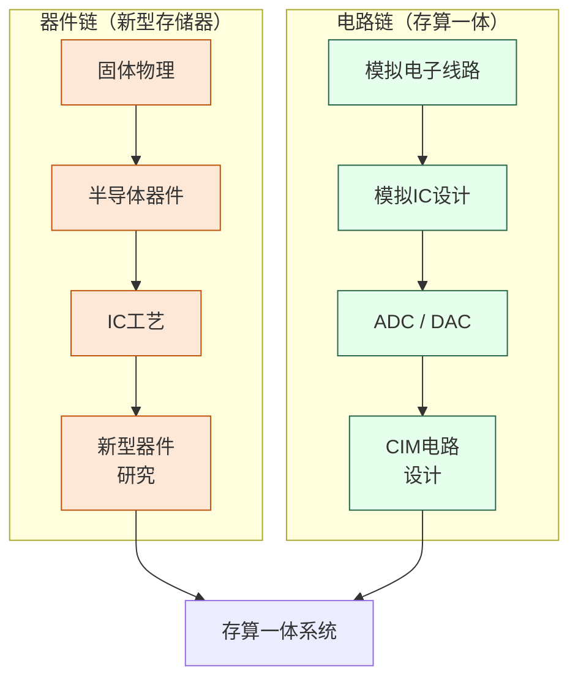

# 存储器与存算一体

## 一句话定义

打破冯·诺依曼架构中"存"与"算"强制分离的瓶颈——既研究新型存储器件，也研究让存储单元直接承担计算任务的新范式。

## 你身边的产品

你笔记本里的 SSD 用的是 NAND Flash，手机内存用的是 LPDDR5 DRAM——这两类存储器是整个数字世界的数据基座，也是这个方向的研究对象。但更能说明问题的是它们的局限：你的 DDR5 内存条带宽大约 51 GB/s，而同期的 NVIDIA H100 GPU 计算速度需要近 2 TB/s 的数据供给，两者相差近 40 倍。这个差距就是"内存墙"——芯片算得越快，等数据的时间就越长，真正有效利用的算力反而越来越少。训练一个大语言模型时，数据在内存和计算单元之间反复搬运消耗的能量，往往比实际做矩阵乘法的能量还多。

为了缓解这个问题，NVIDIA H100 GPU 放弃了普通 DRAM，改用 HBM3（高带宽存储器）——把多层 DRAM 裸片垂直堆叠，直接焊在 GPU 旁边，带宽达到 3.35 TB/s，是普通 DDR5 的 60 多倍。这已经是系统层面的应对方案；而存算一体研究更激进，它的目标是直接在存储单元里完成计算，从根本上消除数据搬运。三星在 HBM 内部集成计算单元的 HBM-PIM 方案，2022 年实测能耗降低了 70%。

## 为什么重要

训练一个大模型需要反复把 TB 级参数在内存和计算单元之间搬来搬去，数据搬运消耗的能量往往比计算本身还多。与此同时，DRAM 和 NAND Flash 的物理极限正在被逼近。

这个方向试图从两个角度同时突破：**新型存储器件**（MRAM、ReRAM、PCM 等）提供更快更省电的存储介质；**存算一体（CIM）** 让计算直接发生在数据所在的地方，省去搬运开销。两者在技术上高度互补。

## 当前最前沿（2024-2025）

存储器本身的技术进展以 HBM3E 为代表：SK Hynix 和三星在 2024 年量产，将 8 层 DRAM 裸片通过数千根硅通孔（TSV）垂直互联，带宽达到 4.8 TB/s，是 NVIDIA H200 和 Google TPU v5 的标配内存方案。每个 HBM3E 封装的制造工艺难度堪比最先进的逻辑芯片。国内方面，长鑫存储是目前唯一量产 DRAM 的企业，已推出 LPDDR5，正在开发 DDR5，是国内存储器自主化的关键节点；长江存储的 232 层 3D NAND 在 NAND Flash 领域已接近国际第一梯队水平。

存算一体研究在 ISSCC 2022-2024 上密集爆发，北大、清华、台大、台积电、三星等机构均展示了在 SRAM 或 NVM 阵列内直接完成矩阵乘法的芯片原型，推理能耗比同等算力的 GPU 低 10 到 100 倍。真正的挑战在于精度——模拟计算天然存在噪声，如何在存储单元的物理偏差下保持神经网络推理精度，是当前最核心的开放问题。IBM 苏黎世研究院在相变存储器上展示了可以支持 BERT 级别模型推理的全模拟推理芯片，是这个方向目前最接近系统级应用的成果之一。

## 核心研究问题

- **器件层**：新型非易失性存储器（NVM）如何在速度、功耗、耐久性、保持性之间取得最优平衡？
- **电路层**：模拟 CIM 的精度如何提升？器件工艺偏差如何在电路层补偿？
- **架构层**：存算一体单元如何与传统数字系统高效接口？稀疏计算如何利用 CIM 硬件？
- **应用层**：什么样的神经网络结构最适合映射到 CIM 硬件？

## 代表性机构与企业

| | 国际 | 国内 |
|--|------|------|
| **企业** | Samsung、SK Hynix、Micron、IBM | 长鑫存储、长江存储、华为 |
| **高校** | Stanford、MIT、IMEC、Peking Univ | 北大、清华、复旦、浙大 |
| **顶会** | IEDM、ISSCC、VLSI Symposium、DAC | — |

## 知识路径

这个方向有**两条并行的知识链**，最终在 CIM 系统设计处汇聚：

**本站相关课程：**

器件链：
- [固体物理（复旦）](../课程资源/物理/固体物理/MICR130013.md)
- [半导体器件原理（复旦）](../课程资源/器件与工艺/半导体器件/半导体器件原理_FDU/MICR130006.md)
- [IC工艺原理（复旦）](../课程资源/器件与工艺/集成电路工艺/集成电路工艺原理_FDU/MICR130007.md)

电路链：
- [模拟电子线路（复旦）](../课程资源/电路/模拟/模拟电子线路/MICR130002.md)
- [模拟集成电路设计原理（复旦）](../课程资源/电路/模拟/模拟集成电路/MICR130030.md)
- [ADC/DAC（复旦）](../课程资源/电路/信号处理/数模模数转换器/INFO130270.md)

## 入门三步走

**第一步：理解动机**  
阅读 Wulf & McKee, *Hitting the Memory Wall* (1995)，一篇两页纸的经典文章，清楚解释了为什么存储墙是个根本性问题。

**第二步：了解全貌**  
阅读综述：Wong & Salahuddin, *Memory leads the way to better computing* (Nature Nanotechnology, 2015)，梳理各类新型存储器的对比。

**第三步：跟进前沿**  
浏览 ISSCC 2021-2024 中 SRAM/CIM Session 的论文列表，感受这个方向当前的研究粒度和技术热点。
