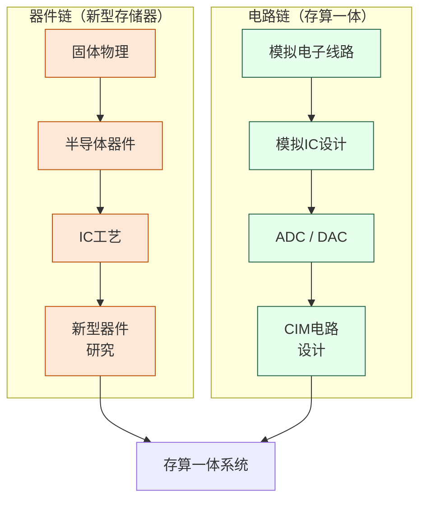

# 存储器与存算一体

## 一句话定义

打破冯·诺依曼架构中"存"与"算"强制分离的瓶颈——既研究新型存储器件，也研究让存储单元直接承担计算任务的新范式。

## 为什么重要

训练一个大模型需要反复把 TB 级参数在内存和计算单元之间搬来搬去，数据搬运消耗的能量往往比计算本身还多。与此同时，DRAM 和 NAND Flash 的物理极限正在被逼近。

这个方向试图从两个角度同时突破：**新型存储器件**（MRAM、ReRAM、PCM 等）提供更快更省电的存储介质；**存算一体（CIM）** 让计算直接发生在数据所在的地方，省去搬运开销。两者在技术上高度互补。

## 核心研究问题

- **器件层**：新型非易失性存储器（NVM）如何在速度、功耗、耐久性、保持性之间取得最优平衡？
- **电路层**：模拟 CIM 的精度如何提升？器件工艺偏差如何在电路层补偿？
- **架构层**：存算一体单元如何与传统数字系统高效接口？稀疏计算如何利用 CIM 硬件？
- **应用层**：什么样的神经网络结构最适合映射到 CIM 硬件？

## 代表性机构与企业

| | 国际 | 国内 |
|--|------|------|
| **企业** | Samsung、SK Hynix、Micron、IBM | 长鑫存储、长江存储、华为 |
| **高校** | Stanford、MIT、IMEC、Peking Univ | 北大、清华、复旦、浙大 |
| **顶会** | IEDM、ISSCC、VLSI Symposium、DAC | — |

## 知识路径

这个方向有**两条并行的知识链**，最终在 CIM 系统设计处汇聚：

**本站相关课程：**

器件链：
- [固体物理（复旦）](../课程资源/物理/固体物理/MICR130013.md)
- [半导体器件原理（复旦）](../课程资源/器件与工艺/半导体器件/半导体器件原理_FDU/MICR130006.md)
- [IC工艺原理（复旦）](../课程资源/器件与工艺/集成电路工艺/集成电路工艺原理_FDU/MICR130007.md)

电路链：
- [模拟电子线路（复旦）](../课程资源/电路/模拟/模拟电子线路/MICR130002.md)
- [模拟集成电路设计原理（复旦）](../课程资源/电路/模拟/模拟集成电路/MICR130030.md)
- [ADC/DAC（复旦）](../课程资源/电路/信号处理/数模模数转换器/INFO130270.md)

## 入门三步走

**第一步：理解动机**  
阅读 Wulf & McKee, *Hitting the Memory Wall* (1995)，一篇两页纸的经典文章，清楚解释了为什么存储墙是个根本性问题。

**第二步：了解全貌**  
阅读综述：Wong & Salahuddin, *Memory leads the way to better computing* (Nature Nanotechnology, 2015)，梳理各类新型存储器的对比。

**第三步：跟进前沿**  
浏览 ISSCC 2021-2024 中 SRAM/CIM Session 的论文列表，感受这个方向当前的研究粒度和技术热点。
