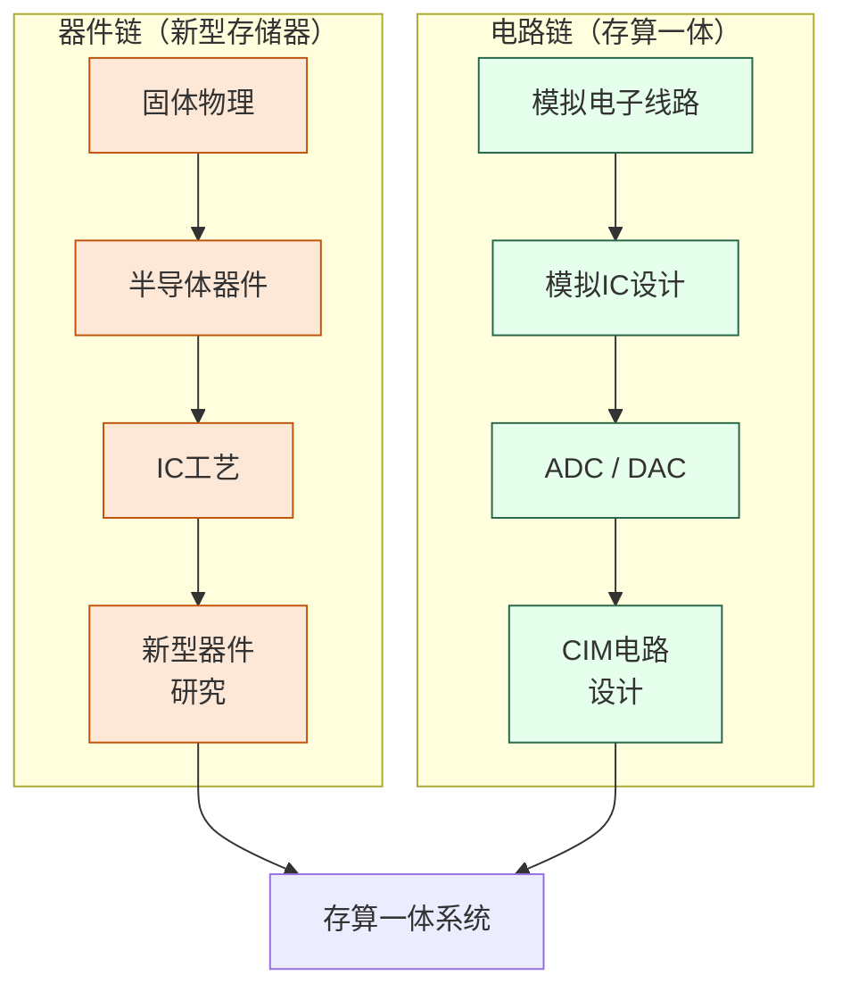

# 存储器与存算一体

## 一句话定义

打破冯·诺依曼架构中"存"与"算"强制分离的瓶颈——既研究新型存储器件，也研究让存储单元直接承担计算任务的新范式。

## 这个方向在研究什么

冯·诺依曼架构把计算单元和存储单元分开——这个七十年前的设计决策是现代计算机的基础，但也埋下了一个随着计算规模扩大而越来越难忽视的问题：数据必须在存储和计算之间来回搬运，而搬运本身消耗能量和时间。在今天的 AI 工作负载下，这个代价已经触目惊心。一块 NVIDIA H100 GPU 的计算能力是每秒约 990 TFLOPS（FP16），但它的片外内存带宽只有 3.35 TB/s。做一个简单估算：如果每个参数需要读一次，那每次内存访问平均只能支撑大约 300 次浮点运算——而 Transformer 的注意力机制远达不到这个计算密度，实际上 GPU 大量时间是在等内存，而非在算。能量消耗也是同样的道理：有测量表明，训练大模型时，数据搬运消耗的能量比实际矩阵乘法本身还多。

存储器件本身的研究瞄准的是现有 DRAM 和 NAND Flash 的物理极限。传统 DRAM 用一个晶体管和一个电容存储一位数据，随着尺寸缩小，电容越来越难制造、漏电越来越难抑制，刷新功耗随单元密度升高而剧增。新型非易失存储器试图从材料机制上绕开这些限制：相变存储器（PCM）利用材料在结晶态和非晶态之间的电阻差存储信息，非易失且读写速度接近 DRAM；磁阻存储器（MRAM）用磁化方向编码数据，写操作不依赖电荷积累，耐久性远超 Flash；阻变存储器（ReRAM）最特别——它的电阻值可以连续调节，这意味着一个器件可以存储多个比特，更重要的是，它天然适合模拟神经网络的突触权重，因为突触的"强度"本来就是连续的。研究者在超净间里制备这些器件，测量其 I-V 特性、耐久性（反复读写后的退化）和保持性（数据能存多久不丢失），然后用这些数据反过来指导电路设计。

存算一体（Compute-in-Memory, CIM）是更激进的解法：不只是换一种存储材料，而是让计算直接发生在存储单元里，从根本上消除搬运这一步。最直观的实现是 SRAM-CIM：在标准的六管 SRAM 单元旁加入计算逻辑，把输入信号以电压或电流的形式注入整列，所有单元同时做乘法，列末端的模拟电路把结果累加，再由 ADC 转成数字值。这个过程天然对应向量内积运算，恰好是矩阵乘法的基本操作。理论上，这样做可以把每次乘加操作的能耗降低 10 到 100 倍，因为信号不再需要离开存储阵列就完成了计算。

实际的困难在于精度。模拟计算的结果受器件制造偏差、电源噪声、温度漂移影响，很难稳定维持 8 位以上的精度——而大多数神经网络推理需要至少 8 位整数量化。这迫使研究者不只是设计电路，还要同时研究适配低精度硬件的量化算法，让芯片架构和模型压缩协同优化。这种"硬件-算法协同设计"正是这个方向最有意思也最开放的地方：一个纯做电路的人和一个纯做算法的人都无法独立解决它，需要两种背景的研究者在问题本身上相遇。

## 核心研究问题

- **器件层**：新型非易失性存储器（NVM）如何在速度、功耗、耐久性、保持性之间取得最优平衡？
- **电路层**：模拟 CIM 的精度如何提升？器件工艺偏差如何在电路层补偿？
- **架构层**：存算一体单元如何与传统数字系统高效接口？稀疏计算如何利用 CIM 硬件？
- **应用层**：什么样的神经网络结构最适合映射到 CIM 硬件？

## 代表性机构与企业

| | 国际 | 国内 |
|--|------|------|
| **企业** | Samsung、SK Hynix、Micron、IBM | 长鑫存储、长江存储、华为 |
| **高校** | Stanford、MIT、IMEC、Peking Univ | 北大、清华、复旦、浙大 |
| **顶会** | IEDM、ISSCC、VLSI Symposium、DAC | — |

## 相关课题组

**国内**

| 姓名 | 单位 | 研究方向 |
|------|------|----------|
| [吴华强](https://stor.ime.tsinghua.edu.cn) | 清华大学集成电路学院（IEEE Fellow 2026，杰青，科学探索奖） | RRAM/MRAM 新型存储器与忆阻器存算一体芯片，器件到系统全栈研究 |
| [钱鹤](https://sic.tsinghua.edu.cn) | 清华大学集成电路学院 | SRAM-CIM 存算一体电路、AI 推理芯片低功耗设计 |
| [唐建石](https://www.ime.tsinghua.edu.cn/info/1035/1595.htm) | 清华大学集成电路学院（国家海外高层次人才，MIT TR35） | 忆阻器突触/神经元、储备池计算、单片三维异质集成，发表于 Nature Electronics |
| [高滨](https://www.sic.tsinghua.edu.cn) | 清华大学集成电路学院 | 忆阻器存算一体芯片设计方法学（器件-系统联合仿真）；Science 2023 片上学习芯片共同通讯 |
| [黄鹏](https://ic.pku.edu.cn/szdw/zzjs/sjzdhyjsxtx1/hp/index.htm) | 北京大学集成电路学院（国优青，博雅青年学者） | RRAM 存算一体芯片与架构、传感-存储-计算融合，发表于 Nature Electronics/IEDM |
| [蔡一茂](https://ic.pku.edu.cn/en/Faculty/Facultys/DepartmentofMicroNanoelectronics/CaiYimao/index.htm) | 北京大学集成电路学院（博雅特聘教授） | RRAM 新型存储器、忆阻器件与神经形态计算，入选中国十大芯片进展（2023） |
| [叶乐](https://ic.pku.edu.cn/szdw/zzjs/jcdlsjx1/yl/index.htm) | 北京大学集成电路学院（杰青） | 存算一体 AI 芯片、3D 集成 AIoT 芯片；ISSCC 2021 最佳芯片奖（国内首次与 Intel 并列） |
| [孙仲](http://scholar.pku.edu.cn/zhong_sun/home) | 北京大学人工智能研究院（博雅青年学者） | RRAM 模拟矩阵计算芯片（Nature Electronics 2025，精度达数字级，速度超 GPU 百倍） |
| [王宗巍](https://ic.pku.edu.cn/szdw/zzjs/jcwndzx1/wzw/index.htm) | 北京大学集成电路学院 | 钽基 ReRAM（国内最早）、存内计算芯片系统；2024 全国 AI 大赛冠军 |
| [刘明](https://fics.fudan.edu.cn/36/80/c22618a276096.htm) | 复旦大学芯片与系统前沿技术研究院（中科院院士，IEEE Fellow，院长） | 新型非易失存储器（Flash、RRAM）、存储器件物理与高密度集成，国内存储器领域最权威学者之一 |
| [刘琦](https://icmne.fudan.edu.cn/2d/2a/c48925a732458.htm) | 复旦大学集成电路与微纳电子创新学院（杰青） | ReRAM/FeRAM 新型存储器、忆阻神经形态器件、存算一体芯片，发表于 Nature Electronics/ISSCC/IEDM |
| [薛晓勇](https://sme.fudan.edu.cn/60/46/c31133a352326/page.htm) | 复旦大学微电子学院 | 存储器与存算一体数模混合 IC、基于 DRAM/SSD 的近存计算软硬件，发表于 Nature Electronics/JSSC |
| [蒋昊](https://fics.fudan.edu.cn/8e/8a/c22620a429706/page.htm) | 复旦大学芯片与系统前沿技术研究院 | 忆阻器与铁电器件用于存储、存内计算及硬件安全（PUF），发表于 Nat. Electron./Nat. Commun.，引用 5000+ |
| [翁毅（Ngai Wong）](https://www.eee.hku.hk/~nwong/) | 香港大学电气与电子工程系（副教授） | 忆阻器/ReRAM 存算一体 AI 芯片、紧凑神经网络设计、EDA 算法；主持港府 5 年 ReRACE 计划，发表于 Nature Commun./Nature Electronics |
| [黎灿（Can Li）](https://scholars.hku.hk/en/persons/can-li) | 香港大学电气与电子工程系 | 忆阻器存算一体芯片、神经形态 AI 加速，与翁毅联合开发自适应 ADC，将 CIM 能耗降低 57%（Nature Commun. 2025） |

**国际**

| 姓名 | 单位 | 研究方向 |
|------|------|----------|
| [H.-S. Philip Wong](https://nano.stanford.edu) | Stanford EE | 相变存储器（PCM）、碳/二维材料存储器、3D 异构集成 |
| [Shimeng Yu](https://shimeng.ece.gatech.edu) | Georgia Tech ECE | RRAM/FeFET 新型存储器、存算一体电路与算法协同设计 |
| [Kaushik Roy](https://engineering.purdue.edu/NRL) | Purdue ECE | 低功耗 AI 芯片、存算一体神经形态硬件、SRAM-CIM 设计 |
| [Hai Li](https://ece.duke.edu/faculty/hai-helen-li) | Duke University ECE | 新型 NVM 存储器电路、存算一体系统、神经网络硬件加速 |

## 知识路径

这个方向有**两条并行的知识链**，最终在 CIM 系统设计处汇聚：

**本站相关课程：**

器件链：
- [固体物理（复旦）](../课程资源/物理/固体物理/MICR130013.md)
- [半导体器件原理（复旦）](../课程资源/器件与工艺/半导体器件/半导体器件原理_FDU/MICR130006.md)
- [IC工艺原理（复旦）](../课程资源/器件与工艺/集成电路工艺/集成电路工艺原理_FDU/MICR130007.md)

电路链：
- [模拟电子线路（复旦）](../课程资源/电路/模拟/模拟电子线路/MICR130002.md)
- [模拟集成电路设计原理（复旦）](../课程资源/电路/模拟/模拟集成电路/MICR130030.md)
- [ADC/DAC（复旦）](../课程资源/电路/信号处理/数模模数转换器/INFO130270.md)

## 入门三步走

**第一步：理解动机**  
阅读 Wulf & McKee, *Hitting the Memory Wall* (1995)，一篇两页纸的经典文章，清楚解释了为什么存储墙是个根本性问题。

**第二步：了解全貌**  
阅读综述：Wong & Salahuddin, *Memory leads the way to better computing* (Nature Nanotechnology, 2015)，梳理各类新型存储器的对比。

**第三步：跟进前沿**  
浏览 ISSCC 2021-2024 中 SRAM/CIM Session 的论文列表，感受这个方向当前的研究粒度和技术热点。
