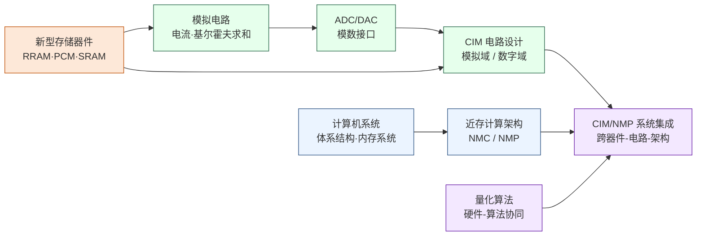

---
hide:
  - navigation
---

大模型推理时，数据搬运消耗的能量常常超过矩阵乘法本身——存算一体（CIM）与近存计算（NMC）研究的，是能不能让计算直接在数据所在的地方发生。

## 这个方向在研究什么

冯·诺依曼在 1945 年把"计算单元和存储单元分开"定下来时，这是个优雅的设计，让两者各做各的专项。可它也埋下一个代价。数据得在存储和计算之间来回搬运，这件事本身就耗能量、耗时间。规模不大时代价不显眼，等 AI 把模型推到数百亿参数，它就藏不住了。一块 NVIDIA H100 的理论算力是每秒 990 TFLOPS（FP16 精度下每秒万亿次浮点运算），片外内存带宽却只有约 3.35 TB/s。芯片大量时间不是在算，而是在等数据从内存传来。大模型推理时这道差距尤其刺眼，权重矩阵巨大、每个却只用一次，有效算力利用率有时不到三成。更突出的是能耗。有测量表明，H100 跑推理时，数据搬运消耗的能量比矩阵乘法本身还多。这不是工程师没优化好，而是冯·诺依曼架构埋下的物理代价。随着模型规模暴涨，它从一个学术话题变成了横在整个产业面前的根本瓶颈。出路其实只有一个方向，让计算离数据更近。而"近到什么程度"，拉出一条从保守到激进的谱系，越往里融合，省得越多，代价也越狠。

<svg viewBox="0 0 880 380" xmlns="http://www.w3.org/2000/svg" style="width:100%;max-width:880px;display:block;margin:1.5em auto;font-family:system-ui,-apple-system,sans-serif;">
  <defs>
    <marker id="cimAx" markerWidth="9" markerHeight="9" refX="6" refY="3" orient="auto"><path d="M0,0 L0,6 L8,3 z" fill="#94A3B8"/></marker>
    <marker id="cimEff" markerWidth="9" markerHeight="9" refX="6" refY="3" orient="auto"><path d="M0,0 L0,6 L8,3 z" fill="#16A34A"/></marker>
    <marker id="cimCost" markerWidth="9" markerHeight="9" refX="6" refY="3" orient="auto"><path d="M0,0 L0,6 L8,3 z" fill="#DC2626"/></marker>
  </defs>
  <rect width="880" height="380" rx="10" fill="#F8FAFC" stroke="#CBD5E1" stroke-width="1.5"/>
  <text x="440" y="28" text-anchor="middle" font-size="16" font-weight="bold" fill="#1E293B">能效与代价随融合程度同步上升</text>
  <text x="440" y="50" text-anchor="middle" font-size="12" fill="#475569">横轴：计算与存储的融合程度递增</text>
  <line x1="24" y1="62" x2="856" y2="62" stroke="#94A3B8" stroke-width="1.4" marker-end="url(#cimAx)"/>
  <rect x="18" y="74" width="200" height="6" rx="2" fill="#64748B"/>
  <rect x="18" y="80" width="200" height="218" rx="8" fill="#F1F5F9" stroke="#94A3B8" stroke-width="1.3"/>
  <text x="118" y="106" text-anchor="middle" font-size="15" font-weight="bold" fill="#334155">冯·诺依曼</text>
  <text x="118" y="127" text-anchor="middle" font-size="11.5" fill="#475569">计算与存储分离</text>
  <text x="118" y="166" text-anchor="middle" font-size="10" fill="#94A3B8">相对能效</text>
  <text x="118" y="194" text-anchor="middle" font-size="24" font-weight="bold" fill="#64748B">1×</text>
  <line x1="38" y1="210" x2="198" y2="210" stroke="#CBD5E1" stroke-width="1"/>
  <text x="118" y="232" text-anchor="middle" font-size="11.5" fill="#475569">基准</text>
  <text x="118" y="252" text-anchor="middle" font-size="11" fill="#64748B">数据搬运是瓶颈</text>
  <rect x="233" y="74" width="200" height="6" rx="2" fill="#2563EB"/>
  <rect x="233" y="80" width="200" height="218" rx="8" fill="#EFF6FF" stroke="#60A5FA" stroke-width="1.3"/>
  <text x="333" y="106" text-anchor="middle" font-size="15" font-weight="bold" fill="#1D4ED8">近存 NMC</text>
  <text x="333" y="127" text-anchor="middle" font-size="11.5" fill="#475569">逻辑紧贴存储</text>
  <text x="333" y="166" text-anchor="middle" font-size="10" fill="#94A3B8">相对能效</text>
  <text x="333" y="194" text-anchor="middle" font-size="24" font-weight="bold" fill="#2563EB">~2×</text>
  <line x1="253" y1="210" x2="413" y2="210" stroke="#BFDBFE" stroke-width="1"/>
  <text x="333" y="232" text-anchor="middle" font-size="11.5" fill="#475569">已量产 · 风险低</text>
  <text x="333" y="252" text-anchor="middle" font-size="10.5" fill="#1E40AF">三星 HBM-PIM</text>
  <rect x="448" y="74" width="200" height="6" rx="2" fill="#D97706"/>
  <rect x="448" y="80" width="200" height="218" rx="8" fill="#FFFBEB" stroke="#FBBF24" stroke-width="1.3"/>
  <text x="548" y="106" text-anchor="middle" font-size="15" font-weight="bold" fill="#B45309">数字存内</text>
  <text x="548" y="126" text-anchor="middle" font-size="11" fill="#92400E">SRAM-CIM</text>
  <text x="548" y="143" text-anchor="middle" font-size="11" fill="#475569">数字 MAC 进阵列</text>
  <text x="548" y="170" text-anchor="middle" font-size="10" fill="#94A3B8">相对能效</text>
  <text x="548" y="196" text-anchor="middle" font-size="23" font-weight="bold" fill="#D97706">3–5×</text>
  <line x1="468" y1="212" x2="628" y2="212" stroke="#FDE68A" stroke-width="1"/>
  <text x="548" y="233" text-anchor="middle" font-size="11.5" fill="#475569">精度可控</text>
  <text x="548" y="253" text-anchor="middle" font-size="10.5" fill="#92400E">ISSCC 完整流片</text>
  <rect x="663" y="74" width="200" height="6" rx="2" fill="#DC2626"/>
  <rect x="663" y="80" width="200" height="218" rx="8" fill="#FEF2F2" stroke="#F87171" stroke-width="1.3"/>
  <text x="763" y="106" text-anchor="middle" font-size="15" font-weight="bold" fill="#B91C1C">模拟存内</text>
  <text x="763" y="126" text-anchor="middle" font-size="11" fill="#991B1B">RRAM / PCM</text>
  <text x="763" y="143" text-anchor="middle" font-size="11" fill="#475569">器件物理直接算</text>
  <text x="763" y="170" text-anchor="middle" font-size="10" fill="#94A3B8">相对能效</text>
  <text x="763" y="196" text-anchor="middle" font-size="23" font-weight="bold" fill="#DC2626">~100×</text>
  <line x1="683" y1="212" x2="843" y2="212" stroke="#FECACA" stroke-width="1"/>
  <text x="763" y="233" text-anchor="middle" font-size="11.5" fill="#475569">尚在研究阶段</text>
  <text x="763" y="253" text-anchor="middle" font-size="10.5" fill="#B91C1C">精度·ADC·器件成熟度</text>
  <text x="34" y="334" text-anchor="start" font-size="12.5" font-weight="bold" fill="#15803D">能效 ↗</text>
  <line x1="96" y1="331" x2="845" y2="331" stroke="#16A34A" stroke-width="2" marker-end="url(#cimEff)"/>
  <text x="470" y="324" text-anchor="middle" font-size="10" fill="#15803D">1× → ~100×</text>
  <text x="34" y="361" text-anchor="start" font-size="12.5" font-weight="bold" fill="#B91C1C">代价 ↗</text>
  <line x1="96" y1="358" x2="845" y2="358" stroke="#DC2626" stroke-width="2" marker-end="url(#cimCost)"/>
  <text x="470" y="351" text-anchor="middle" font-size="10" fill="#B91C1C">器件与 ADC 的制约同步加剧</text>
</svg>

先说最保守的一步，近存计算（Near-Memory Computing，NMC）。它不动存储阵列本身，只把计算逻辑紧贴着存储放，让数据少走几步路。其实把计算并进内存的想法 1970 年代就有，只是长期卡在逻辑和 DRAM 工艺不兼容，做不出又好又便宜的芯片。直到 3D 堆叠成熟，近存这条务实路线才真正量产落地。三星 2021 年的 HBM-PIM 就是这么干的，把计算单元集成进 HBM 的逻辑层，相对上一代拿到两倍以上吞吐、七成以上的能耗下降。SK Hynix 的 AiM 走的是同一条路。这些已经是能量产的产品，证明近存计算不只是实验室概念。它代价小、风险低，可收益也最有限，毕竟计算和存储还是分开的两家。

再往里走一步，把计算直接搬进存储阵列内部，这就是存算一体（Compute-in-Memory，CIM）。先看稳妥的数字路线 SRAM-CIM。在标准 SRAM 宏里加上计算逻辑，输入以电压注入整列，所有单元同时做乘法，列末端自然累加成一次向量内积。它用的是常规数字电路，精度可控，还能复用成熟的 EDA 流程，量产风险不大，能效比 GPU 提升大约三到五倍。2018 年前后，台湾清华大学张孟凡团队等就在 ISSCC 上发表了完整流片的 SRAM-CIM 芯片，把每次乘加的能耗从 GPU 的数十皮焦压到亚皮焦级。

最激进的一步，是干脆让器件物理自己来算，这就是模拟路线，代表是用忆阻器（RRAM，阻变存储器；PCM，相变存储器）搭的存算阵列。这种器件的电阻能调、断电还记得住，正好拿来存神经网络的权重。给它加一个输入电压，流过的电流就是电压乘以电导，等于天然做了一次乘法，整列电流一汇合，基尔霍夫定律就替你把累加也做完了。一个器件同时管存储和计算，理论能效能比 GPU 高一百倍以上。可代价也最狠，有三道坎。一是模拟量天生不准，器件制造偏差、电源噪声、温度漂移都会污染结果，稳下来的有效精度常常只有 4 到 6 位。二是阵列算出的是模拟电流，最后还得用 ADC 读回数字域，而高精度 ADC 又大又费电，常常把阵列省下的能量重新吃掉一大半。三是 RRAM、PCM 这些器件本身的成熟度和良率还不过关，难以放大成可量产的大阵列。

三条路激进程度不同，却汇到同一个地方，算法和硬件得一起设计。最典型的就是量化，让网络的精度需求主动去迁就电路的物理约束，能省多少电、精度掉几位，都在这里博弈。这是眼下最活跃的研究地带，器件、电路、架构三种背景的人都能进场。至于最激进的模拟存内到底能不能成，主要不取决于架构，而取决于器件和 ADC 这两道硬坎迈不迈得过去，这也是整个方向最大的悬念。

### 核心研究问题

- **忆阻器器件的非理想性**：RRAM、PCM、铁电这些可调电阻器件天然适合做模拟突触，但电阻的变异、漂移、可重复性卡在材料和器件层，难以放大成可流片的大阵列。
- **模拟与数字两条路线**：模拟阵列用电流和基尔霍夫求和换来近百倍能效，但有效位常只有 4-6 位；数字 SRAM-CIM 精度可控、能复用成熟 EDA、量产风险低，却只省下几倍，两边都还拿不出压倒对方的证据。
- **ADC 与混合信号接口**：模拟阵列算得再省，结果终归要被 ADC 读回数字域，高精度 ADC 的面积和功耗常反客为主，把阵列省下的能量重新吃掉。
- **近存计算的架构与编程模型**：NMC/NMP 硬件已经量产，却缺编译器和运行时让上层应用透明用上这份近存算力，稀疏负载怎么映射也没有好办法。
- **量化算法与硬件协同**：让存储阵列拓扑和电路物理约束反过来指导量化策略与网络结构，器件、电路、架构三种背景都能从这里进场。
- **三维异质集成**：单层阵列容量有限，要把存算阵列与逻辑层垂直堆叠、用先进封装把存储贴到计算近旁，单元级的能效收益才能放大到系统规模。
- **感存算一体**：让传感、存储、计算在同一阵列里合一，信号刚被感知就地处理，免去从传感器到芯片的搬运，仿视网膜的事件视觉是典型应用。

### 知识路径

图中节点对应以下知识板块（按需选修）：

- 新型存储器件（RRAM/PCM/SRAM、半导体物理）→ [器件与工艺](../学习地图/器件与工艺/index.md)
- 模拟电路、ADC/DAC、CIM 电路设计 → [电路](../学习地图/电路/index.md)
- 计算机系统、体系结构与内存系统、近存计算架构 → [系统架构](../学习地图/系统架构/index.md)
- 量化算法与硬件-算法协同 → [人工智能](../学习地图/人工智能/index.md)

> 图示为前置知识的依赖顺序，按需选修，不必全部学完再进入研究。

## 这个方向适合谁

适合愿意在器件、电路、架构之间来回穿梭的人。这个方向的矛盾全长在层与层的接缝上，ADC 吃掉阵列省下的能量，量化精度顶着器件的有效位，守着一层看不见全局，所以课程上半导体器件、模拟电路、计算机组成至少要有两门学得进去。还得能忍受不干净，模拟有效位只有 4-6 位，温漂让昨天的校准今天失效，觉得这些又脏又具体的矛盾有意思的人如鱼得水，只想做干净理论推导的人会很难受。

## 学术界

### 课题组

**境内**

-   **[马恺声](http://group.iiis.tsinghua.edu.cn/~maks/)** 清华

    存算融合系统架构 · AI 算法-电路-架构协同 · 感存算一体

-   **[吴华强](https://www.ime.tsinghua.edu.cn/info/1015/1787.htm)** 清华

    忆阻器件与存内计算芯片 · 器件到系统全栈设计

-   **[钱鹤](https://www.sic.tsinghua.edu.cn)** 清华

    SRAM-CIM 存算一体电路 · AI 推理芯片低功耗设计

-   **[唐建石](https://www.ime.tsinghua.edu.cn/info/1035/1595.htm)** 清华

    忆阻器存算一体芯片 · 储备池计算 · 三维异质集成

-   **[高滨](https://www.sic.tsinghua.edu.cn)** 清华

    忆阻器存算一体芯片设计方法学 · 器件-系统联合仿真

-   **[高鸣宇](https://people.iiis.tsinghua.edu.cn/~gaomy/)** 清华

    高效内存系统 · 数据密集型负载加速 · 近存计算

-   **[黄鹏](https://ic.pku.edu.cn/szdw/zzjs/sjzdhyjsxtx1/hp/index.htm)** 北大

    RRAM 存算一体芯片与架构 · 传感-存储-计算融合

-   **[叶乐](https://ic.pku.edu.cn/szdw/zzjs/jcdlsjx1/yl/index.htm)** 北大

    存算一体 AI 芯片 · 3D 集成 AIoT 芯片

-   **[孙仲](http://scholar.pku.edu.cn/zhong_sun/home)** 北大

    RRAM 模拟矩阵计算芯片 · 高精度存算一体

-   **[蔡一茂](https://ic.pku.edu.cn/en/Faculty/Facultys/DepartmentofMicroNanoelectronics/CaiYimao/index.htm)** 北大

    RRAM 忆阻器件 · 存算一体芯片

-   **[王宗巍](https://ic.pku.edu.cn/szdw/zzjs/jcwndzx1/wzw/index.htm)** 北大

    钽基 ReRAM · 存内计算芯片系统

-   **[薛晓勇](https://sme.fudan.edu.cn/60/46/c31133a352326/page.htm)** 复旦

    存算一体数模混合 IC · 近存计算软硬件协同

-   **[刘琦](https://icmne.fudan.edu.cn/2d/2a/c48925a732458/page.htm)** 复旦

    ReRAM/FeRAM 存算一体芯片 · 类脑计算

-   **[周鹏](https://sme.fudan.edu.cn/60/68/c31158a352360/page.htm)** 复旦

    二维半导体感存算一体 · 仿视网膜集成

-   **[蒋昊](https://fics.fudan.edu.cn/8e/8a/c22620a429706/page.htm)** 复旦

    忆阻器与铁电器件 · 存内计算 · 硬件安全 PUF

-   **[杨玉超](https://ic.pku.edu.cn/szdw/zzjs/jcwndzx1/yyc/index.htm)** 北大

    忆阻器规模化制造 · 大算力存算一体芯片 · 高阶类脑计算

-   **[蒋力](https://www.cs.sjtu.edu.cn/jiaoshiml/jiangli.html)** 交大

    存算一体架构与设计自动化 · RRAM-PIM/SRAM 存内计算加速器 · 稀疏算法-架构协同

-   **[何卫锋](https://icisee.sjtu.edu.cn/jiaoshiml/heweifeng.html)** 交大

    SRAM 存内计算/近存计算芯片 · 高能效 AI 芯片 · ISSCC 流片验证

-   **[孙亚男](https://icisee.sjtu.edu.cn/jiaoshiml/sunyanan.html)** 交大 

    存内计算（ReRAM/SRAM-CIM）· 三维集成电路设计 · 神经网络加速器与边缘计算

-   **[张亦舒](https://ic.zju.edu.cn/2024/0604/c81879a2928352/page.htm)** 浙大

    RRAM/FeRAM 存算一体芯片 · 神经形态计算 · 存算加密芯片

-   **[康一](https://faculty.ustc.edu.cn/kangyi)** 中科大

    存算一体计算机体系架构 · 混合存内计算 AI 加速器 · 大算力芯片设计

-   **[陈松](https://sme.ustc.edu.cn/2022/0601/c31000a556942/page.htm)** 中科大

    存算融合架构与芯片 · PIM/SRAM-CIM 加速器 · EDA 与编译优化

-   **[缪峰](https://physics.nju.edu.cn/szdw/qbmd/20240321/i261985.html)** 南大

    二维材料忆阻器 · 存内并行矩阵计算 · 类脑感存算视觉系统

-   **[王宇宣](https://is.nju.edu.cn/wyx/main.htm)** 南大

    器件级存算一体 AI 加速芯片 · 光电存算一体 · 存算融合类脑计算

-   **[陈晓明](https://people.ucas.edu.cn/~chenxm)** 中科院

    存算一体架构与 EDA · 稀疏矩阵加速 · AI 加速器设计

-   **[窦春萌](https://people.ucas.ac.cn/~douchunmeng)** 中科院

    RRAM 存算一体芯片（近阈值计算）· 智能计算芯片 · 混合信号电路

-   **[李鹏](https://sme.ustc.edu.cn/2022/0601/c30996a556941/page.htm)** 中科大

    自旋电子神经形态器件 · 存算一体材料与芯片

<button class="prof-show-all">显示全部 ↓</button>

**境外**

-   **[Ngai Wong（黃毅）](https://www.eee.hku.hk/~nwong/)** 港大

    忆阻器/ReRAM 存算一体 AI 芯片 · 紧凑神经网络设计

-   **[Can Li（李灿）](https://ece.hku.hk/people/canl/)** 港大

    忆阻器存算一体芯片 · 神经形态 AI 加速

-   **[H.-S. Philip Wong（黃漢森）](https://nano.stanford.edu)** Stanford

    相变存储器（PCM） · 存算一体 · 3D 异构集成

-   **[Shimeng Yu（余诗孟）](https://shimeng.ece.gatech.edu)** Georgia Tech

    RRAM/FeFET 存算一体 · NeuroSim 仿真工具 · 器件-算法协同

-   **[Kaushik Roy](https://engineering.purdue.edu/NRL)** Purdue

    低功耗 AI 芯片 · SRAM-CIM · 存算一体硬件

-   **[Hai (Helen) Li (李海) & Yiran Chen (陈怡然)](https://cei.pratt.duke.edu/)** Duke 

    新型 NVM 存储器电路 · 存算一体系统 · DNN 压缩与 AI 硬件协同

-   **[Onur Mutlu](https://people.inf.ethz.ch/omutlu/)** ETH Zürich

    近存计算与 PIM 架构 · DRAM 可靠性（RowHammer）

-   **[Tony Nowatzki](https://web.cs.ucla.edu/~nowatzki/)** UCLA

    近存计算（PIM） · 领域专用加速器 · 数据流架构

-   **[José Martínez](https://www.csl.cornell.edu/~martinez/)** Cornell

    近内存计算 · 内存系统架构 · 异构存储层次优化

-   **[Naveen Verma](https://ece.princeton.edu/people/naveen-verma)** Princeton

    SRAM 电荷域存算一体 · 机器学习硬件 · 大面积电子学

-   **[Boris Murmann](https://murmann-group.stanford.edu/)** Stanford

    混合信号 IC 设计 · 嵌入式机器学习 · 模拟/数字 IMC 接口

<button class="prof-show-all">显示全部 ↓</button>

### 学术会议与期刊

  
会议
    ISSCC
    IEDM
    VLSI Symposium
    ISCA
    MICRO
    HPCA
    DAC
  

  
期刊
    IEEE JSSC
    IEEE TED
    IEEE TCAS-I/II
    *Nature Electronics*
    *Nature Nanotechnology*
  

## 毕业去向

### 企业

  
国内
    <a class="dm-chip" href="https://www.bjxxtech.net/">北极雄芯 Polar Bear Tech</a>
    <a class="dm-chip" href="https://www.cxmt.com/">长鑫存储 CXMT</a>
    <a class="dm-chip" href="https://www.ymtc.com/">长江存储 YMTC</a>
    <a class="dm-chip" href="https://www.witmem.com/">知存科技 Witmem</a>
    <a class="dm-chip" href="https://www.houmoai.com/">后摩智能 Houmo.AI</a>
    <a class="dm-chip" href="https://www.yizhu-tech.com/">亿铸科技 Yizhu</a>
    <a class="dm-chip" href="https://pimchip.cn/">苹芯科技 PIMCHIP</a>
    <a class="dm-chip" href="https://reexen.com/">九天睿芯 Reexen</a>
    <a href="https://www.zbitsemi.com/">恒烁股份</a>
  

  
国外
    <a href="https://www.samsung.com/">Samsung 三星电子</a>
    <a href="https://www.skhynix.com/">SK Hynix</a>
    <a href="https://www.micron.com/">Micron 美光</a>
    <a href="https://www.ibm.com/">IBM</a>
    <a class="dm-chip" href="https://mythic.ai/">Mythic</a>
    <a class="dm-chip" href="https://www.upmem.com/">UPMEM</a>
  

### 科研院所

  
国内
    <a class="dm-chip" href="https://www.ime.ac.cn/" title="新型存储器件与存算一体芯片、器件-电路协同">中科院微电子所</a>
    <a class="dm-chip" href="https://www.zhejianglab.org/" title="智能计算，存算一体与类脑计算系统">之江实验室</a>
  

  
国外
    <a class="dm-chip" href="https://www.zurich.ibm.com/sto/memory/" title="模拟存内计算、相变存储器 AI 加速">IBM Research–Zurich（神经形态与存内计算组）</a>
    <a class="dm-chip" href="https://www.imec-int.com/en" title="新型非易失存储器件与存算一体工艺">imec</a>
    <a class="dm-chip" href="https://www.aist.go.jp/index_en.html" title="自旋电子/新型器件存内计算">AIST（日本产综研）</a>
  

