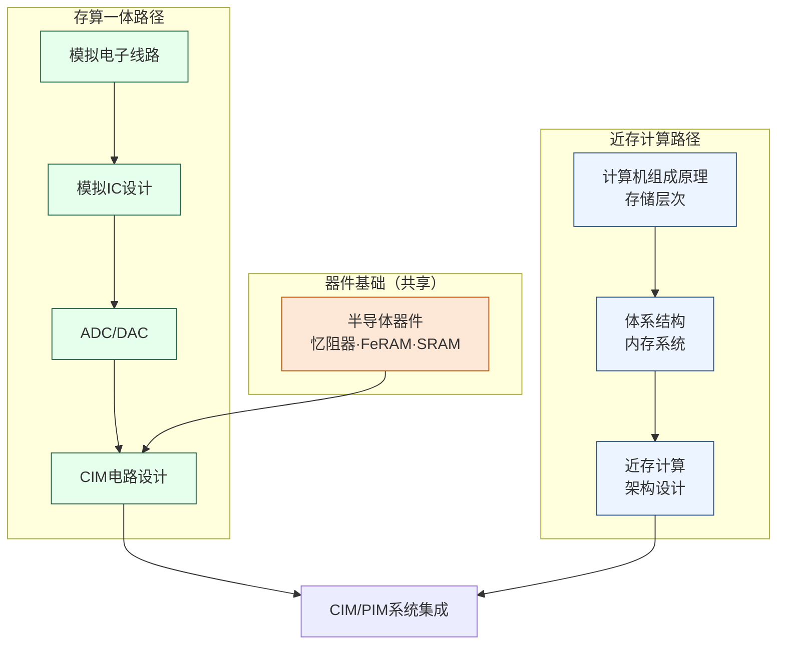

---
hide:
  - navigation
---
# 存算一体与近存计算

## 一句话定义

让计算直接在数据所在地发生——存算一体（CIM）让矩阵乘法在存储阵列内完成，近存计算（PIM）把处理逻辑搬到内存旁，从根本上切断冯·诺依曼架构中搬运数据的能耗代价。

## 这个方向在研究什么

冯·诺依曼架构把计算单元和存储单元分开——这个七十年前的设计决策是现代计算机的基础，但也埋下了一个随着计算规模扩大而越来越难忽视的问题：数据必须在存储和计算之间来回搬运，而搬运本身消耗能量和时间。在今天的 AI 工作负载下，这个代价已经触目惊心。一块 NVIDIA H100 GPU 的计算能力是每秒约 990 TFLOPS（FP16），但它的片外内存带宽只有约 3.35 TB/s——芯片大量时间是在等数据从内存传来，而非在算。有测量表明，训练大模型时，数据搬运消耗的能量比实际矩阵乘法本身还多。

存算一体（Compute-in-Memory, CIM）是最激进的解法：让计算直接发生在存储单元里，从根本上消除搬运这一步。最直观的实现是 SRAM-CIM：在标准的六管 SRAM 单元旁加入计算逻辑，把输入信号以电压或电流的形式注入整列，所有单元同时做乘法，列末端的模拟电路把结果累加，再由 ADC 转成数字值。这个过程天然对应向量内积运算，恰好是矩阵乘法的基本操作。理论上，这样做可以把每次乘加操作的能耗降低 10 到 100 倍，因为信号不再需要离开存储阵列就完成了计算。RRAM/PCM/FeRAM 等非易失存储器进一步扩展了这个思路：器件的电阻值可以连续调节，天然模拟神经网络的突触权重，且断电不丢失——一个器件可以同时承担存储和计算两个功能，面积和能耗进一步优化。

实际的困难在于精度。模拟计算的结果受器件制造偏差、电源噪声、温度漂移影响，很难稳定维持 8 位以上的精度，而大多数神经网络推理需要至少 8 位整数量化。这迫使研究者不只设计电路，还要同时研究适配低精度硬件的量化算法，让芯片架构和模型压缩协同优化。这种"硬件-算法协同设计"正是这个方向最有活力的地方：一个纯做电路的人和一个纯做算法的人都无法独立解决它，需要两种背景的研究者在问题本身上相遇。

近存计算（Processing-in-Memory / Near-Memory Computing, PIM/NMC）采取了一种不同的策略：不在阵列内计算，而是把处理逻辑紧贴存储单元放置，大幅缩短数据搬运距离。HBM（高带宽内存）是当前 AI 芯片广泛使用的近存方案，把 DRAM Die 与逻辑 Die 3D 堆叠，通过 TSV 将带宽提升数倍；更激进的近存计算在 DRAM 阵列内或其边缘集成 SIMD 计算单元，让内存自己能执行简单运算。图神经网络、稀疏矩阵操作、推荐系统等"内存密集型"应用（memory-bound workloads）尤其受益于这种架构——这些应用的计算/访存比极低，在传统 GPU 上 80% 以上的时间都在等内存。三星、SK Hynix 等存储厂商已在 HBM 中集成 PIM 逻辑，研究者则从体系结构层面研究如何为这类计算设备设计高效的编程模型和编译器支持。

## 核心研究问题

- **CIM 精度**：模拟计算受器件偏差和噪声影响，如何在电路层补偿偏差、在算法层设计对低精度鲁棒的量化训练？
- **器件变异性**：RRAM/FeRAM 的电阻状态存在变异和漂移，如何在材料和器件层提高均匀性？
- **近存架构设计**：如何为 PIM 设备设计高效的编程模型和编译器，让应用程序能透明利用近存算力？
- **稀疏计算映射**：图计算、推荐模型等稀疏工作负载如何在 CIM/PIM 硬件上高效映射，避免大量单元空转？
- **硬件-算法协同**：量化精度约束与存储阵列拓扑如何反过来指导神经网络结构设计？

## 代表性机构与企业

| | 国际 | 国内 |
|--|------|------|
| **企业** | Samsung（HBM-PIM）、SK Hynix、Micron、IBM | 长鑫存储、长江存储、华为 |
| **高校** | Stanford、MIT、Georgia Tech、Purdue、ETH | 清华、北大、复旦、浙大 |
| **顶会** | ISSCC · IEDM · ISCA · MICRO · DAC | — |

## 知识路径

**本站相关课程：**

CIM 路径：
- [模拟电子线路（复旦）](../课程资源/电路/模拟/模拟电子线路/MICR130002.md)
- [模拟集成电路设计原理（复旦）](../课程资源/电路/模拟/模拟集成电路/MICR130030.md)
- [ADC/DAC（复旦）](../课程资源/电路/信号处理/数模模数转换器/INFO130270.md)

近存计算路径：
- [计算机组成原理（复旦）](../课程资源/系统架构/速通/MICR130038.md) · [UCB CS61C](../课程资源/系统架构/体系结构/CS61C.md)
- [ETHz Computer Architecture](../课程资源/系统架构/体系结构/CA.md)

## 入门三步走

**第一步：理解动机**  
阅读 Wulf & McKee, *Hitting the Memory Wall* (1995)，两页纸，清楚解释了为什么存储墙是个根本性问题，也是 CIM 和 PIM 研究最核心的出发点。

**第二步：了解两种主流方案**  
- CIM：阅读 Sebastian et al., *Memory devices and applications for in-memory computing* (Nature Nanotechnology, 2020)，梳理从器件到系统的全链路  
- PIM：阅读 Mutlu et al., *A Modern Primer on Processing in Memory* (Emerging Computing, 2022)，全面综述近存计算架构的动机、设计空间与挑战

**第三步：跟进前沿**  
浏览 ISSCC 2022-2024 的 SRAM-CIM Session 论文，以及 ISCA/MICRO 中 near-memory computing 的 roofline 分析，感受硬件-算法协同设计的当前研究粒度。

## 相关课题组

### 境内

-   **[马恺声](http://group.iiis.tsinghua.edu.cn/~maks/)** 清华

    存算融合系统架构 · AI 算法-电路-架构协同 · 感存算一体

-   **[吴华强](https://www.ime.tsinghua.edu.cn/info/1015/1787.htm)** 清华

    忆阻器件与存内计算芯片 · 器件到系统全栈设计

-   **[钱鹤](https://www.sic.tsinghua.edu.cn)** 清华

    SRAM-CIM 存算一体电路 · AI 推理芯片低功耗设计

-   **[唐建石](https://www.ime.tsinghua.edu.cn/info/1035/1595.htm)** 清华

    忆阻器存算一体芯片 · 储备池计算 · 三维异质集成

-   **[高滨](https://www.sic.tsinghua.edu.cn)** 清华

    忆阻器存算一体芯片设计方法学 · 器件-系统联合仿真

-   **[高鸣宇](https://people.iiis.tsinghua.edu.cn/~gaomy/)** 清华

    高效内存系统 · 数据密集型负载加速 · 近存计算

-   **[黄鹏](https://ic.pku.edu.cn/szdw/zzjs/sjzdhyjsxtx1/hp/index.htm)** 北大

    RRAM 存算一体芯片与架构 · 传感-存储-计算融合

-   **[叶乐](https://ic.pku.edu.cn/szdw/zzjs/jcdlsjx1/yl/index.htm)** 北大

    存算一体 AI 芯片 · 3D 集成 AIoT 芯片

-   **[孙仲](http://scholar.pku.edu.cn/zhong_sun/home)** 北大

    RRAM 模拟矩阵计算芯片 · 高精度存算一体

-   **[蔡一茂](https://ic.pku.edu.cn/en/Faculty/Facultys/DepartmentofMicroNanoelectronics/CaiYimao/index.htm)** 北大

    RRAM 忆阻器件 · 存算一体芯片

-   **[王宗巍](https://ic.pku.edu.cn/szdw/zzjs/jcwndzx1/wzw/index.htm)** 北大

    钽基 ReRAM · 存内计算芯片系统

-   **[薛晓勇](https://sme.fudan.edu.cn/60/46/c31133a352326/page.htm)** 复旦

    存算一体数模混合 IC · 近存计算软硬件协同

-   **[刘琦](https://icmne.fudan.edu.cn/2d/2a/c48925a732458/page.htm)** 复旦

    ReRAM/FeRAM 存算一体芯片 · 类脑计算

-   **[周鹏](https://sme.fudan.edu.cn/60/68/c31158a352360/page.htm)** 复旦

    二维半导体感存算一体 · 仿视网膜集成

-   **[蒋昊](https://fics.fudan.edu.cn/8e/8a/c22620a429706/page.htm)** 复旦

    忆阻器与铁电器件 · 存内计算 · 硬件安全 PUF

<button class="prof-show-all">显示全部 ↓</button>

### 境外

-   **[翁毅（Ngai Wong）](https://www.eee.hku.hk/~nwong/)** 港大

    忆阻器/ReRAM 存算一体 AI 芯片 · 紧凑神经网络设计

-   **[黎灿（Can Li）](https://ece.hku.hk/people/canl/)** 港大

    忆阻器存算一体芯片 · 神经形态 AI 加速

-   **[H.-S. Philip Wong](https://nano.stanford.edu)** Stanford

    相变存储器（PCM） · 存算一体 · 3D 异构集成

-   **[Shimeng Yu](https://shimeng.ece.gatech.edu)** Georgia Tech

    RRAM/FeFET 存算一体 · NeuroSim 仿真工具 · 器件-算法协同

-   **[Kaushik Roy](https://engineering.purdue.edu/NRL)** Purdue

    低功耗 AI 芯片 · SRAM-CIM · 存算一体硬件

-   **[Hai Li & Yiran Chen](https://cei.pratt.duke.edu/)** Duke CEI

    新型 NVM 存储器电路 · 存算一体系统 · DNN 压缩与 AI 硬件协同

-   **[Onur Mutlu](https://people.inf.ethz.ch/omutlu/)** ETH Zürich

    近存计算与 PIM 架构 · DRAM 可靠性（RowHammer）

-   **[Tony Nowatzki](https://web.cs.ucla.edu/~nowatzki/)** UCLA

    近存计算（PIM） · 领域专用加速器 · 数据流架构

-   **[José Martínez](https://www.csl.cornell.edu/~martinez/)** Cornell

    近内存计算 · 内存系统架构 · 异构存储层次优化

<button class="prof-show-all">显示全部 ↓</button>
