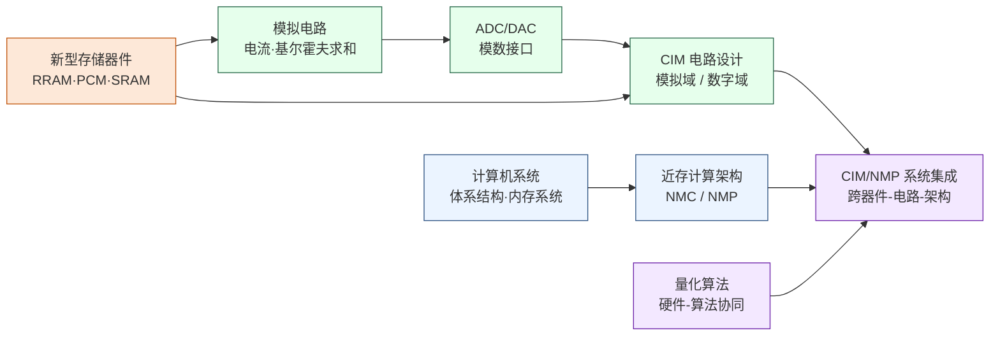

---
hide:
  - navigation
---

你的手机里运行大模型时，大约 70% 的能量不是花在矩阵乘法上，而是花在把数字从内存搬到计算单元这件事上——存算一体（CIM）与近存计算（NMC）研究的，是能不能让计算直接在数据所在的地方发生。

## 这个方向在研究什么

冯·诺依曼在 1945 年设计出"计算单元和存储单元分开"这套架构时，这是一个优雅的决策——让两者各做各的专项。但它也内置了一个代价：数据必须在存储和计算之间来回搬运，而这件事本身消耗能量和时间。在规模不大的时候，代价不显眼；AI 把模型规模推到数百亿参数之后，这个代价变得无法忽视。一块 NVIDIA H100 GPU（图形处理器）的理论算力是每秒 990 TFLOPS（每秒万亿次浮点运算，FP16 精度），但它的片外内存带宽只有约 3.35 TB/s——芯片大量时间不是在算，而是在等数据从内存传来。这个差距在大模型推理时格外显眼：权重矩阵巨大但每次只用一次，实际有效算力利用率有时不到 30%。更触目惊心的是能耗：有测量表明，在 H100 上跑推理时，数据搬运消耗的能量比矩阵乘法本身还多。这不是工程师没优化好，而是冯·诺依曼架构埋下的物理代价，随着 AI 模型规模暴涨，它从一个学术话题变成了影响整个产业的根本瓶颈。

<svg viewBox="0 0 880 220" xmlns="http://www.w3.org/2000/svg" style="width:100%;max-width:880px;display:block;margin:1.5em auto;font-family:system-ui,-apple-system,sans-serif">
  <defs>
    <marker id="cim-arrR" markerWidth="8" markerHeight="6" refX="7" refY="3" orient="auto"><polygon points="0 0,8 3,0 6" fill="#EF4444"/></marker>
    <marker id="cim-arrL" markerWidth="8" markerHeight="6" refX="1" refY="3" orient="auto-start-reverse"><polygon points="0 0,8 3,0 6" fill="#EF4444"/></marker>
    <marker id="nmc-arr" markerWidth="8" markerHeight="6" refX="7" refY="3" orient="auto"><polygon points="0 0,8 3,0 6" fill="#7C3AED"/></marker>
  </defs>
  <!-- Panel 1: Von Neumann -->
  <rect x="15" y="10" width="270" height="200" rx="10" fill="#F8FAFC" stroke="#CBD5E1" stroke-width="1.5"/>
  <text x="150" y="33" text-anchor="middle" font-size="13" font-weight="700" fill="#1E293B">传统冯·诺依曼架构</text>
  <rect x="30" y="55" width="90" height="72" rx="6" fill="#DBEAFE" stroke="#3B82F6" stroke-width="1.5"/>
  <text x="75" y="89" text-anchor="middle" font-size="13" font-weight="700" fill="#1D4ED8">CPU</text>
  <text x="75" y="107" text-anchor="middle" font-size="10" fill="#3B82F6">计算单元</text>
  <rect x="165" y="55" width="90" height="72" rx="6" fill="#DCFCE7" stroke="#16A34A" stroke-width="1.5"/>
  <text x="210" y="89" text-anchor="middle" font-size="13" font-weight="700" fill="#15803D">DRAM</text>
  <text x="210" y="107" text-anchor="middle" font-size="10" fill="#16A34A">存储单元</text>
  <line x1="120" y1="91" x2="165" y2="91" stroke="#EF4444" stroke-width="2.5" marker-end="url(#cim-arrR)" marker-start="url(#cim-arrL)"/>
  <text x="142" y="84" text-anchor="middle" font-size="9" fill="#EF4444" font-weight="600">数据总线</text>
  <text x="150" y="158" text-anchor="middle" font-size="11" fill="#DC2626" font-weight="600">⚠ 搬运耗能 ≈ 70%</text>
  <text x="150" y="176" text-anchor="middle" font-size="10" fill="#64748B">带宽成为主要瓶颈</text>
  <!-- Panel 2: CIM -->
  <rect x="305" y="10" width="270" height="200" rx="10" fill="#F8FAFC" stroke="#CBD5E1" stroke-width="1.5"/>
  <text x="440" y="33" text-anchor="middle" font-size="13" font-weight="700" fill="#1E293B">存算一体（CIM）</text>
  <rect x="320" y="55" width="240" height="72" rx="6" fill="#FEF3C7" stroke="#D97706" stroke-width="2"/>
  <line x1="440" y1="55" x2="440" y2="127" stroke="#D97706" stroke-width="1.5" stroke-dasharray="5,3"/>
  <text x="380" y="89" text-anchor="middle" font-size="12" font-weight="700" fill="#92400E">存储阵列</text>
  <text x="380" y="107" text-anchor="middle" font-size="10" fill="#B45309">SRAM / RRAM</text>
  <text x="500" y="89" text-anchor="middle" font-size="12" font-weight="700" fill="#92400E">计算逻辑</text>
  <text x="500" y="107" text-anchor="middle" font-size="10" fill="#B45309">嵌入阵列内</text>
  <text x="440" y="158" text-anchor="middle" font-size="11" fill="#16A34A" font-weight="600">✓ 数据不移动，就地计算</text>
  <text x="440" y="176" text-anchor="middle" font-size="10" fill="#64748B">能效提升 10–100×</text>
  <!-- Panel 3: NMC -->
  <rect x="595" y="10" width="270" height="200" rx="10" fill="#F8FAFC" stroke="#CBD5E1" stroke-width="1.5"/>
  <text x="730" y="33" text-anchor="middle" font-size="13" font-weight="700" fill="#1E293B">近存计算（NMC / NMP）</text>
  <rect x="610" y="55" width="100" height="72" rx="6" fill="#DCFCE7" stroke="#16A34A" stroke-width="1.5"/>
  <text x="660" y="89" text-anchor="middle" font-size="13" font-weight="700" fill="#15803D">HBM</text>
  <text x="660" y="107" text-anchor="middle" font-size="10" fill="#16A34A">存储单元</text>
  <rect x="725" y="64" width="85" height="54" rx="6" fill="#EDE9FE" stroke="#7C3AED" stroke-width="1.5"/>
  <text x="767" y="90" text-anchor="middle" font-size="11" font-weight="700" fill="#5B21B6">计算逻辑</text>
  <text x="767" y="107" text-anchor="middle" font-size="9" fill="#7C3AED">逻辑层</text>
  <line x1="710" y1="91" x2="725" y2="91" stroke="#7C3AED" stroke-width="2" marker-end="url(#nmc-arr)"/>
  <text x="717" y="83" text-anchor="middle" font-size="8" fill="#7C3AED">极短</text>
  <text x="730" y="158" text-anchor="middle" font-size="11" fill="#16A34A" font-weight="600">✓ 大幅缩短搬运距离</text>
  <text x="730" y="176" text-anchor="middle" font-size="10" fill="#64748B">Samsung HBM-PIM · SK Hynix AiM</text>
</svg>

研究者走出了两条截然不同的路。第一条是存算一体（Compute-in-Memory，CIM）：既然数据搬运是根源，那就让计算直接发生在存储阵列里，根本不搬。最直观的实现是 SRAM-CIM（静态随机存取存储器存算一体）——在标准 SRAM 单元旁加入计算逻辑，把输入以模拟电压注入整列，所有单元同时做乘法，列末端自然累加成向量内积。2019 年前后，台湾交大、清华等研究组开始在 ISSCC 上发表完整流片的 SRAM-CIM 芯片，把矩阵乘法的能耗从 GPU 的数十皮焦每次操作降到亚皮焦级，能效提升接近两个数量级。更激进的路线是用忆阻器（RRAM，阻变存储器；PCM，相变存储器）做存算一体：这种器件的电阻值可以调节并断电保留，天然模拟神经网络突触权重，读取时流过的电流就是权重乘以输入的结果，基尔霍夫定律自动完成累加——一个器件同时承担存储和计算两个功能。第二条是近存计算（Near-Memory Computing，NMC，也称 Near-Memory Processing，NMP）：不在阵列单元内计算，而是把处理逻辑紧贴存储单元放，大幅缩短搬运距离。三星 2021 年发布的 HBM-PIM（高带宽内存近存处理，尽管名字里带 PIM，实质是 NMC 的一种实现）把 SIMD（单指令多数据流）计算单元集成进 HBM2（第二代高带宽内存）的逻辑层，对特定 AI 推理工作负载实现了 2 倍吞吐、60% 能耗降低。SK Hynix 的 AiM 走了类似路线，这些产品证明了近存计算不只是实验室概念，可以量产落地。

CIM 内部形成了两条清晰的技术路线。模拟路线利用物理过程（电流即乘法、基尔霍夫求和）直接实现计算，理论能效可以提升 100 倍以上，代表器件是 RRAM 和 PCM；代价是模拟计算的结果受器件制造偏差、电源噪声、温度漂移影响，稳定精度通常只有 4-6 位有效位。数字路线在 SRAM 单元里做数字运算，精度可控、可复用成熟 EDA 流程，能效提升约 3-5 倍，量产风险更低。两条路线并行发展，交汇点在量化算法与硬件协同设计——研究如何让算法精度需求和电路物理约束相互适应，既是这个方向最活跃的研究地带，也对两种背景的研究者都开放。

### 核心研究问题

- **模拟域精度 vs 能效**：模拟 CIM 用电流和基尔霍夫定律换来 100× 能效，代价是结果被器件制造偏差、电源噪声、温度漂移污染，稳定有效位常常只有 4-6 位——这是物理换算力的根本张力，能不能在电路层做补偿、在算法层训练出对低精度鲁棒的网络，决定模拟路线到底能走多远？
- **ADC/接口开销吃掉收益**：模拟阵列算得再省，结果终究要被 ADC 读回数字域，而高精度 ADC 的面积和功耗往往反客为主、抵消阵列省下的能量——如何在 ADC 分辨率、列并行度和系统精度之间找到平衡点？
- **数字路线还是模拟路线**：SRAM 数字 CIM 精度可控、能复用成熟 EDA 流程、量产风险低，但能效只有 3-5×；模拟 RRAM/PCM 上限高却难量产——两条路线在什么工作负载、什么精度需求下各自胜出，是一个尚未定论的工程判断。
- **新型存储器件的成熟度**：RRAM、PCM 等忆阻器件天然适合做模拟突触，但电阻状态的变异、漂移与可重复性仍卡在材料和器件层，如何把单器件的漂亮特性放大成可流片的大阵列？
- **近存计算的编程模型**：NMC/NMP 把逻辑紧贴 HBM 的逻辑层，硬件已经量产，但如何设计编译器与运行时让上层应用透明地用上这份近存算力，仍是架构侧的开放问题。
- **量化算法与硬件协同设计**：这是正文点明的、两种背景共享的最活跃地带——存储阵列拓扑与电路物理约束能不能反过来指导量化策略、网络结构与训练，让算法精度需求和硬件能力相互适应？

### 知识路径

图中节点对应以下知识板块（按需选修）：

- 新型存储器件（RRAM/PCM/SRAM、半导体物理）→ [器件与工艺](../学习地图/器件与工艺/index.md)
- 模拟电路、ADC/DAC、CIM 电路设计 → [电路](../学习地图/电路/index.md)
- 计算机系统、体系结构与内存系统、近存计算架构 → [系统架构](../学习地图/系统架构/index.md)
- 量化算法与硬件-算法协同 → [人工智能](../学习地图/人工智能/index.md)

> 图示为前置知识的依赖顺序，按需选修，不必全部学完再进入研究。

## 这个方向适合谁

先说一件这个方向绕不开的事：它天生是跨层的。内存墙是冯·诺依曼架构埋下的物理代价，要拆它，你没法只待在一层——模拟 CIM 的精度问题，根子在器件偏差和电源噪声，补偿手段却要落到电路甚至算法；近存计算的算力是架构给的，能不能用上又取决于编译器和运行时。所以最适合这个方向的，是那种愿意在器件、电路、架构之间来回穿梭、不把"这不是我那一层的事"当借口的人。如果你看到"模拟域有效位只有 4-6 位""ADC 开销抵消了阵列省下的能量"这类又脏又具体的工程矛盾会觉得有意思而不是想绕开，那你大概率会喜欢这里。

它实际上提供了两个不同的入口，可以从你熟悉的本科背景切进来。偏模拟电路 / 器件方向的，从 SRAM-CIM 或 RRAM 器件入手，设计阵列、分析噪声、做流片验证，工具是 Cadence Spectre 和版图，成果发在 ISSCC、IEDM、VLSI Symposium 这类电路与器件的顶级会场，期刊则是 JSSC、TED，做出漂亮新器件还能冲 *Nature Electronics*、*Nature Nanotechnology*。偏体系结构 / CS 方向的，则从近存计算切入，研究编程模型、编译器映射、roofline 分析，用 gem5、Ramulator 跑模拟，成果发在 ISCA、MICRO、HPCA，多数工作不需要流片。两条路的发表阵地、工具链、节奏都不一样，选哪条很大程度上取决于你本科攒下的是哪套手艺。

而真正值得点名的是两条路的交汇点——量化算法与硬件协同设计。让算法的精度需求和电路的物理约束相互适应，这个子方向对两种背景都开放，正文也说了它是目前发论文效率最高的地带，DAC 这类设计自动化会场尤其欢迎这种软硬协同的工作。如果你既能读懂电路约束、又懂一点量化训练，这里的空白最多、上手最快。

至于不太适合的情形，我倒想说得直白些：如果你对真实电路的噪声、对内存系统那些琐碎的工程细节完全提不起兴趣，只想做干净漂亮的纯理论推导，那这个方向会让你很难受——它的价值恰恰长在那些不干净的物理细节里，回避了它们，也就回避了这个方向本身。

## 学术界

### 课题组

**境内**

-   **[马恺声](http://group.iiis.tsinghua.edu.cn/~maks/)** 清华

    存算融合系统架构 · AI 算法-电路-架构协同 · 感存算一体

-   **[吴华强](https://www.ime.tsinghua.edu.cn/info/1015/1787.htm)** 清华

    忆阻器件与存内计算芯片 · 器件到系统全栈设计

-   **[钱鹤](https://www.sic.tsinghua.edu.cn)** 清华

    SRAM-CIM 存算一体电路 · AI 推理芯片低功耗设计

-   **[唐建石](https://www.ime.tsinghua.edu.cn/info/1035/1595.htm)** 清华

    忆阻器存算一体芯片 · 储备池计算 · 三维异质集成

-   **[高滨](https://www.sic.tsinghua.edu.cn)** 清华

    忆阻器存算一体芯片设计方法学 · 器件-系统联合仿真

-   **[高鸣宇](https://people.iiis.tsinghua.edu.cn/~gaomy/)** 清华

    高效内存系统 · 数据密集型负载加速 · 近存计算

-   **[黄鹏](https://ic.pku.edu.cn/szdw/zzjs/sjzdhyjsxtx1/hp/index.htm)** 北大

    RRAM 存算一体芯片与架构 · 传感-存储-计算融合

-   **[叶乐](https://ic.pku.edu.cn/szdw/zzjs/jcdlsjx1/yl/index.htm)** 北大

    存算一体 AI 芯片 · 3D 集成 AIoT 芯片

-   **[孙仲](http://scholar.pku.edu.cn/zhong_sun/home)** 北大

    RRAM 模拟矩阵计算芯片 · 高精度存算一体

-   **[蔡一茂](https://ic.pku.edu.cn/en/Faculty/Facultys/DepartmentofMicroNanoelectronics/CaiYimao/index.htm)** 北大

    RRAM 忆阻器件 · 存算一体芯片

-   **[王宗巍](https://ic.pku.edu.cn/szdw/zzjs/jcwndzx1/wzw/index.htm)** 北大

    钽基 ReRAM · 存内计算芯片系统

-   **[薛晓勇](https://sme.fudan.edu.cn/60/46/c31133a352326/page.htm)** 复旦

    存算一体数模混合 IC · 近存计算软硬件协同

-   **[刘琦](https://icmne.fudan.edu.cn/2d/2a/c48925a732458/page.htm)** 复旦

    ReRAM/FeRAM 存算一体芯片 · 类脑计算

-   **[周鹏](https://sme.fudan.edu.cn/60/68/c31158a352360/page.htm)** 复旦

    二维半导体感存算一体 · 仿视网膜集成

-   **[蒋昊](https://fics.fudan.edu.cn/8e/8a/c22620a429706/page.htm)** 复旦

    忆阻器与铁电器件 · 存内计算 · 硬件安全 PUF

-   **[杨玉超](https://ic.pku.edu.cn/szdw/zzjs/jcwndzx1/yyc/index.htm)** 北大

    忆阻器规模化制造 · 大算力存算一体芯片 · 高阶类脑计算

-   **[蒋力](https://www.cs.sjtu.edu.cn/jiaoshiml/jiangli.html)** 交大

    存算一体架构与设计自动化 · RRAM-PIM/SRAM 存内计算加速器 · 稀疏算法-架构协同

-   **[何卫锋](https://icisee.sjtu.edu.cn/jiaoshiml/heweifeng.html)** 交大

    SRAM 存内计算/近存计算芯片 · 高能效 AI 芯片 · ISSCC 流片验证

-   **[孙亚男](https://icisee.sjtu.edu.cn/jiaoshiml/sunyanan.html)** 交大 

    存内计算（ReRAM/SRAM-CIM）· 三维集成电路设计 · 神经网络加速器与边缘计算

-   **[张亦舒](https://ic.zju.edu.cn/2024/0604/c81879a2928352/page.htm)** 浙大

    RRAM/FeRAM 存算一体芯片 · 神经形态计算 · 存算加密芯片

-   **[康一](https://faculty.ustc.edu.cn/kangyi)** 中科大

    存算一体计算机体系架构 · 混合存内计算 AI 加速器 · 大算力芯片设计

-   **[陈松](https://sme.ustc.edu.cn/2022/0601/c31000a556942/page.htm)** 中科大

    存算融合架构与芯片 · PIM/SRAM-CIM 加速器 · EDA 与编译优化

-   **[缪峰](https://physics.nju.edu.cn/szdw/qbmd/20240321/i261985.html)** 南大

    二维材料忆阻器 · 存内并行矩阵计算 · 类脑感存算视觉系统

-   **[王宇宣](https://is.nju.edu.cn/wyx/main.htm)** 南大

    器件级存算一体 AI 加速芯片 · 光电存算一体 · 存算融合类脑计算

-   **[陈晓明](https://people.ucas.edu.cn/~chenxm)** 中科院

    存算一体架构与 EDA · 稀疏矩阵加速 · AI 加速器设计

-   **[窦春萌](https://people.ucas.ac.cn/~douchunmeng)** 中科院

    RRAM 存算一体芯片（近阈值计算）· 智能计算芯片 · 混合信号电路

-   **[李鹏](https://sme.ustc.edu.cn/2022/0601/c30996a556941/page.htm)** 中科大

    自旋电子神经形态器件 · 存算一体材料与芯片

<button class="prof-show-all">显示全部 ↓</button>

**境外**

-   **[Ngai Wong（黃毅）](https://www.eee.hku.hk/~nwong/)** 港大

    忆阻器/ReRAM 存算一体 AI 芯片 · 紧凑神经网络设计

-   **[Can Li（李灿）](https://ece.hku.hk/people/canl/)** 港大

    忆阻器存算一体芯片 · 神经形态 AI 加速

-   **[H.-S. Philip Wong（黃漢森）](https://nano.stanford.edu)** Stanford

    相变存储器（PCM） · 存算一体 · 3D 异构集成

-   **[Shimeng Yu（余诗孟）](https://shimeng.ece.gatech.edu)** Georgia Tech

    RRAM/FeFET 存算一体 · NeuroSim 仿真工具 · 器件-算法协同

-   **[Kaushik Roy](https://engineering.purdue.edu/NRL)** Purdue

    低功耗 AI 芯片 · SRAM-CIM · 存算一体硬件

-   **[Hai (Helen) Li (李海) & Yiran Chen (陈怡然)](https://cei.pratt.duke.edu/)** Duke 

    新型 NVM 存储器电路 · 存算一体系统 · DNN 压缩与 AI 硬件协同

-   **[Onur Mutlu](https://people.inf.ethz.ch/omutlu/)** ETH Zürich

    近存计算与 PIM 架构 · DRAM 可靠性（RowHammer）

-   **[Tony Nowatzki](https://web.cs.ucla.edu/~nowatzki/)** UCLA

    近存计算（PIM） · 领域专用加速器 · 数据流架构

-   **[José Martínez](https://www.csl.cornell.edu/~martinez/)** Cornell

    近内存计算 · 内存系统架构 · 异构存储层次优化

-   **[Naveen Verma](https://ece.princeton.edu/people/naveen-verma)** Princeton

    SRAM 电荷域存算一体 · 机器学习硬件 · 大面积电子学

-   **[Boris Murmann](https://murmann-group.stanford.edu/)** Stanford

    混合信号 IC 设计 · 嵌入式机器学习 · 模拟/数字 IMC 接口

<button class="prof-show-all">显示全部 ↓</button>

### 学术会议与期刊

  
会议
    ISSCC
    IEDM
    VLSI Symposium
    ISCA
    MICRO
    HPCA
    DAC
  

  
期刊
    IEEE JSSC
    IEEE TED
    IEEE TCAS-I/II
    *Nature Electronics*
    *Nature Nanotechnology*
  

## 毕业去向

### 企业

  
国内
    <a class="dm-chip" href="https://www.bjxxtech.net/">北极雄芯 Polar Bear Tech</a>
    <a class="dm-chip" href="https://www.cxmt.com/">长鑫存储 CXMT</a>
    <a class="dm-chip" href="https://www.ymtc.com/">长江存储 YMTC</a>
    <a class="dm-chip" href="https://www.witmem.com/">知存科技 Witmem</a>
    <a class="dm-chip" href="https://www.houmoai.com/">后摩智能 Houmo.AI</a>
    <a class="dm-chip" href="https://www.yizhu-tech.com/">亿铸科技 Yizhu</a>
    <a class="dm-chip" href="https://pimchip.cn/">苹芯科技 PIMCHIP</a>
    <a class="dm-chip" href="https://reexen.com/">九天睿芯 Reexen</a>
    <a href="https://www.zbitsemi.com/">恒烁股份</a>
  

  
国外
    <a href="https://www.samsung.com/">Samsung 三星电子</a>
    <a href="https://www.skhynix.com/">SK Hynix</a>
    <a href="https://www.micron.com/">Micron 美光</a>
    <a href="https://www.ibm.com/">IBM</a>
    <a class="dm-chip" href="https://mythic.ai/">Mythic</a>
    <a class="dm-chip" href="https://www.upmem.com/">UPMEM</a>
  

### 科研院所

  
国内
    <a class="dm-chip" href="https://www.ime.ac.cn/" title="新型存储器件与存算一体芯片、器件-电路协同">中科院微电子所</a>
    <a class="dm-chip" href="https://www.zhejianglab.org/" title="智能计算，存算一体与类脑计算系统">之江实验室</a>
  

  
国外
    <a class="dm-chip" href="https://www.zurich.ibm.com/sto/memory/" title="模拟存内计算、相变存储器 AI 加速">IBM Research–Zurich（神经形态与存内计算组）</a>
    <a class="dm-chip" href="https://www.imec-int.com/en" title="新型非易失存储器件与存算一体工艺">imec</a>
    <a class="dm-chip" href="https://www.aist.go.jp/index_en.html" title="自旋电子/新型器件存内计算">AIST（日本产综研）</a>
  

