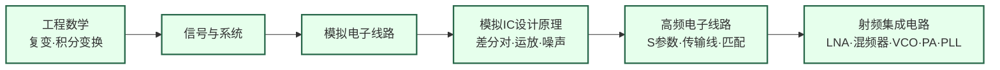

# 射频与毫米波

## 一句话定义

设计让无线信号在空气中高速传播的模拟芯片——从手机基带到毫米波雷达，从 5G 基站到卫星互联网。

## 为什么重要

一切无线通信的背后都是射频芯片。5G 向 6G 的演进将工作频段推进到毫米波乃至太赫兹，频率越高，电路设计难度呈指数级上升。与此同时，FMCW 毫米波雷达成为自动驾驶传感器的核心组件，卫星互联网（Starlink 等）的低轨星座需要大量低成本相控阵芯片。

这个方向是模拟集成电路设计能力的最高体现之一，也是复旦微电子学院的传统强项方向。

## 核心研究问题

- **毫米波路径损耗**：频率越高，空间损耗越大，如何用有限功耗维持链路预算？
- **功率效率**：功率放大器（PA）的效率在毫米波频段急剧下降，如何设计高效率 PA？
- **相控阵集成**：5G/6G 需要数百个天线单元的相控阵，如何将波束赋形电路集成在单芯片上？
- **太赫兹**：300 GHz 以上频段的有源器件设计是前沿挑战，标准 CMOS 能走多远？

## 代表性机构与企业

| | 国际 | 国内 |
|--|------|------|
| **企业** | Qualcomm、Broadcom、MediaTek、Skyworks | 紫光展锐、翱捷科技、华为海思 |
| **高校** | UCB（Niknejad）、UCLA（Razavi/Abidi）、Stanford | 复旦、东南大学、东北大学 |
| **顶会** | ISSCC、RFIC Symposium、IMS、ESSCIRC | — |

## 知识路径

**本站相关课程（本方向知识链最完整）：**

- [信号与系统（复旦）](../课程资源/电路/信号处理/信号与系统/MICR130004.md) · [MIT 6.003](../课程资源/电路/信号处理/信号与系统/MIT6.003.md)
- [模拟电子线路（复旦）](../课程资源/电路/模拟/模拟电子线路/MICR130002.md)
- [模拟集成电路设计原理（复旦）](../课程资源/电路/模拟/模拟集成电路/MICR130030.md)
- [EE613: High-Frequency Analog Circuit Design](../课程资源/电路/模拟/高频电子线路/EE613.md) · [MIT 6.776](../课程资源/电路/模拟/高频电子线路/MIT6.776.md)
- [Razavi RF Microelectronics (UCLA EE164)](../课程资源/电路/模拟/射频集成电路/razavi_rf.md) · [UCB EE142](../课程资源/电路/模拟/射频集成电路/EE142.md)

## 入门三步走

**第一步：建立系统观**  
阅读 Razavi《RF Microelectronics》第 1 章（收发机系统架构），20 页，了解一块射频芯片在整个通信链路中扮演什么角色。

**第二步：建立电路直觉**  
观看 Razavi YouTube 频道的 Electronics 1/2 系列，打牢差分对、电流镜、运放的基础——这是理解所有射频电路的前提。

**第三步：进入核心**  
跟随 Razavi UCLA EE164 课程视频，结合教材逐章学习 LNA、混频器、VCO 的设计方法，这是目前公开资料中质量最高的射频 IC 课程。
