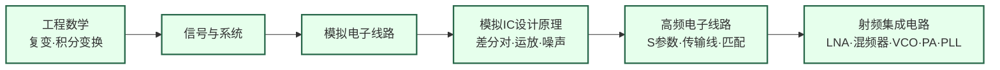

# 射频与毫米波

## 一句话定义

设计让无线信号在空气中高速传播的模拟芯片——从手机基带到毫米波雷达，从 5G 基站到卫星互联网。

## 这个方向在研究什么

在低频电路里，工程师可以把导线看成理想连接——电流从 A 到 B，没有损耗、没有相移、没有辐射。但当信号频率进入 GHz 量级，这个假设就彻底失效了。一根几毫米长的走线，其电感值足以显著影响信号传播；电路板上两根平行走线之间的耦合电容可以把一路信号泄漏到另一路；晶体管的本征增益随频率升高而快速下降，到了几十 GHz 已经所剩无几。射频电路工程师用 S 参数、噪声系数、P1dB 压缩点这些工具来分析和设计电路，这是模拟电路知识在高频下的延伸，但物理图像完全不同。

一块完整的射频收发机芯片由几个关键模块组成，每个模块都有各自难以绕开的物理权衡。接收端的低噪声放大器（LNA）负责把天线接到的微弱信号——有时只有 -100 dBm，相当于 0.1 皮瓦——放大到后级电路可以处理的水平，同时不能引入太多自身噪声，否则噪声就会淹没信号。"低噪声"和"低功耗"本质上是对立的：想要更低的噪声，就需要更大的偏置电流，这是量子力学层面的热噪声限制，无法靠巧妙设计绕过去。发射端的功率放大器（PA）面临另一对矛盾：高功率输出要求晶体管工作在非线性区，但非线性会产生谐波失真，干扰其他信道；想要线性，就要把工作点压低，效率随之大幅下降。一个 LTE 基站的 PA 效率通常只有 30-40%，其余能量都变成了热量。

进入毫米波频段（30-300 GHz），挑战被放大。空间路径损耗与频率的平方成正比：28 GHz 的信号比 2.4 GHz 的信号在同样距离衰减强约 20 dB，也就是功率弱了 100 倍。应对方法是相控阵：把几十到几百个天线单元组成阵列，每个单元配有独立的射频前端，通过精确控制各单元的发射相位，把信号能量像探照灯一样汇聚到目标方向，形成"波束"（beamforming）。一部 5G 毫米波手机里集成的模组，在指甲盖大小的空间内有上百个天线单元和对应的移相器、放大器，能在毫秒内把波束对准基站。这种集成度在十年前几乎不可想象，是当前研究的核心战场之一。

自动驾驶把射频研究又拉向了新的应用场景。77 GHz FMCW（调频连续波）雷达通过发射一段线性调频的毫米波信号，分析回波的频率偏移来精确计算目标的距离和速度，在雨、雾、雪中性能远超摄像头。这类雷达的前端就是一块完整的毫米波 SoC，集成了发射机、接收机和模数转换器。更远处是太赫兹（300 GHz 以上），这个频段此前因为缺乏可用的有源器件几乎无人问津，但近年 ISSCC 上出现了越来越多用标准 CMOS 工艺实现的太赫兹收发机，把电路设计的边界又向前推了一步。研究者的日常工作是：在 Cadence Virtuoso 里搭电路、跑 SpectreRF 仿真，在电磁仿真软件里优化天线和传输线版图，最终送流片，在专用测试台上用频谱仪和网络分析仪测量真实芯片性能。

## 核心研究问题

- **毫米波路径损耗**：频率越高，空间损耗越大，如何用有限功耗维持链路预算？
- **功率效率**：功率放大器（PA）的效率在毫米波频段急剧下降，如何设计高效率 PA？
- **相控阵集成**：5G/6G 需要数百个天线单元的相控阵，如何将波束赋形电路集成在单芯片上？
- **太赫兹**：300 GHz 以上频段的有源器件设计是前沿挑战，标准 CMOS 能走多远？

## 代表性机构与企业

| | 国际 | 国内 |
|--|------|------|
| **企业** | Qualcomm、Broadcom、MediaTek、Skyworks | 紫光展锐、翱捷科技、华为海思 |
| **高校** | UCB（Niknejad）、UCLA（Razavi/Abidi）、Stanford | 复旦、东南大学、东北大学 |
| **顶会** | ISSCC、RFIC Symposium、IMS、ESSCIRC | — |

## 相关课题组

**国内**

| 姓名 | 单位 | 研究方向 |
|------|------|----------|
| [王志华](https://www.sic.tsinghua.edu.cn/info/1014/1791.htm) | 清华大学集成电路学院（IEEE Fellow） | 射频/混合信号 IC 与 RFID 芯片（主导国家标准制定）、高速高精度 ADC |
| [李宇根（Woogeun Rhee）](https://www.sic.tsinghua.edu.cn/info/1014/1809.htm) | 清华大学集成电路学院（IEEE Fellow） | PLL/频率综合器、射频混合信号 IC、毫米波时钟系统 |
| [陈文华](https://web.ee.tsinghua.edu.cn/chenwenhua/zh_CN/index.htm) | 清华大学电子工程系（杰青） | 射频功率放大器（PA）效率优化、5G/6G 线性化技术、Doherty PA |
| [邓伟](https://www.sic.tsinghua.edu.cn/info/1014/1823.htm) | 清华大学集成电路学院（IEEE SSCS Distinguished Lecturer） | 高效率毫米波 PA 设计，前 Apple 首席芯片工程师 |
| [池保勇](https://www.sic.tsinghua.edu.cn/info/1014/1825.htm) | 清华大学集成电路学院 | CMOS 毫米波收发机、5G 射频前端；ISSCC 发表论文 16 篇（国内学者之最） |
| [贾海昆](https://www.sic.tsinghua.edu.cn/info/1014/1815.htm) | 清华大学集成电路学院 | 太赫兹（THz）CMOS 收发机、毫米波雷达 IC |
| [姜汉钧](https://www.sic.tsinghua.edu.cn/info/1014/1814.htm) | 清华大学集成电路学院 | 低功耗无线神经记录芯片、高精度 ADC、IoT 混合信号 IC |
| [叶乐](https://ic.pku.edu.cn/szdw/zzjs/jcdlsjx1/yl/index.htm) | 北京大学集成电路学院（杰青） | 混合信号与射频 IC、存算一体 AI 芯片；ISSCC 2021 年度最佳芯片奖 |
| [王茂俊](https://ic.pku.edu.cn/szdw/zzjs/jcwndzx1/wmj/index.htm) | 北京大学集成电路学院 | GaN 功率与射频器件、高功率密度毫米波前端 |
| [洪志良](http://icmne.fudan.edu.cn) | 复旦大学微电子学院 | 高性能模拟/混合信号 IC、射频收发机、高速接口芯片 |
| [汤章文](http://rfic.fudan.edu.cn) | 复旦大学微电子学院 | 毫米波 CMOS 收发机、相控阵芯片、5G/6G 射频前端 |
| [闵昊](http://rficae.fudan.edu.cn) | 复旦大学微电子学院 | 射频与天线协同设计、毫米波封装天线（AiP）、相控阵系统 |
| [王志功](http://iroi.seu.edu.cn) | 东南大学 | 微波光子集成电路、太赫兹器件、高速无线通信芯片 |

**国际**

| 姓名 | 单位 | 研究方向 |
|------|------|----------|
| [Ali Niknejad](https://rfic.eecs.berkeley.edu) | UC Berkeley EECS | 毫米波 CMOS 电路、5G/6G 收发机、BWRC 联合主任 |
| [Behzad Razavi](https://www.seas.ucla.edu/brweb/) | UCLA EE | 射频/混合信号 IC 权威，教材作者（*RF Microelectronics*），VCO/PLL/LNA 设计 |
| [Thomas Lee](https://smirc.stanford.edu) | Stanford EE | 射频集成电路、超宽带/毫米波 CMOS、经典教材 *The Design of CMOS Radio-Frequency Integrated Circuits* 作者 |
| [Gabriel Rebeiz](https://rebeizgroup.ucsd.edu) | UCSD ECE | 相控阵与波束赋形、毫米波 RFIC、MEMS 开关，5G 毫米波先驱 |
| [Harish Krishnaswamy](https://cosmiccolumbia.com) | Columbia EE | 毫米波全双工、太赫兹 CMOS 收发机、频谱共享射频系统 |

## 知识路径

**本站相关课程（本方向知识链最完整）：**

- [信号与系统（复旦）](../课程资源/电路/信号处理/信号与系统/MICR130004.md) · [MIT 6.003](../课程资源/电路/信号处理/信号与系统/MIT6.003.md)
- [模拟电子线路（复旦）](../课程资源/电路/模拟/模拟电子线路/MICR130002.md)
- [模拟集成电路设计原理（复旦）](../课程资源/电路/模拟/模拟集成电路/MICR130030.md)
- [EE613: High-Frequency Analog Circuit Design](../课程资源/电路/模拟/高频电子线路/EE613.md) · [MIT 6.776](../课程资源/电路/模拟/高频电子线路/MIT6.776.md)
- [Razavi RF Microelectronics (UCLA EE164)](../课程资源/电路/模拟/射频集成电路/razavi_rf.md) · [UCB EE142](../课程资源/电路/模拟/射频集成电路/EE142.md)

## 入门三步走

**第一步：建立系统观**  
阅读 Razavi《RF Microelectronics》第 1 章（收发机系统架构），20 页，了解一块射频芯片在整个通信链路中扮演什么角色。

**第二步：建立电路直觉**  
观看 Razavi YouTube 频道的 Electronics 1/2 系列，打牢差分对、电流镜、运放的基础——这是理解所有射频电路的前提。

**第三步：进入核心**  
跟随 Razavi UCLA EE164 课程视频，结合教材逐章学习 LNA、混频器、VCO 的设计方法，这是目前公开资料中质量最高的射频 IC 课程。
