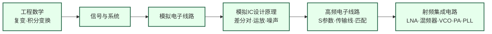

---
hide:
  - navigation
---

设计让无线信号在空气中高速传播的模拟芯片——从手机基带到毫米波雷达，从 5G 基站到卫星互联网。

## 这个方向在研究什么

在低频电路里，工程师可以把导线看成理想连接——电流从 A 到 B，没有损耗、没有相移、没有辐射。但当信号频率进入 GHz 量级，这个假设就彻底失效了。一根几毫米长的走线，其电感值足以显著影响信号传播；电路板上两根平行走线之间的耦合电容可以把一路信号泄漏到另一路；晶体管的本征增益随频率升高而快速下降，到了几十 GHz 已经所剩无几。射频电路工程师用 S 参数、噪声系数、P1dB 压缩点这些工具来分析和设计电路，这是模拟电路知识在高频下的延伸，但物理图像完全不同。

<svg viewBox="0 0 860 220" xmlns="http://www.w3.org/2000/svg" style="width:100%;max-width:860px;display:block;margin:1.5rem auto;">
  <defs>
    <marker id="arrowBlue" markerWidth="8" markerHeight="8" refX="6" refY="3" orient="auto">
      <path d="M0,0 L0,6 L8,3 z" fill="#3B82F6"/>
    </marker>
    <marker id="arrowRed" markerWidth="8" markerHeight="8" refX="6" refY="3" orient="auto">
      <path d="M0,0 L0,6 L8,3 z" fill="#DC2626"/>
    </marker>
    <marker id="arrowGreen" markerWidth="8" markerHeight="8" refX="6" refY="3" orient="auto">
      <path d="M0,0 L0,6 L8,3 z" fill="#16A34A"/>
    </marker>
  </defs>
  <!-- Background -->
  <rect width="860" height="220" rx="10" fill="#F8FAFC" stroke="#CBD5E1" stroke-width="1.5"/>
  <!-- Title labels -->
  <text x="430" y="18" text-anchor="middle" font-size="11" fill="#64748B">收发机（Transceiver）框图</text>
  <!-- Antenna symbol (left) -->
  <line x1="48" y1="110" x2="48" y2="150" stroke="#475569" stroke-width="2"/>
  <line x1="28" y1="90" x2="48" y2="110" stroke="#475569" stroke-width="2"/>
  <line x1="68" y1="90" x2="48" y2="110" stroke="#475569" stroke-width="2"/>
  <line x1="18" y1="78" x2="48" y2="98" stroke="#475569" stroke-width="1.5"/>
  <line x1="78" y1="78" x2="48" y2="98" stroke="#475569" stroke-width="1.5"/>
  <text x="48" y="168" text-anchor="middle" font-size="10" fill="#475569">天线</text>
  <!-- Splitter line from antenna -->
  <line x1="48" y1="130" x2="95" y2="130" stroke="#475569" stroke-width="1.5"/>
  <line x1="95" y1="70" x2="95" y2="175" stroke="#475569" stroke-width="1.5"/>
  <!-- RX Path (top, blue) -->
  <line x1="95" y1="70" x2="130" y2="70" stroke="#3B82F6" stroke-width="2" marker-end="url(#arrowBlue)"/>
  <!-- LNA box -->
  <rect x="132" y="52" width="95" height="36" rx="5" fill="#DBEAFE" stroke="#3B82F6" stroke-width="1.5"/>
  <text x="180" y="68" text-anchor="middle" font-size="11" font-weight="bold" fill="#1E40AF">LNA</text>
  <text x="180" y="81" text-anchor="middle" font-size="9" fill="#1D4ED8">低噪声放大器</text>
  <!-- LNA → Mixer -->
  <line x1="227" y1="70" x2="262" y2="70" stroke="#3B82F6" stroke-width="2" marker-end="url(#arrowBlue)"/>
  <!-- Mixer RX box -->
  <rect x="264" y="52" width="95" height="36" rx="5" fill="#DBEAFE" stroke="#3B82F6" stroke-width="1.5"/>
  <text x="311" y="68" text-anchor="middle" font-size="11" font-weight="bold" fill="#1E40AF">Mixer</text>
  <text x="311" y="81" text-anchor="middle" font-size="9" fill="#1D4ED8">混频器（下变频）</text>
  <!-- Mixer → ADC -->
  <line x1="359" y1="70" x2="394" y2="70" stroke="#3B82F6" stroke-width="2" marker-end="url(#arrowBlue)"/>
  <!-- ADC box -->
  <rect x="396" y="52" width="80" height="36" rx="5" fill="#DBEAFE" stroke="#3B82F6" stroke-width="1.5"/>
  <text x="436" y="68" text-anchor="middle" font-size="11" font-weight="bold" fill="#1E40AF">ADC</text>
  <text x="436" y="81" text-anchor="middle" font-size="9" fill="#1D4ED8">模数转换</text>
  <!-- ADC → Baseband -->
  <line x1="476" y1="70" x2="511" y2="70" stroke="#3B82F6" stroke-width="2" marker-end="url(#arrowBlue)"/>
  <!-- Baseband box -->
  <rect x="513" y="45" width="120" height="50" rx="5" fill="#EDE9FE" stroke="#7C3AED" stroke-width="1.5"/>
  <text x="573" y="65" text-anchor="middle" font-size="11" font-weight="bold" fill="#6D28D9">基带数字</text>
  <text x="573" y="80" text-anchor="middle" font-size="9" fill="#5B21B6">Modem / DSP</text>
  <text x="573" y="92" text-anchor="middle" font-size="9" fill="#5B21B6">RX ↑ / TX ↓</text>
  <!-- TX Path (bottom, red) -->
  <!-- Baseband → DAC -->
  <line x1="513" y1="175" x2="478" y2="175" stroke="#DC2626" stroke-width="2" marker-end="url(#arrowRed)"/>
  <!-- DAC box -->
  <rect x="396" y="157" width="80" height="36" rx="5" fill="#FEE2E2" stroke="#DC2626" stroke-width="1.5"/>
  <text x="436" y="173" text-anchor="middle" font-size="11" font-weight="bold" fill="#B91C1C">DAC</text>
  <text x="436" y="186" text-anchor="middle" font-size="9" fill="#991B1B">数模转换</text>
  <!-- DAC → PA -->
  <line x1="396" y1="175" x2="361" y2="175" stroke="#DC2626" stroke-width="2" marker-end="url(#arrowRed)"/>
  <!-- PA box -->
  <rect x="264" y="157" width="95" height="36" rx="5" fill="#FEE2E2" stroke="#DC2626" stroke-width="1.5"/>
  <text x="311" y="173" text-anchor="middle" font-size="11" font-weight="bold" fill="#B91C1C">PA</text>
  <text x="311" y="186" text-anchor="middle" font-size="9" fill="#991B1B">功率放大器</text>
  <!-- PA → Antenna -->
  <line x1="264" y1="175" x2="129" y2="175" stroke="#DC2626" stroke-width="2" marker-end="url(#arrowRed)"/>
  <!-- Mixer TX box -->
  <rect x="132" y="157" width="95" height="36" rx="5" fill="#FEE2E2" stroke="#DC2626" stroke-width="1.5"/>
  <text x="180" y="173" text-anchor="middle" font-size="11" font-weight="bold" fill="#B91C1C">Mixer</text>
  <text x="180" y="186" text-anchor="middle" font-size="9" fill="#991B1B">混频器（上变频）</text>
  <!-- PA ← Mixer TX -->
  <!-- already covered by the line above; add mixer→antenna segment -->
  <line x1="132" y1="175" x2="97" y2="175" stroke="#DC2626" stroke-width="2" marker-end="url(#arrowRed)"/>
  <!-- PLL/VCO (center, green) -->
  <rect x="640" y="85" width="130" height="50" rx="8" fill="#DCFCE7" stroke="#16A34A" stroke-width="1.5"/>
  <text x="705" y="106" text-anchor="middle" font-size="12" font-weight="bold" fill="#15803D">PLL / VCO</text>
  <text x="705" y="122" text-anchor="middle" font-size="9.5" fill="#166534">本振（LO）信号源</text>
  <!-- PLL → RX Mixer (dashed green) -->
  <line x1="640" y1="100" x2="360" y2="80" stroke="#16A34A" stroke-width="1.5" stroke-dasharray="5,3" marker-end="url(#arrowGreen)"/>
  <!-- PLL → TX Mixer (dashed green) -->
  <line x1="640" y1="120" x2="360" y2="165" stroke="#16A34A" stroke-width="1.5" stroke-dasharray="5,3" marker-end="url(#arrowGreen)"/>
  <!-- Labels -->
  <text x="180" y="38" text-anchor="middle" font-size="10" fill="#3B82F6">RX 接收链路</text>
  <text x="311" y="210" text-anchor="middle" font-size="10" fill="#DC2626">TX 发射链路</text>
  <text x="705" y="150" text-anchor="middle" font-size="9" fill="#166534">为 RX/TX 提供载波频率</text>
</svg>

一块完整的射频收发机芯片由几个关键模块组成，每个模块都有各自难以绕开的物理权衡。接收端的低噪声放大器（LNA）负责把天线接到的微弱信号——有时只有 -100 dBm，相当于 0.1 皮瓦——放大到后级电路可以处理的水平，同时不能引入太多自身噪声，否则噪声就会淹没信号。"低噪声"和"低功耗"本质上是对立的：想要更低的噪声，就需要更大的偏置电流，这是量子力学层面的热噪声限制，无法靠巧妙设计绕过去。发射端的功率放大器（PA）面临另一对矛盾：高功率输出要求晶体管工作在非线性区，但非线性会产生谐波失真，干扰其他信道；想要线性，就要把工作点压低，效率随之大幅下降。一个 LTE 基站的 PA 效率通常只有 30-40%，其余能量都变成了热量。

进入毫米波频段（30-300 GHz），挑战被放大。空间路径损耗与频率的平方成正比：28 GHz 的信号比 2.4 GHz 的信号在同样距离衰减强约 20 dB，也就是功率弱了 100 倍。应对方法是相控阵：把几十到几百个天线单元组成阵列，每个单元配有独立的射频前端，通过精确控制各单元的发射相位，把信号能量像探照灯一样汇聚到目标方向，形成"波束"（beamforming）。一部 5G 毫米波手机里集成的模组，在指甲盖大小的空间内有上百个天线单元和对应的移相器、放大器，能在毫秒内把波束对准基站。这种集成度在十年前几乎不可想象，是当前研究的核心战场之一。

自动驾驶把射频研究又拉向了新的应用场景。77 GHz FMCW（调频连续波）雷达通过发射一段线性调频的毫米波信号，分析回波的频率偏移来精确计算目标的距离和速度，在雨、雾、雪中性能远超摄像头。这类雷达的前端就是一块完整的毫米波 SoC，集成了发射机、接收机和模数转换器。更远处是太赫兹（300 GHz 以上），这个频段此前因为缺乏可用的有源器件几乎无人问津，但近年 ISSCC 上出现了越来越多用标准 CMOS 工艺实现的太赫兹收发机，把电路设计的边界又向前推了一步。研究者的日常工作是：在 Cadence Virtuoso 里搭电路、跑 SpectreRF 仿真，在电磁仿真软件里优化天线和传输线版图，最终送流片，在专用测试台上用频谱仪和网络分析仪测量真实芯片性能。

### 核心研究问题

- **高频下的"理想导线"失效**：进入 GHz 后，一根几毫米走线的电感、平行线间的耦合电容都不能再忽略，晶体管本征增益随频率快速跌落。怎样用 S 参数、传输线模型重建一套在高频仍站得住的设计直觉？
- **LNA 的噪声-功耗对立**：更低的噪声系数要求更大的偏置电流，而这条底线是热噪声的量子极限，无法靠巧妙拓扑绕过。在 -100 dBm 的微弱信号面前，噪声与功耗究竟能压到哪个折中点？
- **PA 的线性-效率两难**：要高输出就得把晶体管推进非线性区，可非线性带来谐波失真、干扰邻道；要线性就得回退工作点，效率随之崩塌（基站 PA 常年只有 30-40%）。能不能既线性又高效，而不是二选一？
- **毫米波路径损耗与相控阵**：28 GHz 比 2.4 GHz 同距离多衰减约 20 dB（功率弱 100 倍），只能靠把上百个天线单元、移相器、放大器塞进指甲盖大小的模组、用波束赋形把能量"探照灯式"聚向目标。这种集成度的极限在哪？
- **毫米波/太赫兹 SoC 的边界**：77 GHz FMCW 雷达要把发射、接收、ADC 做成一块毫米波 SoC；300 GHz 以上此前因缺有源器件几近空白。标准 CMOS 到底能把收发机推到多高的频率？

### 知识路径

图中节点对应以下知识板块（按需选修）：

- [电路（模拟方向）](../学习地图/电路/index.md)
- [器件与工艺](../学习地图/器件与工艺/index.md)
- [系统架构（信号与系统）](../学习地图/系统架构/index.md)

## 适合什么样的人

这个方向适合对"高频物理"有天然兴趣、并且乐意把电磁场当成第一性约束的人。你得习惯用 S 参数和噪声系数而不是电压增益来描述一个放大器，能从史密斯圆图上一眼看出阻抗匹配的状态，也能接受"几十微米的走线在毫米波频段会变成一根天线"这种在低频里根本不存在的事实。这个方向最迷人也最折磨人的地方，是它逼你直面那些绕不过去的物理权衡——LNA 的噪声和功耗、PA 的线性和效率——这些不是设计技巧问题，而是物理底线，你能做的是在底线之上找最优折中，而不是消灭矛盾。

日常节奏大致是：在 Cadence Virtuoso 里搭晶体管级电路 → 跑 SpectreRF 做 S 参数、噪声、非线性仿真 → 用 HFSS 或 Momentum 做电磁仿真，把片上传输线、天线和封装版图一寸寸优化 → 流片 → 在探针台上用矢量网络分析仪、频谱仪、噪声系数仪去测真实芯片。流片周期常常半年起步，测试窗口却很短，一次掩膜错误就要再等一轮，所以这个方向格外吃耐心、吃测试方案的设计能力，也吃那种"仿真和实测对不上时还能沉住气找原因"的韧性。

如果你更喜欢纯数学建模、写算法、和软件而非射频仪器打交道，或者受不了流片这种以月计的反馈延迟，这个方向可能不适合你。但如果你想把信号从天线一路打通到基带、把电磁场和电路设计真正连成一个连续的物理图像，它会很对胃口——而且与雷达、卫星通信、国防、车载毫米波的产业绑定很深，就业面宽，代价是学习曲线陡。

## 学术界

### 课题组

**境内**

-   **[王志华](https://www.sic.tsinghua.edu.cn/info/1014/1791.htm)** 清华

    射频/混合信号 IC · RFID 芯片 · 高速高精度 ADC

-   **[李宇根（Woogeun Rhee）](https://www.x-mol.com/university/faculty/243668)** 清华

    PLL/频率综合器 · 射频混合信号 IC · 毫米波时钟系统

-   **[陈文华](https://web.ee.tsinghua.edu.cn/chenwenhua/zh_CN/index.htm)** 清华

    射频功率放大器效率优化 · 5G/6G 线性化技术 · Doherty PA

-   **[邓伟](https://www.sic.tsinghua.edu.cn/info/1014/1823.htm)** 清华

    高效率毫米波 PA 设计

-   **[池保勇](https://www.sic.tsinghua.edu.cn/info/1014/1825.htm)** 清华

    CMOS 毫米波收发机 · 5G 射频前端

-   **[贾海昆](https://www.sic.tsinghua.edu.cn/info/1014/1815.htm)** 清华

    太赫兹 CMOS 收发机 · 毫米波雷达 IC

-   **[姜汉钧](https://www.sic.tsinghua.edu.cn/info/1014/1814.htm)** 清华

    低功耗无线神经记录芯片 · 高精度 ADC · IoT 混合信号 IC

-   **[叶乐](https://ic.pku.edu.cn/szdw/zzjs/jcdlsjx1/yl/index.htm)** 北大

    混合信号与射频 IC · 存算一体 AI 芯片

-   **[王茂俊](https://ic.pku.edu.cn/szdw/zzjs/jcwndzx1/wmj/index.htm)** 北大

    GaN 功率与射频器件 · 高功率密度毫米波前端

-   **[闫娜](https://sme.fudan.edu.cn/60/61/c31157a352353/page.htm)** 复旦 

    高能效射频芯片 · 6G 可重构 RF · 毫米波雷达

-   **[徐鸿涛](https://sme.fudan.edu.cn/60/92/c31155a352402/page.htm)** 复旦

    毫米波 IC 与系统 · 5G/6G · 可穿戴 IoT 无线 SoC

-   **[洪志良](http://icmne.fudan.edu.cn)** 复旦

    高性能模拟/混合信号 IC · 射频收发机 · 高速接口芯片

-   **[唐长文](http://rfic.fudan.edu.cn)** 复旦

    毫米波 CMOS 收发机 · 相控阵芯片 · 5G/6G 射频前端

-   **[闵昊](http://rficae.fudan.edu.cn)** 复旦

    射频与天线协同设计 · 毫米波封装天线（AiP） · 相控阵系统

-   **[王志功](http://iroi.seu.edu.cn)** 东南大学

    微波光子集成电路 · 太赫兹器件 · 高速无线通信芯片

-   **[马顺利](https://sme.fudan.edu.cn/60/13/c31134a352275/page.htm)** 复旦

    毫米波/太赫兹相控阵雷达芯片 · 5G/6G 毫米波收发机 · FMCW/ADPLL

-   **[洪伟](https://mmw.seu.edu.cn/2020/0928/c30531a348210/page.htm)** 东南大学

    毫米波集成天线与系统 · 大规模相控阵 · 毫米波/太赫兹理论与器件

-   **[周健军](https://icisee.sjtu.edu.cn/jiaoshiml/zhoujianjun.html)** 交大

    CMOS 射频收发机 · 毫米波通信与雷达 IC · 高速有线收发前端

-   **[金晶](https://icisee.sjtu.edu.cn/jiaoshiml/jinjing.html)** 交大 

    射频/混合信号 IC · 频率综合器（PLL） · 低功耗收发机与射频前端

-   **[高翔](https://person.zju.edu.cn/xianggao)** 浙大

    射频与模数混合信号 IC · 亚采样锁相环（Sub-Sampling PLL） · 无线通信芯片

-   **[崔强](https://person.zju.edu.cn/qiangcui)** 浙大

    射频/毫米波/太赫兹器件电路与系统 · 高速接口与芯粒封装 · ML 辅助 IC 设计

-   **[赵博](https://person.zju.edu.cn/zhaobo)** 浙大

    超低功耗 CMOS 无线收发芯片 · 片上天线微型 Radio（ISSCC 最小芯片） · 物联网/生物医疗 RF SoC

-   **[胡诣哲](https://sme.ustc.edu.cn/2022/1012/c30996a575413/page.htm)** 中科大

    数字化射频 IC（Digital-RF） · 新型相控阵芯片 · 毫米波数字雷达 · ADPLL/数字 PA

-   **[林福江](https://sme.ustc.edu.cn/2022/0601/c30996a556921/page.htm)** 中科大

    超低噪声毫米波射频前端 · GaN 第三代器件 MMIC · 射频器件建模

-   **[楼立恒](https://sme.ustc.edu.cn/2024/0225/c31014a630510/page.htm)** 中科大

    RF/毫米波收发电路与系统 · 全数字锁相环与频率综合 · 相控阵/MIMO IC 架构数字化

<button class="prof-show-all">显示全部 ↓</button>

**境外**

-   **[C. Patrick Yue（俞捷）](https://ece.hkust.edu.hk/eepatrick)** 港科大

    毫米波通信与感知电路 · 光无线物理层 · 高速有线 SoC

-   **[Yansong Yang（杨岩松）](https://www.yansongyang.com/)** 港科大

    压电 MEMS 谐振器与滤波器 · 5G/mmWave 射频前端

-   **[Ali Niknejad](https://rfic.eecs.berkeley.edu)** UC Berkeley

    毫米波 CMOS 电路 · 5G/6G 收发机

-   **[Behzad Razavi](https://www.seas.ucla.edu/brweb/)** UCLA

    射频/混合信号 IC · VCO/PLL/LNA 设计

-   **[Thomas Lee](https://profiles.stanford.edu/thomas-lee)** Stanford

    射频集成电路 · 超宽带/毫米波 CMOS

-   **[Gabriel Rebeiz](https://jacobsschool.ucsd.edu/faculty/profile?id=238)** UCSD

    相控阵与波束赋形 · 毫米波 RFIC · MEMS 开关

-   **[Harish Krishnaswamy](https://cosmiccolumbia.com)** Columbia

    毫米波全双工 · 太赫兹 CMOS 收发机 · 频谱共享射频系统

<button class="prof-show-all">显示全部 ↓</button>

### 学术会议与期刊

  
顶会
    ISSCC
    RFIC Symposium
    IMS
    ESSERC
    EuMW
  

  
顶刊
    JSSC
    T-MTT
    TCAS-I/II
    MWCL
  

## 业界机构

> 这个方向毕业后主要的业界去向（国内外）。上市公司附实时股价链接，便于了解产业景气度。

### 企业

  
国内
    <a href="https://www.maxscend.com/">卓胜微</a>
    <a href="https://www.vanchip.com/">唯捷创芯</a>
    <a href="https://www.asrmicro.com/">翱捷科技（ASR）</a>
    <a href="https://www.sanan-e.com/">三安光电（三安集成 GaN/GaAs 射频）</a>
    <a class="dm-chip" href="https://www.calterah.com/">加特兰微电子（Calterah）</a>
    <a class="dm-chip" href="https://www.unisoc.com/">紫光展锐（UNISOC）</a>
    <a class="dm-chip" href="https://www.hisilicon.com/">华为海思（HiSilicon）</a>
  

  
国外
    <a href="https://www.qualcomm.com/">Qualcomm（高通）</a>
    <a href="https://www.broadcom.com/">Broadcom（无线连接 / 射频前端）</a>
    <a href="https://www.skyworksinc.com/">Skyworks Solutions</a>
    <a href="https://www.qorvo.com/">Qorvo</a>
    <a href="https://www.mediatek.com/">MediaTek（联发科）</a>
    <a href="https://www.macom.com/">MACOM（GaN MMIC · 相控阵雷达 · 卫星通信）</a>
    <a href="https://www.nxp.com/">NXP（77 GHz 车载雷达收发机）</a>
    <a href="https://www.infineon.com/">Infineon（77/79 GHz 毫米波雷达 MMIC）</a>
  

### 科研院所

  
国内
    <a class="dm-chip" href="https://mmw.seu.edu.cn/" title="毫米波/亚毫米波核心器件与芯片、信息超材料、相控阵系统">东南大学毫米波全国重点实验室</a>
    <a class="dm-chip" href="https://www.ime.cas.cn/" title="毫米波/射频 CMOS 收发机与前端集成">中科院微电子所</a>
    <a class="dm-chip" href="https://www.pcl.ac.cn/" title="宽带无线通信与高速射频系统">鹏城实验室</a>
  

  
国外
    <a class="dm-chip" href="https://bwrc.berkeley.edu/" title="毫米波 CMOS 收发机、5G/6G 无线系统">UC Berkeley 无线研究中心（BWRC）</a>
    <a class="dm-chip" href="https://www.imec-int.com/en" title="毫米波相控阵、5G/6G 射频前端">imec（比利时微电子研究中心）</a>
    <a class="dm-chip" href="https://www.iaf.fraunhofer.de/en.html" title="III-V/GaN 毫米波与太赫兹 MMIC">Fraunhofer IAF（德国应用固体物理研究所）</a>
  

