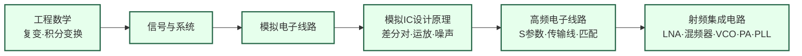

---
hide:
  - navigation
---

设计让无线信号在空气中高速传播的模拟芯片——从手机基带到毫米波雷达，从 5G 基站到卫星互联网。

## 这个方向在研究什么

在低频电路里，工程师可以把导线看成理想连接——电流从 A 到 B，没有损耗、没有相移、没有辐射。但当信号频率进入 GHz 量级，这个假设就彻底失效了。一根几毫米长的走线，其电感值足以显著影响信号传播；电路板上两根平行走线之间的耦合电容可以把一路信号泄漏到另一路；晶体管的本征增益随频率升高而快速下降，到了几十 GHz 已经所剩无几。射频电路工程师用 S 参数、噪声系数、P1dB 压缩点这些工具来分析和设计电路，这是模拟电路知识在高频下的延伸，但物理图像完全不同。

<svg viewBox="0 0 860 220" xmlns="http://www.w3.org/2000/svg" style="width:100%;max-width:860px;display:block;margin:1.5rem auto;">
  <defs>
    <marker id="arrowBlue" markerWidth="8" markerHeight="8" refX="6" refY="3" orient="auto">
      <path d="M0,0 L0,6 L8,3 z" fill="#3B82F6"/>
    </marker>
    <marker id="arrowRed" markerWidth="8" markerHeight="8" refX="6" refY="3" orient="auto">
      <path d="M0,0 L0,6 L8,3 z" fill="#DC2626"/>
    </marker>
    <marker id="arrowGreen" markerWidth="8" markerHeight="8" refX="6" refY="3" orient="auto">
      <path d="M0,0 L0,6 L8,3 z" fill="#16A34A"/>
    </marker>
  </defs>
  <!-- Background -->
  <rect width="860" height="220" rx="10" fill="#F8FAFC" stroke="#CBD5E1" stroke-width="1.5"/>
  <!-- Title labels -->
  <text x="430" y="18" text-anchor="middle" font-size="11" fill="#64748B">收发机（Transceiver）框图</text>
  <!-- Antenna symbol (left) -->
  <line x1="48" y1="110" x2="48" y2="150" stroke="#475569" stroke-width="2"/>
  <line x1="28" y1="90" x2="48" y2="110" stroke="#475569" stroke-width="2"/>
  <line x1="68" y1="90" x2="48" y2="110" stroke="#475569" stroke-width="2"/>
  <line x1="18" y1="78" x2="48" y2="98" stroke="#475569" stroke-width="1.5"/>
  <line x1="78" y1="78" x2="48" y2="98" stroke="#475569" stroke-width="1.5"/>
  <text x="48" y="168" text-anchor="middle" font-size="10" fill="#475569">天线</text>
  <!-- Splitter line from antenna -->
  <line x1="48" y1="130" x2="95" y2="130" stroke="#475569" stroke-width="1.5"/>
  <line x1="95" y1="70" x2="95" y2="175" stroke="#475569" stroke-width="1.5"/>
  <!-- RX Path (top, blue) -->
  <line x1="95" y1="70" x2="130" y2="70" stroke="#3B82F6" stroke-width="2" marker-end="url(#arrowBlue)"/>
  <!-- LNA box -->
  <rect x="132" y="52" width="95" height="36" rx="5" fill="#DBEAFE" stroke="#3B82F6" stroke-width="1.5"/>
  <text x="180" y="68" text-anchor="middle" font-size="11" font-weight="bold" fill="#1E40AF">LNA</text>
  <text x="180" y="81" text-anchor="middle" font-size="9" fill="#1D4ED8">低噪声放大器</text>
  <!-- LNA → Mixer -->
  <line x1="227" y1="70" x2="262" y2="70" stroke="#3B82F6" stroke-width="2" marker-end="url(#arrowBlue)"/>
  <!-- Mixer RX box -->
  <rect x="264" y="52" width="95" height="36" rx="5" fill="#DBEAFE" stroke="#3B82F6" stroke-width="1.5"/>
  <text x="311" y="68" text-anchor="middle" font-size="11" font-weight="bold" fill="#1E40AF">Mixer</text>
  <text x="311" y="81" text-anchor="middle" font-size="9" fill="#1D4ED8">混频器（下变频）</text>
  <!-- Mixer → ADC -->
  <line x1="359" y1="70" x2="394" y2="70" stroke="#3B82F6" stroke-width="2" marker-end="url(#arrowBlue)"/>
  <!-- ADC box -->
  <rect x="396" y="52" width="80" height="36" rx="5" fill="#DBEAFE" stroke="#3B82F6" stroke-width="1.5"/>
  <text x="436" y="68" text-anchor="middle" font-size="11" font-weight="bold" fill="#1E40AF">ADC</text>
  <text x="436" y="81" text-anchor="middle" font-size="9" fill="#1D4ED8">模数转换</text>
  <!-- ADC → Baseband -->
  <line x1="476" y1="70" x2="511" y2="70" stroke="#3B82F6" stroke-width="2" marker-end="url(#arrowBlue)"/>
  <!-- Baseband box -->
  <rect x="513" y="45" width="120" height="50" rx="5" fill="#EDE9FE" stroke="#7C3AED" stroke-width="1.5"/>
  <text x="573" y="65" text-anchor="middle" font-size="11" font-weight="bold" fill="#6D28D9">基带数字</text>
  <text x="573" y="80" text-anchor="middle" font-size="9" fill="#5B21B6">Modem / DSP</text>
  <text x="573" y="92" text-anchor="middle" font-size="9" fill="#5B21B6">RX ↑ / TX ↓</text>
  <!-- TX Path (bottom, red) -->
  <!-- Baseband → DAC -->
  <line x1="513" y1="175" x2="478" y2="175" stroke="#DC2626" stroke-width="2" marker-end="url(#arrowRed)"/>
  <!-- DAC box -->
  <rect x="396" y="157" width="80" height="36" rx="5" fill="#FEE2E2" stroke="#DC2626" stroke-width="1.5"/>
  <text x="436" y="173" text-anchor="middle" font-size="11" font-weight="bold" fill="#B91C1C">DAC</text>
  <text x="436" y="186" text-anchor="middle" font-size="9" fill="#991B1B">数模转换</text>
  <!-- DAC → PA -->
  <line x1="396" y1="175" x2="361" y2="175" stroke="#DC2626" stroke-width="2" marker-end="url(#arrowRed)"/>
  <!-- PA box -->
  <rect x="264" y="157" width="95" height="36" rx="5" fill="#FEE2E2" stroke="#DC2626" stroke-width="1.5"/>
  <text x="311" y="173" text-anchor="middle" font-size="11" font-weight="bold" fill="#B91C1C">PA</text>
  <text x="311" y="186" text-anchor="middle" font-size="9" fill="#991B1B">功率放大器</text>
  <!-- PA → Antenna -->
  <line x1="264" y1="175" x2="129" y2="175" stroke="#DC2626" stroke-width="2" marker-end="url(#arrowRed)"/>
  <!-- Mixer TX box -->
  <rect x="132" y="157" width="95" height="36" rx="5" fill="#FEE2E2" stroke="#DC2626" stroke-width="1.5"/>
  <text x="180" y="173" text-anchor="middle" font-size="11" font-weight="bold" fill="#B91C1C">Mixer</text>
  <text x="180" y="186" text-anchor="middle" font-size="9" fill="#991B1B">混频器（上变频）</text>
  <!-- PA ← Mixer TX -->
  <!-- already covered by the line above; add mixer→antenna segment -->
  <line x1="132" y1="175" x2="97" y2="175" stroke="#DC2626" stroke-width="2" marker-end="url(#arrowRed)"/>
  <!-- PLL/VCO (center, green) -->
  <rect x="640" y="85" width="130" height="50" rx="8" fill="#DCFCE7" stroke="#16A34A" stroke-width="1.5"/>
  <text x="705" y="106" text-anchor="middle" font-size="12" font-weight="bold" fill="#15803D">PLL / VCO</text>
  <text x="705" y="122" text-anchor="middle" font-size="9.5" fill="#166534">本振（LO）信号源</text>
  <!-- PLL → RX Mixer (dashed green) -->
  <line x1="640" y1="100" x2="360" y2="80" stroke="#16A34A" stroke-width="1.5" stroke-dasharray="5,3" marker-end="url(#arrowGreen)"/>
  <!-- PLL → TX Mixer (dashed green) -->
  <line x1="640" y1="120" x2="360" y2="165" stroke="#16A34A" stroke-width="1.5" stroke-dasharray="5,3" marker-end="url(#arrowGreen)"/>
  <!-- Labels -->
  <text x="180" y="38" text-anchor="middle" font-size="10" fill="#3B82F6">RX 接收链路</text>
  <text x="311" y="210" text-anchor="middle" font-size="10" fill="#DC2626">TX 发射链路</text>
  <text x="705" y="150" text-anchor="middle" font-size="9" fill="#166534">为 RX/TX 提供载波频率</text>
</svg>

一块完整的射频收发机芯片由几个关键模块组成，每个模块都有各自难以绕开的物理权衡。接收端的低噪声放大器（LNA）负责把天线接到的微弱信号——有时只有 -100 dBm，相当于 0.1 皮瓦——放大到后级电路可以处理的水平，同时不能引入太多自身噪声，否则噪声就会淹没信号。"低噪声"和"低功耗"本质上是对立的：想要更低的噪声，就需要更大的偏置电流，这是量子力学层面的热噪声限制，无法靠巧妙设计绕过去。发射端的功率放大器（PA）面临另一对矛盾：高功率输出要求晶体管工作在非线性区，但非线性会产生谐波失真，干扰其他信道；想要线性，就要把工作点压低，效率随之大幅下降。一个 LTE 基站的 PA 效率通常只有 30-40%，其余能量都变成了热量。

进入毫米波频段（30-300 GHz），挑战被放大。空间路径损耗与频率的平方成正比：28 GHz 的信号比 2.4 GHz 的信号在同样距离衰减强约 20 dB，也就是功率弱了 100 倍。应对方法是相控阵：把几十到几百个天线单元组成阵列，每个单元配有独立的射频前端，通过精确控制各单元的发射相位，把信号能量像探照灯一样汇聚到目标方向，形成"波束"（beamforming）。一部 5G 毫米波手机里集成的模组，在指甲盖大小的空间内有上百个天线单元和对应的移相器、放大器，能在毫秒内把波束对准基站。这种集成度在十年前几乎不可想象，是当前研究的核心战场之一。

自动驾驶把射频研究又拉向了新的应用场景。77 GHz FMCW（调频连续波）雷达通过发射一段线性调频的毫米波信号，分析回波的频率偏移来精确计算目标的距离和速度，在雨、雾、雪中性能远超摄像头。这类雷达的前端就是一块完整的毫米波 SoC，集成了发射机、接收机和模数转换器。更远处是太赫兹（300 GHz 以上），这个频段此前因为缺乏可用的有源器件几乎无人问津，但近年 ISSCC 上出现了越来越多用标准 CMOS 工艺实现的太赫兹收发机，把电路设计的边界又向前推了一步。研究者的日常工作是：在 Cadence Virtuoso 里搭电路、跑 SpectreRF 仿真，在电磁仿真软件里优化天线和传输线版图，最终送流片，在专用测试台上用频谱仪和网络分析仪测量真实芯片性能。

## 适合什么样的人

这个方向强烈适合对"高频物理"和"电磁直觉"有天然兴趣的人。你需要习惯用 S 参数而非电压增益来描述电路，能从史密斯圆图上读出阻抗匹配状态，理解为什么几十微米的走线在毫米波频段会变成一根天线。如果你觉得"信号从天线到基带要经过哪些变换"这个问题本身令你着迷，大概率会喜欢这个方向。

日常工作节奏是：Cadence Virtuoso 搭晶体管级电路 → SpectreRF 做 S 参数/噪声/非线性仿真 → Ansys HFSS 或 Momentum 做电磁仿真优化片上传输线和天线 → 版图 → 流片 → 用矢量网络分析仪（VNA）、频谱仪、噪声系数仪在探针台上测量芯片。流片周期长（通常半年以上），测试窗口短，需要极强的耐心和精细的测试方案设计能力。

相比模拟方向，这个方向对电磁场理论的要求更高，同时对系统链路预算（link budget）的理解也是必须的。如果你对数学建模更感兴趣而不喜欢和测试仪器打交道，或者希望做更多软件/算法工作，这个方向可能不是最佳匹配。该方向与国防、雷达、卫星通信行业联系紧密，就业面宽，但学习曲线相对陡峭。

## 核心研究问题

- **毫米波路径损耗**：频率越高，空间损耗越大，如何用有限功耗维持链路预算？
- **功率效率**：功率放大器（PA）的效率在毫米波频段急剧下降，如何设计高效率 PA？
- **相控阵集成**：5G/6G 需要数百个天线单元的相控阵，如何将波束赋形电路集成在单芯片上？
- **太赫兹**：300 GHz 以上频段的有源器件设计是前沿挑战，标准 CMOS 能走多远？

## 代表性机构

> 这个方向毕业后能去的代表性企业与科研院所（国内外）。上市公司附实时股价链接，便于了解产业景气度。

### 企业

**国内**

- [卓胜微](https://www.maxscend.com/) · [实时股价](https://quote.eastmoney.com/sz300782.html) — 射频开关 / LNA / 射频前端模组龙头
- [唯捷创芯](https://www.vanchip.com/) · [实时股价](https://quote.eastmoney.com/sh688153.html) — 射频功率放大器（PA）模组
- [翱捷科技（ASR）](https://www.asrmicro.com/) · [实时股价](https://quote.eastmoney.com/sh688220.html) — 蜂窝基带与射频前端、无线 SoC
- [紫光展锐（UNISOC）](https://www.unisoc.com/)（未上市） — 5G 基带、射频收发与射频前端芯片
- [华为海思（HiSilicon）](https://www.hisilicon.com/)（华为未上市） — 射频收发机与无线 SoC

**国外**

- [Qualcomm（高通）](https://www.qualcomm.com/) · [实时股价](https://finance.yahoo.com/quote/QCOM)
- [Broadcom（无线连接 / 射频前端）](https://www.broadcom.com/) · [实时股价](https://finance.yahoo.com/quote/AVGO)
- [Skyworks Solutions](https://www.skyworksinc.com/) · [实时股价](https://finance.yahoo.com/quote/SWKS)
- [Qorvo](https://www.qorvo.com/) · [实时股价](https://finance.yahoo.com/quote/QRVO)
- [MediaTek（联发科）](https://www.mediatek.com/) · [实时股价](https://finance.yahoo.com/quote/2454.TW)

### 科研院所

**国内**

- [东南大学毫米波全国重点实验室](https://mmw.seu.edu.cn/) — 毫米波/亚毫米波核心器件与芯片、信息超材料、相控阵系统
- [中科院微电子所](https://www.ime.cas.cn/) — 毫米波/射频 CMOS 收发机与前端集成
- [鹏城实验室](https://www.pcl.ac.cn/) — 宽带无线通信与高速射频系统

**国外**

- [UC Berkeley 无线研究中心（BWRC）](https://bwrc.berkeley.edu/) — 毫米波 CMOS 收发机、5G/6G 无线系统
- [imec（比利时微电子研究中心）](https://www.imec-int.com/en) — 毫米波相控阵、5G/6G 射频前端
- [Fraunhofer IAF（德国应用固体物理研究所）](https://www.iaf.fraunhofer.de/en.html) — III-V/GaN 毫米波与太赫兹 MMIC

## 顶会顶刊

**顶会**：ISSCC · RFIC Symposium · IMS（IEEE MTT-S Int'l Microwave Symposium）· ESSERC（原 ESSCIRC）· EuMW

**顶刊**：JSSC（IEEE Journal of Solid-State Circuits）· T-MTT（IEEE Trans. Microwave Theory and Techniques）· TCAS-I/II（IEEE Trans. Circuits and Systems）· MWCL（IEEE Microwave and Wireless Components Letters）

## 知识路径

图中节点对应以下知识板块（按需选修）：

- [电路（模拟方向）](../学习地图/电路/index.md)
- [器件与工艺](../学习地图/器件与工艺/index.md)
- [系统架构（信号与系统）](../学习地图/系统架构/index.md)

## 入门三步走

**典型研究长什么样**　ISSCC 射频/毫米波方向的论文核心是一颗流片的 CMOS 或 SiGe 芯片，给出实测的噪声系数（NF）、增益（Gain）、输出功率（Pout）、效率（PAE）或相位噪声，并与当前 state-of-the-art 对比。毫米波相控阵论文还需报告阵列波束成形增益和扫描角度范围。流片是这个方向的核心门槛，大多数顶会论文没有实测芯片数据是无法发表的，读博期间通常会经历 1-2 次完整的设计→版图→流片→测试循环。

**第一步：建立系统观**  
阅读 Razavi《RF Microelectronics》第 1 章（收发机系统架构），20 页，了解一块射频芯片在整个通信链路中扮演什么角色。

**第二步：建立电路直觉**  
观看 Razavi YouTube 频道的 Electronics 1/2 系列，打牢差分对、电流镜、运放的基础——这是理解所有射频电路的前提。

**第三步：进入核心**  
跟随 Razavi UCLA EE164 课程视频，结合教材逐章学习 LNA、混频器、VCO 的设计方法，这是目前公开资料中质量最高的射频 IC 课程。

## 相关课题组

### 境内

-   **[王志华](https://www.sic.tsinghua.edu.cn/info/1014/1791.htm)** 清华

    射频/混合信号 IC · RFID 芯片 · 高速高精度 ADC

-   **[李宇根（Woogeun Rhee）](https://www.sic.tsinghua.edu.cn/info/1014/1809.htm)** 清华

    PLL/频率综合器 · 射频混合信号 IC · 毫米波时钟系统

-   **[陈文华](https://web.ee.tsinghua.edu.cn/chenwenhua/zh_CN/index.htm)** 清华

    射频功率放大器效率优化 · 5G/6G 线性化技术 · Doherty PA

-   **[邓伟](https://www.sic.tsinghua.edu.cn/info/1014/1823.htm)** 清华

    高效率毫米波 PA 设计

-   **[池保勇](https://www.sic.tsinghua.edu.cn/info/1014/1825.htm)** 清华

    CMOS 毫米波收发机 · 5G 射频前端

-   **[贾海昆](https://www.sic.tsinghua.edu.cn/info/1014/1815.htm)** 清华

    太赫兹 CMOS 收发机 · 毫米波雷达 IC

-   **[姜汉钧](https://www.sic.tsinghua.edu.cn/info/1014/1814.htm)** 清华

    低功耗无线神经记录芯片 · 高精度 ADC · IoT 混合信号 IC

-   **[叶乐](https://ic.pku.edu.cn/szdw/zzjs/jcdlsjx1/yl/index.htm)** 北大

    混合信号与射频 IC · 存算一体 AI 芯片

-   **[王茂俊](https://ic.pku.edu.cn/szdw/zzjs/jcwndzx1/wmj/index.htm)** 北大

    GaN 功率与射频器件 · 高功率密度毫米波前端

-   **[闫娜](https://sme.fudan.edu.cn/60/61/c31157a352353/page.htm)** 复旦 

    高能效射频芯片 · 6G 可重构 RF · 毫米波雷达

-   **[徐鸿涛](https://sme.fudan.edu.cn/60/92/c31155a352402/page.htm)** 复旦

    毫米波 IC 与系统 · 5G/6G · 可穿戴 IoT 无线 SoC

-   **[洪志良](http://icmne.fudan.edu.cn)** 复旦

    高性能模拟/混合信号 IC · 射频收发机 · 高速接口芯片

-   **[唐长文](http://rfic.fudan.edu.cn)** 复旦

    毫米波 CMOS 收发机 · 相控阵芯片 · 5G/6G 射频前端

-   **[闵昊](http://rficae.fudan.edu.cn)** 复旦

    射频与天线协同设计 · 毫米波封装天线（AiP） · 相控阵系统

-   **[王志功](http://iroi.seu.edu.cn)** 东南大学

    微波光子集成电路 · 太赫兹器件 · 高速无线通信芯片

-   **[马顺利](https://sme.fudan.edu.cn/60/13/c31134a352275/page.htm)** 复旦

    毫米波/太赫兹相控阵雷达芯片 · 5G/6G 毫米波收发机 · FMCW/ADPLL

-   **[洪伟](https://mmw.seu.edu.cn/2020/0928/c30531a348210/page.htm)** 东南大学

    毫米波集成天线与系统 · 大规模相控阵 · 毫米波/太赫兹理论与器件

<button class="prof-show-all">显示全部 ↓</button>

### 境外

-   **[C. Patrick Yue（俞捷）](https://ece.hkust.edu.hk/eepatrick)** 港科大

    毫米波通信与感知电路 · 光无线物理层 · 高速有线 SoC

-   **[Yansong Yang（杨岩松）](https://www.yansongyang.com/)** 港科大

    压电 MEMS 谐振器与滤波器 · 5G/mmWave 射频前端

-   **[Ali Niknejad](https://rfic.eecs.berkeley.edu)** UC Berkeley

    毫米波 CMOS 电路 · 5G/6G 收发机

-   **[Behzad Razavi](https://www.seas.ucla.edu/brweb/)** UCLA

    射频/混合信号 IC · VCO/PLL/LNA 设计

-   **[Thomas Lee](https://profiles.stanford.edu/thomas-lee)** Stanford

    射频集成电路 · 超宽带/毫米波 CMOS

-   **[Gabriel Rebeiz](https://jacobsschool.ucsd.edu/faculty/profile?id=238)** UCSD

    相控阵与波束赋形 · 毫米波 RFIC · MEMS 开关

-   **[Harish Krishnaswamy](https://cosmiccolumbia.com)** Columbia

    毫米波全双工 · 太赫兹 CMOS 收发机 · 频谱共享射频系统

<button class="prof-show-all">显示全部 ↓</button>
