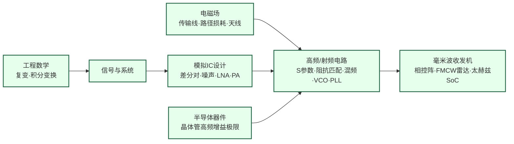

---
hide:
  - navigation
---

设计让无线信号穿越空间的模拟芯片，把信息多快好省地传出去，而这四样从来不可兼得。

## 这个方向在研究什么

二十年前，一部手机只能打电话、发短信；今天，时速三百公里的高铁上也能开视频会议、看直播。换个场景，手腕上的运动手环、植入体内的起搏器，靠一颗小电池就能安静工作十年。这两类无线需求几乎相反，归根到底却是同一件事：把信息传得多快好省。难就难在这四样彼此牵制，一颗芯片不可能样样占全——要又多又快，就得占用更宽的频段、推向更高的频率，可频率越高越费电、越难做；要传得准，又得多花功率和带宽。于是这门学问分成两路，一路往高频走、争带宽，一路往低功耗压、保续航，而传得准是两路都得守住的底线。

<svg viewBox="0 0 910 330" xmlns="http://www.w3.org/2000/svg" style="width:100%;max-width:910px;display:block;margin:1.5rem auto;">
  <defs>
    <marker id="spAxis" markerWidth="8" markerHeight="8" refX="6" refY="3" orient="auto"><path d="M0,0 L0,6 L8,3 z" fill="#475569"/></marker>
  </defs>
  <rect width="910" height="330" rx="10" fill="#F8FAFC" stroke="#CBD5E1" stroke-width="1.5"/>
  <text x="455" y="24" text-anchor="middle" font-size="13" font-weight="bold" fill="#1E293B">无线频谱的频段分配与典型用途</text>
  <!-- legend -->
  <rect x="296" y="39" width="14" height="10" rx="2" fill="#D6DEE8" stroke="#64748B" stroke-width="1"/>
  <text x="314" y="48" font-size="9.5" fill="#334155">通用通信</text>
  <rect x="384" y="39" width="14" height="10" rx="2" fill="#BFD3EC" stroke="#1E40AF" stroke-width="1"/>
  <text x="402" y="48" font-size="9.5" fill="#1E40AF">低功耗短距</text>
  <rect x="498" y="39" width="14" height="10" rx="2" fill="#FBD5AE" stroke="#C2410C" stroke-width="1"/>
  <text x="516" y="48" font-size="9.5" fill="#9A3412">大带宽高速</text>
  <!-- zones -->
  <rect x="64" y="58" width="554" height="234" fill="#EAF1F9"/>
  <rect x="618" y="58" width="258" height="234" fill="#FBF1E6"/>
  <text x="341" y="74" text-anchor="middle" font-size="10.5" fill="#1E40AF">低频：频段拥挤、传播损耗小</text>
  <text x="747" y="74" text-anchor="middle" font-size="10.5" fill="#9A3412">高频：频谱充裕、可用带宽大</text>
  <!-- R1 -->
  <rect x="537" y="110" width="15" height="16" rx="3" fill="#D6DEE8" stroke="#64748B" stroke-width="1"/>
  <text x="545" y="104" text-anchor="middle" font-size="8.5" fill="#334155">北斗/GPS</text>
  <rect x="688" y="110" width="25" height="16" rx="3" fill="#FBD5AE" stroke="#C2410C" stroke-width="1"/>
  <text x="700" y="104" text-anchor="middle" font-size="8.5" fill="#9A3412">5G 毫米波</text>
  <rect x="760" y="110" width="55" height="16" rx="3" fill="#FBD5AE" stroke="#C2410C" stroke-width="1"/>
  <text x="787" y="104" text-anchor="middle" font-size="8.5" fill="#9A3412">6G · 回传</text>
  <!-- R2 -->
  <rect x="510" y="140" width="81" height="16" rx="3" fill="#D6DEE8" stroke="#64748B" stroke-width="1"/>
  <text x="550" y="134" text-anchor="middle" font-size="8.5" fill="#334155">蜂窝 2G–5G</text>
  <rect x="653" y="140" width="61" height="16" rx="3" fill="#FBD5AE" stroke="#C2410C" stroke-width="1"/>
  <text x="683" y="134" text-anchor="middle" font-size="8.5" fill="#9A3412">卫星 Ku/Ka</text>
  <rect x="815" y="140" width="61" height="16" rx="3" fill="#FBD5AE" stroke="#C2410C" stroke-width="1"/>
  <text x="845" y="134" text-anchor="middle" font-size="8.5" fill="#9A3412">太赫兹</text>
  <!-- R3 -->
  <rect x="145" y="170" width="372" height="16" rx="3" fill="#D6DEE8" stroke="#64748B" stroke-width="1"/>
  <text x="331" y="182" text-anchor="middle" font-size="9" fill="#334155">广播 · 电视（0.5 MHz – 0.8 GHz）</text>
  <rect x="609" y="170" width="20" height="16" rx="3" fill="#D6DEE8" stroke="#64748B" stroke-width="1"/>
  <text x="619" y="198" text-anchor="middle" font-size="8.5" fill="#334155">WiFi 5/6/6E</text>
  <rect x="745" y="170" width="12" height="16" rx="3" fill="#FBD5AE" stroke="#C2410C" stroke-width="1"/>
  <text x="751" y="198" text-anchor="middle" font-size="8.5" fill="#9A3412">雷达 77G</text>
  <!-- 省 cluster -->
  <text x="300" y="206" text-anchor="middle" font-size="9" fill="#1E40AF">低功耗短距系统（集中于低频段）</text>
  <rect x="305" y="222" width="14" height="16" rx="3" fill="#BFD3EC" stroke="#1E40AF" stroke-width="1"/>
  <text x="311" y="252" text-anchor="middle" font-size="8.5" fill="#1E3A8A">RFID 13.56M</text>
  <rect x="490" y="222" width="34" height="16" rx="3" fill="#BFD3EC" stroke="#1E40AF" stroke-width="1"/>
  <text x="507" y="218" text-anchor="middle" font-size="8.5" fill="#1E3A8A">LoRa/NB-IoT</text>
  <rect x="566" y="222" width="14" height="16" rx="3" fill="#BFD3EC" stroke="#1E40AF" stroke-width="1"/>
  <text x="573" y="252" text-anchor="middle" font-size="8.5" fill="#1E3A8A">蓝牙/Zigbee</text>
  <!-- axis -->
  <line x1="64" y1="292" x2="888" y2="292" stroke="#475569" stroke-width="1.5" marker-end="url(#spAxis)"/>
  <text x="882" y="284" text-anchor="end" font-size="10" fill="#475569">频率</text>
  <line x1="180" y1="292" x2="180" y2="298" stroke="#475569" stroke-width="1"/>
  <text x="180" y="309" text-anchor="middle" font-size="9" fill="#475569">1 MHz</text>
  <line x1="296" y1="292" x2="296" y2="298" stroke="#475569" stroke-width="1"/>
  <text x="296" y="309" text-anchor="middle" font-size="9" fill="#475569">10 MHz</text>
  <line x1="412" y1="292" x2="412" y2="298" stroke="#475569" stroke-width="1"/>
  <text x="412" y="309" text-anchor="middle" font-size="9" fill="#475569">100 MHz</text>
  <line x1="528" y1="292" x2="528" y2="298" stroke="#475569" stroke-width="1"/>
  <text x="528" y="309" text-anchor="middle" font-size="9" fill="#475569">1 GHz</text>
  <line x1="644" y1="292" x2="644" y2="298" stroke="#475569" stroke-width="1"/>
  <text x="644" y="309" text-anchor="middle" font-size="9" fill="#475569">10 GHz</text>
  <line x1="760" y1="292" x2="760" y2="298" stroke="#475569" stroke-width="1"/>
  <text x="760" y="309" text-anchor="middle" font-size="9" fill="#475569">100 GHz</text>
  <line x1="876" y1="292" x2="876" y2="298" stroke="#475569" stroke-width="1"/>
  <text x="876" y="309" text-anchor="middle" font-size="9" fill="#475569">1 THz</text>
</svg>

可不管走哪条路，做的都是射频电路，而射频电路和低频电路根本不是一回事。频率低的时候，一根导线就是理想的连接：电流从这头流到那头，不损耗、不延迟，也不往外辐射。频率升到 GHz，这些就都不成立了——几毫米长的走线会凭空多出一段电感，改变信号的相位；挨着的两根走线会借寄生电容互相串扰；信号还会像电磁波一样从导线上辐射出去。也正是靠这份能辐射的本事，信号才能由天线送上天空，所以这段能做无线的高频就叫射频（RF）。到了射频，低频那套靠电压、电流分析电路的办法不再够用，工程师改用 S 参数、噪声系数、史密斯圆图这套专门描述高频的语言。把这层物理弄明白，两条路才各自展开。

<svg viewBox="0 0 860 220" xmlns="http://www.w3.org/2000/svg" style="width:100%;max-width:860px;display:block;margin:1.5rem auto;">
  <defs>
    <marker id="arrowBlue" markerWidth="8" markerHeight="8" refX="6" refY="3" orient="auto">
      <path d="M0,0 L0,6 L8,3 z" fill="#3B82F6"/>
    </marker>
    <marker id="arrowRed" markerWidth="8" markerHeight="8" refX="6" refY="3" orient="auto">
      <path d="M0,0 L0,6 L8,3 z" fill="#DC2626"/>
    </marker>
    <marker id="arrowGreen" markerWidth="8" markerHeight="8" refX="6" refY="3" orient="auto">
      <path d="M0,0 L0,6 L8,3 z" fill="#16A34A"/>
    </marker>
  </defs>
  <!-- Background -->
  <rect width="860" height="220" rx="10" fill="#F8FAFC" stroke="#CBD5E1" stroke-width="1.5"/>
  <!-- Title labels -->
  <text x="430" y="18" text-anchor="middle" font-size="11" fill="#64748B">收发机（Transceiver）框图</text>
  <!-- Antenna symbol (left) -->
  <line x1="48" y1="110" x2="48" y2="150" stroke="#475569" stroke-width="2"/>
  <line x1="28" y1="90" x2="48" y2="110" stroke="#475569" stroke-width="2"/>
  <line x1="68" y1="90" x2="48" y2="110" stroke="#475569" stroke-width="2"/>
  <line x1="18" y1="78" x2="48" y2="98" stroke="#475569" stroke-width="1.5"/>
  <line x1="78" y1="78" x2="48" y2="98" stroke="#475569" stroke-width="1.5"/>
  <text x="48" y="168" text-anchor="middle" font-size="10" fill="#475569">天线</text>
  <!-- Splitter line from antenna -->
  <line x1="48" y1="130" x2="95" y2="130" stroke="#475569" stroke-width="1.5"/>
  <line x1="95" y1="70" x2="95" y2="175" stroke="#475569" stroke-width="1.5"/>
  <!-- RX Path (top, blue) -->
  <line x1="95" y1="70" x2="130" y2="70" stroke="#3B82F6" stroke-width="2" marker-end="url(#arrowBlue)"/>
  <!-- LNA box -->
  <rect x="132" y="52" width="95" height="36" rx="5" fill="#DBEAFE" stroke="#3B82F6" stroke-width="1.5"/>
  <text x="180" y="68" text-anchor="middle" font-size="11" font-weight="bold" fill="#1E40AF">LNA</text>
  <text x="180" y="81" text-anchor="middle" font-size="9" fill="#1D4ED8">低噪声放大器</text>
  <!-- LNA → Mixer -->
  <line x1="227" y1="70" x2="262" y2="70" stroke="#3B82F6" stroke-width="2" marker-end="url(#arrowBlue)"/>
  <!-- Mixer RX box -->
  <rect x="264" y="52" width="95" height="36" rx="5" fill="#DBEAFE" stroke="#3B82F6" stroke-width="1.5"/>
  <text x="311" y="68" text-anchor="middle" font-size="11" font-weight="bold" fill="#1E40AF">Mixer</text>
  <text x="311" y="81" text-anchor="middle" font-size="9" fill="#1D4ED8">混频器（下变频）</text>
  <!-- Mixer → ADC -->
  <line x1="359" y1="70" x2="394" y2="70" stroke="#3B82F6" stroke-width="2" marker-end="url(#arrowBlue)"/>
  <!-- ADC box -->
  <rect x="396" y="52" width="80" height="36" rx="5" fill="#DBEAFE" stroke="#3B82F6" stroke-width="1.5"/>
  <text x="436" y="68" text-anchor="middle" font-size="11" font-weight="bold" fill="#1E40AF">ADC</text>
  <text x="436" y="81" text-anchor="middle" font-size="9" fill="#1D4ED8">模数转换</text>
  <!-- ADC → Baseband -->
  <line x1="476" y1="70" x2="511" y2="70" stroke="#3B82F6" stroke-width="2" marker-end="url(#arrowBlue)"/>
  <!-- Baseband box -->
  <rect x="513" y="45" width="120" height="50" rx="5" fill="#EDE9FE" stroke="#7C3AED" stroke-width="1.5"/>
  <text x="573" y="65" text-anchor="middle" font-size="11" font-weight="bold" fill="#6D28D9">基带数字</text>
  <text x="573" y="80" text-anchor="middle" font-size="9" fill="#5B21B6">Modem / DSP</text>
  <text x="573" y="92" text-anchor="middle" font-size="9" fill="#5B21B6">RX ↑ / TX ↓</text>
  <!-- TX Path (bottom, red) -->
  <!-- Baseband → DAC -->
  <line x1="513" y1="175" x2="478" y2="175" stroke="#DC2626" stroke-width="2" marker-end="url(#arrowRed)"/>
  <!-- DAC box -->
  <rect x="396" y="157" width="80" height="36" rx="5" fill="#FEE2E2" stroke="#DC2626" stroke-width="1.5"/>
  <text x="436" y="173" text-anchor="middle" font-size="11" font-weight="bold" fill="#B91C1C">DAC</text>
  <text x="436" y="186" text-anchor="middle" font-size="9" fill="#991B1B">数模转换</text>
  <!-- DAC → PA -->
  <line x1="396" y1="175" x2="361" y2="175" stroke="#DC2626" stroke-width="2" marker-end="url(#arrowRed)"/>
  <!-- PA box -->
  <rect x="264" y="157" width="95" height="36" rx="5" fill="#FEE2E2" stroke="#DC2626" stroke-width="1.5"/>
  <text x="311" y="173" text-anchor="middle" font-size="11" font-weight="bold" fill="#B91C1C">PA</text>
  <text x="311" y="186" text-anchor="middle" font-size="9" fill="#991B1B">功率放大器</text>
  <!-- PA → Antenna -->
  <line x1="264" y1="175" x2="129" y2="175" stroke="#DC2626" stroke-width="2" marker-end="url(#arrowRed)"/>
  <!-- Mixer TX box -->
  <rect x="132" y="157" width="95" height="36" rx="5" fill="#FEE2E2" stroke="#DC2626" stroke-width="1.5"/>
  <text x="180" y="173" text-anchor="middle" font-size="11" font-weight="bold" fill="#B91C1C">Mixer</text>
  <text x="180" y="186" text-anchor="middle" font-size="9" fill="#991B1B">混频器（上变频）</text>
  <!-- PA ← Mixer TX -->
  <!-- already covered by the line above; add mixer→antenna segment -->
  <line x1="132" y1="175" x2="97" y2="175" stroke="#DC2626" stroke-width="2" marker-end="url(#arrowRed)"/>
  <!-- PLL/VCO (center, green) -->
  <rect x="640" y="85" width="130" height="50" rx="8" fill="#DCFCE7" stroke="#16A34A" stroke-width="1.5"/>
  <text x="705" y="106" text-anchor="middle" font-size="12" font-weight="bold" fill="#15803D">PLL / VCO</text>
  <text x="705" y="122" text-anchor="middle" font-size="9.5" fill="#166534">本振（LO）信号源</text>
  <!-- PLL → RX Mixer (dashed green) -->
  <line x1="640" y1="100" x2="360" y2="80" stroke="#16A34A" stroke-width="1.5" stroke-dasharray="5,3" marker-end="url(#arrowGreen)"/>
  <!-- PLL → TX Mixer (dashed green) -->
  <line x1="640" y1="120" x2="360" y2="165" stroke="#16A34A" stroke-width="1.5" stroke-dasharray="5,3" marker-end="url(#arrowGreen)"/>
  <!-- Labels -->
  <text x="180" y="38" text-anchor="middle" font-size="10" fill="#3B82F6">RX 接收链路</text>
  <text x="311" y="210" text-anchor="middle" font-size="10" fill="#DC2626">TX 发射链路</text>
  <text x="705" y="150" text-anchor="middle" font-size="9" fill="#166534">为 RX/TX 提供载波频率</text>
</svg>

信号要离开芯片、送上天线，先得有一级电路把它放大，这就是功率放大器（PA）。两种需求在这里第一次正面相遇。要传得远，PA 就得输出足够大的功率，可大功率会让晶体管进入非线性区，产生谐波、干扰相邻信道；要保持线性，又得降低工作点，效率随之下降。一个 4G 基站的 PA，效率常年只有三四成，其余的电都变成了热，这是“快”这一侧的难处。换到“省”这一侧，难处正好相反：一颗纽扣电池要供传感器工作十年，PA 不能一直开着，于是收发机大部分时间处于休眠，只在需要发送时醒来，发完立即休眠，每比特的能耗都要尽量压低。同一个放大器，一侧追求大功率和高效率，一侧追求极低功耗。

信号一旦离开天线，损耗就开始了。电磁波在空间中扩散，能量衰减很快，而且频率越高，衰减越严重。路径损耗大致与频率的平方成正比，28 GHz 的信号比 2.4 GHz 的在相同距离上多损耗约 20 dB，功率只剩百分之一。从发射到接收，这一路的功率得失都要算清，工程师把它叫作链路预算，而路径损耗正是这本账上最难平衡的一笔。面对它，两侧给出了相反的答案。“快”这一侧迎难而上。与其用一根天线向四周辐射，不如把几十上百个微小的天线单元排成阵列，分别控制每个单元的相位，让电磁波在目标方向上叠加、在其他方向上抵消，汇聚成一束波束，把损失的能量补回来，这就是相控阵。手机直连卫星是它的极端例子：卫星相当于把基站搬到几百公里高的轨道上，靠星上一面很大的相控阵，对准地面那部功率和天线都很小的手机。

<svg viewBox="0 0 860 300" xmlns="http://www.w3.org/2000/svg" style="width:100%;max-width:860px;display:block;margin:1.5rem auto;">
  <defs>
    <marker id="lbUp" markerWidth="9" markerHeight="9" refX="4" refY="2" orient="auto"><path d="M0,8 L4,0 L8,8 z" fill="#16A34A"/></marker>
    <marker id="lbGap" markerWidth="8" markerHeight="8" refX="4" refY="3" orient="auto"><path d="M0,0 L8,0 L4,6 z" fill="#475569"/></marker>
  </defs>
  <rect width="860" height="300" rx="10" fill="#F8FAFC" stroke="#CBD5E1" stroke-width="1.5"/>
  <text x="430" y="23" text-anchor="middle" font-size="13" font-weight="bold" fill="#1E293B">无线链路的功率预算示意</text>
  <!-- y axis -->
  <line x1="95" y1="45" x2="95" y2="272" stroke="#475569" stroke-width="1.2"/>
  <text x="95" y="40" text-anchor="middle" font-size="9" fill="#475569">功率/dBm</text>
  <text x="88" y="67" text-anchor="end" font-size="9" fill="#475569">+30</text>
  <text x="88" y="108" text-anchor="end" font-size="9" fill="#475569">0</text>
  <text x="88" y="177" text-anchor="end" font-size="9" fill="#475569">-50</text>
  <text x="88" y="245" text-anchor="end" font-size="9" fill="#475569">-100</text>
  <!-- PA output -->
  <circle cx="150" cy="64" r="4" fill="#003F88"/>
  <text x="150" y="54" text-anchor="middle" font-size="9.5" fill="#1E3A8A">PA 输出 +30 dBm（≈1 W）</text>
  <!-- path loss lines -->
  <line x1="150" y1="64" x2="620" y2="201" stroke="#2563EB" stroke-width="2.2"/>
  <text x="455" y="150" text-anchor="middle" font-size="9" fill="#2563EB">2.4 GHz</text>
  <line x1="150" y1="64" x2="620" y2="242" stroke="#C2410C" stroke-width="2.2"/>
  <text x="455" y="212" text-anchor="middle" font-size="9" fill="#C2410C">28 GHz（多损耗约 20 dB）</text>
  <circle cx="620" cy="201" r="3.5" fill="#2563EB"/>
  <circle cx="620" cy="242" r="3.5" fill="#C2410C"/>
  <!-- noise floor -->
  <line x1="150" y1="256" x2="730" y2="256" stroke="#DC2626" stroke-width="1.2" stroke-dasharray="5,3"/>
  <text x="734" y="259" text-anchor="start" font-size="9" fill="#B91C1C">噪声地板 ≈ -110 dBm</text>
  <text x="430" y="270" text-anchor="middle" font-size="9" fill="#9A3412">接收 -100 dBm（0.1 pW）</text>
  <!-- gap arrow -->
  <line x1="700" y1="68" x2="700" y2="238" stroke="#475569" stroke-width="1.1" stroke-dasharray="4,3" marker-start="url(#lbGap)" marker-end="url(#lbGap)"/>
  <text x="708" y="150" text-anchor="start" font-size="9" fill="#475569">动态范围</text>
  <text x="708" y="164" text-anchor="start" font-size="9" fill="#475569">≈ 130 dB（13 个数量级）</text>
  <!-- phased array lift -->
  <line x1="620" y1="240" x2="620" y2="200" stroke="#16A34A" stroke-width="2" marker-end="url(#lbUp)"/>
  <text x="628" y="214" text-anchor="start" font-size="9" fill="#15803D">相控阵阵列增益</text>
  <text x="628" y="226" text-anchor="start" font-size="9" fill="#15803D">（补偿路径损耗）</text>
  <!-- stage labels -->
  <text x="150" y="288" text-anchor="middle" font-size="9" fill="#475569">PA 输出</text>
  <text x="385" y="288" text-anchor="middle" font-size="9" fill="#475569">自由空间传播</text>
  <text x="620" y="288" text-anchor="middle" font-size="9" fill="#475569">接收 / LNA</text>
</svg>

一部 5G 毫米波终端，会在指甲盖大小的面积里集成上百个天线单元和相应的移相器、放大器，毫秒内就能把波束对准基站。这种集成度十年前还难以想象，是“快”这一侧最活跃的方向之一。“省”这一侧既没有功率预算，也不需要相控阵。它要连接的不过是几十米外的网关，传不远本来就不是问题，难的是每次发送要做到多省。它的重点落在相反的一面：把整个收发机做得尽量简单、尽量小，把每次发送的能量降到最低，能不发就不发。同样面对这段距离，一侧的办法是加大发射，一侧的办法是尽量少发、把电路做到最简。

<svg viewBox="0 0 820 240" xmlns="http://www.w3.org/2000/svg" style="width:100%;max-width:820px;display:block;margin:1.5rem auto;">
  <defs>
    <marker id="dcAxis" markerWidth="8" markerHeight="8" refX="6" refY="3" orient="auto"><path d="M0,0 L0,6 L8,3 z" fill="#475569"/></marker>
  </defs>
  <rect width="820" height="240" rx="10" fill="#F8FAFC" stroke="#CBD5E1" stroke-width="1.5"/>
  <text x="410" y="23" text-anchor="middle" font-size="13" font-weight="bold" fill="#1E293B">超低功耗收发机的占空比工作方式</text>
  <!-- axes -->
  <line x1="70" y1="45" x2="70" y2="200" stroke="#475569" stroke-width="1.2"/>
  <text x="64" y="40" text-anchor="end" font-size="9" fill="#475569">功耗</text>
  <line x1="70" y1="200" x2="788" y2="200" stroke="#475569" stroke-width="1.2" marker-end="url(#dcAxis)"/>
  <text x="792" y="204" text-anchor="start" font-size="10" fill="#475569">时间</text>
  <!-- power waveform: mostly asleep, brief spikes -->
  <path d="M70,185 L185,185 L185,70 L199,70 L199,185 L355,185 L355,70 L369,70 L369,185 L525,185 L525,70 L539,70 L539,185 L695,185 L695,70 L709,70 L709,185 L780,185" fill="none" stroke="#003F88" stroke-width="2"/>
  <!-- average power -->
  <line x1="70" y1="177" x2="780" y2="177" stroke="#DC2626" stroke-width="1.2" stroke-dasharray="5,3"/>
  <text x="78" y="172" text-anchor="start" font-size="9" fill="#B91C1C">平均功耗</text>
  <!-- annotations -->
  <text x="235" y="76" text-anchor="start" font-size="9" fill="#1E3A8A">唤醒发送（数十 mW，数毫秒）</text>
  <text x="437" y="197" text-anchor="middle" font-size="9" fill="#475569">休眠（数 µW）</text>
  <text x="410" y="225" text-anchor="middle" font-size="10" fill="#334155">平均功耗 ≈ 占空比 × 峰值功耗</text>
</svg>

信号穿过空间到达接收机时，往往只剩 -100 dBm，也就是 0.1 皮瓦。发送时是几瓦，接收时是飞瓦，相差十几个数量级。把这个几乎被噪声掩盖的信号从噪声中分辨出来，是低噪声放大器（LNA）的任务。两侧在这里遇到的是同一个限制：热噪声。要得到更低的噪声、更高的灵敏度，就得加大晶体管的偏置电流，而热噪声划定的下限，再精巧的电路也无法突破。“快”这一侧要求 LNA 在几十 GHz 的毫米波下仍能压制噪声，“省”这一侧要求它在纳安级电流下仍能保持灵敏度。同一个限制，一侧体现在频率上，一侧体现在功耗上，能做的都是在下限之上找一个可接受的折中。

无论收还是发，整条链路都需要一个稳定的本振，为信号确定载波频率。这本身是一门专门的学问，叫频率综合，核心是锁相环（PLL）。“快”这一侧要求本振在几十 GHz 下依然稳定，“省”这一侧要求它在几乎不耗电的条件下依然纯净。这个每个收发机都要用到的部件，同样被两种需求拉向两端。

沿各自的方向走到尽头，两侧会遇到各自的极限。“快”的尽头是太赫兹，频率高到 300 GHz 以上，晶体管的增益已近枯竭，长期缺乏可用的有源器件，近年才有研究用标准 CMOS 工艺把收发机做到这个频段，将边界又推进一步。“省”的尽头则相反，把一个比特发送出去，能耗究竟还能降到多低，目前也没有定论。同一门射频，被这两种相反的需求，一边推向更高的频率，一边压向更低的功耗，发展成今天这样一个很宽的方向。

### 核心研究问题

- **高频下"理想导线"假设的崩塌**：信号爬进 GHz 后，几毫米走线的电感足以改变相位、平行走线的寄生耦合电容会把信号悄悄漏走、晶体管增益一路下滑——低频那套电压增益语言彻底失效。如何改用 S 参数、噪声系数、史密斯圆图重建一套在高频仍站得住的设计直觉？
- **链路预算这道十几个数量级的鸿沟**：发射端 PA 吼出几瓦，传到接收端只剩 -100 dBm（0.1 皮瓦），一瓦对一飞瓦。射频里几乎所有精巧设计都在为填平这道账服务——每一分贝的损耗与增益要怎样一笔笔记清、攒够？
- **LNA 的噪声-功耗硬底线**：要从噪声地板里把 0.1 皮瓦的信号捞起来又不淹掉它，就得压低噪声系数，而这要求更大偏置电流；热噪声划下的下限再巧的拓扑也绕不过。噪声与功耗能折中到哪一点？
- **PA 的线性-效率两难**：想要大功率就得把晶体管推进非线性区，可非线性冒出谐波、污染邻道；想保持干净线性就得回退工作点，效率随之塌掉（4G 基站 PA 常年只有三四成）。能否既线性又高效，而非二选一？
- **毫米波路径损耗与相控阵**：路径损耗约与频率平方成正比，28 GHz 比 2.4 GHz 同距离多衰减约 20 dB（功率弱百倍）；只能把上百个天线单元、移相器、放大器塞进指甲盖大小的模组，用相位控制把能量"探照灯式"拧成一束波束抢回链路预算。这套集成度的极限在哪？手机直连卫星又把它推到了什么边界？
- **毫米波/太赫兹收发机的频率天花板**：同一套毫米波收发机既是 5G 前端，也是 77 GHz FMCW 车载雷达；再往上的太赫兹（300 GHz 以上）长期因晶体管增益枯竭、找不到趁手的有源器件而几近空白。标准 CMOS 工艺到底能把收发机推到多高的频率？

### 知识路径

图中节点对应以下知识板块（按需选修）：

- [数学（复变与积分变换）](../学习地图/数学/index.md)
- [物理（电磁场）](../学习地图/物理/大学物理/index.md)
- [器件与工艺（晶体管高频特性）](../学习地图/器件与工艺/index.md)
- [电路 · 模拟方向（差分对/噪声/LNA/PA）](../学习地图/电路/模拟/index.md)
- [电路 · 信号处理（信号与系统/ADC·DAC/FMCW）](../学习地图/电路/信号处理/index.md)

## 这个方向适合谁

这个方向适合那种愿意把电磁场当成第一性约束、对"高频物理"有天然兴趣的人。你得能接受一根几毫米的走线在毫米波频段会变成一根天线、两根挨着的走线会偷偷漏电这种在低频世界根本不存在的事实，习惯用 S 参数和噪声系数而不是电压增益去描述一个放大器，能从史密斯圆图上一眼读出阻抗匹配的状态。换句话说，你需要一种分布参数的直觉——电流不再是从这头瞬间到那头，而是一路上有相位、有延迟、有辐射的波。这个方向最迷人也最折磨人的地方，是它逼你直面那些绕不过去的物理权衡：LNA 的噪声与功耗、PA 的线性与效率，往高频走它们只会被逼得更紧。这些不是设计技巧问题，而是物理划死的硬底线，你能做的是在底线之上找最优折中，而不是消灭矛盾。

本科最对口的底子是电磁场、模拟电路与信号处理这条线：把电磁场学扎实，往上的路径损耗、相控阵、片上传输线才有物理图像；把模拟 IC 的噪声、差分对、偏置吃透，LNA 和 PA 那两对矛盾才谈得上拿捏；信号与系统、ADC/DAC 则是把天线一路打通到基带的另一半。如果你大学物理里最喜欢的恰好是场与波那几章，而不是写算法、搭软件，那这个方向大概率会很对你的胃口。

发表阵地相当集中也相当硬核：电路这一侧看 ISSCC、RFIC Symposium 和 JSSC，微波/天线这一侧看 IMS（IEEE MTT-S 国际微波会议）、欧洲的 EuMW/EuMIC 与 T-MTT（Trans. MTT），相控阵和波束赋形的活儿常在两边都露脸。这些会议门槛高，往往要拿实测芯片的硬数据说话，光仿真漂亮是过不了关的。也正因如此，这个方向的节奏被流片死死拽住：在 Cadence 里搭晶体管级电路、跑 SpectreRF 看 S 参数和噪声、用 HFSS 或 Momentum 把版图一寸寸优化，然后流片——一轮常常半年起步，回来还要在探针台上用矢量网络分析仪、噪声系数仪一点点测，测试窗口很短，一次掩膜错误就再等一轮。

所以这个方向格外吃耐心，也吃"仿真和实测对不上时还能沉住气找原因"的那种韧性。如果你受不了以月计的反馈延迟，或者更想和数学模型、软件而不是射频仪器打交道，它可能不适合你。但如果你想把信号从天线一路打通到基带、把电磁场与电路设计真正连成一幅连续的物理图像，它的回报很实在——与雷达、卫星通信、车载毫米波、国防的产业绑定极深，就业面宽，代价是学习曲线陡、入门那段尤其难熬。

## 学术界

### 课题组

**境内**

-   **[王志华](https://www.sic.tsinghua.edu.cn/info/1014/1791.htm)** 清华

    射频/混合信号 IC · RFID 芯片 · 高速高精度 ADC

-   **[李宇根（Woogeun Rhee）](https://www.x-mol.com/university/faculty/243668)** 清华

    PLL/频率综合器 · 射频混合信号 IC · 毫米波时钟系统

-   **[陈文华](https://web.ee.tsinghua.edu.cn/chenwenhua/zh_CN/index.htm)** 清华

    射频功率放大器效率优化 · 5G/6G 线性化技术 · Doherty PA

-   **[邓伟](https://www.sic.tsinghua.edu.cn/info/1014/1823.htm)** 清华

    高效率毫米波 PA 设计

-   **[池保勇](https://www.sic.tsinghua.edu.cn/info/1014/1825.htm)** 清华

    CMOS 毫米波收发机 · 5G 射频前端

-   **[贾海昆](https://www.sic.tsinghua.edu.cn/info/1014/1815.htm)** 清华

    太赫兹 CMOS 收发机 · 毫米波雷达 IC

-   **[姜汉钧](https://www.sic.tsinghua.edu.cn/info/1014/1814.htm)** 清华

    低功耗无线神经记录芯片 · 高精度 ADC · IoT 混合信号 IC

-   **[叶乐](https://ic.pku.edu.cn/szdw/zzjs/jcdlsjx1/yl/index.htm)** 北大

    混合信号与射频 IC · 存算一体 AI 芯片

-   **[王茂俊](https://ic.pku.edu.cn/szdw/zzjs/jcwndzx1/wmj/index.htm)** 北大

    GaN 功率与射频器件 · 高功率密度毫米波前端

-   **[闫娜](https://sme.fudan.edu.cn/60/61/c31157a352353/page.htm)** 复旦 

    高能效射频芯片 · 6G 可重构 RF · 毫米波雷达

-   **[徐鸿涛](https://sme.fudan.edu.cn/60/92/c31155a352402/page.htm)** 复旦

    毫米波 IC 与系统 · 5G/6G · 可穿戴 IoT 无线 SoC

-   **[洪志良](http://icmne.fudan.edu.cn)** 复旦

    高性能模拟/混合信号 IC · 射频收发机 · 高速接口芯片

-   **[唐长文](http://rfic.fudan.edu.cn)** 复旦

    毫米波 CMOS 收发机 · 相控阵芯片 · 5G/6G 射频前端

-   **[闵昊](http://rficae.fudan.edu.cn)** 复旦

    射频与天线协同设计 · 毫米波封装天线（AiP） · 相控阵系统

-   **[王志功](http://iroi.seu.edu.cn)** 东南大学

    微波光子集成电路 · 太赫兹器件 · 高速无线通信芯片

-   **[马顺利](https://sme.fudan.edu.cn/60/13/c31134a352275/page.htm)** 复旦

    毫米波/太赫兹相控阵雷达芯片 · 5G/6G 毫米波收发机 · FMCW/ADPLL

-   **[洪伟](https://mmw.seu.edu.cn/2020/0928/c30531a348210/page.htm)** 东南大学

    毫米波集成天线与系统 · 大规模相控阵 · 毫米波/太赫兹理论与器件

-   **[周健军](https://icisee.sjtu.edu.cn/jiaoshiml/zhoujianjun.html)** 交大

    CMOS 射频收发机 · 毫米波通信与雷达 IC · 高速有线收发前端

-   **[金晶](https://icisee.sjtu.edu.cn/jiaoshiml/jinjing.html)** 交大 

    射频/混合信号 IC · 频率综合器（PLL） · 低功耗收发机与射频前端

-   **[高翔](https://person.zju.edu.cn/xianggao)** 浙大

    射频与模数混合信号 IC · 亚采样锁相环（Sub-Sampling PLL） · 无线通信芯片

-   **[崔强](https://person.zju.edu.cn/qiangcui)** 浙大

    射频/毫米波/太赫兹器件电路与系统 · 高速接口与芯粒封装 · ML 辅助 IC 设计

-   **[赵博](https://person.zju.edu.cn/zhaobo)** 浙大

    超低功耗 CMOS 无线收发芯片 · 片上天线微型 Radio（ISSCC 最小芯片） · 物联网/生物医疗 RF SoC

-   **[胡诣哲](https://sme.ustc.edu.cn/2022/1012/c30996a575413/page.htm)** 中科大

    数字化射频 IC（Digital-RF） · 新型相控阵芯片 · 毫米波数字雷达 · ADPLL/数字 PA

-   **[林福江](https://sme.ustc.edu.cn/2022/0601/c30996a556921/page.htm)** 中科大

    超低噪声毫米波射频前端 · GaN 第三代器件 MMIC · 射频器件建模

-   **[楼立恒](https://sme.ustc.edu.cn/2024/0225/c31014a630510/page.htm)** 中科大

    RF/毫米波收发电路与系统 · 全数字锁相环与频率综合 · 相控阵/MIMO IC 架构数字化

<button class="prof-show-all">显示全部 ↓</button>

**境外**

-   **[C. Patrick Yue（俞捷）](https://ece.hkust.edu.hk/eepatrick)** 港科大

    毫米波通信与感知电路 · 光无线物理层 · 高速有线 SoC

-   **[Yansong Yang（杨岩松）](https://www.yansongyang.com/)** 港科大

    压电 MEMS 谐振器与滤波器 · 5G/mmWave 射频前端

-   **[Ali Niknejad](https://rfic.eecs.berkeley.edu)** UC Berkeley

    毫米波 CMOS 电路 · 5G/6G 收发机

-   **[Behzad Razavi](https://www.seas.ucla.edu/brweb/)** UCLA

    射频/混合信号 IC · VCO/PLL/LNA 设计

-   **[Thomas Lee](https://profiles.stanford.edu/thomas-lee)** Stanford

    射频集成电路 · 超宽带/毫米波 CMOS

-   **[Gabriel Rebeiz](https://jacobsschool.ucsd.edu/faculty/profile?id=238)** UCSD

    相控阵与波束赋形 · 毫米波 RFIC · MEMS 开关

-   **[Harish Krishnaswamy](https://cosmiccolumbia.com)** Columbia

    毫米波全双工 · 太赫兹 CMOS 收发机 · 频谱共享射频系统

<button class="prof-show-all">显示全部 ↓</button>

### 学术会议与期刊

  
会议
    ISSCC
    RFIC Symposium
    IMS
    ESSERC
    EuMW
  

  
期刊
    JSSC
    T-MTT
    TCAS-I/II
    MWCL
  

## 毕业去向

### 企业

  
国内
    <a href="https://www.maxscend.com/">卓胜微</a>
    <a href="https://www.vanchip.com/">唯捷创芯</a>
    <a href="https://www.asrmicro.com/">翱捷科技（ASR）</a>
    <a href="https://www.sanan-e.com/">三安光电（三安集成 GaN/GaAs 射频）</a>
    <a class="dm-chip" href="https://www.calterah.com/">加特兰微电子（Calterah）</a>
    <a class="dm-chip" href="https://www.unisoc.com/">紫光展锐（UNISOC）</a>
    <a class="dm-chip" href="https://www.hisilicon.com/">华为海思（HiSilicon）</a>
  

  
国外
    <a href="https://www.qualcomm.com/">Qualcomm（高通）</a>
    <a href="https://www.broadcom.com/">Broadcom（无线连接 / 射频前端）</a>
    <a href="https://www.skyworksinc.com/">Skyworks Solutions</a>
    <a href="https://www.qorvo.com/">Qorvo</a>
    <a href="https://www.mediatek.com/">MediaTek（联发科）</a>
    <a href="https://www.macom.com/">MACOM（GaN MMIC · 相控阵雷达 · 卫星通信）</a>
    <a href="https://www.nxp.com/">NXP（77 GHz 车载雷达收发机）</a>
    <a href="https://www.infineon.com/">Infineon（77/79 GHz 毫米波雷达 MMIC）</a>
  

### 科研院所

  
国内
    <a class="dm-chip" href="https://mmw.seu.edu.cn/" title="毫米波/亚毫米波核心器件与芯片、信息超材料、相控阵系统">东南大学毫米波全国重点实验室</a>
    <a class="dm-chip" href="https://www.ime.cas.cn/" title="毫米波/射频 CMOS 收发机与前端集成">中科院微电子所</a>
    <a class="dm-chip" href="https://www.pcl.ac.cn/" title="宽带无线通信与高速射频系统">鹏城实验室</a>
  

  
国外
    <a class="dm-chip" href="https://bwrc.berkeley.edu/" title="毫米波 CMOS 收发机、5G/6G 无线系统">UC Berkeley 无线研究中心（BWRC）</a>
    <a class="dm-chip" href="https://www.imec-int.com/en" title="毫米波相控阵、5G/6G 射频前端">imec（比利时微电子研究中心）</a>
    <a class="dm-chip" href="https://www.iaf.fraunhofer.de/en.html" title="III-V/GaN 毫米波与太赫兹 MMIC">Fraunhofer IAF（德国应用固体物理研究所）</a>
  

