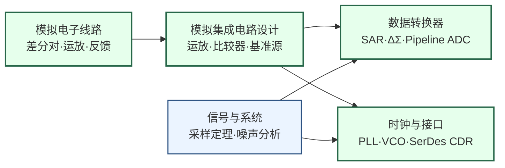

---
hide:
  - navigation
---

设计让模拟世界与数字世界高速转换的"接口芯片"——ADC、DAC、PLL、SerDes 是每块现代 SoC 都不可或缺的混合信号基础模块。

## 这个方向在研究什么

现代 SoC 是两个世界并存的芯片：数字内核用 0/1 计算，而芯片与外界的交互——声音、图像、射频信号、高速串行总线——都是模拟量。连接这两个世界的，是混合信号集成电路。一块旗舰手机内部的 PMIC（电源管理芯片）、音频 Codec、图像传感器读出电路、USB/PCIe SerDes PHY，每一个都是独立的混合信号子系统，也是芯片设计中技术难度最高、对设计师物理直觉要求最强的一类电路。

<svg viewBox="0 0 860 200" xmlns="http://www.w3.org/2000/svg" style="width:100%;max-width:860px;display:block;margin:1.5rem auto;">
  <!-- Background -->
  <rect width="860" height="200" rx="10" fill="#F8FAFC" stroke="#CBD5E1" stroke-width="1.5"/>
  <!-- Analog World Zone -->
  <rect x="10" y="10" width="170" height="180" rx="8" fill="#DBEAFE" stroke="#3B82F6" stroke-width="1.5"/>
  <text x="95" y="32" text-anchor="middle" font-size="12" font-weight="bold" fill="#1E40AF">模拟世界</text>
  <!-- Sine wave left -->
  <path d="M 25 90 Q 40 60 55 90 Q 70 120 85 90 Q 100 60 115 90 Q 130 120 145 90 Q 155 72 165 90" stroke="#3B82F6" stroke-width="2" fill="none"/>
  <text x="95" y="125" text-anchor="middle" font-size="9.5" fill="#1D4ED8">温度 · 声音 · 射频</text>
  <text x="95" y="140" text-anchor="middle" font-size="9.5" fill="#1D4ED8">图像 · 传感器信号</text>
  <!-- Arrow: Analog -> ADC -->
  <line x1="180" y1="100" x2="210" y2="100" stroke="#64748B" stroke-width="2" marker-end="url(#arr)"/>
  <!-- ADC box -->
  <rect x="212" y="70" width="100" height="60" rx="6" fill="#DCFCE7" stroke="#16A34A" stroke-width="1.5"/>
  <text x="262" y="97" text-anchor="middle" font-size="12" font-weight="bold" fill="#15803D">ADC</text>
  <text x="262" y="113" text-anchor="middle" font-size="9.5" fill="#166534">模拟→数字</text>
  <text x="262" y="126" text-anchor="middle" font-size="9" fill="#166534">SAR · ΔΣ · Pipeline</text>
  <!-- Arrow: ADC -> DSP -->
  <line x1="312" y1="100" x2="345" y2="100" stroke="#64748B" stroke-width="2" marker-end="url(#arr)"/>
  <!-- Digital Processing box -->
  <rect x="347" y="65" width="120" height="70" rx="6" fill="#EDE9FE" stroke="#7C3AED" stroke-width="1.5"/>
  <text x="407" y="91" text-anchor="middle" font-size="12" font-weight="bold" fill="#6D28D9">数字处理</text>
  <text x="407" y="107" text-anchor="middle" font-size="9.5" fill="#5B21B6">CPU / DSP / AI Core</text>
  <text x="407" y="121" text-anchor="middle" font-size="9" fill="#5B21B6">0/1 逻辑域</text>
  <!-- Arrow: DSP -> DAC -->
  <line x1="467" y1="100" x2="500" y2="100" stroke="#64748B" stroke-width="2" marker-end="url(#arr)"/>
  <!-- DAC box -->
  <rect x="502" y="70" width="100" height="60" rx="6" fill="#DCFCE7" stroke="#16A34A" stroke-width="1.5"/>
  <text x="552" y="97" text-anchor="middle" font-size="12" font-weight="bold" fill="#15803D">DAC</text>
  <text x="552" y="113" text-anchor="middle" font-size="9.5" fill="#166534">数字→模拟</text>
  <text x="552" y="126" text-anchor="middle" font-size="9" fill="#166534">音频 · 射频发射</text>
  <!-- Arrow: DAC -> Output -->
  <line x1="602" y1="100" x2="635" y2="100" stroke="#64748B" stroke-width="2" marker-end="url(#arr)"/>
  <!-- Output Analog Zone -->
  <rect x="637" y="10" width="213" height="180" rx="8" fill="#DBEAFE" stroke="#3B82F6" stroke-width="1.5"/>
  <text x="743" y="32" text-anchor="middle" font-size="12" font-weight="bold" fill="#1E40AF">物理世界输出</text>
  <path d="M 650 90 Q 665 60 680 90 Q 695 120 710 90 Q 725 60 740 90 Q 755 120 770 90 Q 785 60 800 90 Q 810 72 820 90" stroke="#3B82F6" stroke-width="2" fill="none"/>
  <text x="743" y="125" text-anchor="middle" font-size="9.5" fill="#1D4ED8">扬声器 · 发射天线</text>
  <text x="743" y="140" text-anchor="middle" font-size="9.5" fill="#1D4ED8">驱动电机 · 显示屏</text>
  <!-- PLL circle below center -->
  <ellipse cx="340" cy="175" rx="42" ry="17" fill="#FEF3C7" stroke="#D97706" stroke-width="1.5"/>
  <text x="340" y="179" text-anchor="middle" font-size="10" font-weight="bold" fill="#92400E">PLL / VCO</text>
  <!-- SerDes box below right -->
  <rect x="440" y="158" width="80" height="34" rx="5" fill="#FEF3C7" stroke="#D97706" stroke-width="1.5"/>
  <text x="480" y="177" text-anchor="middle" font-size="10" font-weight="bold" fill="#92400E">SerDes</text>
  <!-- PLL upward arrow to center -->
  <line x1="340" y1="158" x2="380" y2="135" stroke="#D97706" stroke-width="1.5" stroke-dasharray="4,3" marker-end="url(#arrAmber)"/>
  <line x1="480" y1="158" x2="440" y2="135" stroke="#D97706" stroke-width="1.5" stroke-dasharray="4,3" marker-end="url(#arrAmber)"/>
  <!-- Arrow markers -->
  <defs>
    <marker id="arr" markerWidth="8" markerHeight="8" refX="6" refY="3" orient="auto">
      <path d="M0,0 L0,6 L8,3 z" fill="#64748B"/>
    </marker>
    <marker id="arrAmber" markerWidth="8" markerHeight="8" refX="6" refY="3" orient="auto">
      <path d="M0,0 L0,6 L8,3 z" fill="#D97706"/>
    </marker>
  </defs>
</svg>

数字设计师有一个特权：可以假装世界上只有 0 和 1。一个逻辑门输出 3.2V 还是 3.5V 无关紧要，只要超过门限就算逻辑 1，足够稳定就能传到下一级。这个抽象层让数字工程师可以在逻辑、架构、软件等层面工作，完全不必管底层的物理细节。模拟电路设计师没有这个特权。ADC 要分辨 1.0000V 和 1.0001V 的差别，PLL 要把时钟抖动控制在皮秒量级，LNA 要在 -100 dBm 信号强度下不引入额外噪声——每一个晶体管的热噪声、每一对器件的随机制造偏差（失配）、每一条走线的寄生电感，都是可见的误差来源，无法被"假装不存在"。

模拟 IC 的核心挑战，是物理上的好东西往往不能同时得到。热噪声来自电阻和晶体管中电子的随机热运动，理论上无法消除——要降低噪声，就要用更大的偏置电流或更大的电容，意味着更多功耗或更大面积。速度和精度之间有类似的矛盾：ADC 每次采样需要一定的建立时间，想要更快就必须接受更多误差，想要更高精度就必须放慢速度。Walden FoM（功耗/采样率/分辨率的综合指标）散点图几十年来追踪着整个 ADC 领域的技术前沿，而这条曲线之所以移动得如此缓慢，正是因为每一步改进都在与热力学基本定律抗争。设计者能做的是在约束内以更聪明的架构逼近理论极限——SAR ADC 的二分搜索策略在低功耗场景极为高效，ΔΣ ADC 把量化噪声整形到高频再用数字滤波器压制，两者是在"速度、精度、功耗"三角博弈中找到的不同生存位置。

当数据中心需要芯片间每秒传输数百太比特的数据，这些物理约束就从实验室问题变成了产业瓶颈。224 Gbps SerDes PHY——连接 GPU 与网络交换机的高速串行接口——需要在信道损耗 40 dB、多处反射的铜线上恢复信号：发送端用多抽头均衡器（FFE）预补偿失真，接收端用连续时间均衡（CTLE）、判决反馈均衡（DFE）和时钟恢复（CDR）逐步还原，每个环节的设计都取决于对模拟信道物理的理解深度。SerDes 速率每隔三年翻倍（56→112→224→448 Gbps），而每次翻倍都不是简单缩放，而是需要重新审视每一个电路节点。同样，每块数字芯片里的 PLL 从低频参考时钟合成 CPU 工作频率，其相位噪声（时钟不纯净度）直接影响时序裕量；5G 基带本振 PLL 的相位噪声每差 1 dB，系统误码率就会显著变差——这是时域版本的同一个 noise-power 权衡，换了物理量但结构完全相同。

研究者的日常工作是在 Cadence Virtuoso 里构建晶体管级电路，用 Spectre 跑蒙特卡洛仿真感受工艺偏差的影响，反复优化，然后发流片，在芯片测试台上用频谱仪、网络分析仪和示波器测量实测性能——ISSCC 论文的核心价值不在仿真图，而在流片实测结果。近年最活跃的两个方向是：数字辅助模拟（用片上数字逻辑校准模拟电路的非理想性，把数字工艺缩放的红利引入模拟设计）和 AI 辅助电路设计（用机器学习加速原本需要人工反复迭代的仿真和优化）——两者都是让逼近物理极限的过程更有方向感，而那个极限本身，由物理决定，不会消失。

### 核心研究问题

- **噪声-功耗-精度的三角博弈**：热噪声来自电子的随机热运动、无法被消除，压低它就要付出更大电流或更大电容的代价。Walden FoM 曲线几十年只缓慢移动，正因每一步都在与热力学基本定律抗争——在给定工艺下，架构还能把 ADC 往物理极限推多近？
- **架构如何换取生存位置**：SAR 用二分搜索在低功耗场景取胜，ΔΣ 把量化噪声整形到高频再用数字滤波器压制，两者只是在同一个三角里选了不同的牺牲项。面对一个具体的速度/精度需求，哪种架构（乃至两者的杂交）才是当下最优解？
- **超高速 SerDes 的信号还原**：224 Gbps PHY 要在损耗 40 dB、反射重重的铜线上恢复信号，靠发送端 FFE 预补偿、接收端 CTLE/DFE 与 CDR 逐级还原。速率每三年翻倍且从不是简单缩放——下一代 448 Gbps 又有哪些电路节点必须推倒重做？
- **PLL 相位噪声的时域版权衡**：从低频参考时钟合成 CPU 主频，时钟的不纯净度直接吃掉时序裕量；5G 本振 PLL 相噪每差 1 dB，系统误码率就显著恶化。这是换了物理量、结构却完全相同的 noise-power 矛盾，如何在更低功耗下把相噪再压一截？
- **数字辅助模拟**：用片上数字逻辑校准模拟电路的失配与非线性，把数字工艺缩放的红利借给模拟设计——校准能补偿掉多少原本要靠器件尺寸硬扛的非理想性，又把哪些误差留给了物理本身？
- **AI 辅助的电路设计与测量**：晶体管级优化长期依赖人工反复迭代仿真，机器学习能否让这个逼近极限的过程更有方向感？而 ISSCC 的价值从来在流片实测而非仿真图，AI 又能在多大程度上预测硅片上的真实表现？

### 知识路径

图中节点对应以下知识板块（按需选修）：

- [电路（模拟方向）](../学习地图/电路/index.md)
- [器件与工艺](../学习地图/器件与工艺/index.md)
- [系统架构（信号与系统）](../学习地图/系统架构/index.md)

## 适合什么样的人

这个方向适合放不下"物理细节"的人。数字设计师有一个特权——可以假装世界上只有 0 和 1，输出 3.2V 还是 3.5V 无关紧要；你恰恰是那个享受不了这种特权、也不想享受的人。你得直接面对每个晶体管的热噪声、每对器件的随机失配、每条走线的寄生电感，把它们当成可见的、要逐一对付的误差来源，而不是抽象层下面"假装不存在"的东西。如果你在学模拟电子线路时，觉得搭差分对、看波形、算相位裕量这件事本身有意思——而不是痛苦地套公式——这个方向大概率适合你。

日常工作是仿真驱动的设计迭代：在 Cadence Virtuoso 里搭晶体管级电路，用 Spectre/SpectreRF 跑瞬态、AC、噪声和蒙特卡洛（工艺角+失配），从仿真结果里读出哪里被噪声或失配卡住，改参数、改架构，再仿。流片前要画版图，之后在芯片测试台上用频谱仪、网络分析仪和示波器测真实硅片——这是一条从纸面到硅片、跨越数月乃至一年的全周期，而 ISSCC 论文的分量永远压在实测结果上，不在仿真图。你需要的是一种很特别的耐心：愿意为了把 FoM 曲线往前推一小步，反复和热力学定律掰手腕。

支撑这一切的是直觉：对噪声理论（热噪声、闪烁噪声、相位噪声）和线性系统（传递函数、稳定性、相位裕量）的扎实掌握，以及从 ENOB、FoM、相噪、S 参数里一眼看出电路好坏的手感。真正的乐趣在于，ADC 的速度/精度/功耗三角、SerDes 的信道均衡、PLL 的相噪权衡，本质都是同一套 noise-power 矛盾换了物理量——把这条线打通，你会越做越通透。反过来说，如果你更喜欢写 RTL、跑 EDA 数字流程、或一头扎进机器学习实验，远多于对着一条运放波形琢磨它为什么不稳定，那这个方向多半不会让你舒服。

## 学术界

### 课题组

**境内**

-   **叶凡** 复旦

    高能效 SAR ADC · 低功耗数据转换器 · ISSCC/VLSI 发表

-   **倪熔华** 复旦

    高速 PLL/频率综合器 · SerDes CDR · 片上时钟生成

-   **[许灏](https://sme.fudan.edu.cn/6b/47/c31134a420679/page.htm)** 复旦

    模拟 IC 设计 · ADC · 混合信号/射频集成电路

-   **[洪志良](https://sme.fudan.edu.cn/60/a2/c31133a352418/page.htm)** 复旦

    混合信号 IC · 高速接口 · 模拟集成电路分析与设计

-   **[孙楠（Nan Sun）](https://www.nansunlab.com/)** 清华

    新型 ADC 架构 · 低功耗数据转换器 · 磁传感器读出电路

-   **[王志华](https://www.sic.tsinghua.edu.cn/info/1014/1791.htm)** 清华

    高速高精度 ADC · 混合信号 IC · RFID 国家标准

-   **[李宇根（Woogeun Rhee）](https://www.x-mol.com/university/faculty/243668)** 清华

    低相噪 PLL · 小数分频锁相环 · 混合信号时钟电路

-   **[姜汉钧](https://www.sic.tsinghua.edu.cn/info/1014/1814.htm)** 清华

    高精度 ADC · IoT 混合信号 IC · 模拟集成电路设计

-   **[叶乐](https://ic.pku.edu.cn/szdw/zzjs/Y1/yl/index.htm)** 北大

    混合信号 IC · AI 芯片 · 存算一体 AIoT 芯片

-   **[时龙兴](https://ic.seu.edu.cn/shilongxing/main.htm)** 东南大学

    混合信号 IC · SAR ADC 架构 · 高速接口电路

-   **[李福乐](https://www.sic.tsinghua.edu.cn/info/1014/1812.htm)** 清华

    高速高精度流水线 ADC · 电流舵 DAC · 数模混合 IC

-   **[沈林晓](https://ic.pku.edu.cn/szdw/zzjs/jcdlsjx1/slx/index.htm)** 北大

    高速 SAR ADC · 噪声整形流水线 ADC · 智能传感器读出芯片

-   **[唐希源](https://ic.pku.edu.cn/szdw/zzjs/jcdlsjx1/txy/index.htm)** 北大

    增量噪声整形 ADC · 电容数字转换器（CDC） · 浮动反相放大器

-   **[周健军](https://icisee.sjtu.edu.cn/jiaoshiml/zhoujianjun.html)** 交大

    模拟/射频/混合信号 IC · 高速 SerDes PHY · ADC/DAC（CARFIC 中心）

-   **[金晶](https://icisee.sjtu.edu.cn/jiaoshiml/jinjing.html)** 交大 

    频率综合器/PLL · 数据转换器 ADC/DAC · 射频/混合信号 IC

-   **[陈铭易](https://icisee.sjtu.edu.cn/jiaoshiml/chenmingyi.html)** 交大

    精密传感接口芯片 · 超高分辨率 ΔΣ/Zoom ADC · 微能量采集与电源管理

-   **[王国兴](https://icisee.sjtu.edu.cn/jiaoshiml/wangguoxing.html)** 交大

    超低功耗数模混合 IC · 智能脑机接口芯片 · 生物医疗模拟前端（ISSCC/JSSC）

-   **[李永福](https://icisee.sjtu.edu.cn/jiaoshiml/liyongfu.html)** 交大

    模拟/混合信号 IC · 数据转换器（CT ΔΣ/时间交织 ADC）· 电源转换器与 AI 辅助 EDA

-   **[高翔](https://person.zju.edu.cn/xianggao)** 浙大

    亚采样 PLL（Sub-Sampling PLL 发明人）· 射频/模数混合信号 IC · ISSCC 多篇

-   **[谭志超](https://person.zju.edu.cn/zctan)** 浙大

    高精度 ADC · 超低功耗混合信号电路 · 传感器读出电路

-   **[罗宇轩](https://person.zju.edu.cn/luoyx)** 浙大

    模拟/混合信号 IC（JSSC/ISSCC/VLSI）· 传感器/仪器仪表 ASIC

-   **[赵梦恋](https://person.zju.edu.cn/zhaomenglian)** 浙大 

    数模混合 IC · 高精度低功耗数据转换芯片 · 电源管理 IC

-   **[何乐年](https://person.zju.edu.cn/0099103)** 浙大

    模拟与混合信号 IC · 高速高精度 ADC/DAC · CMOS 图像传感器读出 · 电源管理芯片

-   **[胡诣哲](https://sme.ustc.edu.cn/2022/1012/c30996a575413/page.htm)** 中科大

    全数字锁相环 ADPLL · 超低相噪振荡器 · 数字化射频 IC

-   **[程林](https://sme.ustc.edu.cn/2022/0601/c30996a556909/page.htm)** 中科大

    电源管理 DC-DC · 模拟集成电路 · 生物电信号模拟前端 AFE（ISSCC/JSSC）

-   **[赵雷](https://sme.ustc.edu.cn/2022/0601/c30996a556917/page.htm)** 中科大

    专用集成电路 ASIC · 高速高精度信号采集 ADC · 超高精度时间测量 TDC

-   **[杜力](https://ese.nju.edu.cn/dl/list.htm)** 南大

    模拟集成电路设计 · 光通信模拟前端 AFE · AI 辅助模拟电路敏捷设计

-   **[杜源](https://ese.nju.edu.cn/dy/list.htm)** 南大

    高速 SerDes/CDR · 光电高速 IO（2–224 Gbps）· AI 辅助高速接口电路

<button class="prof-show-all">显示全部 ↓</button>

**境外**

-   **[Rui P. Martins](https://ime.um.edu.mo/people/rmartins/)** 澳门大学

    模拟与混合信号 VLSI · 射频 IC · 国家重点实验室 PI

-   **余成斌** 澳门大学

    模拟滤波器 · AD/DA · 无线模拟前端 IP

-   **[Pui-In Mak（麥沛然）](https://ime.um.edu.mo/people/pimak/)** 澳门大学

    射频与模拟电路 · 微流控芯片 · 无线传感 IC

-   **[Howard Cam Luong（梁錦和）](https://ece.hkust.edu.hk/eeluong)** 港科大

    高速低功耗数据转换器 · 混合信号 IC · 射频接口电路

-   **[Wing-Hung Ki（暨永雄）](https://ece.hkust.edu.hk/eeki)** 港科大

    开关电源/PMIC · 开关电容功率转换器 · 电源管理 IC

-   **[Boris Murmann](https://murmann-group.org/)** U Hawaii

    SAR ADC · ADC 性能数据库 · 数据转换器教材

-   **[Ian Galton](https://web.eng.ucsd.edu/~galton/)** UCSD

    ΔΣ 调制器 · 增量式 ADC · 数字辅助模拟校准

-   **[Pavan Kumar Hanumolu](https://hanumolu.ece.illinois.edu/)** UIUC

    PLL/CDR · 超低功耗 SerDes · 数字辅助模拟电路

-   **[Michael Flynn](https://web.eecs.umich.edu/~mpflynn/)** U Michigan

    SAR ADC 架构创新 · 时间交织 ADC 校准 · 低功耗数据转换器

-   **[Elad Alon](https://www2.eecs.berkeley.edu/Faculty/Homepages/elad.html)** UC Berkeley

    高速 SerDes · 低功耗 I/O 互联 · 混合信号接口电路

-   **[Behzad Razavi](https://www.ee.ucla.edu/behzad-razavi/)** UCLA

    数据转换器 · PLL · 模拟/射频/混合信号 IC 教材权威

-   **[Shanthi Pavan](https://www.ee.iitm.ac.in/people/shanthi-pavan/)** IIT Madras

    ΔΣ ADC · 连续时间调制器 · 高速模拟电路

-   **[Borivoje Nikolić](https://bwrc.eecs.berkeley.edu/people/borivoje-nikolic)** UC Berkeley

    高速数模混合电路 · 低功耗数字/模拟 VLSI · 敏捷芯片设计

-   **[Naveen Verma](https://ee.princeton.edu/people/naveen-verma)** Princeton

    机器学习硬件 · 数模混合 IC · 边缘 AI 芯片系统集成

<button class="prof-show-all">显示全部 ↓</button>

### 学术会议与期刊

  
顶会
    ISSCC
    VLSI Symposium
    CICC
    ESSERC（原 ESSCIRC）
    A-SSCC
  

  
顶刊
    JSSC
    TCAS-I/II
    TVLSI
  

## 业界机构

> 这个方向毕业后主要的业界去向（国内外）。上市公司附实时股价链接，便于了解产业景气度。

### 企业

  
国内
    <a href="https://www.willsemi.com/">韦尔股份 / 豪威集团</a>
    <a href="https://www.montage-tech.com/">澜起科技</a>
    <a href="https://www.3peak.cn/">思瑞浦</a>
    <a href="https://www.sg-micro.com/">圣邦股份</a>
    <a href="https://www.novosns.com/">纳芯微</a>
    <a href="https://www.belling.com.cn/">上海贝岭</a>
    <a href="https://www.joulwatt.com/">杰华特（JoulWatt）</a>
    <a href="https://www.bpsemi.com/">晶丰明源</a>
  

  
国外
    <a href="https://www.ti.com/">Texas Instruments（德州仪器）</a>
    <a href="https://www.analog.com/">Analog Devices（ADI）</a>
    <a href="https://www.monolithicpower.com/">Monolithic Power Systems（MPS·电源管理）</a>
    <a href="https://www.broadcom.com/">Broadcom（SerDes / 高速接口）</a>
    <a href="https://www.marvell.com/">Marvell（数据中心高速互连）</a>
    <a href="https://credosemi.com/">Credo（224G SerDes / AEC 有源电缆）</a>
    <a href="https://www.asteralabs.com/">Astera Labs（PCIe/CXL Retimer · 互连）</a>
  

### 科研院所

  
国内
    <a class="dm-chip" href="https://www.ime.cas.cn/" title="数据转换器、高速接口与混合信号 IC 工艺与设计">中科院微电子所</a>
    <a class="dm-chip" href="https://www.sim.cas.cn/" title="传感器读出电路与微系统集成">中科院上海微系统所</a>
    <a class="dm-chip" href="https://www.pcl.ac.cn/" title="DDR5、高速 SerDes 等高端接口 IP">鹏城实验室·集成电路基础研究室</a>
    <a class="dm-chip" href="https://www.icrd.com.cn/" title="先进工艺平台与模拟/混合信号 IP">上海集成电路研发中心（ICRD）</a>
  

  
国外
    <a class="dm-chip" href="https://www.imec-int.com/en" title="先进 CMOS 工艺下的数据转换器与高速 I/O 研究">imec（比利时微电子研究中心）</a>
    <a class="dm-chip" href="https://bwrc.berkeley.edu/" title="高速 SerDes、ADC 与混合信号系统">UC Berkeley 无线研究中心（BWRC）</a>
    <a class="dm-chip" href="https://systemx.stanford.edu/" title="从器件到系统的混合信号集成研究">Stanford SystemX Alliance</a>
    <a class="dm-chip" href="https://www.aist.go.jp/index_en.html" title="模拟器件与精密测量">AIST（日本产业技术综合研究所）</a>
  

