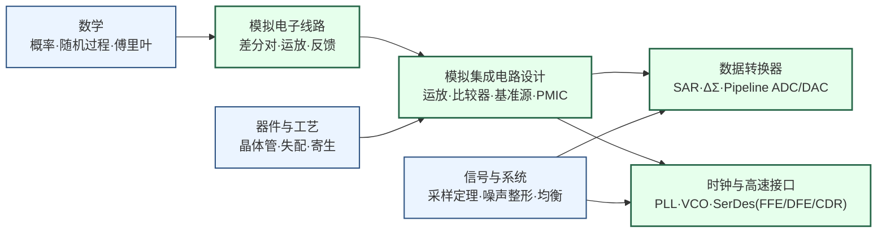

---
hide:
  - navigation
---

设计让模拟世界与数字世界高速转换的"接口芯片"。ADC（模数转换器，Analog-to-Digital Converter）、DAC（数模转换器，Digital-to-Analog Converter）、PLL（锁相环，Phase-Locked Loop）、SerDes（高速串行收发器，Serializer/Deserializer）是每块现代 SoC 都不可或缺的混合信号基础模块。

## 这个方向在研究什么

<svg viewBox="0 0 760 380" xmlns="http://www.w3.org/2000/svg" style="width:100%;max-width:760px;display:block;margin:1.5rem auto;">
  <rect width="760" height="380" rx="10" fill="#F8FAFC" stroke="#CBD5E1" stroke-width="1.5"/>
  <text x="380" y="30" text-anchor="middle" font-size="13" font-weight="bold" fill="#1E293B">你和外界打交道的每个出入口，都是一颗混合信号芯片</text>
  <rect x="300" y="58" width="170" height="296" rx="22" fill="#F1F5F9" stroke="#475569" stroke-width="2"/>
  <rect x="312" y="84" width="146" height="244" rx="6" fill="#EAF1F9" stroke="#CBD5E1" stroke-width="0.8"/>
  <circle cx="385" cy="71" r="3" fill="#94A3B8"/>
  <rect x="356" y="186" width="58" height="40" rx="4" fill="#E2E8F0" stroke="#475569" stroke-width="1.4"/>
  <text x="385" y="203" text-anchor="middle" font-size="10" font-weight="bold" fill="#334155">AP</text>
  <text x="385" y="217" text-anchor="middle" font-size="8" fill="#64748B">数字内核 0/1</text>
  <rect x="320" y="108" width="38" height="22" rx="3" fill="#DBEAFE" stroke="#1E40AF" stroke-width="1.3"/>
  <text x="339" y="123" text-anchor="middle" font-size="9" font-weight="bold" fill="#1E40AF">PMIC</text>
  <rect x="320" y="296" width="44" height="22" rx="3" fill="#DBEAFE" stroke="#1E40AF" stroke-width="1.3"/>
  <text x="342" y="311" text-anchor="middle" font-size="9" font-weight="bold" fill="#1E40AF">Codec</text>
  <rect x="408" y="108" width="46" height="22" rx="3" fill="#DBEAFE" stroke="#1E40AF" stroke-width="1.3"/>
  <text x="431" y="123" text-anchor="middle" font-size="9" font-weight="bold" fill="#1E40AF">图像读出</text>
  <rect x="406" y="296" width="48" height="22" rx="3" fill="#DBEAFE" stroke="#1E40AF" stroke-width="1.3"/>
  <text x="430" y="311" text-anchor="middle" font-size="9" font-weight="bold" fill="#1E40AF">SerDes</text>
  <line x1="320" y1="119" x2="258" y2="119" stroke="#94A3B8" stroke-width="0.8" stroke-dasharray="3,2"/>
  <text x="252" y="116" text-anchor="end" font-size="11" fill="#1E40AF" font-weight="500">电源管理 PMIC</text>
  <text x="252" y="130" text-anchor="end" font-size="9" fill="#64748B">把电池电压稳成各路供电</text>
  <line x1="320" y1="307" x2="258" y2="307" stroke="#94A3B8" stroke-width="0.8" stroke-dasharray="3,2"/>
  <text x="252" y="304" text-anchor="end" font-size="11" fill="#1E40AF" font-weight="500">音频 Codec（ADC/DAC）</text>
  <text x="252" y="318" text-anchor="end" font-size="9" fill="#64748B">声音 ↔ 比特</text>
  <line x1="454" y1="119" x2="516" y2="119" stroke="#94A3B8" stroke-width="0.8" stroke-dasharray="3,2"/>
  <text x="522" y="116" text-anchor="start" font-size="11" fill="#1E40AF" font-weight="500">图像传感器读出</text>
  <text x="522" y="130" text-anchor="start" font-size="9" fill="#64748B">每个像素的电荷 → 数字</text>
  <line x1="454" y1="307" x2="516" y2="307" stroke="#94A3B8" stroke-width="0.8" stroke-dasharray="3,2"/>
  <text x="522" y="304" text-anchor="start" font-size="11" fill="#1E40AF" font-weight="500">高速接口 SerDes</text>
  <text x="522" y="318" text-anchor="start" font-size="9" fill="#64748B">和电脑每秒几十 Gb 对拷</text>
  <text x="380" y="362" text-anchor="middle" font-size="10.5" fill="#475569">数字内核只认 0/1，可它和外界的每一次交互，都得靠这些混合信号芯片来翻译。</text>
</svg>

现代 SoC 是两个世界并存的芯片。数字内核用 0/1 计算，而芯片跟外界打交道的那些信号，无论是声音、图像、射频还是高速串行总线，本质都是连续变化的模拟量。连接这两个世界的，就是混合信号集成电路。一块旗舰手机里的电源管理芯片（PMIC，Power Management IC）、音频编解码器（Codec）、图像传感器读出电路、USB/PCIe 的 SerDes，每一个都是独立的混合信号子系统，也是整颗芯片里技术难度最高、最吃设计师物理直觉的一类电路。

<svg viewBox="0 0 860 200" xmlns="http://www.w3.org/2000/svg" style="width:100%;max-width:860px;display:block;margin:1.5rem auto;">
  <!-- Background -->
  <rect width="860" height="200" rx="10" fill="#F8FAFC" stroke="#CBD5E1" stroke-width="1.5"/>
  <!-- Analog World Zone -->
  <rect x="10" y="10" width="170" height="180" rx="8" fill="#DBEAFE" stroke="#3B82F6" stroke-width="1.5"/>
  <text x="95" y="32" text-anchor="middle" font-size="12" font-weight="bold" fill="#1E40AF">模拟世界</text>
  <!-- Sine wave left -->
  <path d="M 25 90 Q 40 60 55 90 Q 70 120 85 90 Q 100 60 115 90 Q 130 120 145 90 Q 155 72 165 90" stroke="#3B82F6" stroke-width="2" fill="none"/>
  <text x="95" y="125" text-anchor="middle" font-size="9.5" fill="#1D4ED8">温度 · 声音 · 射频</text>
  <text x="95" y="140" text-anchor="middle" font-size="9.5" fill="#1D4ED8">图像 · 传感器信号</text>
  <!-- Arrow: Analog -> ADC -->
  <line x1="180" y1="100" x2="210" y2="100" stroke="#64748B" stroke-width="2" marker-end="url(#arr)"/>
  <!-- ADC box -->
  <rect x="212" y="70" width="100" height="60" rx="6" fill="#DCFCE7" stroke="#16A34A" stroke-width="1.5"/>
  <text x="262" y="97" text-anchor="middle" font-size="12" font-weight="bold" fill="#15803D">ADC</text>
  <text x="262" y="113" text-anchor="middle" font-size="9.5" fill="#166534">模拟→数字</text>
  <text x="262" y="126" text-anchor="middle" font-size="9" fill="#166534">SAR · ΔΣ · Pipeline</text>
  <!-- Arrow: ADC -> DSP -->
  <line x1="312" y1="100" x2="345" y2="100" stroke="#64748B" stroke-width="2" marker-end="url(#arr)"/>
  <!-- Digital Processing box -->
  <rect x="347" y="65" width="120" height="70" rx="6" fill="#EDE9FE" stroke="#7C3AED" stroke-width="1.5"/>
  <text x="407" y="91" text-anchor="middle" font-size="12" font-weight="bold" fill="#6D28D9">数字处理</text>
  <text x="407" y="107" text-anchor="middle" font-size="9.5" fill="#5B21B6">CPU / DSP / AI Core</text>
  <text x="407" y="121" text-anchor="middle" font-size="9" fill="#5B21B6">0/1 逻辑域</text>
  <!-- Arrow: DSP -> DAC -->
  <line x1="467" y1="100" x2="500" y2="100" stroke="#64748B" stroke-width="2" marker-end="url(#arr)"/>
  <!-- DAC box -->
  <rect x="502" y="70" width="100" height="60" rx="6" fill="#DCFCE7" stroke="#16A34A" stroke-width="1.5"/>
  <text x="552" y="97" text-anchor="middle" font-size="12" font-weight="bold" fill="#15803D">DAC</text>
  <text x="552" y="113" text-anchor="middle" font-size="9.5" fill="#166534">数字→模拟</text>
  <text x="552" y="126" text-anchor="middle" font-size="9" fill="#166534">音频 · 射频发射</text>
  <!-- Arrow: DAC -> Output -->
  <line x1="602" y1="100" x2="635" y2="100" stroke="#64748B" stroke-width="2" marker-end="url(#arr)"/>
  <!-- Output Analog Zone -->
  <rect x="637" y="10" width="213" height="180" rx="8" fill="#DBEAFE" stroke="#3B82F6" stroke-width="1.5"/>
  <text x="743" y="32" text-anchor="middle" font-size="12" font-weight="bold" fill="#1E40AF">物理世界输出</text>
  <path d="M 650 90 Q 665 60 680 90 Q 695 120 710 90 Q 725 60 740 90 Q 755 120 770 90 Q 785 60 800 90 Q 810 72 820 90" stroke="#3B82F6" stroke-width="2" fill="none"/>
  <text x="743" y="125" text-anchor="middle" font-size="9.5" fill="#1D4ED8">扬声器 · 发射天线</text>
  <text x="743" y="140" text-anchor="middle" font-size="9.5" fill="#1D4ED8">驱动电机 · 显示屏</text>
  <!-- PLL circle below center -->
  <ellipse cx="340" cy="175" rx="42" ry="17" fill="#FEF3C7" stroke="#D97706" stroke-width="1.5"/>
  <text x="340" y="179" text-anchor="middle" font-size="10" font-weight="bold" fill="#92400E">PLL / VCO</text>
  <!-- SerDes box below right -->
  <rect x="440" y="158" width="80" height="34" rx="5" fill="#FEF3C7" stroke="#D97706" stroke-width="1.5"/>
  <text x="480" y="177" text-anchor="middle" font-size="10" font-weight="bold" fill="#92400E">SerDes</text>
  <!-- PLL upward arrow to center -->
  <line x1="340" y1="158" x2="380" y2="135" stroke="#D97706" stroke-width="1.5" stroke-dasharray="4,3" marker-end="url(#arrAmber)"/>
  <line x1="480" y1="158" x2="440" y2="135" stroke="#D97706" stroke-width="1.5" stroke-dasharray="4,3" marker-end="url(#arrAmber)"/>
  <!-- Arrow markers -->
  <defs>
    <marker id="arr" markerWidth="8" markerHeight="8" refX="6" refY="3" orient="auto">
      <path d="M0,0 L0,6 L8,3 z" fill="#64748B"/>
    </marker>
    <marker id="arrAmber" markerWidth="8" markerHeight="8" refX="6" refY="3" orient="auto">
      <path d="M0,0 L0,6 L8,3 z" fill="#D97706"/>
    </marker>
  </defs>
</svg>

数字设计师有一个特权，可以假装世界上只有 0 和 1。一个逻辑门输出 3.2V 还是 3.5V 无关紧要，只要超过门限就算逻辑 1，足够稳定就能传到下一级。这个抽象层让数字工程师在逻辑、架构、软件层面工作，完全不必管底层的物理细节。模拟电路设计师没有这个特权。ADC 要分辨 1.0000V 和 1.0001V 的差别，PLL 要把时钟抖动控制在皮秒量级，低噪声放大器（LNA，Low-Noise Amplifier）要在 -100 dBm 的微弱信号下不引入额外噪声。每一个晶体管的热噪声、每一对器件的随机失配、每一条走线的寄生电感，都是看得见的误差来源，没法"假装不存在"。

模拟 IC 的核心挑战，是物理上的好东西往往不可兼得。Razavi 在那本“模电圣经”里把这件事画成一个八边形，八个指标分占八个角，谁也不让谁。热噪声来自电阻和晶体管里电子的随机热运动，理论上没法消除。想降低噪声，就得用更大的偏置电流或更大的电容，也就意味着更多功耗、更大面积。速度和精度之间也有一对类似的矛盾。ADC 每次采样需要一定的建立时间，想更快就得接受更多误差，想更准就得放慢速度。设计者能做的，是在约束内用更聪明的架构去逼近理论极限。

<svg viewBox="0 0 720 320" xmlns="http://www.w3.org/2000/svg" style="width:100%;max-width:720px;display:block;margin:1.5rem auto;">
  <rect width="720" height="320" rx="10" fill="#F8FAFC" stroke="#CBD5E1" stroke-width="1.5"/>
  <text x="360" y="28" text-anchor="middle" font-size="13" font-weight="bold" fill="#1E293B">模拟IC设计的“不可能八角”（Razavi）</text>
  <line x1="360" y1="170" x2="360" y2="78" stroke="#EEF2F6" stroke-width="1"/>
  <line x1="360" y1="170" x2="452" y2="170" stroke="#EEF2F6" stroke-width="1"/>
  <line x1="360" y1="170" x2="360" y2="262" stroke="#EEF2F6" stroke-width="1"/>
  <line x1="360" y1="170" x2="268" y2="170" stroke="#EEF2F6" stroke-width="1"/>
  <polygon points="360,78 425,105 452,170 425,235 360,262 295,235 268,170 295,105" fill="none" stroke="#CBD5E1" stroke-width="1.5"/>
  <polygon points="360,87 415,115 397,170 399,209 360,207 321,209 286,170 337,147" fill="#3B82F6" fill-opacity="0.15" stroke="#1E40AF" stroke-width="1.6"/>
  <polygon points="360,119 406,124 397,170 406,216 360,207 327,203 273,170 314,124" fill="#F97316" fill-opacity="0.15" stroke="#C2410C" stroke-width="1.6"/>
  <polygon points="360,87 386,144 397,170 399,209 360,211 334,196 291,170 337,147" fill="#22C55E" fill-opacity="0.15" stroke="#15803D" stroke-width="1.6"/>
  <text x="360" y="66" text-anchor="middle" font-size="10.5" fill="#334155">噪声</text>
  <text x="438" y="100" text-anchor="start" font-size="10.5" fill="#334155">线性度</text>
  <text x="462" y="173" text-anchor="start" font-size="10.5" fill="#334155">增益</text>
  <text x="438" y="240" text-anchor="start" font-size="10.5" fill="#334155">功耗</text>
  <text x="360" y="280" text-anchor="middle" font-size="10.5" fill="#334155">电源电压</text>
  <text x="282" y="240" text-anchor="end" font-size="10.5" fill="#334155">电压摆幅</text>
  <text x="258" y="173" text-anchor="end" font-size="10.5" fill="#334155">速度</text>
  <text x="282" y="100" text-anchor="end" font-size="10.5" fill="#334155">输入/输出阻抗</text>
  <rect x="556" y="108" width="14" height="10" rx="2" fill="#3B82F6" fill-opacity="0.5" stroke="#1E40AF" stroke-width="1"/>
  <text x="575" y="117" text-anchor="start" font-size="10" fill="#1E40AF">ADC</text>
  <rect x="556" y="136" width="14" height="10" rx="2" fill="#F97316" fill-opacity="0.5" stroke="#C2410C" stroke-width="1"/>
  <text x="575" y="145" text-anchor="start" font-size="10" fill="#C2410C">SerDes</text>
  <rect x="556" y="164" width="14" height="10" rx="2" fill="#22C55E" fill-opacity="0.5" stroke="#15803D" stroke-width="1"/>
  <text x="575" y="173" text-anchor="start" font-size="10" fill="#15803D">PLL</text>
  <text x="360" y="304" text-anchor="middle" font-size="10.5" fill="#475569">每类电路把不同的角往外拉：ADC 重噪声/线性度/速度，SerDes 重速度，PLL 重相噪。示意，非定量。</text>
</svg>

当数据中心要在芯片之间每秒搬运数百太比特，这些物理约束就从实验室问题变成了产业瓶颈。一颗 224 Gbps 的 SerDes，要把信号从一台 GPU 送到几十厘米外的交换机，中间那段铜线损耗高达 40 dB，还到处是反射，信号传到对面早就糊成了一团。办法分两步。发送端先把信号"预先扭曲"一下，估计信道会怎么糟蹋它，提前做反向补偿。接收端再用一连串均衡和时钟恢复电路，把糊掉的波形一级一级还原回来。每一步设计有多好，全看你对这段铜线的物理摸得有多透。SerDes 的速率每三年翻一倍，从 56 到 112 到 224，再往 448 去，可每次翻倍都不是把电路照搬放大，而是几乎每个节点都得推倒重来。

<svg viewBox="0 0 820 260" xmlns="http://www.w3.org/2000/svg" style="width:100%;max-width:820px;display:block;margin:1.5rem auto;">
  <defs>
    <marker id="sdArr" markerWidth="9" markerHeight="9" refX="6" refY="3" orient="auto"><path d="M0,0 L0,6 L8,3 z" fill="#475569"/></marker>
  </defs>
  <rect width="820" height="260" rx="10" fill="#F8FAFC" stroke="#CBD5E1" stroke-width="1.5"/>
  <text x="410" y="30" text-anchor="middle" font-size="13" font-weight="bold" fill="#1E293B">SerDes（高速串行收发器）：224 Gbps 信号在铜线上糊掉，再被一步步还原</text>
  <rect x="40" y="70" width="180" height="90" rx="6" fill="#FFFFFF" stroke="#16A34A" stroke-width="1.4"/>
  <line x1="70" y1="90" x2="190" y2="140" stroke="#16A34A" stroke-width="1.5"/>
  <line x1="70" y1="140" x2="190" y2="90" stroke="#16A34A" stroke-width="1.5"/>
  <polygon points="118,103 142,115 118,127 94,115" fill="none" stroke="#15803D" stroke-width="1"/>
  <text x="130" y="178" text-anchor="middle" font-size="10.5" font-weight="bold" fill="#15803D">① 发送端</text>
  <text x="130" y="194" text-anchor="middle" font-size="9" fill="#475569">按信道会怎么糟蹋它</text>
  <text x="130" y="207" text-anchor="middle" font-size="9" fill="#475569">预先反向补偿</text>
  <line x1="226" y1="115" x2="266" y2="115" stroke="#475569" stroke-width="2" marker-end="url(#sdArr)"/>
  <rect x="272" y="70" width="180" height="90" rx="6" fill="#FEF2F2" stroke="#DC2626" stroke-width="1.4"/>
  <path d="M292,90 Q330,150 362,95 Q392,150 432,98" fill="none" stroke="#B91C1C" stroke-width="1.2" opacity="0.7"/>
  <path d="M292,130 Q330,80 362,135 Q392,82 432,128" fill="none" stroke="#B91C1C" stroke-width="1.2" opacity="0.7"/>
  <path d="M292,110 Q335,140 365,108 Q398,138 432,112" fill="none" stroke="#94A3B8" stroke-width="1" opacity="0.7"/>
  <path d="M292,108 Q330,82 366,132 Q400,90 432,118" fill="none" stroke="#94A3B8" stroke-width="1" opacity="0.7"/>
  <text x="362" y="178" text-anchor="middle" font-size="10.5" font-weight="bold" fill="#B91C1C">② 铜线信道</text>
  <text x="362" y="194" text-anchor="middle" font-size="9" fill="#475569">40 dB 损耗 + 反射</text>
  <text x="362" y="207" text-anchor="middle" font-size="9" fill="#475569">眼图闭成一团</text>
  <line x1="458" y1="115" x2="498" y2="115" stroke="#475569" stroke-width="2" marker-end="url(#sdArr)"/>
  <rect x="504" y="70" width="180" height="90" rx="6" fill="#FFFFFF" stroke="#16A34A" stroke-width="1.4"/>
  <line x1="534" y1="90" x2="654" y2="140" stroke="#16A34A" stroke-width="1.5"/>
  <line x1="534" y1="140" x2="654" y2="90" stroke="#16A34A" stroke-width="1.5"/>
  <polygon points="582,103 606,115 582,127 558,115" fill="none" stroke="#15803D" stroke-width="1"/>
  <text x="594" y="178" text-anchor="middle" font-size="10.5" font-weight="bold" fill="#15803D">③ 接收端</text>
  <text x="594" y="194" text-anchor="middle" font-size="9" fill="#475569">逐级均衡 + 时钟恢复</text>
  <text x="594" y="207" text-anchor="middle" font-size="9" fill="#475569">眼图重新睁开</text>
  <text x="410" y="238" text-anchor="middle" font-size="10.5" fill="#475569">发送端预补偿，接收端逐级还原。两步都看你把这段铜线的物理摸得多透。</text>
</svg>

PLL 讲的是同一个故事，只不过搬到了时间轴上。每块数字芯片都需要一个又快又稳的节拍来同步，PLL 就负责把一个慢的参考时钟倍频成芯片用的 GHz 主频。可再好的时钟，每一下"嘀嗒"也不会卡得分毫不差，边沿总会忽早忽晚地抖一点，这种时间上的抖动就是相位噪声。它在两个地方都要命。在数字芯片里，时钟一抖，留给每个信号稳定下来的余量就被压缩，主频就上不去；在 5G 收发机里，那个负责搬移频率的时钟一抖，发出去的信号符号就糊在一起，收错的概率跟着上升。说到底，想让时钟更稳，就得多花功耗。这还是 ADC 那个 noise-power 矛盾，只是把电压上的噪声换成了时间上的抖动，结构一模一样。

<svg viewBox="0 0 820 230" xmlns="http://www.w3.org/2000/svg" style="width:100%;max-width:820px;display:block;margin:1.5rem auto;">
  <defs>
    <marker id="plArr" markerWidth="9" markerHeight="9" refX="6" refY="3" orient="auto"><path d="M0,0 L0,6 L8,3 z" fill="#475569"/></marker>
  </defs>
  <rect width="820" height="230" rx="10" fill="#F8FAFC" stroke="#CBD5E1" stroke-width="1.5"/>
  <text x="410" y="28" text-anchor="middle" font-size="13" font-weight="bold" fill="#1E293B">PLL（锁相环）的结构：把输出锁定到参考 N 倍的负反馈环</text>
  <text x="55" y="92" text-anchor="middle" font-size="10" fill="#475569">参考时钟</text>
  <text x="55" y="106" text-anchor="middle" font-size="10" fill="#475569">f_ref</text>
  <line x1="92" y1="100" x2="128" y2="100" stroke="#475569" stroke-width="2" marker-end="url(#plArr)"/>
  <rect x="130" y="78" width="92" height="44" rx="5" fill="#DBEAFE" stroke="#1E40AF" stroke-width="1.4"/>
  <text x="176" y="98" text-anchor="middle" font-size="10.5" font-weight="bold" fill="#1E40AF">鉴相器</text>
  <text x="176" y="113" text-anchor="middle" font-size="9" fill="#1D4ED8">PFD 比相位</text>
  <line x1="222" y1="100" x2="256" y2="100" stroke="#475569" stroke-width="2" marker-end="url(#plArr)"/>
  <rect x="258" y="78" width="104" height="44" rx="5" fill="#DBEAFE" stroke="#1E40AF" stroke-width="1.4"/>
  <text x="310" y="98" text-anchor="middle" font-size="10.5" font-weight="bold" fill="#1E40AF">环路滤波器</text>
  <text x="310" y="113" text-anchor="middle" font-size="9" fill="#1D4ED8">相差变控制电压</text>
  <line x1="362" y1="100" x2="396" y2="100" stroke="#475569" stroke-width="2" marker-end="url(#plArr)"/>
  <rect x="398" y="78" width="104" height="44" rx="5" fill="#DCFCE7" stroke="#16A34A" stroke-width="1.4"/>
  <text x="450" y="98" text-anchor="middle" font-size="10.5" font-weight="bold" fill="#15803D">压控振荡器</text>
  <text x="450" y="113" text-anchor="middle" font-size="9" fill="#166534">VCO 生成时钟</text>
  <line x1="502" y1="100" x2="600" y2="100" stroke="#475569" stroke-width="2" marker-end="url(#plArr)"/>
  <text x="660" y="92" text-anchor="middle" font-size="10" fill="#475569">输出主频</text>
  <text x="660" y="107" text-anchor="middle" font-size="10" font-weight="bold" fill="#15803D">= N × f_ref</text>
  <line x1="550" y1="100" x2="550" y2="170" stroke="#475569" stroke-width="1.6"/>
  <line x1="551" y1="170" x2="406" y2="170" stroke="#475569" stroke-width="1.6"/>
  <rect x="316" y="153" width="90" height="34" rx="5" fill="#FEF3C7" stroke="#D97706" stroke-width="1.4"/>
  <text x="361" y="174" text-anchor="middle" font-size="10" font-weight="bold" fill="#92400E">÷N 分频器</text>
  <line x1="316" y1="170" x2="176" y2="170" stroke="#475569" stroke-width="1.6"/>
  <line x1="176" y1="170" x2="176" y2="124" stroke="#475569" stroke-width="1.6" marker-end="url(#plArr)"/>
  <text x="246" y="186" text-anchor="middle" font-size="9" fill="#9A3412">把输出分频后送回比较</text>
  <text x="410" y="214" text-anchor="middle" font-size="10.5" fill="#475569">鉴相器不停比较参考和反馈的相位差，用它微调 VCO，直到输出稳稳锁在参考的 N 倍上。这就叫"锁相"。</text>
</svg>

除了在模拟域和上述“不可能八角”死磕以外，用**数字精度补偿模拟误差**也是一条路。别用模拟的精度硬扛，而是把误差测出来、再用便宜的数字逻辑算掉。比如一颗高精度 ADC，开机时先测出自己电容的失配，存成一组修正系数，工作时把误差从输出里数字减掉。模拟那一半可以做得糙一点，脏活交给随工艺不断变便宜的数字去擦。

过往的模拟电路设计非常吃经验，模拟电路设计师属于“越老越吃香”的行业。近年随着 LLM 的爆发，AI 辅助模拟电路设计也ying'yu'ne**用 AI 帮着设计电路**，听上去诱人，真做起来却比数字 EDA 难得多。模拟设计本是一门慢手艺，调器件、跑仿真、再调，一轮一轮要花上几周。机器学习确实能在窄任务上搭把手，比如替一个已知拓扑自动调参数，或者用代理模型替掉慢吞吞的 SPICE 仿真。可它一抬头就撞上三堵硬墙。模拟没有"满足时序"那样单一可优化的目标，而是前面那张八边形，八个角互相拉扯，AI 拿不到一个干净的分数去学。更要命的是 SPICE 仿真本身在高频下就不准，仿真和真实流片对不上，等于训练数据的标准答案都不可信。再加上每个设计都是孤例，每个数据点都要跑一次慢仿真甚至流一次片，数据少得可怜。所以 AI 眼下更像个加速器，能让逼近极限的脚步快一点，却远远谈不上替人把模拟电路设计出来。说到底，这两条路都只是让逼近极限走得更快，那个极限本身由物理决定，不会消失。

### 核心研究问题

- **数据转换器的架构创新**：高分辨率 ADC 的能效几十年贴着 kT/C 极限挪不动，SAR、ΔΣ、流水线各靠新结构在噪声、精度、速度之间换出一点余量。
- **超高速 SerDes 与高速接口**：224 Gbps 信号要在损耗 40 dB、到处反射的铜线上传输，靠发送端预补偿和接收端逐级均衡还原，速率每三年翻倍且每代都得把电路节点推倒重想。
- **低相噪 PLL 与时钟生成**：PLL 倍频出芯片主频，可时钟边沿总忽早忽晚地抖，这点抖动在数字芯片里拉低主频、在收发机里让符号糊成一团，亚采样和全数字环各走一路压相噪。
- **传感接口与电源管理**：精密 AFE 要从微伏级生物电或电容差里捞信号、压住失配与漂移，PMIC 要在宽负载下稳压保效率，两类电路撑起读出芯片和供电这条产业线。
- **数字辅助与 AI 辅助（IC 切口）**：把误差测出来再用便宜的数字逻辑算掉，模拟那半做糙一点吃工艺缩放红利，但八边形给不出干净的优化目标、SPICE 高频又不准，AI 眼下更像加速器而非替人设计。

### 知识路径

图中节点对应以下知识板块（按需选修）：

- [电路 · 模拟（模拟电子线路 → 模拟 IC → 数据转换器 / 时钟接口）](../学习地图/电路/模拟/index.md)
- [电路 · 信号处理（采样定理 · 噪声整形 · 均衡）](../学习地图/电路/信号处理/index.md)
- [器件与工艺（晶体管特性 · 失配 · 寄生）](../学习地图/器件与工艺/index.md)
- [数学（概率与随机过程 · 傅里叶分析）](../学习地图/数学/index.md)

## 这个方向适合谁

这个方向适合放不下物理细节的人，数字设计师能假装世界只有 0 和 1，你偏要直面 ADC 里 1.0000V 和 1.0001V 的差别、PLL 的皮秒抖动、每个晶体管的热噪声。微电子本科最顺的硬件切口是把模拟电子线路加信号与系统打通，前者给你差分对、运放、基准源的器械感，后者给你采样和噪声分析的语言。诚实说节奏偏慢，论文分量永远压在流片实测而非仿真图上，顶会是 ISSCC，爱写 RTL 或扎进算法的人多半不舒服。

## 学术界

### 课题组

**境内**

-   **[叶凡](https://sme.fudan.edu.cn/60/57/c31157a352343/page.htm)** 复旦

    高能效 SAR ADC · 低功耗数据转换器 · ISSCC/VLSI 发表

-   **[倪熔华](https://sme.fudan.edu.cn/60/15/c31149a352277/page.htm)** 复旦

    高速 PLL/频率综合器 · SerDes CDR · 片上时钟生成

-   **[许灏](https://sme.fudan.edu.cn/6b/47/c31134a420679/page.htm)** 复旦

    模拟 IC 设计 · ADC · 混合信号/射频集成电路

-   **[洪志良](https://sme.fudan.edu.cn/60/a2/c31133a352418/page.htm)** 复旦

    混合信号 IC · 高速接口 · 模拟集成电路分析与设计

-   **[孙楠（Nan Sun）](https://www.nansunlab.com/)** 清华

    新型 ADC 架构 · 低功耗数据转换器 · 磁传感器读出电路

-   **[王志华](https://www.sic.tsinghua.edu.cn/info/1014/1791.htm)** 清华

    高速高精度 ADC · 混合信号 IC · RFID 国家标准

-   **[李宇根（Woogeun Rhee）](https://www.x-mol.com/university/faculty/243668)** 清华

    低相噪 PLL · 小数分频锁相环 · 混合信号时钟电路

-   **[姜汉钧](https://www.sic.tsinghua.edu.cn/info/1014/1814.htm)** 清华

    高精度 ADC · IoT 混合信号 IC · 模拟集成电路设计

-   **[叶乐](https://ic.pku.edu.cn/szdw/zzjs/Y1/yl/index.htm)** 北大

    混合信号 IC · AI 芯片 · 存算一体 AIoT 芯片

-   **[李福乐](https://www.sic.tsinghua.edu.cn/info/1014/1812.htm)** 清华

    高速高精度流水线 ADC · 电流舵 DAC · 数模混合 IC

-   **[沈林晓](https://ic.pku.edu.cn/szdw/zzjs/jcdlsjx1/slx/index.htm)** 北大

    高速 SAR ADC · 噪声整形流水线 ADC · 智能传感器读出芯片

-   **[唐希源](https://ic.pku.edu.cn/szdw/zzjs/jcdlsjx1/txy/index.htm)** 北大

    增量噪声整形 ADC · 电容数字转换器（CDC） · 浮动反相放大器

-   **[周健军](https://icisee.sjtu.edu.cn/jiaoshiml/zhoujianjun.html)** 交大

    模拟/射频/混合信号 IC · 高速 SerDes PHY · ADC/DAC（CARFIC 中心）

-   **[金晶](https://icisee.sjtu.edu.cn/jiaoshiml/jinjing.html)** 交大 

    频率综合器/PLL · 数据转换器 ADC/DAC · 射频/混合信号 IC

-   **[陈铭易](https://icisee.sjtu.edu.cn/jiaoshiml/chenmingyi.html)** 交大

    精密传感接口芯片 · 超高分辨率 ΔΣ/Zoom ADC · 微能量采集与电源管理

-   **[王国兴](https://icisee.sjtu.edu.cn/jiaoshiml/wangguoxing.html)** 交大

    超低功耗数模混合 IC · 智能脑机接口芯片 · 生物医疗模拟前端（ISSCC/JSSC）

-   **[李永福](https://icisee.sjtu.edu.cn/jiaoshiml/liyongfu.html)** 交大

    模拟/混合信号 IC · 数据转换器（CT ΔΣ/时间交织 ADC）· 电源转换器与 AI 辅助 EDA

-   **[高翔](https://person.zju.edu.cn/xianggao)** 浙大

    亚采样 PLL（Sub-Sampling PLL 发明人）· 射频/模数混合信号 IC · ISSCC 多篇

-   **[谭志超](https://person.zju.edu.cn/zctan)** 浙大

    高精度 ADC · 超低功耗混合信号电路 · 传感器读出电路

-   **[罗宇轩](https://person.zju.edu.cn/luoyx)** 浙大

    模拟/混合信号 IC（JSSC/ISSCC/VLSI）· 传感器/仪器仪表 ASIC

-   **[赵梦恋](https://person.zju.edu.cn/zhaomenglian)** 浙大 

    数模混合 IC · 高精度低功耗数据转换芯片 · 电源管理 IC

-   **[何乐年](https://person.zju.edu.cn/0099103)** 浙大

    模拟与混合信号 IC · 高速高精度 ADC/DAC · CMOS 图像传感器读出 · 电源管理芯片

-   **[胡诣哲](https://sme.ustc.edu.cn/2022/1012/c30996a575413/page.htm)** 中科大

    全数字锁相环 ADPLL · 超低相噪振荡器 · 数字化射频 IC

-   **[程林](https://sme.ustc.edu.cn/2022/0601/c30996a556909/page.htm)** 中科大

    电源管理 DC-DC · 模拟集成电路 · 生物电信号模拟前端 AFE（ISSCC/JSSC）

-   **[赵雷](https://sme.ustc.edu.cn/2022/0601/c30996a556917/page.htm)** 中科大

    专用集成电路 ASIC · 高速高精度信号采集 ADC · 超高精度时间测量 TDC

-   **[杜力](https://ese.nju.edu.cn/dl/list.htm)** 南大

    模拟集成电路设计 · 光通信模拟前端 AFE · AI 辅助模拟电路敏捷设计

-   **[杜源](https://ese.nju.edu.cn/dy/list.htm)** 南大

    高速 SerDes/CDR · 光电高速 IO（2–224 Gbps）· AI 辅助高速接口电路

<button class="prof-show-all">显示全部 ↓</button>

**境外**

-   **[Rui P. Martins](https://ime.um.edu.mo/people/rmartins/)** 澳门大学

    模拟与混合信号 VLSI · 射频 IC · 国家重点实验室 PI

-   **余成斌** 澳门大学

    模拟滤波器 · AD/DA · 无线模拟前端 IP

-   **[Pui-In Mak（麥沛然）](https://ime.um.edu.mo/people/pimak/)** 澳门大学

    射频与模拟电路 · 微流控芯片 · 无线传感 IC

-   **[Howard Cam Luong（梁錦和）](https://ece.hkust.edu.hk/eeluong)** 港科大

    高速低功耗数据转换器 · 混合信号 IC · 射频接口电路

-   **[Wing-Hung Ki（暨永雄）](https://ece.hkust.edu.hk/eeki)** 港科大

    开关电源/PMIC · 开关电容功率转换器 · 电源管理 IC

-   **[Boris Murmann](https://murmann-group.org/)** U Hawaii

    SAR ADC · ADC 性能数据库 · 数据转换器教材

-   **[Ian Galton](https://web.eng.ucsd.edu/~galton/)** UCSD

    ΔΣ 调制器 · 增量式 ADC · 数字辅助模拟校准

-   **[Pavan Kumar Hanumolu](https://hanumolu.ece.illinois.edu/)** UIUC

    PLL/CDR · 超低功耗 SerDes · 数字辅助模拟电路

-   **[Michael Flynn](https://web.eecs.umich.edu/~mpflynn/)** U Michigan

    SAR ADC 架构创新 · 时间交织 ADC 校准 · 低功耗数据转换器

-   **[Elad Alon](https://www2.eecs.berkeley.edu/Faculty/Homepages/elad.html)** UC Berkeley

    高速 SerDes · 低功耗 I/O 互联 · 混合信号接口电路

-   **[Behzad Razavi](https://www.ee.ucla.edu/behzad-razavi/)** UCLA

    数据转换器 · PLL · 模拟/射频/混合信号 IC 教材权威

-   **[Shanthi Pavan](https://www.ee.iitm.ac.in/people/shanthi-pavan/)** IIT Madras

    ΔΣ ADC · 连续时间调制器 · 高速模拟电路

-   **[Borivoje Nikolić](https://bwrc.eecs.berkeley.edu/people/borivoje-nikolic)** UC Berkeley

    高速数模混合电路 · 低功耗数字/模拟 VLSI · 敏捷芯片设计

-   **[Naveen Verma](https://ee.princeton.edu/people/naveen-verma)** Princeton

    机器学习硬件 · 数模混合 IC · 边缘 AI 芯片系统集成

<button class="prof-show-all">显示全部 ↓</button>

### 学术会议与期刊

  
会议
    ISSCC
    VLSI Symposium
    CICC
    ESSERC（原 ESSCIRC）
    A-SSCC
  

  
期刊
    JSSC
    TCAS-I/II
    TVLSI
  

## 毕业去向

### 企业

  
国内
    <a href="https://www.willsemi.com/">韦尔股份 / 豪威集团</a>
    <a href="https://www.montage-tech.com/">澜起科技</a>
    <a href="https://www.3peak.cn/">思瑞浦</a>
    <a href="https://www.sg-micro.com/">圣邦股份</a>
    <a href="https://www.novosns.com/">纳芯微</a>
    <a href="https://www.belling.com.cn/">上海贝岭</a>
    <a href="https://www.joulwatt.com/">杰华特（JoulWatt）</a>
    <a href="https://www.bpsemi.com/">晶丰明源</a>
  

  
国外
    <a href="https://www.ti.com/">Texas Instruments（德州仪器）</a>
    <a href="https://www.analog.com/">Analog Devices（ADI）</a>
    <a href="https://www.monolithicpower.com/">Monolithic Power Systems（MPS·电源管理）</a>
    <a href="https://www.broadcom.com/">Broadcom（SerDes / 高速接口）</a>
    <a href="https://www.marvell.com/">Marvell（数据中心高速互连）</a>
    <a href="https://credosemi.com/">Credo（224G SerDes / AEC 有源电缆）</a>
    <a href="https://www.asteralabs.com/">Astera Labs（PCIe/CXL Retimer · 互连）</a>
  

### 科研院所

  
国内
    <a class="dm-chip" href="https://www.ime.cas.cn/" title="数据转换器、高速接口与混合信号 IC 工艺与设计">中科院微电子所</a>
    <a class="dm-chip" href="https://www.pcl.ac.cn/" title="DDR5、高速 SerDes 等高端接口 IP">鹏城实验室·集成电路基础研究室</a>
  

  
国外
    <a class="dm-chip" href="https://www.imec-int.com/en" title="先进 CMOS 工艺下的数据转换器与高速 I/O 研究">imec（比利时微电子研究中心）</a>
    <a class="dm-chip" href="https://bwrc.berkeley.edu/" title="高速 SerDes、ADC 与混合信号系统">UC Berkeley 无线研究中心（BWRC）</a>
    <a class="dm-chip" href="https://www.aist.go.jp/index_en.html" title="模拟器件与精密测量">AIST（日本产业技术综合研究所）</a>
  

