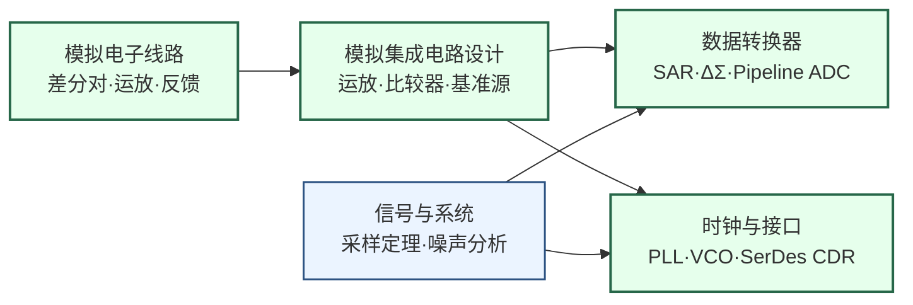

---
hide:
  - navigation
---
# 模拟与混合信号集成电路

## 一句话定义

设计让模拟世界与数字世界高速转换的"接口芯片"——ADC、DAC、PLL、SerDes 是每块现代 SoC 都不可或缺的混合信号基础模块。

## 这个方向在研究什么

现代 SoC 是两个世界并存的芯片：数字内核用 0/1 计算，而芯片与外界的交互——声音、图像、射频信号、高速串行总线——都是模拟量。连接这两个世界的，是混合信号集成电路。一块旗舰手机内部的 PMIC（电源管理芯片）、音频 Codec、图像传感器读出电路、USB/PCIe SerDes PHY，每一个都是独立的混合信号子系统，也是芯片设计中技术难度最高、对设计师物理直觉要求最强的一类电路。

**模数转换器（ADC）**是混合信号设计的皇冠明珠。ADC 把随时间连续变化的模拟电压，以固定速率采样并量化为数字码字。衡量 ADC 的两大指标——采样速率（Samples/s）和分辨率（ENOB，有效位数）——存在根本性的权衡：想要更高速率，就要缩短每次比较时间；想要更高精度，就要让电路对热噪声和器件失配更不敏感，两者都以更多功耗为代价。Walden FoM（能效品质因数）散点图几十年来一直是衡量 ADC 技术进步的标尺，整个领域的努力都指向把这条线向左下方推。

主流 ADC 架构有三类：**流水线 ADC（Pipeline）**适合中高速中高精度应用，曾主导通信基带采样；**逐次逼近 ADC（SAR ADC）**依靠二分搜索逻辑，在低功耗场景极为高效，随着数字工艺缩放优势增大，已成为物联网和生物医疗芯片的主流；**增量求和 ADC（ΔΣ）**通过把量化噪声"推到"高频再用数字滤波器滤掉，可在音频频段实现 100 dB 以上动态范围，是音频 Codec 的首选。近年最活跃的研究方向是**时间交织 ADC（TIADC）**——把多个并行 ADC 的采样相位错开以倍增速率，关键挑战是通道间增益、偏置、时序失配引起的混叠，数字后校准算法是研究热点。

**锁相环（PLL）**是每块数字芯片的心脏。CPU 的工作频率来自 PLL 对参考时钟的倍频；5G 基带里合成不同载波频率的本振信号来自小数分频 PLL；高速 SerDes 里用于从数据流中恢复时钟的 CDR（Clock Data Recovery）本质也是一种 PLL。PLL 的核心矛盾是**相位噪声与功耗**：相位噪声描述时钟信号在频域的"不纯净程度"，直接影响数字电路的时序裕量和射频系统的误码率，而压制相位噪声的代价通常是更大的偏置电流和更复杂的滤波网络。近年 ISSCC 上频繁出现的**数字辅助 PLL（DPLL）**和**注入锁定振荡器（ILO）**代表了提升能效的两种思路：DPLL 把传统模拟环路滤波器替换为数字 TDC + 数字滤波，充分利用工艺缩放红利；ILO 用信号直接注入锁定振荡器，以极低功耗换取特定相噪性能。

**SerDes（Serializer/Deserializer）**是数据中心互联、PCIe/UCIe 等高速接口的核心电路。一个 224 Gbps PAM4 SerDes PHY 在数毫米见方的硅片上完成发送均衡（FFE）、接收端连续时间均衡（CTLE）与判决反馈均衡（DFE）、时钟恢复（CDR），以及信号完整性补偿——要在几十 dB 信道损耗加高频反射的恶劣环境下实现接近无误码传输。SerDes 速率每隔几年翻倍（56→112→224 Gbps），驱动着工艺与电路技术同步创新，是 ISSCC Wireline Session 长期最热门的战场。

**CMOS 图像传感器读出电路（CIS Readout）**处于光学与模拟电路的交叉点：每个像素的光生电荷被源跟随器读出后，经列级 ADC（通常是单斜率或 SAR）量化，关键挑战是像素重置噪声（kTC noise）的相关双采样（CDS）消除、列级 ADC 匹配和速度，以及功耗与帧率的权衡。智能手机旗舰里的图像传感器（索尼 IMX、三星 ISOCELL）正是这个研究领域的工业前沿。

## 核心研究问题

- **ADC 能效墙**：采样速率和有效精度的提升带来指数级功耗代价，如何突破 Walden FoM 的能效边界？
- **PLL 相位噪声**：时序裕量和射频系统 SNR 都受制于时钟质量，如何在更低功耗下实现更低相噪 PLL？
- **超高速 SerDes**：224 Gbps→448 Gbps 趋势下，信号完整性、均衡算法和 CDR 收敛速度面临哪些新挑战？
- **图像传感器噪声**：更小像素、更高帧率下如何持续压低读出噪声，支撑夜景摄影和科学成像？
- **数字辅助模拟**：ML 辅助的电路校准（失配补偿、非线性校正）能否大幅缩短模拟电路的设计迭代周期？

## 代表性机构与企业

| | 国际 | 国内 |
|--|------|------|
| **企业** | Texas Instruments、Analog Devices、Broadcom（SerDes）、Marvell | 韦尔半导体（图像传感器）、澜起科技、思瑞浦、上海贝岭 |
| **高校** | Stanford（Murmann）、UCSD（Galton）、UIUC（Hanumolu）、Michigan（Flynn） | 复旦、东南大学、清华、浙大 |
| **顶会** | ISSCC、VLSI Symposium、ESSCIRC、CICC、A-SSCC | — |

## 知识路径

**本站相关课程：**

- [模拟电子线路（复旦）](../课程资源/电路/模拟/模拟电子线路/MICR130002.md) · [Razavi Electronics 1&2（UCLA）](../课程资源/电路/模拟/模拟电子线路/razavi_electronics.md)
- [模拟集成电路设计原理（复旦）](../课程资源/电路/模拟/模拟集成电路/MICR130030.md) · [Razavi CMOS IC Design（UCLA）](../课程资源/电路/模拟/模拟集成电路/razavi.md)
- [数模模数转换器（复旦）](../课程资源/电路/信号处理/数模模数转换器/INFO130270.md) · [ADC/DAC 学习资源汇总](../课程资源/电路/信号处理/数模模数转换器/stanford_adc.md)
- [信号与系统（复旦）](../课程资源/电路/信号处理/信号与系统/MICR130004.md)

## 入门三步走

**第一步：打牢模拟 IC 基础**  
学习 Razavi《Design of Analog CMOS Integrated Circuits》前 11 章（差分对到运放稳定性分析），这是所有数据转换器和 PLL 设计的共同语言。本站的 Razavi CMOS IC Design 课程页有配套视频资源。

**第二步：专攻数据转换器**  
浏览 Murmann ADC Survey（搜索"Murmann ADC Survey"可找到最新版本），在散点图上直观感受当前技术的"能效墙"在哪里；再跟随斯坦福 EE315B Data Converters 课程讲义（公开于 Stanford EE 网站），系统学习 SAR/Pipeline/ΔΣ 的理论推导和实用设计方法。

**第三步：了解 PLL 与 SerDes 前沿**  
阅读 Razavi《Design of CMOS Phase-Locked Loops》第 1-3 章建立 PLL 直觉；然后浏览 ISSCC 2024/2025 的 Wireline/Clock Session demo papers——224 Gbps SerDes、低相噪 DPLL 和 CDR 收敛算法是你会反复看到的主题。

## 相关课题组

### 境内

-   **叶凡** 复旦

    高能效 SAR ADC · 低功耗数据转换器 · ISSCC/VLSI 发表

-   **倪熔华** 复旦

    高速 PLL/频率综合器 · SerDes CDR · 片上时钟生成

-   **[许灏](https://sme.fudan.edu.cn/6b/47/c31134a420679/page.htm)** 复旦

    模拟 IC 设计 · ADC · 混合信号/射频集成电路

-   **[洪志良](https://sme.fudan.edu.cn/60/a2/c31133a352418/page.htm)** 复旦

    混合信号 IC · 高速接口 · 模拟集成电路分析与设计

-   **[孙楠（Nan Sun）](https://www.nansunlab.com/)** 清华

    新型 ADC 架构 · 低功耗数据转换器 · 磁传感器读出电路

-   **[王志华](https://www.sic.tsinghua.edu.cn/info/1014/1791.htm)** 清华

    高速高精度 ADC · 混合信号 IC · RFID 国家标准

-   **[李宇根（Woogeun Rhee）](https://www.sic.tsinghua.edu.cn/info/1014/1809.htm)** 清华

    低相噪 PLL · 小数分频锁相环 · 混合信号时钟电路

-   **[姜汉钧](https://www.sic.tsinghua.edu.cn/info/1014/1814.htm)** 清华

    高精度 ADC · IoT 混合信号 IC · 模拟集成电路设计

-   **[叶乐](https://ic.pku.edu.cn/szdw/zzjs/Y1/yl/index.htm)** 北大

    混合信号 IC · AI 芯片 · 存算一体 AIoT 芯片

-   **[时龙兴](http://asic.seu.edu.cn/)** 东南大学

    混合信号 IC · SAR ADC 架构 · 高速接口电路

<button class="prof-show-all">显示全部 ↓</button>

### 境外

-   **[Rui P. Martins](https://ime.um.edu.mo/people/rmartins/)** 澳门大学

    模拟与混合信号 VLSI · 射频 IC · 国家重点实验室 PI

-   **余成斌** 澳门大学

    模拟滤波器 · AD/DA · 无线模拟前端 IP

-   **[麦沛然（Pui-In Mak）](https://ime.um.edu.mo/people/pimak/)** 澳门大学

    射频与模拟电路 · 微流控芯片 · 无线传感 IC

-   **[Howard Cam Luong](https://ece.hkust.edu.hk/eeluong)** 港科大

    高速低功耗数据转换器 · 混合信号 IC · 射频接口电路

-   **[Wing-Hung Ki（纪荣杰）](https://ece.hkust.edu.hk/eeki)** 港科大

    开关电源/PMIC · 开关电容功率转换器 · 电源管理 IC

-   **[卢煜（Yan Lu）](https://www.ee.cuhk.edu.hk/~yanlu/)** 港中大

    开关电容 DC-DC 转换器 · 混合信号电源管理 IC · ISSCC 最佳论文

-   **[Boris Murmann](https://murmann-group.org/)** U Hawaii

    SAR ADC · ADC 性能数据库 · 数据转换器教材

-   **[Ian Galton](https://web.eng.ucsd.edu/~galton/)** UCSD

    ΔΣ 调制器 · 增量式 ADC · 数字辅助模拟校准

-   **[Pavan Kumar Hanumolu](https://hanumolu.ece.illinois.edu/)** UIUC

    PLL/CDR · 超低功耗 SerDes · 数字辅助模拟电路

-   **[Michael Flynn](https://web.eecs.umich.edu/~mpflynn/)** 密歇根大学

    SAR ADC 架构创新 · 时间交织 ADC 校准 · 低功耗数据转换器

-   **[Elad Alon](https://www2.eecs.berkeley.edu/Faculty/Homepages/alon.html)** UC Berkeley

    高速 SerDes · 低功耗 I/O 互联 · 混合信号接口电路

-   **[Behzad Razavi](https://www.ee.ucla.edu/behzad-razavi/)** UCLA

    数据转换器 · PLL · 模拟/射频/混合信号 IC 教材权威

-   **[Shanthi Pavan](https://www.ee.iitm.ac.in/people/shanthi-pavan/)** IIT Madras

    ΔΣ ADC · 连续时间调制器 · 高速模拟电路

-   **[Borivoje Nikolić](https://bwrc.eecs.berkeley.edu/people/borivoje-nikolic)** UC Berkeley

    高速数模混合电路 · 低功耗数字/模拟 VLSI · 敏捷芯片设计

-   **[Naveen Verma](https://ee.princeton.edu/people/naveen-verma)** Princeton

    机器学习硬件 · 数模混合 IC · 边缘 AI 芯片系统集成

<button class="prof-show-all">显示全部 ↓</button>

