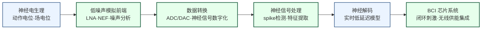

---
hide:
  - navigation
---
设计能与神经系统直接交互的芯片——记录大脑电信号、刺激神经元，最终实现人机之间的直接信息通路。

## 这个方向在研究什么

霍金留给世界的最后印象，是靠脸颊上一块肌肉的轻微抽动说话。眼镜上一个红外传感器盯着这块肌肉，屏幕上的光标逐个扫过字母，他用一次抽动选中想要的那个，一分钟拼出一两个词。可霍金其实是"幸运"的渐冻症（ALS）患者。这种病吞掉了他几乎所有的运动能力，偏偏给他留下了这块还能动的肌肉。一旦病情走到连脸颊都动不了的完全闭锁，这条窄路也会断掉。人还清醒，大脑照常发放电脉冲，却再也找不到一块肌肉把意图送出去。

唯一的出口是绕过所有肌肉，直接从大脑里把话读出来。2023 年，斯坦福团队把电极阵列植入渐冻症患者 Pat Bennett 的大脑皮层，一块芯片实时解码她"尝试发音"时神经元的放电，在屏幕上打出 "I am thirsty"、"bring my glasses here"，速度逼近正常人说话的节奏，远远超过了霍金一辈子没能够到的上限。把芯片直接接到神经系统上，让大脑和外部世界重新连通，这就是**生物电子与脑机接口**在做的事。

<svg viewBox="0 0 860 340" xmlns="http://www.w3.org/2000/svg" style="width:100%;max-width:860px;display:block;margin:1.5rem auto;font-family:system-ui,sans-serif;">
  <defs>
    <marker id="bci-rd" markerWidth="9" markerHeight="9" refX="6.5" refY="3" orient="auto"><path d="M0,0 L0,6 L8,3 z" fill="#475569"/></marker>
    <marker id="bci-wr" markerWidth="9" markerHeight="9" refX="6.5" refY="3" orient="auto"><path d="M0,0 L0,6 L8,3 z" fill="#DC2626"/></marker>
  </defs>
  <!-- 中心标题 -->
  <text x="400" y="166" text-anchor="middle" font-size="21" font-weight="700" fill="#475569">闭环</text>
  <text x="400" y="188" text-anchor="middle" font-size="11" fill="#64748B">边读 · 边判断 · 边刺激</text>
  <!-- 大脑节点 -->
  <ellipse cx="108" cy="170" rx="66" ry="54" fill="#DCFCE7" stroke="#16A34A" stroke-width="1.8"/>
  <text x="108" y="164" text-anchor="middle" font-size="12" font-weight="600" fill="#15803D">大脑 / 神经元</text>
  <text x="108" y="182" text-anchor="middle" font-size="10" fill="#166534">动作电位 ~几十μV</text>
  <!-- 上行：读 -->
  <rect x="206" y="56" width="92" height="52" rx="6" fill="#FEF3C7" stroke="#D97706" stroke-width="1.6"/>
  <text x="252" y="86" text-anchor="middle" font-size="11" font-weight="600" fill="#B45309">记录电极</text>
  <rect x="340" y="56" width="120" height="52" rx="6" fill="#DBEAFE" stroke="#3B82F6" stroke-width="1.6"/>
  <text x="400" y="80" text-anchor="middle" font-size="11" font-weight="600" fill="#1D4ED8">前端 IC</text>
  <text x="400" y="96" text-anchor="middle" font-size="9" fill="#1E40AF">LNA · ADC</text>
  <rect x="502" y="56" width="104" height="52" rx="6" fill="#EDE9FE" stroke="#7C3AED" stroke-width="1.6"/>
  <text x="554" y="80" text-anchor="middle" font-size="11" font-weight="600" fill="#6D28D9">神经解码</text>
  <text x="554" y="96" text-anchor="middle" font-size="9" fill="#5B21B6">对抗漂移</text>
  <rect x="648" y="56" width="160" height="52" rx="6" fill="#CFFAFE" stroke="#0891B2" stroke-width="1.6"/>
  <text x="728" y="80" text-anchor="middle" font-size="11" font-weight="600" fill="#0E7490">意图输出</text>
  <text x="728" y="96" text-anchor="middle" font-size="9" fill="#155E75">光标 · 语音 · 义肢</text>
  <!-- 下行：写 -->
  <rect x="620" y="232" width="188" height="52" rx="6" fill="#FEE2E2" stroke="#EF4444" stroke-width="1.6"/>
  <text x="714" y="256" text-anchor="middle" font-size="11" font-weight="600" fill="#DC2626">刺激控制器</text>
  <text x="714" y="272" text-anchor="middle" font-size="9" fill="#B91C1C">只在需要时出手</text>
  <rect x="406" y="232" width="104" height="52" rx="6" fill="#FEF3C7" stroke="#D97706" stroke-width="1.6"/>
  <text x="458" y="262" text-anchor="middle" font-size="11" font-weight="600" fill="#B45309">刺激电极</text>
  <!-- 读链箭头 -->
  <line x1="166" y1="146" x2="206" y2="92" stroke="#475569" stroke-width="1.5" marker-end="url(#bci-rd)"/>
  <line x1="298" y1="82" x2="338" y2="82" stroke="#475569" stroke-width="1.5" marker-end="url(#bci-rd)"/>
  <line x1="460" y1="82" x2="500" y2="82" stroke="#475569" stroke-width="1.5" marker-end="url(#bci-rd)"/>
  <line x1="606" y1="82" x2="646" y2="82" stroke="#475569" stroke-width="1.5" marker-end="url(#bci-rd)"/>
  <!-- 写链箭头（顺时针回环） -->
  <line x1="728" y1="110" x2="714" y2="230" stroke="#DC2626" stroke-width="1.5" marker-end="url(#bci-wr)"/>
  <line x1="620" y1="258" x2="512" y2="258" stroke="#DC2626" stroke-width="1.5" marker-end="url(#bci-wr)"/>
  <line x1="406" y1="258" x2="168" y2="200" stroke="#DC2626" stroke-width="1.5" marker-end="url(#bci-wr)"/>
  <!-- 图例 -->
  <text x="150" y="305" font-size="10" fill="#475569">读：神经 → 意图</text>
  <text x="150" y="322" font-size="10" fill="#DC2626">写：刺激 → 神经</text>
</svg>

生物电子的尺度铺得很宽。一端是完全不开刀、贴在皮肤上的可穿戴器件，电子皮肤、心电与汗液监测、有机电化学晶体管做的柔性传感，隔着体表就能读出身体的生理信号。另一端，也是这个方向最硬核的部分，是把芯片直接接进神经系统。这里又装着两件方向相反的事。一件是把大脑接出来，读取神经元的活动、解码成意图，去驱动光标、机械臂或合成语音，让瘫痪和闭锁的人重新和世界连上，这是狭义的**脑机接口**。另一件是把信号写回去，用电脉冲精确刺激神经元、修复受损的神经通路，这是**神经调控**。两件事方向相反，却都得先回答同一个问题。电极到底放在哪。

这件事没有标准答案，而是一道光谱。一端是完全不开颅，把电极贴在头皮上记脑电（EEG）。戴上就能用、几乎零风险，代价是信号隔着颅骨和头皮被衰减、被抹平，空间分辨率粗到厘米级，分不清底下具体哪群神经元在放电。即便如此，巧妙的范式照样能压出可观的带宽。清华团队的 SSVEP 拼写器让人盯着以不同频率闪烁的字符，视觉皮层会产生同频的脑电响应，靠这招在头皮电极上做到每分钟约 12 个词，是非侵入路线的速度天花板。但它的代价是范式被锁死，你只能从屏幕上一组预设的闪烁目标里挑，而不是真把任意念头读出来。光谱的另一端是开颅，把微电极阵列直接插进大脑皮层，贴着神经元记录，能分辨到单个细胞、看到清清楚楚的 spike。霍金没能拥有的自由表达、Bennett 打出的整句话，走的都是这条侵入式的路。越往侵入端走，信号越干净、读出的意图越精细，可手术创伤和长期风险也越大。这道光谱怎么取舍，是这个方向所有工作的起点。

<svg viewBox="0 0 860 320" xmlns="http://www.w3.org/2000/svg" style="width:100%;max-width:860px;display:block;margin:1.5rem auto;font-family:system-ui,sans-serif;">
  <defs>
    <marker id="bci-depth" markerWidth="9" markerHeight="9" refX="4" refY="7" orient="auto"><path d="M0,0 L6,0 L3,8 z" fill="#475569"/></marker>
  </defs>
  <!-- 分层剖面 -->
  <rect x="70" y="64" width="290" height="40" fill="#F6DCC4" stroke="#CDA176" stroke-width="1.2"/>
  <text x="80" y="88" font-size="11" fill="#8A5A2B">头皮</text>
  <rect x="70" y="104" width="290" height="26" fill="#ECECEC" stroke="#C8C8C8" stroke-width="1.2"/>
  <text x="80" y="121" font-size="11" fill="#777777">颅骨</text>
  <rect x="70" y="130" width="290" height="80" fill="#F1D4E1" stroke="#D89BB7" stroke-width="1.2"/>
  <text x="80" y="148" font-size="11" fill="#A04E78">大脑皮层</text>
  <rect x="70" y="210" width="290" height="58" fill="#DBD3EF" stroke="#B2A6DC" stroke-width="1.2"/>
  <text x="80" y="228" font-size="11" fill="#6B5BA8">皮层下</text>
  <!-- EEG 电极 -->
  <ellipse cx="160" cy="84" rx="18" ry="8" fill="#D4AF37" stroke="#9A7B16" stroke-width="1.2"/>
  <text x="160" y="58" text-anchor="middle" font-size="10" font-weight="600" fill="#9A7B16">EEG</text>
  <!-- ECoG 片 -->
  <rect x="150" y="132" width="120" height="9" rx="4" fill="#2563EB"/>
  <text x="210" y="126" text-anchor="middle" font-size="10" font-weight="600" fill="#1D4ED8">ECoG</text>
  <!-- 微电极阵列 -->
  <rect x="288" y="128" width="56" height="6" fill="#1D4ED8"/>
  <line x1="296" y1="134" x2="296" y2="192" stroke="#1D4ED8" stroke-width="2"/>
  <line x1="310" y1="134" x2="310" y2="198" stroke="#1D4ED8" stroke-width="2"/>
  <line x1="324" y1="134" x2="324" y2="192" stroke="#1D4ED8" stroke-width="2"/>
  <line x1="338" y1="134" x2="338" y2="196" stroke="#1D4ED8" stroke-width="2"/>
  <text x="316" y="252" text-anchor="middle" font-size="10" font-weight="600" fill="#1E40AF">微电极阵列</text>
  <!-- 深度轴 -->
  <line x1="384" y1="74" x2="384" y2="256" stroke="#475569" stroke-width="1.6" marker-end="url(#bci-depth)"/>
  <text x="384" y="58" text-anchor="middle" font-size="9" fill="#64748B">无创·糊</text>
  <text x="384" y="282" text-anchor="middle" font-size="9" fill="#64748B">有创·清晰</text>
  <!-- 右侧说明 -->
  <text x="430" y="84" font-size="13" font-weight="600" fill="#B45309">头皮 EEG · 非侵入</text>
  <text x="430" y="103" font-size="11" fill="#555555">戴上就能用、零风险。信号隔着颅骨被</text>
  <text x="430" y="119" font-size="11" fill="#555555">抹平到厘米级。清华 SSVEP 拼写器靠盯</text>
  <text x="430" y="135" font-size="11" fill="#555555">闪烁也能到约 12 词/分，但只能从预设</text>
  <text x="430" y="151" font-size="11" fill="#555555">目标里选。</text>
  <text x="430" y="184" font-size="13" font-weight="600" fill="#1D4ED8">ECoG · 半侵入</text>
  <text x="430" y="203" font-size="11" fill="#555555">开颅但贴在皮层表面，不插进去。</text>
  <text x="430" y="236" font-size="13" font-weight="600" fill="#1E40AF">皮层内微电极 · 侵入</text>
  <text x="430" y="255" font-size="11" fill="#555555">插进皮层、贴着神经元，分辨到单细胞</text>
  <text x="430" y="271" font-size="11" fill="#555555">的 spike，几十 μV。Utah array、</text>
  <text x="430" y="287" font-size="11" fill="#555555">Neuropixels、Neuralink N1 都走这条。</text>
</svg>

真插进了皮层，麻烦才正式开始。单个神经元发放的**动作电位（spike）**，在电极尖端测到的电压只有几十到几百微伏，持续不到一毫秒，还叠在幅度大得多的局部场电位和肌电、电源干扰上面。要从这种信号里干净地抠出单个神经元的活动，电极后面得紧跟一个输入噪声极低的放大器，把信号放大六七十分贝而几乎不添新噪声。这是模拟 IC 里最难的活之一。衡量它的指标叫**噪声效率因子（NEF）**，有一条由物理决定的下限，真实电路既要逼近这条下限，又得把每通道功耗压到微瓦量级。功耗为什么这么要命。因为整块芯片只要多耗几毫瓦，发出的热就足以灼伤周围的脑组织，这是植入物碰都不能碰的红线。

读到干净的 spike，离"读懂"还隔着一座山。芯片采下来的不过是一串电压波形，要把它翻译成"她想说哪个词""他想把光标往哪挪"，中间还差一层解码模型。这层模型是神经科学和 AI 的交叉地带。得先弄清大脑究竟用什么样的放电模式去编码一个动作的方向、一次发音的口型，再训练算法把这套编码反解回来。**Neuralink 的 N1** 把上千个电极扎进运动皮层，2024 年初第一位四肢瘫痪的患者 Noland Arbaugh 靠想象自己的手在动，就能移动光标、下国际象棋，到 2025 年底已经有十几个人装上；Pat Bennett 那边解码的则是尝试发音对应的神经活动。更麻烦的是，这套映射并不稳定。同一个意图，今天和几周后在神经元里的"坐标"会悄悄漂移，一部分是因为电极相对脑组织有微米级位移，记录到的神经元在不断换班。结果是昨天还很准的解码器，今天就开始掉链子，得反复重新校准。怎么让模型自己跟上漂移、不必天天让病人停下来重训，是眼下最活跃的研究问题之一。

还有一个常被忽略却致命的麻烦，电极本身活不久。把一根硬邦邦的硅探针插进柔软的大脑，身体会拿它当异物，周围慢慢长出胶质瘢痕把电极裹起来，几个月到几年后信号一点点变弱，直到什么都记不到。所以材料这一支专门在跟"长期"较劲。把电极做得越来越柔软、越来越细，让它在脑组织里几乎"隐形"以减轻排异；用纳米薄膜做出能贴合脑回沟壑的柔性阵列；或者像 Neuropixels 那样在一根探针上集成上千个记录点，用密度换取更多有效通道。复旦宋恩名团队的柔性植入电极正是这条路。一块芯片再强，扛不过身体的排异也是空谈。

到这儿讲的都是把大脑读出来。反过来，信息也能写回神经，这是这个方向的另一半。**深部脑刺激（DBS）**把电极送进大脑深处的丘脑底核，持续发放微弱电脉冲，能显著压住帕金森患者的震颤，全球已有几十万人在用，是规模最大的植入式神经电子应用。写和读对称又不同。刺激的幅度、频率、脉宽都得卡得很准，太弱没疗效，太强会带来副作用甚至烧坏神经组织。刺激器前端要解决的，就是怎么在精确给量的同时，万一出故障也绝不越过那条安全线。

读和写各自都已经能用，可这个方向真正的前沿，是把两者合到一颗芯片上做成**闭环**。传统 DBS 不管病情如何一直放电，闭环则是边记录神经活动、边判断异常放电什么时候冒头，只在需要的瞬间才出手，既提疗效又省电池。这件事正从实验室走进病人体内。2025 年初，Medtronic 一款能边读边调的自适应 DBS 拿到 FDA 批准，成了全球第一个商用的闭环神经刺激系统。要说这条路最终能走到多成熟，**人工耳蜗**是最好的答案。它把声音拆成按频率分组的电刺激，绕过坏掉的毛细胞直接点亮听觉神经，已经帮全球几十万重度失聪的人重新听见声音，是整个领域最成熟的临床成功。视觉那头，**视网膜假体**在做同样的事，把摄像头的画面转成电刺激送进残存的视网膜，替失明者重建一点光感，只是还远没有耳蜗那么成熟。有意思的是，这些感觉假体到今天大多还是开环的，只管把信号写进去，并不回读神经的反馈。从开环的耳蜗和视网膜假体，到刚落地的闭环 DBS，正是这个方向接下来要走的路。

### 核心研究问题

- **噪声 / 功耗 / 热量的三难权衡**：spike 只有几十到几百微伏，前放要放大 60-80 dB 而几乎不引入额外噪声；衡量这件事的噪声效率因子（NEF）有物理噪声下限，而每通道功耗又必须钉在微瓦量级——整芯片一旦超过几毫瓦，发热就会灼伤周围组织。什么样的放大器拓扑能在三者同时被压死时仍逼近物理极限？
- **从淹没的背景里分离单个 spike**：不到一毫秒的动作电位，叠加在幅度更大（毫伏级）的局部场电位以及肌电、电源干扰之上，信噪比天然很差。前端的带宽、增益、共模抑制该怎么设计，才能稳稳抠出单神经元活动而不被大信号饱和？
- **千通道集成与神经数据洪流**：Neuralink N1 把 1024 个电极通道、每路独立的放大器加 ADC 塞进一块芯片，每通道每秒数万采样点、数百通道齐发，带宽极高。在面积和功耗都被压死的前提下，如何在片上压缩、再无线（如蓝牙）送出这么大的数据流？
- **隔皮无电池供能**：植入物不能换电池、要在生理盐水里工作数年，只能靠近场耦合线圈持续供电；而能量转换效率和线圈发热是直接对立的两端。怎样在数年寿命内既供得上电、又不让局部升温伤及组织、封装又能过生物相容性验证？
- **闭环刺激的实时判读**：先进的神经调控不再持续放电，而是边记录边检测病理性放电模式、只在需要时才激活刺激，以同时提疗效、省电池。难点是芯片要在毫秒级实时判断"此刻该不该刺激"——这套片上信号处理到底要做到多智能？
- **刺激强度的安全窗口**：DBS 注入丘脑底核的电流幅度、频率、脉宽必须精确卡在一个窗口里——太弱没有疗效，太强会产生副作用甚至损伤神经组织。如何设计既能精准给量、又在故障时绝不越界的刺激器前端？

### 知识路径

图中节点对应以下知识板块（按需选修）：

- 神经电生理 / 信号源直觉 → [物理](../学习地图/物理/index.md)（理解动作电位、场电位与电极界面的物理本质）
- 低噪声模拟前端、数据转换、刺激器前端 → [电路（模拟）](../学习地图/电路/模拟/index.md)（LNA、NEF、ADC、混合信号 IC 的硬核内容）
- spike 检测与特征提取 → [电路（信号处理）](../学习地图/电路/信号处理/index.md)（生物信号的滤波、频谱与片上实时处理）
- 实时神经解码 → [人工智能](../学习地图/人工智能/index.md)（把神经活动映射成意图/指令的解码模型）

## 这个方向适合谁

如果你享受被规格逼到墙角的那种设计，这个方向几乎是为你准备的。这里的每一颗 spike 都只有几十到几百微伏，你的前放要在放大 60-80 dB 的同时把输入参考噪声压到极低，还要把每通道功耗钉在微瓦量级——因为整芯片多几毫瓦的热量就会灼伤组织。你日常面对的是 NEF 这样的物理极限、是噪声 / 功耗 / 面积同时收紧的三难取舍：低噪声放大器、ADC、近场无线供能、片上 spike 检测、安全可控的刺激器前端，这些模拟与混合信号 IC 的硬核内容在 BCI 场景里没有一个规格是松的，每一个晶体管尺寸的取舍背后都有真实的物理意义。如果你喜欢的是在宽松裕量里堆功能、把性能问题留给下一代工艺去解决，那这个方向会让你很难受。

本科背景上，它最适合 EE / 微电子出身、底层电路功底扎实的人——模拟电子线路、噪声分析、数据转换是你的看家本领。但只懂电路远远不够。你得对信号源本身有好奇心：动作电位长什么样、局部场电位为什么既是干扰也是信息、丘脑底核里那串病理放电凭什么能用一个阈值检出来。越往上走，越要碰神经信号处理和实时解码这类偏算法、偏 AI 的活，因为芯片采下来的数据最终要变成意图和指令。所以这个方向天然跨学科：最好的研究者一边在画 SPICE、调版图，一边能读懂神经科学和临床文献，知道自己这块芯片要去缓解谁的帕金森震颤、替谁重建听觉。它要求你有把设计直觉从晶体管一路连到神经元和病人的能力，也要求你愿意主动跨出电路的舒适区。

发表的阵地决定了你得同时讨好两拨人。纯电路的硬核成果走 ISSCC、ESSCIRC、VLSI 这类固态电路顶会和 JSSC；生物医疗交叉的工作则落在 BioCAS、EMBC 以及 TBioCAS、TBME、TNSRE 这些生物医学电路与工程的期刊；做到系统和临床转化层面，还能冲 Nature Biomedical Engineering 这样的顶刊。这意味着你既要懂怎么把一颗 NEF 逼到极限的放大器写成 ISSCC 的故事，也要懂怎么把它讲成一个能改善病人生活的系统——两种话语都得会说。

最后，这个方向要求你和不确定性、和慢节奏长期共处。大脑本身是会变的，今天训练好的解码模型明天可能就漂移失效；动物实验到人体之间隔着一条很宽的鸿沟，实验周期长、变量多，一次植入的反馈要等上几个月。如果你更喜欢规则确定、迭代飞快、一个下午就能跑完一轮验证的工作，那这个方向慢长黏稠的节奏可能不适合你。复旦有刘骁老师（植入式神经信号采集、人工耳蜗）和宋恩名老师（柔性植入式 BCI）两条最直接的切入路径。

## 学术界

### 课题组

**境内**

-   **[马恺声](http://group.iiis.tsinghua.edu.cn/~maks/)** 清华

    生物启发计算架构 · 神经形态芯片系统 · 跨学科 Bio-IC 研究

-   **[高上凯](https://bme.tsinghua.edu.cn/)** 清华 

    非侵入式脑机接口 · P300/SSVEP · BCI 临床转化

-   **[高小榕](https://brain.tsinghua.edu.cn/info/1010/1006.htm)** 清华

    脑电信号处理 · 运动想象 BCI · 多模态脑成像

-   **[洪波](https://brain.tsinghua.edu.cn/info/1010/1008.htm)** 清华

    侵入式脑机接口 · 电生理信号解码 · NEO 系统

-   **[谢翔](https://www.ime.tsinghua.edu.cn/info/1039/1582.htm)** 清华

    神经形态电路 · 低功耗 BCI 芯片 · 可植入 ASIC

-   **[段小洁](https://future.pku.edu.cn/en/js/Faculty/DeptBME/040a2fe7553b4cc0a00b38c1f1f42d9c.htm)** 北大 

    纳米生物电子 · 碳基柔性电极 · 高密度神经探针

-   **[李志宏](https://ic.pku.edu.cn/szdw/zzjs/L1/lzh/index.htm)** 北大

    BioMEMS · 植入式神经探针 · 硅基神经记录芯片

-   **[刘骁](http://www.it.fudan.edu.cn/Data/View/3677)** 复旦

    植入式神经信号采集 · 神经调控 IC · 人工耳蜗/脑起搏器

-   **[宋恩名](https://brain-interface.fudan.edu.cn/main.htm)** 复旦

    柔性植入式 BCI · 纳米薄膜电极 · Cell/Nature 发表

-   **[王国兴](https://bicasl.sjtu.edu.cn/info/1017/1080.htm)** 交大

    智能脑机接口芯片与系统 · 高能效神经记录 IC · 视网膜假体/植入式生物电子

-   **[陈铭易](https://icisee.sjtu.edu.cn/jiaoshiml/chenmingyi.html)** 交大

    脑机接口高动态范围模拟前端 · 直接转换 ADC · 植入式生物医疗芯片

-   **[刘彦](https://bicasl.sjtu.edu.cn/info/1017/1078.htm)** 交大

    植入式双向脑机接口 ASIC · 多通道神经记录 SoC · 神经 spike 分选

-   **[陈弘达](https://semi.cas.cn/rcdw/yjsds/202309/t20230919_6890119.html)** 中科院

    光电微电子集成电路 · BCI 干电极 EEG 芯片 · 神经记录 IC

-   **[郝耀耀](https://person.zju.edu.cn/yaoyaoh)** 浙大

    植入式脑机接口微型芯片 · 超低功耗采集/通信 IC · 脑机接口电极与微系统

-   **[王跃明](https://person.zju.edu.cn/ymwang)** 浙大

    侵入式脑机接口 · 多通道神经记录芯片与全植入微系统 · 闭环电刺激

-   **[潘纲](https://person.zju.edu.cn/gpan)** 浙大

    类脑计算芯片（达尔文系列） · 脉冲神经网络 · 脑机融合智能

-   **[Mohamad Sawan](https://cenbrain.westlake.edu.cn/)** 西湖大学

    植入式神经接口 ASIC · 闭环神经调控 · 无线供能与生物传感芯片

<button class="prof-show-all">显示全部 ↓</button>

**境外**

-   **[Shiming Zhang（张世明）](https://ece.hku.hk/people/smzhang/)** 港大

    有机电化学晶体管 · 柔性可穿戴生物电子 · In-sensor AI 计算

-   **[Ni Zhao（赵铌）](https://www.ee.cuhk.edu.hk/~nzhao/)** 港中大 

    柔性/可拉伸生物电子 · 钙钛矿光电器件 · 表皮式健康监测

-   **[Edward Boyden](https://synthneuro.org/)** MIT

    光遗传学 · 扩展显微镜 · 神经环路解析工具

-   **[Michel Maharbiz](https://maharbizgroup.wordpress.com/)** UC Berkeley

    神经尘埃 · 超声神经接口 · 极微型植入式无线器件

-   **[Rikky Muller](https://www.rikkymuller.com/)** UC Berkeley 

    低功耗神经记录/刺激 IC · 植入式无线神经技术

-   **[Rahul Sarpeshkar](https://engineering.dartmouth.edu/community/faculty/rahul-sarpeshkar)** Dartmouth

    超低功耗模拟电路 · 神经假体 · 仿生计算

-   **[Mahsa Shoaran](https://people.epfl.ch/mahsa.shoaran)** EPFL 

    闭环神经刺激 SoC · 多通道神经记录 ASIC · 片上机器学习癫痫/帕金森检测

-   **[Timothy Denison](https://www.oxfordmartin.ox.ac.uk/people/timothy-denison)** Oxford

    自适应深脑刺激 · 闭环植入式神经调控 · 生理闭环混合信号电路

<button class="prof-show-all">显示全部 ↓</button>

### 学术会议与期刊

  
会议
    ISSCC
    ESSCIRC
    VLSI Symposium
    IEEE EMBC
    IEEE BioCAS
  

  
期刊
    IEEE JSSC
    IEEE TBioCAS
    IEEE TBME
    IEEE TNSRE
    Nature Biomedical Engineering
  

## 毕业去向

### 企业

  
国内
    <a class="dm-chip" href="http://www.neuracle.cn/">博睿康 Neuracle</a>
    <a class="dm-chip" href="https://www.neuroxess.com/">脑虎科技 NeuroXess</a>
    <a class="dm-chip" href="https://we-linking.com/">微灵医疗 WE-LINKING</a>
    <a class="dm-chip" href="https://www.brainco.tech/">强脑科技 BrainCo</a>
    <a class="dm-chip" href="https://www.nurotron.com/">诺尔康 Nurotron</a>
  

  
国外
    <a class="dm-chip" href="https://neuralink.com/">Neuralink</a>
    <a class="dm-chip" href="https://synchron.com/">Synchron</a>
    <a class="dm-chip" href="https://blackrockneurotech.com/">Blackrock Neurotech</a>
    <a href="https://www.medtronic.com/">Medtronic</a>
    <a href="https://www.abbott.com/">Abbott</a>
    <a href="https://www.cochlear.com/">Cochlear</a>
    <a class="dm-chip" href="https://www.medel.com/">MED-EL</a>
    <a class="dm-chip" href="https://www.emotiv.com/">Emotiv</a>
  

### 科研院所

  
国内
    <a class="dm-chip" href="https://www.sim.cas.cn/" title="柔性神经电极与神经接口微系统">中科院上海微系统与信息技术研究所</a>
    <a class="dm-chip" href="http://fit.zju.edu.cn/" title="侵入式脑机接口、脑机融合与神经记录芯片">浙江大学脑机智能全国重点实验室</a>
    <a class="dm-chip" href="https://www.shibs.cn/" title="神经接口新技术与脑疾病诊疗">深港脑科学创新研究院</a>
    <a class="dm-chip" href="https://cenbrain.westlake.edu.cn/" title="植入式神经接口 ASIC 与闭环神经调控">西湖大学神经接口与脑机交互实验室</a>
  

  
国外
    <a class="dm-chip" href="https://www.braingate.org/" title="多机构侵入式 BCI 临床试验（Brown/Stanford/MGH 等）">BrainGate 联盟</a>
    <a class="dm-chip" href="https://www.imec-int.com/en/expertise/health-technologies/neural-probes" title="Neuropixels 高密度神经探针的设计与流片">imec 神经探针</a>
    <a class="dm-chip" href="https://neuro-x.epfl.ch/en/" title="神经假体、闭环神经调控与神经技术转化">EPFL Neuro·X</a>
    <a class="dm-chip" href="https://mcgovern.mit.edu/" title="神经环路工具与脑机接口神经科学">MIT McGovern Institute</a>
  

