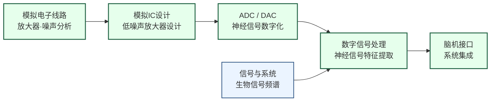

---
hide:
  - navigation
---
设计能与神经系统直接交互的芯片——记录大脑电信号、刺激神经元，最终实现人机之间的直接信息通路。

## 这个方向在研究什么

大脑和外部世界之间的信息通路，无论是感受刺激（听、看、触）还是发出控制（移动、说话），都经由神经元的电脉冲序列传递。如果能在芯片和神经元之间建立可靠的双向接口——既能读取神经元的活动，又能精确刺激神经元——就可以修复受损的神经通路，甚至建立全新的人机信息通道。这正是生物电子与脑机接口研究的核心：设计能与神经系统直接交互的芯片系统。

<svg viewBox="0 0 860 220" xmlns="http://www.w3.org/2000/svg" style="width:100%;max-width:860px;display:block;margin:1.5rem auto;font-family:system-ui,sans-serif;">
  <defs>
    <marker id="bci-arrow" markerWidth="8" markerHeight="8" refX="6" refY="3" orient="auto">
      <path d="M0,0 L0,6 L8,3 z" fill="#64748B"/>
    </marker>
  </defs>
  <!-- Box 1: 神经元 -->
  <ellipse cx="80" cy="110" rx="60" ry="45" fill="#DCFCE7" stroke="#16A34A" stroke-width="1.8"/>
  <text x="80" y="104" text-anchor="middle" font-size="13" font-weight="600" fill="#15803D">神经元</text>
  <text x="80" y="120" text-anchor="middle" font-size="10" fill="#166534">动作电位</text>
  <text x="80" y="134" text-anchor="middle" font-size="10" fill="#166534">~1ms 脉冲</text>
  <text x="80" y="170" text-anchor="middle" font-size="9" fill="#64748B">信号源</text>
  <!-- Arrow 1→2 -->
  <line x1="142" y1="110" x2="168" y2="110" stroke="#64748B" stroke-width="1.5" marker-end="url(#bci-arrow)"/>
  <!-- Box 2: 植入电极 -->
  <rect x="170" y="72" width="110" height="76" rx="6" fill="#FEF3C7" stroke="#D97706" stroke-width="1.8"/>
  <text x="225" y="96" text-anchor="middle" font-size="12" font-weight="600" fill="#B45309">植入电极</text>
  <!-- Probe shape -->
  <rect x="215" y="104" width="20" height="30" rx="2" fill="#D97706" opacity="0.5"/>
  <polygon points="215,134 225,145 235,134" fill="#D97706" opacity="0.5"/>
  <text x="225" y="164" text-anchor="middle" font-size="9" fill="#92400E">几十微伏信号</text>
  <!-- Arrow 2→3 -->
  <line x1="282" y1="110" x2="308" y2="110" stroke="#64748B" stroke-width="1.5" marker-end="url(#bci-arrow)"/>
  <!-- Box 3: 神经记录IC -->
  <rect x="310" y="65" width="145" height="90" rx="6" fill="#DBEAFE" stroke="#3B82F6" stroke-width="1.8"/>
  <text x="382" y="88" text-anchor="middle" font-size="12" font-weight="600" fill="#1D4ED8">神经记录 IC</text>
  <rect x="325" y="97" width="50" height="28" rx="3" fill="#BFDBFE" stroke="#3B82F6" stroke-width="1"/>
  <text x="350" y="115" text-anchor="middle" font-size="9" fill="#1E40AF">前放 LNA</text>
  <rect x="390" y="97" width="50" height="28" rx="3" fill="#BFDBFE" stroke="#3B82F6" stroke-width="1"/>
  <text x="415" y="115" text-anchor="middle" font-size="9" fill="#1E40AF">ADC</text>
  <text x="382" y="167" text-anchor="middle" font-size="9" fill="#1E40AF">输入噪声极低 | 功耗&lt;毫瓦</text>
  <!-- Arrow 3→4 -->
  <line x1="457" y1="110" x2="483" y2="110" stroke="#64748B" stroke-width="1.5" marker-end="url(#bci-arrow)"/>
  <!-- Box 4: 信号解码 -->
  <rect x="485" y="65" width="145" height="90" rx="6" fill="#EDE9FE" stroke="#7C3AED" stroke-width="1.8"/>
  <text x="557" y="88" text-anchor="middle" font-size="12" font-weight="600" fill="#6D28D9">信号解码</text>
  <!-- Waveform -->
  <polyline points="500,110 510,98 518,118 526,102 534,114 542,105 550,110" fill="none" stroke="#7C3AED" stroke-width="1.5"/>
  <!-- Arrow to text -->
  <line x1="555" y1="110" x2="568" y2="110" stroke="#7C3AED" stroke-width="1.2" marker-end="url(#bci-arrow)"/>
  <text x="598" y="108" text-anchor="middle" font-size="10" fill="#6D28D9">抓取</text>
  <text x="598" y="120" text-anchor="middle" font-size="10" fill="#6D28D9">指令</text>
  <text x="557" y="167" text-anchor="middle" font-size="9" fill="#5B21B6">实时解码 | 低延迟</text>
  <!-- Arrow 4→5 -->
  <line x1="632" y1="110" x2="658" y2="110" stroke="#64748B" stroke-width="1.5" marker-end="url(#bci-arrow)"/>
  <!-- Box 5: 反馈/输出 -->
  <rect x="660" y="65" width="180" height="90" rx="6" fill="#FEE2E2" stroke="#EF4444" stroke-width="1.8"/>
  <text x="750" y="88" text-anchor="middle" font-size="12" font-weight="600" fill="#DC2626">反馈 / 输出</text>
  <!-- Arm icon (simplified) -->
  <rect x="700" y="96" width="14" height="35" rx="3" fill="#EF4444" opacity="0.6"/>
  <rect x="714" y="108" width="30" height="10" rx="3" fill="#EF4444" opacity="0.6"/>
  <rect x="744" y="103" width="8" height="20" rx="2" fill="#EF4444" opacity="0.5"/>
  <text x="750" y="145" text-anchor="middle" font-size="10" fill="#B91C1C">义肢 / 刺激器</text>
  <text x="750" y="167" text-anchor="middle" font-size="9" fill="#B91C1C">闭环刺激</text>
</svg>

问题是，神经信号非常微弱、非常难以采集。单个神经元发放的动作电位（spike），在电极尖端测量到的电压幅度只有几十到几百微伏，持续时间只有不到一毫秒，而且叠加在幅度更大（毫伏级）的局部场电位和来自肌肉、电源的各种干扰之上。要从这样的信号里可靠地提取单个神经元的活动，需要在电极后面紧接一个输入参考噪声极低的放大器，把信号放大 60-80 dB 同时不引入额外噪声，才能进行后续处理。这类放大器的设计是模拟 IC 里最严苛的挑战之一：噪声效率因子（NEF）是衡量其性能的核心指标，理论极限由物理噪声下限决定，而实际电路要在尽可能接近极限的同时，把每通道的功耗控制在微瓦量级——因为如果整块芯片的功耗超过几毫瓦，产生的热量就会损伤周围组织，这是植入式器件无法接受的。

植入式设计面临的工程约束，和地面上的电子系统完全不同。芯片要在生理盐水环境里工作数年不腐蚀不失效，封装材料的生物相容性必须经过严格验证；芯片不能换电池，必须靠无线能量传输（近场耦合线圈）持续供电，而这个过程中能量转换效率和发热需要精心权衡；神经数据的带宽可能很高（每个通道每秒数万个采样点，数百通道同时记录），如何压缩、如何无线传输是独立的工程难题。Neuralink 的 N1 芯片 2024 年首次植入人体，集成了 1024 个电极通道，每个通道有独立的放大器和 ADC，通过蓝牙将神经数据传到手机——这个集成度代表了目前商业化产品的上限，而它仍然只能覆盖大脑皮层的极小一部分。

刺激端的挑战和记录端对称但不同。深脑刺激（DBS）把电极植入大脑的丘脑底核，向其持续发放微弱电脉冲，可以显著缓解帕金森症的震颤——全球已有超过 15 万人在使用 DBS 设备，这是目前规模最大的植入式神经电子临床应用。刺激电流的幅度、频率、脉冲宽度需要精确控制：太弱没有效果，太强会产生副作用甚至损伤神经组织。更先进的方向是闭环刺激：芯片同时记录神经活动，检测病理性的放电模式，只在需要时才激活刺激，既提高疗效又延长电池寿命。这对芯片的实时信号处理能力提出了更高要求，也是当前研究最活跃的子方向。人工耳蜗是另一个同类应用：把声音信号转成频率分组的电刺激序列，驱动耳蜗内的电极阵列，绕过损坏的毛细胞直接激活听觉神经。它已经帮助了全球数十万名重度失聪患者恢复听力，是生物电子领域最成熟的临床成功案例。

## 适合什么样的人

这个方向对模拟电路基础扎实的学生是最自然的选择：低噪声放大器、ADC、无线能量传输——这些都是模拟/混合信号 IC 设计的核心内容，在 BCI 场景里有极为严苛的规格要求（噪声、功耗、面积同时受限），让每个设计决策都有真实的物理意义。

**需要同时对生物和医学有好奇心**：这个方向的终极目标是帮助瘫痪患者重获行动能力、帮助帕金森患者减轻震颤。如果你只关心电路而对应用场景无感，很难在这个方向坚持下去。最好的研究者往往既能读神经科学文献，也能画 SPICE 仿真图。

**临床转化维度**让这个方向区别于纯电路研究：Neuralink、Synchron 等公司正在推进人体临床试验，研究成果有可能在 5-10 年内进入医疗器械审批流程。这意味着安全性和可靠性的要求远超学术原型，但也意味着成果的社会影响远超发一篇论文。

**不擅长不确定性的人需要谨慎**：神经信号解码的挑战在于大脑本身是变化的，昨天训练的解码模型明天可能失效，动物实验和人体实验之间存在巨大鸿沟。这个方向的实验周期长、变量多，需要跨学科协作（电子工程师+神经科学家+临床医生）。

复旦有刘骁老师（植入式神经信号采集、人工耳蜗）和宋恩名老师（柔性植入式 BCI），是院内最直接的切入点。

## 核心研究问题

- **超低噪声放大器**：神经元动作电位只有几十微伏，前端放大器的噪声必须极低，如何同时保证低噪声和低功耗？
- **高通道数集成**：Neuralink 的 N1 芯片集成 1024 个电极通道，每通道都需要独立的模拟前端，面积和功耗如何控制？
- **无线功率传输**：植入式设备无法换电池，近场无线充电（NFC/无线电能传输）如何保证效率和安全性？
- **长期生物相容性**：芯片植入后免疫反应导致电极逐渐失效，如何设计材料和封装？

## 代表性机构

| | 国际 | 国内 |
|--|------|------|
| **企业** | Neuralink、Synchron、Medtronic、Abbott | 博睿康、微灵医疗 |
| **顶会** | ISSCC、ESSCIRC、NeurIPS（BCI算法）、IEEE TNSRE | — |

## 知识路径

**本站相关课程：**

- [电路（模拟）](../课程资源/电路/模拟/index.md)
- [系统架构（信号处理）](../课程资源/系统架构/index.md)

## 入门三步走

**典型研究长什么样**

ISSCC 的 BCI 芯片论文通常以通道数、噪声效率因子（NEF）、功耗和面积四个指标定义贡献，与历史最优对比。论文核心是模拟前端电路的拓扑创新（如新型斩波放大器结构、自适应功耗控制），配合硅片照片和测量结果（功耗曲线、噪声谱、通道间串扰）。实验部分通常包含在体动物实验（大鼠或非人灵长类），展示芯片实际记录到的神经信号和分选结果。一篇 ISSCC BCI 论文背后通常是 1-2 年的流片和动物实验周期。

**第一步：了解神经信号的物理本质**  
阅读 Kandel et al.《Principles of Neural Science》第 2-3 章（动作电位和突触传递），20 页，建立对"要测量的信号长什么样"的直觉。

**第二步：了解芯片设计挑战**  
阅读 Shenoy et al., *Towards large-scale, human-based, mesoscopic neurotechnologies* (Neuron, 2013)，清晰梳理了脑机接口从生物学到工程学的全链路挑战。

**第三步：读经典电路论文**  
Harrison & Charles, *A low-power low-noise CMOS amplifier for neural recording applications* (JSSC, 2003)，这是神经记录前端放大器设计的奠基论文，被引数千次，电路原理清晰，适合有模拟电路基础后阅读。

## 相关课题组

### 境内

-   **[马恺声](http://group.iiis.tsinghua.edu.cn/~maks/)** 清华

    生物启发计算架构 · 神经形态芯片系统 · 跨学科 Bio-IC 研究

-   **[高上凯](https://bme.tsinghua.edu.cn/)** 清华

    非侵入式脑机接口 · P300/SSVEP · BCI 临床转化

-   **[高小榕](https://brain.tsinghua.edu.cn/info/1010/1006.htm)** 清华

    脑电信号处理 · 运动想象 BCI · 多模态脑成像

-   **[洪波](https://brain.tsinghua.edu.cn/info/1010/1008.htm)** 清华

    侵入式脑机接口 · 电生理信号解码 · NEO 系统

-   **[谢翔](https://www.ime.tsinghua.edu.cn/info/1039/1582.htm)** 清华

    神经形态电路 · 低功耗 BCI 芯片 · 可植入 ASIC

-   **[段小洁](https://future.pku.edu.cn/en/js/Faculty/DeptBME/040a2fe7553b4cc0a00b38c1f1f42d9c.htm)** 北大

    纳米生物电子 · 碳基柔性电极 · 高密度神经探针

-   **[李志宏](https://ic.pku.edu.cn/szdw/zzjs/L1/lzh/index.htm)** 北大

    BioMEMS · 植入式神经探针 · 硅基神经记录芯片

-   **[刘骁](http://www.it.fudan.edu.cn/Data/View/3677)** 复旦

    植入式神经信号采集 · 神经调控 IC · 人工耳蜗/脑起搏器

-   **[宋恩名](https://brain-interface.fudan.edu.cn/main.htm)** 复旦

    柔性植入式 BCI · 纳米薄膜电极 · Cell/Nature 发表

-   **[陈弘达](https://semi.cas.cn/rcdw/yjsds/202309/t20230919_6890119.html)** 中科院

    光电微电子集成电路 · BCI 干电极 EEG 芯片 · 神经记录 IC

<button class="prof-show-all">显示全部 ↓</button>

### 境外

-   **[张世明（Shiming Zhang）](https://ece.hku.hk/people/smzhang/)** 港大

    有机电化学晶体管 · 柔性可穿戴生物电子 · In-sensor AI 计算

-   **[赵妮（Ni Zhao）](https://www.ee.cuhk.edu.hk/~nzhao/)** 港中大

    柔性/可拉伸生物电子 · 钙钛矿光电器件 · 表皮式健康监测

-   **[Edward Boyden](https://synthneuro.org/)** MIT

    光遗传学 · 扩展显微镜 · 神经环路解析工具

-   **[Michel Maharbiz](https://maharbizgroup.wordpress.com/)** UC Berkeley

    神经尘埃 · 超声神经接口 · 极微型植入式无线器件

-   **[Rikky Muller](https://www.rikkymuller.com/)** UC Berkeley

    低功耗神经记录/刺激 IC · 植入式无线神经技术

-   **[Rahul Sarpeshkar](https://engineering.dartmouth.edu/community/faculty/rahul-sarpeshkar)** Dartmouth

    超低功耗模拟电路 · 神经假体 · 仿生计算

<button class="prof-show-all">显示全部 ↓</button>
