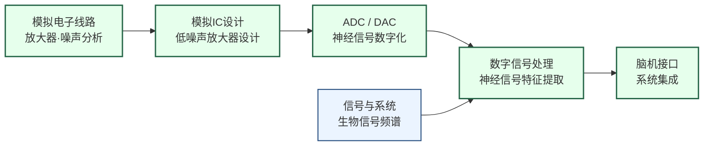

# 生物电子与脑机接口

## 一句话定义

设计能与神经系统直接交互的芯片——记录大脑电信号、刺激神经元，最终实现人机之间的直接信息通路。

## 为什么重要

帕金森症患者通过深脑刺激（DBS）芯片减轻震颤；耳蜗植入芯片让聋人重获听力；脊髓损伤患者通过脑机接口重新控制手臂。这些已经是临床现实。

Neuralink 在 2024 年完成首次人体植入，让这个方向破圈进入公众视野。但脑机接口面临极端的工程约束：芯片要植入人体、功耗要低到不产生热损伤、要无线传输高带宽神经数据、要在生理环境中稳定工作数年。这些约束把模拟 IC 设计推向了极限。

## 核心研究问题

- **超低噪声放大器**：神经元动作电位只有几十微伏，前端放大器的噪声必须极低，如何同时保证低噪声和低功耗？
- **高通道数集成**：Neuralink 的 N1 芯片集成 1024 个电极通道，每通道都需要独立的模拟前端，面积和功耗如何控制？
- **无线功率传输**：植入式设备无法换电池，近场无线充电（NFC/无线电能传输）如何保证效率和安全性？
- **长期生物相容性**：芯片植入后免疫反应导致电极逐渐失效，如何设计材料和封装？

## 代表性机构与企业

| | 国际 | 国内 |
|--|------|------|
| **企业** | Neuralink、Synchron、Medtronic、Abbott | 博睿康、微灵医疗 |
| **高校** | MIT（Boyden）、Columbia、UCSB、ETH Zurich | 浙大、天津大学、上海交大 |
| **顶会** | ISSCC、ESSCIRC、NeurIPS（BCI算法）、IEEE TNSRE | — |

## 知识路径

**本站相关课程：**

- [模拟电子线路（复旦）](../课程资源/电路/模拟/模拟电子线路/MICR130002.md)
- [模拟集成电路设计原理（复旦）](../课程资源/电路/模拟/模拟集成电路/MICR130030.md)
- [ADC/DAC（复旦）](../课程资源/电路/信号处理/数模模数转换器/INFO130270.md)
- [信号与系统（复旦）](../课程资源/电路/信号处理/信号与系统/MICR130004.md)
- [数字信号处理（复旦）](../课程资源/电路/信号处理/数字信号处理/INFO130010.md)

## 入门三步走

**第一步：了解神经信号的物理本质**  
阅读 Kandel et al.《Principles of Neural Science》第 2-3 章（动作电位和突触传递），20 页，建立对"要测量的信号长什么样"的直觉。

**第二步：了解芯片设计挑战**  
阅读 Shenoy et al., *Towards large-scale, human-based, mesoscopic neurotechnologies* (Neuron, 2013)，清晰梳理了脑机接口从生物学到工程学的全链路挑战。

**第三步：读经典电路论文**  
Harrison & Charles, *A low-power low-noise CMOS amplifier for neural recording applications* (JSSC, 2003)，这是神经记录前端放大器设计的奠基论文，被引数千次，电路原理清晰，适合有模拟电路基础后阅读。
