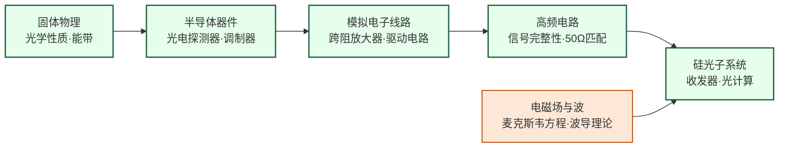

# 硅光子与光电集成

## 一句话定义

在硅芯片上集成光学元件，用光子而非电子传输数据——解决 AI 数据中心互联带宽危机，并向光计算方向演进。

## 这个方向在研究什么

在长距离通信上，光纤早就赢了：一根光纤的传输容量可以达到每秒数十太比特，而铜缆在超过几十米后信号就开始衰减，需要中继放大。但在短距离——比如数据中心机架内部的芯片间互联——电信号仍然主导，因为在几厘米到几米的范围内，铜缆足够便宜和可靠。这个格局在 AI 集群时代开始松动。一个训练 GPT-4 级别模型的集群有数万块 GPU，它们之间的数据吞吐量极为惊人，而铜缆在高速传输时功耗巨大（信号完整性问题导致需要大量均衡和放大电路），并且超过几米就很难做到百 Gbps 的速率。用光代替铜，在带宽、功耗、距离三个维度上都有优势，这是硅光子近年来最迫切的工业需求来源。

"硅光子"的核心思路是：用已经高度成熟的 CMOS 半导体工艺，在硅芯片上制造出能操控光的元件——波导（引导光传播的细管道）、调制器（把电信号转成光强或相位的变化）、光电探测器（把光信号还原成电信号）。这样就可以用流片厂成熟的产线来生产光学元件，而不需要专门的光学工厂，成本大幅降低。问题在于，硅是间接带隙材料，无法高效发光，所以硅光子芯片本身无法产生激光，光源必须另外解决——要么外接激光器耦合进芯片，要么在硅上键合 III-V 族材料（砷化镓、磷化铟）来集成激光器。后者极为困难，因为这两种材料的晶格常数不匹配，键合界面的缺陷密度很高，这是硅光子领域长期悬而未决的核心工艺难题之一。

光调制器是另一个关键器件。硅基马赫-曾德调制器（MZM）通过施加电压改变硅的折射率，进而改变光的相位，从而实现对光信号的调制。但硅的电光系数（Pockels 效应）很弱，要达到足够的相移需要几毫米长的相移段，芯片面积大；相比之下，铌酸锂（LiNbO₃）的电光系数强得多，可以在几十微米的长度内完成同样的调制，带宽也更高，这就是为什么"薄膜铌酸锂"（TFLN）近年成为光子集成研究的热点材料，哈佛、MIT、国内浙大等多个团队在追这个方向。

光计算是更远处的前沿，也是争议最多的一个设想。神经网络推理的核心是矩阵乘法，而矩阵乘法可以用光学干涉仪来模拟：把光信号分成若干路，每路经过不同的相移和分束，干涉叠加后的输出就对应矩阵乘法的结果。光子以光速传播，且不同路之间基本不产生热量，理论上能效远超电子计算。MIT 2017 年在 *Nature Photonics* 上展示了用硅光子芯片实现小型神经网络推理的实验，Lightmatter 等公司在 2023 年展示了能跑实际 AI 模型的光子芯片原型。但真正的挑战是精度控制——光路中的温度漂移、制造偏差会引起相位误差，而神经网络对精度的要求并不宽松。这个方向现在究竟是"即将颠覆算力格局"还是"长期只能做演示"，业界还没有定论，但正因为不确定，才有大量研究空间。

## 核心研究问题

- **片上光源**：硅是间接带隙材料，无法高效发光，如何在硅平台上集成激光器（III-V 键合、GeSn 激光器）？
- **调制器带宽**：硅基马赫-曾德调制器（MZM）的带宽和插损如何进一步优化？
- **光电探测器**：锗（Ge）基光电探测器如何提高响应度和带宽？
- **光计算**：光子神经网络能否在推理任务上实现比电子芯片更高的能效？

## 代表性机构与企业

| | 国际 | 国内 |
|--|------|------|
| **企业** | Intel（Silicon Photonics）、Ayar Labs、Coherent | 光迅科技、华为光子、中际旭创 |
| **高校** | MIT、Columbia、UCB、EPFL | 浙大、上海交大、北大 |
| **顶会** | OFC、ECOC、CLEO、IEEE Photonics Journal | — |

## 知识路径

**本站相关课程：**

- [固体物理（复旦）](../课程资源/物理/固体物理/MICR130013.md)
- [半导体器件原理（复旦）](../课程资源/器件与工艺/半导体器件/半导体器件原理_FDU/MICR130006.md)
- [模拟电子线路（复旦）](../课程资源/电路/模拟/模拟电子线路/MICR130002.md)
- [高频电子线路 EE613](../课程资源/电路/模拟/高频电子线路/EE613.md)

## 入门三步走

**第一步：了解光的物理基础**  
阅读 Saleh & Teich《Fundamentals of Photonics》第 1-2 章（光波与光学元件基础），建立光波传播和波导的直觉。

**第二步：了解硅光子平台**  
阅读 Reed et al., *Silicon optical modulators* (Nature Photonics, 2010)，这是硅光子领域被引最高的综述之一，清晰介绍了硅基调制器的物理机制。

**第三步：了解与 AI 的结合**  
阅读 Shen et al., *Deep learning with coherent nanophotonic circuits* (Nature Photonics, 2017)，这篇文章提出用马赫-曾德干涉仪阵列实现神经网络推理，是光计算领域的奠基性工作。
