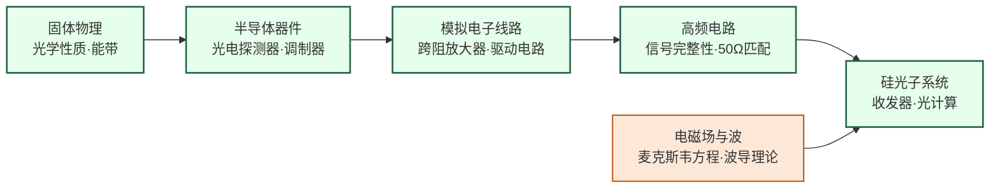

# 硅光子与光电集成

## 一句话定义

在硅芯片上集成光学元件，用光子而非电子传输数据——解决 AI 数据中心互联带宽危机，并向光计算方向演进。

## 你身边的产品

你家里的宽带光纤，信号从运营商机房到你门口都用光传输——光纤收发器就是把电信号转换成光信号、再在终端把光信号还原成电信号的芯片。这个过程中的光电转换器件（激光器、调制器、探测器）正是硅光子研究的核心元件。随着网速从百兆升到千兆再到万兆，对收发器的带宽和功耗要求不断提高，传统分立器件方案越来越难以为继，把所有光学元件集成在硅芯片上成为必然趋势。

在 AI 数据中心里，规模更大、矛盾也更尖锐。NVIDIA H100 集群里的 GPU 之间靠铜缆 InfiniBand 互联，但铜缆在超过 2-3 米后信号衰减明显，数据中心内的走线已经开始成为瓶颈，用光代替铜的需求越来越迫切。自动驾驶车上的激光雷达（LiDAR）也是光电集成的重要应用：传统机械旋转 LiDAR 体积大、易损坏，而基于相控阵原理的固态 LiDAR 芯片可以没有任何机械运动地扫描整个前方视野，这需要在芯片上集成数千个光学天线单元。

## 为什么重要

当 GPU 集群规模达到数万块时，芯片之间的数据传输（铜缆互联）成为系统瓶颈：铜缆带宽有限、功耗巨大、距离受限。光互联（硅光子）的带宽密度是铜缆的 10-100 倍，且功耗与距离无关。

除互联外，硅光子在 LiDAR（激光雷达）、光纤通信收发器、以及长远的**光计算**（用光子做矩阵乘法）方向均有重要应用。这是一个横跨光学、器件物理和模拟电路的高度交叉领域。

## 当前最前沿（2024-2025）

2024 年 Intel 宣布推出集成硅光子收发器的数据中心互联方案，单端口光速率达到 1.6 Tbps；Ayar Labs 的片上光互联芯粒（optical chiplet）被 DARPA 和多家 AI 芯片公司测试，目标是把光学 I/O 直接集成进 GPU 封装内，彻底取消封装外的铜缆。这个方向的终极图景是"光电融合"——一块芯片上同时存在电子计算单元和光学互联网络。

光计算是另一个令人兴奋但争议更大的前沿。MIT、斯坦福、Lightmatter 等机构和公司在用马赫-曾德干涉仪（MZI）阵列做矩阵乘法，光子以光速穿过波导网络完成计算，理论上能效极高。Lightmatter 的 Passage 芯片 2023 年已展示了运行实际 AI 模型的能力，但精度、可编程性和与数字系统的接口仍是待解难题。业界对"光计算能否真正替代电子计算"存在相当分歧，但光互联取代铜线互联这件事，几乎是确定会在 5-10 年内大规模发生的。

## 核心研究问题

- **片上光源**：硅是间接带隙材料，无法高效发光，如何在硅平台上集成激光器（III-V 键合、GeSn 激光器）？
- **调制器带宽**：硅基马赫-曾德调制器（MZM）的带宽和插损如何进一步优化？
- **光电探测器**：锗（Ge）基光电探测器如何提高响应度和带宽？
- **光计算**：光子神经网络能否在推理任务上实现比电子芯片更高的能效？

## 代表性机构与企业

| | 国际 | 国内 |
|--|------|------|
| **企业** | Intel（Silicon Photonics）、Ayar Labs、Coherent | 光迅科技、华为光子、中际旭创 |
| **高校** | MIT、Columbia、UCB、EPFL | 浙大、上海交大、北大 |
| **顶会** | OFC、ECOC、CLEO、IEEE Photonics Journal | — |

## 知识路径

**本站相关课程：**

- [固体物理（复旦）](../课程资源/物理/固体物理/MICR130013.md)
- [半导体器件原理（复旦）](../课程资源/器件与工艺/半导体器件/半导体器件原理_FDU/MICR130006.md)
- [模拟电子线路（复旦）](../课程资源/电路/模拟/模拟电子线路/MICR130002.md)
- [高频电子线路 EE613](../课程资源/电路/模拟/高频电子线路/EE613.md)

## 入门三步走

**第一步：了解光的物理基础**  
阅读 Saleh & Teich《Fundamentals of Photonics》第 1-2 章（光波与光学元件基础），建立光波传播和波导的直觉。

**第二步：了解硅光子平台**  
阅读 Reed et al., *Silicon optical modulators* (Nature Photonics, 2010)，这是硅光子领域被引最高的综述之一，清晰介绍了硅基调制器的物理机制。

**第三步：了解与 AI 的结合**  
阅读 Shen et al., *Deep learning with coherent nanophotonic circuits* (Nature Photonics, 2017)，这篇文章提出用马赫-曾德干涉仪阵列实现神经网络推理，是光计算领域的奠基性工作。
