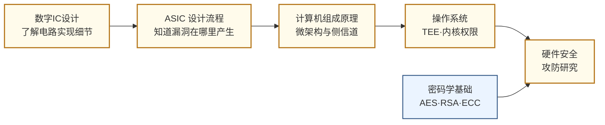

# 硬件安全

## 一句话定义

从芯片和硬件层面研究如何攻击计算系统，以及如何在设计阶段构建防御——这是网络安全中最底层、最难防御的战场。

## 你身边的产品

你手机里的指纹传感器和 Face ID，以及微信支付、支付宝的生物特征验证，背后都依赖一个叫做可信执行环境（TEE）的硬件机制——ARM TrustZone 把处理器分成"安全世界"和"普通世界"，你的指纹数据只在安全世界里处理，哪怕手机系统被恶意软件完全控制，攻击者也无法读取这些数据。iPhone 的 Secure Enclave 芯片是独立于主 CPU 的安全处理器，专门存储 Touch ID 和 Face ID 的密钥，即使苹果公司自己也无法从外部读取。

2018 年曝光的 Spectre 漏洞是硬件安全史上影响范围最广的事件：它利用的不是任何代码 bug，而是处理器为了提高性能而引入的"投机执行"机制——CPU 会预先执行它猜测可能会走的分支，如果猜错了就撤销结果，但撤销操作在缓存层面留下了痕迹，攻击者可以通过精心构造的程序读取缓存时序来推断出本不该可见的内存内容，包括其他进程的数据和内核内存。这个漏洞影响了几乎所有 2000 年后制造的 Intel、AMD 和 ARM 处理器。打补丁的方式是禁用一部分投机执行，代价是性能下降 5-30%。这个案例清楚地说明了为什么硬件安全问题比软件安全更难处理：漏洞来自设计决策本身，没有"正确版本"可以升级到。

## 为什么重要

软件安全已被广泛研究，但硬件层面的漏洞往往无法通过软件补丁修复。2018 年的 Spectre/Meltdown 漏洞来自处理器微架构的投机执行机制，影响了全球几乎所有 Intel/AMD/ARM 处理器；供应链中的硬件木马可以在芯片制造阶段被植入，出厂后无法检测；量子计算的发展威胁到现有的所有加密体系，需要从硬件层重新设计密码加速器。

随着芯片设计和制造的全球化分工，硬件安全从学术议题变成了国家安全议题。

## 当前最前沿（2024-2025）

侧信道攻击在 2023-2024 年出现了新变体：PACMAN（2022，MIT）攻破了 Apple M1 的指针认证机制（PAC）；RowHammer 攻击的新变种 RowPress（2023）展示了对最新一代 DDR5 内存的可靠攻击路径。随着 AI 推理在终端设备上的普及，如何保护模型参数不被侧信道恢复成为新兴研究问题——研究者已经展示了通过测量 NPU 的功耗来还原神经网络权重的攻击。

防御方面，RISC-V 开放 ISA 的流行带动了硬件安全扩展的研究：CHERI（剑桥大学）给每个内存指针加上权限标签，在硬件层面阻止缓冲区溢出攻击；MIT 的 Sanctum 是一个开源的安全飞地方案，展示了如何在 RISC-V 上实现类 SGX 的可信执行环境。后量子密码（PQC）是另一个快速推进的子方向：NIST 已于 2024 年正式发布 ML-KEM、ML-DSA 等后量子标准算法，如何为这些新算法设计高效的硬件加速器，是接下来几年最确定性的研究需求之一。

## 核心研究问题

- **侧信道攻击（Side-Channel Attacks）**：通过测量功耗曲线、电磁辐射或时序信息，推断 AES 密钥等敏感信息，如何在硬件设计阶段防止信息泄露？
- **硬件木马（Hardware Trojans）**：恶意电路被植入 ASIC 的 RTL 或版图层，如何在流片前检测和验证？
- **物理不可克隆函数（PUF）**：利用芯片制造过程中的随机工艺偏差生成唯一"指纹"，用于硬件身份认证，如何提高稳定性和抗攻击性？
- **可信执行环境（TEE）**：ARM TrustZone、RISC-V PMP 等机制如何在硬件层面隔离安全计算，防止操作系统层面的攻击？

## 代表性机构与企业

| | 国际 | 国内 |
|--|------|------|
| **企业** | Arm（TrustZone）、Rambus、IBM（安全芯片）、Google（Titan M） | 华为、国芯科技、紫光国微 |
| **高校** | MIT、CMU、UCSB、NYU Tandon、KU Leuven | 清华、北大、国防科大 |
| **顶会** | HOST（硬件安全专属）、S&P、CCS、USENIX Security、DAC | — |

## 知识路径

**本站相关课程：**

- [数字集成电路设计原理（复旦）](../课程资源/电路/数字/数字集成电路/数字集成电路设计原理_FDU/MICR130029.md)
- [ASIC 设计（复旦）](../课程资源/电路/ASIC/INFO130094.md)
- [计算机组成原理（复旦）](../课程资源/系统架构/速通/MICR130038.md) · [CMU 15-213 CSAPP](../课程资源/系统架构/速通/CSAPP.md)
- [操作系统 MIT 6.S081](../课程资源/系统架构/操作系统/MIT6.S081.md)
- [密码学基础（Stanford）](../课程资源/数学/数学进阶/密码学/StandfordCrypto.md)

## 入门三步走

**第一步：感受攻击的真实性**  
阅读 Kocher et al., *Spectre Attacks: Exploiting Speculative Execution* (2019 IEEE S&P)，理解一个纯粹来自微架构设计决策的漏洞如何影响整个行业。无需完全看懂细节，重要的是建立"硬件设计决策有安全后果"的直觉。

**第二步：了解防御机制**  
阅读 ARM 的 TrustZone 技术白皮书（免费公开），了解硬件隔离机制的设计思路。

**第三步：动手实验**  
ChipWhisperer 是一个开源硬件安全实验平台，有完整的侧信道攻击教程（<https://github.com/newaetech/chipwhisperer>），可以在几十美元的开发板上复现对 AES 的功耗分析攻击。
