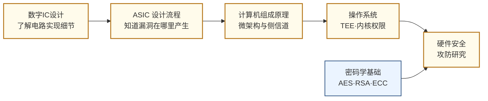

# 硬件安全

## 一句话定义

从芯片和硬件层面研究如何攻击计算系统，以及如何在设计阶段构建防御——这是网络安全中最底层、最难防御的战场。

## 这个方向在研究什么

软件安全研究了几十年，有了漏洞可以打补丁，有了 CVE 可以发版修复。但硬件层面的漏洞属于另一种性质：它来自芯片的物理设计和制造过程，一旦出厂就无法修改，影响的是所有运行在这块芯片上的软件，不管软件本身写得多么安全。2018 年曝光的 Spectre 漏洞是这类问题的极端案例。处理器为了提高性能引入了"投机执行"机制——CPU 会预测程序接下来可能执行哪条分支，提前算好结果，如果预测对了就直接用，如果错了就撤销。关键在于，撤销操作虽然清理了寄存器状态，但没有清理缓存的痕迹。攻击者可以构造特殊程序，诱导处理器投机执行一段本无权访问的内存读取，再通过测量不同内存地址的缓存访问时序推断出那段内存里的内容——包括其他进程的数据、操作系统内核的密钥。这个漏洞影响了几乎所有 2000 年后制造的 Intel、AMD、ARM 处理器，打补丁的方式是禁用部分投机执行，性能代价是 5-30%。漏洞本身来自性能优化的设计决策，没有"正确版本"可以升级到，这正是硬件安全和软件安全最本质的差别。

侧信道攻击（Side-Channel Attacks）是这个方向里研究历史最长、成果最丰富的子领域。攻击的基本思路是：任何实现了密码算法的物理电路，在运行时都会产生可以被测量的物理信号——功耗随时钟周期的波动、电磁辐射的强度、加密操作的执行时间——这些信号泄漏了关于密钥的信息。早在 1998 年，Paul Kocher 就展示了通过测量智能卡的功耗曲线来恢复 DES 密钥，无需任何密码数学漏洞，只需要一台示波器和几千次测量。研究者在这个基础上发展出了功耗分析（SPA/DPA）、电磁分析（EMA）、时序攻击等一系列技术，攻击对象从智能卡扩展到 FPGA、嵌入式处理器、甚至 AI 芯片——研究者已经展示了通过测量 NPU 运行时的功耗来还原神经网络模型权重。防御方法包括在电路层引入随机化（掩码技术）、硬件层面的功耗均衡、以及让实现时序与数据无关的"恒时"（constant-time）编程方法。

硬件木马（Hardware Trojans）针对的是芯片供应链的安全。现代芯片的设计往往外包给第三方 IP 核提供商，制造交给台积电、三星等代工厂——这条链路上的任何一个环节，都可能被恶意行为者在芯片里植入隐藏电路。这个隐藏电路大多数时候保持沉默，只在特定触发条件下（比如特定的输入序列、特定的日期）激活，完成窃取密钥、伪造计算结果或关闭系统的操作。检测硬件木马极为困难：芯片内部的晶体管数量以亿计，木马只需要占其中极小的比例；功能仿真无法发现它，因为木马在正常条件下不会触发；物理检测需要用电子显微镜逐层扫描芯片，成本极高。研究者开发了侧信道指纹识别、机器学习辅助的版图异常检测、以及在 RTL 阶段的形式化验证方法来应对这个问题，但完全可靠的检测方法至今仍未出现，这也是这个方向对于国家安全如此重要的原因。

物理不可克隆函数（PUF）是防御端的一个有趣研究方向。芯片制造过程中存在不可避免的随机工艺偏差：同一设计的两块芯片，微观尺度上没有任何两块完全相同。PUF 利用这种随机性来生成芯片的"生物指纹"——对相同的输入激励，每块芯片产生独特且可重现的响应，用于身份认证。PUF 的优势在于这个"指纹"无法被复制（因为制造偏差是随机的），也不需要存储在任何可被读取的内存里（因为它由物理特性决定）。研究挑战在于提高 PUF 的稳定性（同一块芯片在温度变化后响应应保持一致）和抵抗机器学习建模攻击（攻击者通过大量激励-响应对训练出一个 PUF 的数学模型）。ARM TrustZone 和 RISC-V PMP 等可信执行环境（TEE）的设计是另一个活跃方向，目标是在硬件层面创造一个即使操作系统被攻破也无法侵入的安全区域。

## 核心研究问题

- **侧信道攻击（Side-Channel Attacks）**：通过测量功耗曲线、电磁辐射或时序信息，推断 AES 密钥等敏感信息，如何在硬件设计阶段防止信息泄露？
- **硬件木马（Hardware Trojans）**：恶意电路被植入 ASIC 的 RTL 或版图层，如何在流片前检测和验证？
- **物理不可克隆函数（PUF）**：利用芯片制造过程中的随机工艺偏差生成唯一"指纹"，用于硬件身份认证，如何提高稳定性和抗攻击性？
- **可信执行环境（TEE）**：ARM TrustZone、RISC-V PMP 等机制如何在硬件层面隔离安全计算，防止操作系统层面的攻击？

## 代表性机构与企业

| | 国际 | 国内 |
|--|------|------|
| **企业** | Arm（TrustZone）、Rambus、IBM（安全芯片）、Google（Titan M） | 华为、国芯科技、紫光国微 |
| **高校** | MIT、CMU、UCSB、NYU Tandon、KU Leuven | 清华、北大、国防科大 |
| **顶会** | HOST（硬件安全专属）、S&P、CCS、USENIX Security、DAC | — |

## 相关课题组

**国内**

| 姓名 | 单位 | 研究方向 |
|------|------|----------|
| [邓舒文](https://web.ee.tsinghua.edu.cn/shuwen_deng/en/index.htm) | 清华大学电子工程系（国家优青） | 微架构侧信道攻击与防御、时序隐信道检测、隐私保护硬件架构，Google 隐私安全博士奖学金 |
| [苏菲](https://www.sic.tsinghua.edu.cn/info/1034/2263.htm) | 清华大学集成电路学院 | Chiplet 互联安全与测试、硬件信任链设计，前 Intel 高级工程师 |
| [冯建华](https://ic.pku.edu.cn/szdw/zzjs/F1/fjh/index.htm) | 北京大学集成电路学院 | IC 设计与测试、硬件木马检测、逻辑加密、可信电路设计 |
| [崔小乐](https://www.ece.pku.edu.cn/info/1053/2218.htm) | 北京大学电子工程系 | 物理不可克隆函数（PUF）设计与安全分析、可信硬件认证 |
| [蒋昊](https://fics.fudan.edu.cn/8e/8a/c22620a429706/page.htm) | 复旦大学芯片与系统前沿技术研究院 | 忆阻器与铁电器件用于硬件安全（PUF 物理不可克隆函数）及存内计算，发表于 Nat. Electron./Nat. Commun. |
| [王伶俐](https://sme.fudan.edu.cn/60/3c/c31133a352316/page.htm) | 复旦大学微电子学院 | FPGA 结构与安全可编程系统、抗辐射 FPGA、可重构安全计算（上海市技术发明奖）、量子计算 |
| [侯锐](https://people.ucas.ac.cn/~hourui) | 中科院信息工程研究所 | 安全处理器架构、侧信道防御、国产高性能 CPU 安全 |

**国际**

| 姓名 | 单位 | 研究方向 |
|------|------|----------|
| [Srinivas Devadas](https://people.csail.mit.edu/devadas/) | MIT CSAIL | 硅基 PUF 发明者、AEGIS 安全处理器，现专注硬件加速密码学 |
| [Mark Tehranipoor](https://tehranipoor.ece.ufl.edu/) | University of Florida | 硬件木马、IC 供应链安全、硬件可信度验证，Florida 网络安全研究院院长 |
| [G. Edward Suh](https://tsg.ece.cornell.edu/) | Cornell ECE | 可验证安全处理器架构、硬件辅助安全机制、可信执行环境 |
| [Christof Paar](https://www.mpi-sp.org/paar) | MPI for Security & Privacy | 嵌入式安全、硬件木马、物理层安全、高效密码实现，经典教材 *Understanding Cryptography* 作者 |

## 知识路径

**本站相关课程：**

- [数字集成电路设计原理（复旦）](../课程资源/电路/数字/数字集成电路/数字集成电路设计原理_FDU/MICR130029.md)
- [ASIC 设计（复旦）](../课程资源/电路/ASIC/INFO130094.md)
- [计算机组成原理（复旦）](../课程资源/系统架构/速通/MICR130038.md) · [CMU 15-213 CSAPP](../课程资源/系统架构/速通/CSAPP.md)
- [操作系统 MIT 6.S081](../课程资源/系统架构/操作系统/MIT6.S081.md)
- [密码学基础（Stanford）](../课程资源/数学/数学进阶/密码学/StandfordCrypto.md)

## 入门三步走

**第一步：感受攻击的真实性**  
阅读 Kocher et al., *Spectre Attacks: Exploiting Speculative Execution* (2019 IEEE S&P)，理解一个纯粹来自微架构设计决策的漏洞如何影响整个行业。无需完全看懂细节，重要的是建立"硬件设计决策有安全后果"的直觉。

**第二步：了解防御机制**  
阅读 ARM 的 TrustZone 技术白皮书（免费公开），了解硬件隔离机制的设计思路。

**第三步：动手实验**  
ChipWhisperer 是一个开源硬件安全实验平台，有完整的侧信道攻击教程（<https://github.com/newaetech/chipwhisperer>），可以在几十美元的开发板上复现对 AES 的功耗分析攻击。
