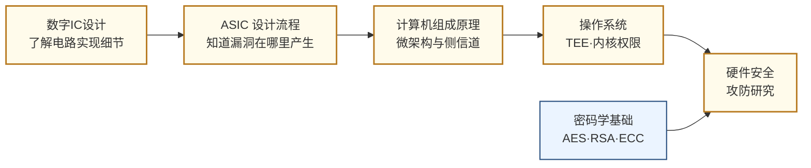

---
hide:
  - navigation
---
从芯片和硬件层面研究如何攻击计算系统，以及如何在设计阶段构建防御——这是网络安全中最底层、最难防御的战场。

## 这个方向在研究什么

软件安全研究了几十年，有了漏洞可以打补丁，有了 CVE 可以发版修复。但硬件层面的漏洞属于另一种性质：它来自芯片的物理设计和制造过程，一旦出厂就无法修改，影响的是所有运行在这块芯片上的软件，不管软件本身写得多么安全。2018 年曝光的 Spectre 漏洞是这类问题的极端案例。处理器为了提高性能引入了"投机执行"机制——CPU 会预测程序接下来可能执行哪条分支，提前算好结果，如果预测对了就直接用，如果错了就撤销。关键在于，撤销操作虽然清理了寄存器状态，但没有清理缓存的痕迹。攻击者可以构造特殊程序，诱导处理器投机执行一段本无权访问的内存读取，再通过测量不同内存地址的缓存访问时序推断出那段内存里的内容——包括其他进程的数据、操作系统内核的密钥。这个漏洞影响了几乎所有 2000 年后制造的 Intel、AMD、ARM 处理器，打补丁的方式是禁用部分投机执行，性能代价是 5-30%。漏洞本身来自性能优化的设计决策，没有"正确版本"可以升级到，这正是硬件安全和软件安全最本质的差别。

<svg viewBox="0 0 860 220" xmlns="http://www.w3.org/2000/svg" style="width:100%;max-width:860px;display:block;margin:1.5rem auto;font-family:system-ui,sans-serif;">
  <defs>
    <marker id="hw-arrow" markerWidth="8" markerHeight="8" refX="6" refY="3" orient="auto">
      <path d="M0,0 L0,6 L8,3 z" fill="#64748B"/>
    </marker>
  </defs>
  <!-- Panel 1: 芯片正常运行 -->
  <rect x="20" y="20" width="230" height="180" rx="8" fill="#F8FAFC" stroke="#CBD5E1" stroke-width="1.5"/>
  <text x="135" y="44" text-anchor="middle" font-size="13" font-weight="600" fill="#334155">① 芯片正常运行</text>
  <rect x="55" y="58" width="160" height="90" rx="6" fill="#DBEAFE" stroke="#3B82F6" stroke-width="1.5"/>
  <text x="135" y="82" text-anchor="middle" font-size="12" font-weight="600" fill="#1D4ED8">AES 加密运算</text>
  <text x="135" y="100" text-anchor="middle" font-size="20" fill="#1D4ED8">🔒</text>
  <text x="135" y="124" text-anchor="middle" font-size="11" fill="#1E40AF">密钥安全存储</text>
  <text x="135" y="142" text-anchor="middle" font-size="11" fill="#1E40AF">在芯片内部</text>
  <text x="135" y="185" text-anchor="middle" font-size="11" fill="#64748B">正常功能：加密输出</text>
  <!-- Arrow 1→2 -->
  <line x1="250" y1="110" x2="298" y2="110" stroke="#64748B" stroke-width="1.5" marker-end="url(#hw-arrow)"/>
  <!-- Panel 2: 攻击者测量 -->
  <rect x="300" y="20" width="260" height="180" rx="8" fill="#F8FAFC" stroke="#CBD5E1" stroke-width="1.5"/>
  <text x="430" y="44" text-anchor="middle" font-size="13" font-weight="600" fill="#334155">② 攻击者测量</text>
  <rect x="330" y="58" width="140" height="80" rx="6" fill="#DBEAFE" stroke="#3B82F6" stroke-width="1.5"/>
  <text x="400" y="82" text-anchor="middle" font-size="12" font-weight="600" fill="#1D4ED8">AES 加密运算</text>
  <text x="400" y="100" text-anchor="middle" font-size="20" fill="#1D4ED8">🔒</text>
  <text x="400" y="120" text-anchor="middle" font-size="11" fill="#1E40AF">芯片运行中</text>
  <!-- Red probe wire -->
  <line x1="400" y1="138" x2="400" y2="158" stroke="#EF4444" stroke-width="2.5"/>
  <circle cx="400" cy="138" r="4" fill="#EF4444"/>
  <!-- Oscilloscope waves -->
  <polyline points="420,170 430,155 440,175 450,155 460,170 470,158 480,168 490,158 500,165 510,155 520,165 530,158 540,168" fill="none" stroke="#EF4444" stroke-width="1.5"/>
  <text x="430" y="198" text-anchor="middle" font-size="11" fill="#DC2626">功耗 / 电磁 / 时序测量</text>
  <!-- Arrow 2→3 -->
  <line x1="560" y1="110" x2="608" y2="110" stroke="#64748B" stroke-width="1.5" marker-end="url(#hw-arrow)"/>
  <!-- Panel 3: 密钥泄露 -->
  <rect x="610" y="20" width="230" height="180" rx="8" fill="#F8FAFC" stroke="#CBD5E1" stroke-width="1.5"/>
  <text x="725" y="44" text-anchor="middle" font-size="13" font-weight="600" fill="#334155">③ 密钥泄露</text>
  <rect x="645" y="58" width="160" height="80" rx="6" fill="#FEE2E2" stroke="#EF4444" stroke-width="1.5"/>
  <text x="725" y="80" text-anchor="middle" font-size="12" font-weight="600" fill="#DC2626">密钥暴露</text>
  <text x="725" y="100" text-anchor="middle" font-size="20" fill="#DC2626">🔓</text>
  <text x="725" y="120" text-anchor="middle" font-size="11" fill="#B91C1C">无需密码数学漏洞</text>
  <text x="725" y="160" text-anchor="middle" font-size="11" fill="#64748B">密钥恢复</text>
  <text x="725" y="178" text-anchor="middle" font-size="11" fill="#64748B">无需暴力破解</text>
</svg>

侧信道攻击（Side-Channel Attacks）是这个方向里研究历史最长、成果最丰富的子领域。攻击的基本思路是：任何实现了密码算法的物理电路，在运行时都会产生可以被测量的物理信号——功耗随时钟周期的波动、电磁辐射的强度、加密操作的执行时间——这些信号泄漏了关于密钥的信息。早在 1998 年，Paul Kocher 就展示了通过测量智能卡的功耗曲线来恢复 DES 密钥，无需任何密码数学漏洞，只需要一台示波器和几千次测量。研究者在这个基础上发展出了功耗分析（SPA/DPA）、电磁分析（EMA）、时序攻击等一系列技术，攻击对象从智能卡扩展到 FPGA、嵌入式处理器、甚至 AI 芯片——研究者已经展示了通过测量 NPU 运行时的功耗来还原神经网络模型权重。防御方法包括在电路层引入随机化（掩码技术）、硬件层面的功耗均衡、以及让实现时序与数据无关的"恒时"（constant-time）编程方法。

硬件木马（Hardware Trojans）针对的是芯片供应链的安全。现代芯片的设计往往外包给第三方 IP 核提供商，制造交给台积电、三星等代工厂——这条链路上的任何一个环节，都可能被恶意行为者在芯片里植入隐藏电路。这个隐藏电路大多数时候保持沉默，只在特定触发条件下（比如特定的输入序列、特定的日期）激活，完成窃取密钥、伪造计算结果或关闭系统的操作。检测硬件木马极为困难：芯片内部的晶体管数量以亿计，木马只需要占其中极小的比例；功能仿真无法发现它，因为木马在正常条件下不会触发；物理检测需要用电子显微镜逐层扫描芯片，成本极高。研究者开发了侧信道指纹识别、机器学习辅助的版图异常检测、以及在 RTL 阶段的形式化验证方法来应对这个问题，但完全可靠的检测方法至今仍未出现，这也是这个方向对于国家安全如此重要的原因。

物理不可克隆函数（PUF）是防御端的一个有趣研究方向。芯片制造过程中存在不可避免的随机工艺偏差：同一设计的两块芯片，微观尺度上没有任何两块完全相同。PUF 利用这种随机性来生成芯片的"生物指纹"——对相同的输入激励，每块芯片产生独特且可重现的响应，用于身份认证。PUF 的优势在于这个"指纹"无法被复制（因为制造偏差是随机的），也不需要存储在任何可被读取的内存里（因为它由物理特性决定）。研究挑战在于提高 PUF 的稳定性（同一块芯片在温度变化后响应应保持一致）和抵抗机器学习建模攻击（攻击者通过大量激励-响应对训练出一个 PUF 的数学模型）。ARM TrustZone 和 RISC-V PMP 等可信执行环境（TEE）的设计是另一个活跃方向，目标是在硬件层面创造一个即使操作系统被攻破也无法侵入的安全区域。

## 适合什么样的人

这个方向对喜欢"对抗性思维"的人特别有吸引力——你需要同时扮演攻击者和防御者，设想各种非常规的信息泄露路径，再想办法堵住它们。

EE 背景的学生入口在电路和微架构层：你懂功耗如何随数据变化、时序路径如何产生，这正是侧信道攻击的物理基础。从数字 IC 设计出发，理解芯片运行时的物理特征，是研究侧信道防御的自然路径。

CS 背景的学生入口在系统和软件层：操作系统、TEE 机制、编译器如何生成恒时代码，都是合理的起点。Spectre 类漏洞本质上是微架构和软件抽象层之间的不匹配，既需要理解硬件，也需要理解软件假设。

不需要顶级数学基础——密码学只需要理解 AES、RSA 的基本结构，不需要推导安全证明。但需要对细节有耐心：功耗曲线分析、时序路径分析都是需要仔细观察的工作。

这个方向产出同时投 ISSCC/DAC（硬件）和 S&P/CCS（安全）的论文，读博期间可以在两个社区里建立声誉，是比较少见的真正跨界方向。对于对国家安全、供应链安全感兴趣的学生，这个方向也有明确的政策意义和产业需求。

## 核心研究问题

- **侧信道攻击（Side-Channel Attacks）**：通过测量功耗曲线、电磁辐射或时序信息，推断 AES 密钥等敏感信息，如何在硬件设计阶段防止信息泄露？
- **硬件木马（Hardware Trojans）**：恶意电路被植入 ASIC 的 RTL 或版图层，如何在流片前检测和验证？
- **物理不可克隆函数（PUF）**：利用芯片制造过程中的随机工艺偏差生成唯一"指纹"，用于硬件身份认证，如何提高稳定性和抗攻击性？
- **可信执行环境（TEE）**：ARM TrustZone、RISC-V PMP 等机制如何在硬件层面隔离安全计算，防止操作系统层面的攻击？

## 代表性机构

| | 国际 | 国内 |
|--|------|------|
| **企业** | Arm（TrustZone）、Rambus、IBM（安全芯片）、Google（Titan M） | 华为、国芯科技、紫光国微 |
| **顶会** | HOST（硬件安全专属）、S&P、CCS、USENIX Security、DAC | — |

## 知识路径

**本站相关课程：**

- [系统架构](../学习地图/系统架构/index.md)
- [电路（数字）](../学习地图/电路/数字/index.md)

## 入门三步走

**典型研究长什么样**

顶会（HOST、S&P、DAC）的硬件安全论文通常有明确的"攻防循环"结构：先展示一种新的攻击路径（往往来自对微架构或工艺细节的新观察），量化攻击成功率和所需测量次数，再提出对应的硬件级防御方案并评估其面积/功耗开销。实验部分通常包含真实芯片测量数据（示波器功耗曲线、电磁分布图）或 FPGA 原型验证，代码和数据集有时开源。一篇顶会论文从发现攻击到完成防御评估，往往需要一块真实的目标芯片、一套测量装置和几个月的实验迭代。

**第一步：感受攻击的真实性**  
阅读 Kocher et al., *Spectre Attacks: Exploiting Speculative Execution* (2019 IEEE S&P)，理解一个纯粹来自微架构设计决策的漏洞如何影响整个行业。无需完全看懂细节，重要的是建立"硬件设计决策有安全后果"的直觉。

**第二步：了解防御机制**  
阅读 ARM 的 TrustZone 技术白皮书（免费公开），了解硬件隔离机制的设计思路。

**第三步：动手实验**  
ChipWhisperer 是一个开源硬件安全实验平台，有完整的侧信道攻击教程（<https://github.com/newaetech/chipwhisperer>），可以在几十美元的开发板上复现对 AES 的功耗分析攻击。

## 相关课题组

### 境内

-   **[邓舒文](https://web.ee.tsinghua.edu.cn/shuwen_deng/en/index.htm)** 清华 

    微架构侧信道攻击与防御 · 时序隐信道检测 · 隐私保护硬件架构

-   **[苏菲](https://www.sic.tsinghua.edu.cn/info/1034/2263.htm)** 清华

    Chiplet 互联安全与测试 · 硬件信任链设计

-   **[冯建华](https://ic.pku.edu.cn/szdw/zzjs/F1/fjh/index.htm)** 北大

    硬件木马检测 · 逻辑加密 · 可信电路设计

-   **[崔小乐](https://www.ece.pku.edu.cn/info/1053/2218.htm)** 北大

    物理不可克隆函数（PUF） · 可信硬件认证

-   **[蒋昊](https://fics.fudan.edu.cn/8e/8a/c22620a429706/page.htm)** 复旦

    忆阻器/铁电器件硬件安全 · PUF · 存内计算

-   **[王伶俐](https://sme.fudan.edu.cn/60/3c/c31133a352316/page.htm)** 复旦

    FPGA 安全可编程系统 · 抗辐射 FPGA · 可重构安全计算

-   **[侯锐](https://people.ucas.ac.cn/~hourui)** 中科院

    安全处理器架构 · 侧信道防御 · 国产 CPU 安全

-   **[刘雷波](https://www.ime.tsinghua.edu.cn/info/1014/1807.htm)** 清华

    可重构密码芯片 · CPU 硬件安全动态检测 · PUF 与 TRNG 物理安全增强

-   **[张帆](https://person.zju.edu.cn/fanzhang)** 浙大

    侧信道攻击与防御 · 故障注入攻防 · 后量子密码硬件实现

-   **[谷大武](https://www.cs.sjtu.edu.cn/en/PeopleDetail.aspx?id=169)** 交大

    密码工程与硬件实现 · 侧信道分析 · 系统安全（LoCCS 实验室）

<button class="prof-show-all">显示全部 ↓</button>

### 境外

-   **[Wei Zhang（张薇）](https://ece.hkust.edu.hk/eeweiz)** 港科大 

    FPGA 安全 · 嵌入式系统硬件-软件协同安全 · DNN FPGA 加速

-   **[Qiang Xu（徐强）](https://www.cse.cuhk.edu.hk/~qxu/)** CUHK

    硬件木马检测 · 逻辑加密 · IC 故障注入攻击

-   **[Srinivas Devadas](https://people.csail.mit.edu/devadas/)** MIT

    硅基 PUF · AEGIS 安全处理器 · 硬件加速密码学

-   **[Mark Tehranipoor](https://tehranipoor.ece.ufl.edu/)** U Florida

    硬件木马 · IC 供应链安全 · 硬件可信度验证

-   **[G. Edward Suh](https://tsg.ece.cornell.edu/)** Cornell

    可验证安全处理器架构 · 硬件辅助安全机制 · 可信执行环境

-   **[Christof Paar](https://www.mpi-sp.org/paar)** MPI-SP

    嵌入式安全 · 硬件木马 · 高效密码实现

-   **[Christopher Fletcher](https://cwfletcher.net/)** UC Berkeley

    处理器微架构安全 · 侧信道/瞬态攻击（Spectre/Meltdown）防御 · 隐私计算硬件

-   **[Yunsi Fei](https://coe.northeastern.edu/people/fei-yunsi/)** Northeastern 

    深度学习侧信道分析 · 安全 RISC-V/TrustZone 评估 · CHEST 中心硬件可信

<button class="prof-show-all">显示全部 ↓</button>
