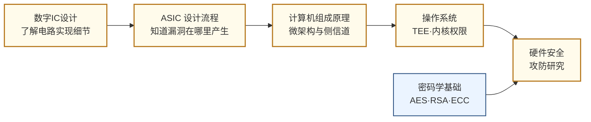

---
hide:
  - navigation
---
从芯片和硬件层面研究如何攻击计算系统，以及如何在设计阶段构建防御——这是网络安全中最底层、最难防御的战场。

## 这个方向在研究什么

软件安全研究了几十年——漏洞出现可以打补丁，CVE 一出就发版修复。但硬件层面的漏洞是另一种东西：它来自芯片的物理设计和制造过程，一旦出厂就刻在硅上、无从回收，影响的是所有跑在这块芯片上的软件，不管软件本身写得多么严谨。2018 年曝光的 **Spectre** 漏洞就是个极端案例。CPU 为了榨干性能引入了"投机执行"——处理器会预测程序接下来可能走哪条分支，提前算好结果，预测对了直接用，预测错了就撤销。问题在于，撤销操作虽然清理了寄存器，却没清理缓存留下的痕迹。攻击者可以构造特殊程序，诱导处理器投机执行一段本无权访问的内存读取，再通过测量缓存访问时序反推出那段内存的内容——其他进程的数据、操作系统内核的密钥，全部裸露。这个漏洞影响了几乎所有 2000 年后出厂的 Intel、AMD、ARM 处理器，"修复"只能靠禁用部分投机执行，性能代价 5%–30%。漏洞本身来自一个三十年前看起来天经地义的性能优化决策，没有"正确版本"可以升级——这正是硬件安全和软件安全最根本的差别。

硬件作为信任的根基，至少有三道关口会失守——出厂时的**供应链污染**、运行时的**物理泄漏**、部署时的**身份认证**；而当三道防线都让人不放心，还有一条更激进的路：**让密码学接管计算**，让硬件不再需要被信任。这四条战线构成了硬件安全研究的整张地图。

第一道关在出厂之前。一颗现代芯片要经过设计公司、第三方 IP 提供商、代工厂、封装厂数家不同企业的手，链条上任何一环都可能被植入一段隐藏电路——这就是**硬件木马（Hardware Trojan）**。木马平时保持沉默，只在特定触发条件下激活：可能是某个特殊输入序列，也可能是一个特定日期。一旦触发，它能窃取密钥、伪造计算结果，或直接关停系统。检测它是个物理意义上的难题：一颗芯片上有几十亿个晶体管，木马只占其中极小一撮；功能仿真发现不了它（正常条件下不触发）；要靠物理手段，就得用电子显微镜逐层扫描，成本高得只有国安场景才用得起。研究者目前的武器是侧信道指纹比对、机器学习辅助的版图异常检测、以及 RTL 阶段的形式化验证——但还没有任何一种方法接近"完全可靠"，这也是这个方向被各国列入战略议程的原因。

就算芯片来源干净，运行时它依然会主动出卖自己。芯片在做加密运算时，物理世界正在持续地"出卖"它——功耗随时钟拍子起伏，电磁辐射随门翻转跳动，加密时间随密钥位变化。早在 1998 年，Paul Kocher 用一台示波器测量智能卡的功耗曲线，几千次测量就还原了 DES 密钥，没动一行密码学。这条路径之后扩展成一整套攻击技术族——功耗分析（**SPA/DPA**）、电磁分析（**EMA**）、时序攻击——目标也从智能卡蔓延到 FPGA、嵌入式 CPU，最近甚至打到了 AI 芯片身上：研究者通过测量 NPU 运行时的功耗曲线，反推出了神经网络的权重。防御的思路是从物理层消除信号——在电路里加随机化（**掩码 masking**）、把功耗设计成与数据无关、让代码执行时间恒定（**constant-time**）——这是一场关不上的猫鼠游戏。

<svg viewBox="0 0 860 220" xmlns="http://www.w3.org/2000/svg" style="width:100%;max-width:860px;display:block;margin:1.5rem auto;font-family:system-ui,sans-serif;">
  <defs>
    <marker id="hw-arrow" markerWidth="8" markerHeight="8" refX="6" refY="3" orient="auto">
      <path d="M0,0 L0,6 L8,3 z" fill="#64748B"/>
    </marker>
  </defs>
  <!-- Panel 1: 芯片正常运行 -->
  <rect x="20" y="20" width="230" height="180" rx="8" fill="#F8FAFC" stroke="#CBD5E1" stroke-width="1.5"/>
  <text x="135" y="44" text-anchor="middle" font-size="13" font-weight="600" fill="#334155">① 芯片正常运行</text>
  <rect x="55" y="58" width="160" height="90" rx="6" fill="#DBEAFE" stroke="#3B82F6" stroke-width="1.5"/>
  <text x="135" y="82" text-anchor="middle" font-size="12" font-weight="600" fill="#1D4ED8">AES 加密运算</text>
  <text x="135" y="100" text-anchor="middle" font-size="20" fill="#1D4ED8">🔒</text>
  <text x="135" y="124" text-anchor="middle" font-size="11" fill="#1E40AF">密钥安全存储</text>
  <text x="135" y="142" text-anchor="middle" font-size="11" fill="#1E40AF">在芯片内部</text>
  <text x="135" y="185" text-anchor="middle" font-size="11" fill="#64748B">正常功能：加密输出</text>
  <!-- Arrow 1→2 -->
  <line x1="250" y1="110" x2="298" y2="110" stroke="#64748B" stroke-width="1.5" marker-end="url(#hw-arrow)"/>
  <!-- Panel 2: 攻击者测量 -->
  <rect x="300" y="20" width="260" height="180" rx="8" fill="#F8FAFC" stroke="#CBD5E1" stroke-width="1.5"/>
  <text x="430" y="44" text-anchor="middle" font-size="13" font-weight="600" fill="#334155">② 攻击者测量</text>
  <rect x="330" y="58" width="140" height="80" rx="6" fill="#DBEAFE" stroke="#3B82F6" stroke-width="1.5"/>
  <text x="400" y="82" text-anchor="middle" font-size="12" font-weight="600" fill="#1D4ED8">AES 加密运算</text>
  <text x="400" y="100" text-anchor="middle" font-size="20" fill="#1D4ED8">🔒</text>
  <text x="400" y="120" text-anchor="middle" font-size="11" fill="#1E40AF">芯片运行中</text>
  <!-- Red probe wire -->
  <line x1="400" y1="138" x2="400" y2="158" stroke="#EF4444" stroke-width="2.5"/>
  <circle cx="400" cy="138" r="4" fill="#EF4444"/>
  <!-- Oscilloscope waves -->
  <polyline points="420,170 430,155 440,175 450,155 460,170 470,158 480,168 490,158 500,165 510,155 520,165 530,158 540,168" fill="none" stroke="#EF4444" stroke-width="1.5"/>
  <text x="430" y="198" text-anchor="middle" font-size="11" fill="#DC2626">功耗 / 电磁 / 时序测量</text>
  <!-- Arrow 2→3 -->
  <line x1="560" y1="110" x2="608" y2="110" stroke="#64748B" stroke-width="1.5" marker-end="url(#hw-arrow)"/>
  <!-- Panel 3: 密钥泄露 -->
  <rect x="610" y="20" width="230" height="180" rx="8" fill="#F8FAFC" stroke="#CBD5E1" stroke-width="1.5"/>
  <text x="725" y="44" text-anchor="middle" font-size="13" font-weight="600" fill="#334155">③ 密钥泄露</text>
  <rect x="645" y="58" width="160" height="80" rx="6" fill="#FEE2E2" stroke="#EF4444" stroke-width="1.5"/>
  <text x="725" y="80" text-anchor="middle" font-size="12" font-weight="600" fill="#DC2626">密钥暴露</text>
  <text x="725" y="100" text-anchor="middle" font-size="20" fill="#DC2626">🔓</text>
  <text x="725" y="120" text-anchor="middle" font-size="11" fill="#B91C1C">无需密码数学漏洞</text>
  <text x="725" y="160" text-anchor="middle" font-size="11" fill="#64748B">密钥恢复</text>
  <text x="725" y="178" text-anchor="middle" font-size="11" fill="#64748B">无需暴力破解</text>
</svg>

最后一道防线是身份的根基。即使设计干净、制造无毒、运行时不漏，怎么证明手里这块芯片就是你以为的那块？这里出现了一个有趣的反转：**物理不可克隆函数（PUF）**把制造工艺里那些"该死的"随机偏差变成了优势。同一份设计造出的两块芯片，在原子尺度上永远不可能完全相同；PUF 利用这种偏差，让每块芯片对相同激励产生独一无二、又每次都能稳定重现的响应——相当于硅片自带的生物指纹，既无法复制，也不需要存在任何可读内存里。研究的难点在两端：让指纹在温度变化、器件老化下依然稳定，以及抵抗机器学习建模攻击（攻击者用大量激励-响应对训练出 PUF 的数学复制品）。从单芯片再往上一层就是**可信执行环境（TEE）**——ARM 的 **TrustZone**、RISC-V 的 **PMP** 都属于这类机制，目标是在硬件里划出一块"安全飞地"，让里面运行的代码即使在操作系统被攻陷的情况下也不被外界窥探。一颗芯片如果能"证明自己"并"守住自己的领地"，整个软件世界才有信任的支点。

以上三条战线都建立在"想办法信任硬件"的前提下。还有一条更激进的路——让数据从离开你电脑的那一刻起就处在密文中，硬件再不可信也无所谓。1982 年，**姚期智** 在论文里抛出了一道著名的"**百万富翁问题**"：两位富翁想比较谁更有钱，又都不愿告诉对方自己的财产数字——能不能做到？这个看似茶余饭后的玩笑开创了"**安全多方计算**"领域，让"在不暴露数据的前提下做计算"成为密码学的一大支柱。今天这条思路最受瞩目的两个分支是**同态加密（FHE）**和**零知识证明（ZKP）**：FHE 让数据在密文上直接被计算、全程不解密；ZKP 则让一方向另一方证明某个陈述为真而不透露任何细节，区块链把 **zkSNARK / zkSTARK** 推成了显学。

<svg viewBox="0 0 860 290" xmlns="http://www.w3.org/2000/svg" style="width:100%;max-width:860px;display:block;margin:1.5rem auto;font-family:system-ui,sans-serif;">
  <defs>
    <marker id="hw-arr2" markerWidth="8" markerHeight="8" refX="6" refY="3" orient="auto">
      <path d="M0,0 L0,6 L8,3 z" fill="#475569"/>
    </marker>
  </defs>
  <!-- Panel 1: FHE -->
  <rect x="15" y="15" width="410" height="260" rx="10" fill="#F0F9FF" stroke="#0EA5E9" stroke-width="1.5"/>
  <text x="220" y="40" text-anchor="middle" font-size="14" font-weight="700" fill="#075985">同态加密（FHE）</text>
  <text x="220" y="58" text-anchor="middle" font-size="11" fill="#0369A1">服务器在密文上直接计算，从头到尾不解密</text>
  <rect x="30" y="80" width="80" height="70" rx="6" fill="#FFFFFF" stroke="#0EA5E9" stroke-width="1.5"/>
  <text x="70" y="100" text-anchor="middle" font-size="10" fill="#0369A1" font-weight="600">用户</text>
  <text x="70" y="122" text-anchor="middle" font-size="11" fill="#0F172A">x = 5</text>
  <text x="70" y="138" text-anchor="middle" font-size="11" fill="#0F172A">y = 3</text>
  <line x1="110" y1="115" x2="148" y2="115" stroke="#475569" stroke-width="1.5" marker-end="url(#hw-arr2)"/>
  <text x="129" y="108" text-anchor="middle" font-size="9" fill="#475569">🔒 加密</text>
  <rect x="153" y="78" width="180" height="120" rx="8" fill="#FEF3C7" stroke="#D97706" stroke-width="1.5" stroke-dasharray="5,3"/>
  <text x="243" y="98" text-anchor="middle" font-size="11" fill="#92400E" font-weight="600">服务器（盲算）</text>
  <rect x="170" y="118" width="42" height="22" rx="3" fill="#1F2937"/>
  <text x="191" y="134" text-anchor="middle" font-size="11" fill="#FBBF24" font-weight="700" letter-spacing="1">▓▓▓</text>
  <text x="225" y="134" text-anchor="middle" font-size="14" fill="#92400E" font-weight="700">+</text>
  <rect x="240" y="118" width="42" height="22" rx="3" fill="#1F2937"/>
  <text x="261" y="134" text-anchor="middle" font-size="11" fill="#FBBF24" font-weight="700" letter-spacing="1">▓▓▓</text>
  <text x="295" y="134" text-anchor="middle" font-size="14" fill="#92400E" font-weight="700">=</text>
  <rect x="170" y="148" width="146" height="22" rx="3" fill="#1F2937"/>
  <text x="243" y="164" text-anchor="middle" font-size="11" fill="#FBBF24" font-weight="700" letter-spacing="1">▓▓▓ (密文结果)</text>
  <text x="243" y="186" text-anchor="middle" font-size="9" fill="#92400E">看不见 5、3 或 8 的真身</text>
  <line x1="338" y1="115" x2="375" y2="115" stroke="#475569" stroke-width="1.5" marker-end="url(#hw-arr2)"/>
  <text x="356" y="108" text-anchor="middle" font-size="9" fill="#475569">🔓 解密</text>
  <rect x="380" y="90" width="38" height="50" rx="6" fill="#FFFFFF" stroke="#0EA5E9" stroke-width="1.5"/>
  <text x="399" y="120" text-anchor="middle" font-size="14" fill="#0F172A" font-weight="700">8</text>
  <text x="220" y="230" text-anchor="middle" font-size="11" fill="#075985" font-weight="600">数据从离开用户那一刻起就处在密文中</text>
  <text x="220" y="252" text-anchor="middle" font-size="10" fill="#0369A1">服务器再不可信也无从下手</text>
  <!-- Panel 2: ZKP -->
  <rect x="435" y="15" width="410" height="260" rx="10" fill="#F0FDF4" stroke="#16A34A" stroke-width="1.5"/>
  <text x="640" y="40" text-anchor="middle" font-size="14" font-weight="700" fill="#14532D">零知识证明(ZKP)</text>
  <text x="640" y="58" text-anchor="middle" font-size="11" fill="#15803D">证明陈述为真，但不透露任何细节</text>
  <rect x="455" y="80" width="115" height="130" rx="6" fill="#FFFFFF" stroke="#16A34A" stroke-width="1.5"/>
  <text x="512" y="100" text-anchor="middle" font-size="11" fill="#15803D" font-weight="600">证明者</text>
  <rect x="472" y="115" width="80" height="58" rx="4" fill="#1F2937" stroke="#475569" stroke-width="1.5"/>
  <text x="512" y="135" text-anchor="middle" font-size="11" fill="#FBBF24">🔒 秘密 x</text>
  <text x="512" y="156" text-anchor="middle" font-size="9" fill="#FBBF24">满足 P(x) = 真</text>
  <text x="512" y="195" text-anchor="middle" font-size="10" fill="#15803D">"我知道一个 x"</text>
  <line x1="572" y1="145" x2="660" y2="145" stroke="#16A34A" stroke-width="1.5" marker-end="url(#hw-arr2)"/>
  <rect x="585" y="129" width="62" height="24" rx="12" fill="#FFFFFF" stroke="#16A34A" stroke-width="1.2"/>
  <text x="616" y="146" text-anchor="middle" font-size="10" fill="#15803D" font-weight="600">证明 Π</text>
  <rect x="668" y="80" width="160" height="130" rx="6" fill="#FFFFFF" stroke="#16A34A" stroke-width="1.5"/>
  <text x="748" y="100" text-anchor="middle" font-size="11" fill="#15803D" font-weight="600">验证者</text>
  <text x="748" y="125" text-anchor="middle" font-size="10" fill="#0F172A">收到证明 Π</text>
  <text x="748" y="143" text-anchor="middle" font-size="10" fill="#0F172A">→ 数学验证</text>
  <text x="748" y="170" text-anchor="middle" font-size="16" fill="#16A34A" font-weight="700">✓ 相信</text>
  <text x="748" y="192" text-anchor="middle" font-size="9" fill="#15803D">但完全不知道 x</text>
  <text x="640" y="230" text-anchor="middle" font-size="11" fill="#15803D" font-weight="600">秘密 x 始终在证明者手中</text>
  <text x="640" y="252" text-anchor="middle" font-size="10" fill="#15803D">验证者只学到一个事实："这件事为真"</text>
</svg>

两者在硬件层面汇聚到同一类瓶颈：**NTT（数论变换）**、大整数模乘和 **MSM（多标量乘法）** 吃掉了绝大部分计算时间，纯软件实现比明文慢上万倍——靠数学走不动，必须靠硅。专用加速器随之冒头：MIT、Intel 都做了 FHE 加速器原型；ZK 方向有 **Cysic**（中国）、**Ingonyama** 这类 2022 年后涌现的初创公司，专门加速 prover。这条路彻底改写了硬件在安全里的角色——不再是信任之根，而是高性能的密码协处理器。

## 适合什么样的人

这个方向对喜欢"对抗性思维"的人特别有吸引力——你需要同时扮演攻击者和防御者，设想各种非常规的信息泄露路径，再想办法堵住它们。

EE 背景的学生入口在电路和微架构层：你懂功耗如何随数据变化、时序路径如何产生，这正是侧信道攻击的物理基础。从数字 IC 设计出发，理解芯片运行时的物理特征，是研究侧信道防御的自然路径。

CS 背景的学生入口在系统和软件层：操作系统、TEE 机制、编译器如何生成恒时代码，都是合理的起点。Spectre 类漏洞本质上是微架构和软件抽象层之间的不匹配，既需要理解硬件，也需要理解软件假设。

不需要顶级数学基础——密码学只需要理解 AES、RSA 的基本结构，不需要推导安全证明。但需要对细节有耐心：功耗曲线分析、时序路径分析都是需要仔细观察的工作。

这个方向产出同时投 ISSCC/DAC（硬件）和 S&P/CCS（安全）的论文，读博期间可以在两个社区里建立声誉，是比较少见的真正跨界方向。对于对国家安全、供应链安全感兴趣的学生，这个方向也有明确的政策意义和产业需求。

## 核心研究问题

- **侧信道攻击（Side-Channel Attacks）**：通过测量功耗曲线、电磁辐射或时序信息，推断 AES 密钥等敏感信息，如何在硬件设计阶段防止信息泄露？
- **硬件木马（Hardware Trojans）**：恶意电路被植入 ASIC 的 RTL 或版图层，如何在流片前检测和验证？
- **物理不可克隆函数（PUF）**：利用芯片制造过程中的随机工艺偏差生成唯一"指纹"，用于硬件身份认证，如何提高稳定性和抗攻击性？
- **可信执行环境（TEE）**：ARM TrustZone、RISC-V PMP 等机制如何在硬件层面隔离安全计算，防止操作系统层面的攻击？

## 代表性机构

| | 国际 | 国内 |
|--|------|------|
| **企业** | Arm（TrustZone）、Rambus、IBM（安全芯片）、Google（Titan M） | 华为、国芯科技、紫光国微 |
| **顶会** | HOST（硬件安全专属）、S&P、CCS、USENIX Security、DAC | — |

## 知识路径

**本站相关课程：**

- [系统架构](../学习地图/系统架构/index.md)
- [电路（数字）](../学习地图/电路/数字/index.md)

## 入门三步走

**典型研究长什么样**

顶会（HOST、S&P、DAC）的硬件安全论文通常有明确的"攻防循环"结构：先展示一种新的攻击路径（往往来自对微架构或工艺细节的新观察），量化攻击成功率和所需测量次数，再提出对应的硬件级防御方案并评估其面积/功耗开销。实验部分通常包含真实芯片测量数据（示波器功耗曲线、电磁分布图）或 FPGA 原型验证，代码和数据集有时开源。一篇顶会论文从发现攻击到完成防御评估，往往需要一块真实的目标芯片、一套测量装置和几个月的实验迭代。

**第一步：感受攻击的真实性**  
阅读 Kocher et al., *Spectre Attacks: Exploiting Speculative Execution* (2019 IEEE S&P)，理解一个纯粹来自微架构设计决策的漏洞如何影响整个行业。无需完全看懂细节，重要的是建立"硬件设计决策有安全后果"的直觉。

**第二步：了解防御机制**  
阅读 ARM 的 TrustZone 技术白皮书（免费公开），了解硬件隔离机制的设计思路。

**第三步：动手实验**  
ChipWhisperer 是一个开源硬件安全实验平台，有完整的侧信道攻击教程（<https://github.com/newaetech/chipwhisperer>），可以在几十美元的开发板上复现对 AES 的功耗分析攻击。

## 相关课题组

### 境内

-   **[邓舒文](https://web.ee.tsinghua.edu.cn/shuwen_deng/en/index.htm)** 清华 

    微架构侧信道攻击与防御 · 时序隐信道检测 · 隐私保护硬件架构

-   **[苏菲](https://www.sic.tsinghua.edu.cn/info/1034/2263.htm)** 清华

    Chiplet 互联安全与测试 · 硬件信任链设计

-   **[冯建华](https://ic.pku.edu.cn/szdw/zzjs/F1/fjh/index.htm)** 北大

    硬件木马检测 · 逻辑加密 · 可信电路设计

-   **[崔小乐](https://www.ece.pku.edu.cn/info/1053/2218.htm)** 北大

    物理不可克隆函数（PUF） · 可信硬件认证

-   **[蒋昊](https://fics.fudan.edu.cn/8e/8a/c22620a429706/page.htm)** 复旦

    忆阻器/铁电器件硬件安全 · PUF · 存内计算

-   **[王伶俐](https://sme.fudan.edu.cn/60/3c/c31133a352316/page.htm)** 复旦

    FPGA 安全可编程系统 · 抗辐射 FPGA · 可重构安全计算

-   **[侯锐](https://people.ucas.ac.cn/~hourui)** 中科院

    安全处理器架构 · 侧信道防御 · 国产 CPU 安全

-   **[刘雷波](https://www.ime.tsinghua.edu.cn/info/1014/1807.htm)** 清华

    可重构密码芯片 · CPU 硬件安全动态检测 · PUF 与 TRNG 物理安全增强

-   **[张帆](https://person.zju.edu.cn/fanzhang)** 浙大

    侧信道攻击与防御 · 故障注入攻防 · 后量子密码硬件实现

-   **[谷大武](https://www.cs.sjtu.edu.cn/en/PeopleDetail.aspx?id=169)** 交大

    密码工程与硬件实现 · 侧信道分析 · 系统安全（LoCCS 实验室）

<button class="prof-show-all">显示全部 ↓</button>

### 境外

-   **[Wei Zhang（张薇）](https://ece.hkust.edu.hk/eeweiz)** 港科大 

    FPGA 安全 · 嵌入式系统硬件-软件协同安全 · DNN FPGA 加速

-   **[Qiang Xu（徐强）](https://www.cse.cuhk.edu.hk/~qxu/)** CUHK

    硬件木马检测 · 逻辑加密 · IC 故障注入攻击

-   **[Srinivas Devadas](https://people.csail.mit.edu/devadas/)** MIT

    硅基 PUF · AEGIS 安全处理器 · 硬件加速密码学

-   **[Mark Tehranipoor](https://tehranipoor.ece.ufl.edu/)** U Florida

    硬件木马 · IC 供应链安全 · 硬件可信度验证

-   **[G. Edward Suh](https://tsg.ece.cornell.edu/)** Cornell

    可验证安全处理器架构 · 硬件辅助安全机制 · 可信执行环境

-   **[Christof Paar](https://www.mpi-sp.org/paar)** MPI-SP

    嵌入式安全 · 硬件木马 · 高效密码实现

-   **[Christopher Fletcher](https://cwfletcher.net/)** UC Berkeley

    处理器微架构安全 · 侧信道/瞬态攻击（Spectre/Meltdown）防御 · 隐私计算硬件

-   **[Yunsi Fei](https://coe.northeastern.edu/people/fei-yunsi/)** Northeastern 

    深度学习侧信道分析 · 安全 RISC-V/TrustZone 评估 · CHEST 中心硬件可信

<button class="prof-show-all">显示全部 ↓</button>
