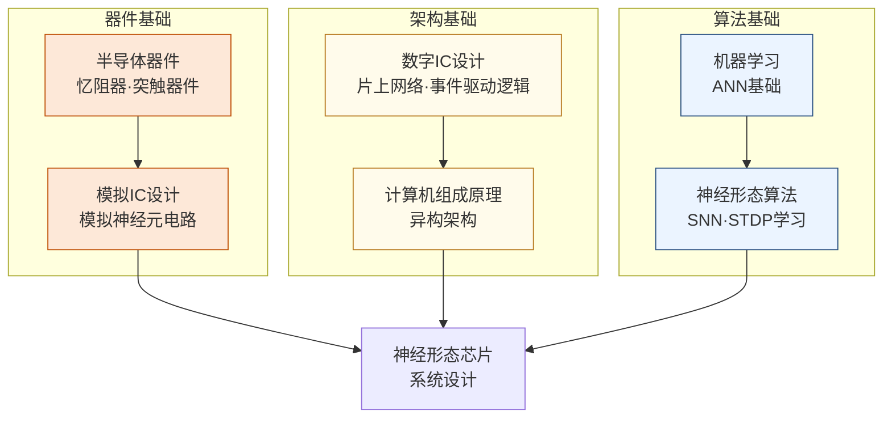

# 神经形态计算

## 一句话定义

模仿大脑神经元的脉冲放电机制，设计比传统深度学习硬件更节能的类脑芯片。

## 这个方向在研究什么

标准的深度学习计算里，神经网络是一组矩阵：输入乘以权重矩阵，经过非线性激活，再乘以下一层的权重矩阵，如此往复。这套框架在 GPU 上运行良好，但有一个根本性的低效：每一层都要把大量参数从内存读出来参与乘法，不管当前输入是否真正涉及这些参数；所有运算密集、同步地发生——整个矩阵同时计算，同时等待结果写回。这和大脑的工作方式有本质区别。生物神经元绝大多数时候是静默的，只有在接收到足够强度的输入时才发出一个短暂的电脉冲（spike），然后归于静默。这种"事件驱动"的计算模式使得神经元的能量消耗和它实际处理的信息量成正比，而不是和电路规模成正比。这是人脑总功耗约 20 瓦却能完成复杂认知任务的核心原因之一，而训练 GPT-4 的 GPU 集群单次运行功耗超过 30 兆瓦，差距超过五个数量级。

脉冲神经网络（SNN）是在算法层面对大脑这套计算范式的模仿。SNN 中每个神经元维护一个膜电位状态，输入脉冲到来时膜电位积分上升，超过阈值时发出一个脉冲，随后膜电位复位。信息以脉冲的时序和频率编码，而不是连续的浮点数激活值。对应地，神经形态芯片的硬件设计是事件驱动的：没有全局时钟强迫所有单元同步工作，而是哪里有脉冲，哪里被激活，能耗随输入稀疏程度自然降低。IBM 的 TrueNorth（2014）实现了 100 万个硅神经元和 2.56 亿个硅突触，功耗只有 70 毫瓦，却能实时完成图像分类。清华大学的天机（Tianjic）芯片更进一步，在同一块芯片上同时支持脉冲网络和传统 CNN 两套计算范式，2019 年驾驶无人自行车的实验登上了 *Nature* 封面，展示了混合架构在实际任务中的可行性。

这个方向目前最核心的瓶颈是训练。标准深度学习依赖反向传播，而反向传播需要计算每个激活值的梯度；SNN 的脉冲是不可微的离散跳变，没有梯度可以传递。研究者用"替代梯度"（surrogate gradient）绕过这一问题——前向传播时用真实的脉冲函数，反向传播时用一个平滑近似函数代替计算梯度。这个技巧有效，但引入了算法层面的近似误差，使得同等规模的 SNN 在 ImageNet 分类精度上仍落后于标准 ANN 几个百分点。另一条路是把训练好的 ANN 权重转换成 SNN 的脉冲频率编码（ANN-to-SNN 转换），精度损失更小，但需要多个时间步才能积分出稳定结果，引入了推理延迟。如何在精度、速度、能耗之间找到实际可用的平衡点，是当前最活跃的研究问题。

忆阻器（memristor）是与神经形态计算高度交织的器件方向。神经网络的突触权重需要存储，忆阻器的电阻状态可以连续调节并持久保留，天然适合模拟突触的"强度"——写入一次，断电不丢失，读取时直接参与乘法（流过器件的电流等于电导与电压的乘积，而电流在列线上自然求和，恰好完成向量内积）。这把存储和计算合一的想法和存算一体（CIM）研究高度重合。难点在于器件变异性（同批制造的器件电阻状态有偏差）和漂移（电阻值会随时间缓慢漂移），使得精确编程权重极为困难。研究者在材料层面（优化 HfO₂、GST 等材料的均匀性）和算法层面（设计对噪声鲁棒的训练方法）同时攻关，这种硬件-算法协同设计的特点，是整个神经形态方向对跨背景研究者最有吸引力的地方。

## 核心研究问题

- **脉冲神经网络（SNN）训练**：SNN 的不可微性使反向传播失效，如何有效训练大规模 SNN？
- **忆阻器（Memristor）器件**：用于模拟突触权重的 ReRAM/PCM 器件存在变异性和漂移问题，如何在算法层面补偿？
- **事件驱动硬件**：神经形态芯片是事件驱动的，如何设计高效的片上网络（NoC）和路由机制？
- **与传统 AI 的混合**：天机的实践表明，脉冲网络和传统 CNN 可以在同一芯片上协同工作，这种混合架构如何优化？

## 代表性机构与企业

| | 国际 | 国内 |
|--|------|------|
| **企业/研究院** | Intel（Loihi）、IBM（TrueNorth）、BrainChip | 华为、中科院 |
| **高校** | MIT、Stanford、海德堡大学（BrainScaleS）、苏黎世联邦理工 | 清华（天机）、北大、浙大 |
| **顶会** | NeurIPS、ICLR（SNN算法）、ISSCC、IEDM（器件） | — |

## 知识路径

**本站相关课程：**

- [半导体器件原理（复旦）](../课程资源/器件与工艺/半导体器件/半导体器件原理_FDU/MICR130006.md)
- [模拟集成电路设计原理（复旦）](../课程资源/电路/模拟/模拟集成电路/MICR130030.md)
- [数字集成电路设计原理（复旦）](../课程资源/电路/数字/数字集成电路/数字集成电路设计原理_FDU/MICR130029.md)
- [机器学习基础（CS229/CS189）](../课程资源/人工智能/机器学习/CS229.md)

## 入门三步走

**第一步：了解生物背景**  
阅读 Mahowald & Douglas, *A silicon neuron* (Nature, 1991)，两页，这是神经形态计算的奠基论文之一，说明了用模拟电路模拟神经元的基本思路。

**第二步：了解现代系统**  
阅读 Davies et al., *Loihi: A neuromorphic manycore processor with on-chip learning* (IEEE Micro, 2018)，了解工业级神经形态芯片的完整设计思路。

**第三步：动手实验**  
Intel 提供 Loihi 的云端访问权限（Intel Neuromorphic Research Community），可以申请在真实硬件上运行 SNN 实验。
