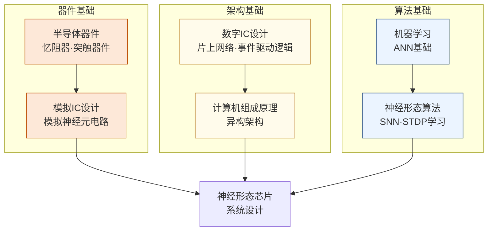

# 神经形态计算

## 一句话定义

模仿大脑神经元的脉冲放电机制，设计比传统深度学习硬件更节能的类脑芯片。

## 为什么重要

人脑处理视觉、语言、运动的功耗只有 20 瓦，而运行同等任务的 GPU 集群需要数兆瓦。这个能效差距超过五个数量级。神经形态计算试图从硬件架构层面回答：如果我们不用浮点矩阵乘法，而是模仿大脑的脉冲编码和局部学习规则，能不能造出效率革命性提升的计算芯片？

代表性系统包括 IBM 的 TrueNorth（2014）、Intel 的 Loihi 系列和清华大学的天机（Tianjic）。这个方向学术性较强，但随着边缘 AI 对极低功耗的需求，工业界的兴趣也在快速增长。

## 核心研究问题

- **脉冲神经网络（SNN）训练**：SNN 的不可微性使反向传播失效，如何有效训练大规模 SNN？
- **忆阻器（Memristor）器件**：用于模拟突触权重的 ReRAM/PCM 器件存在变异性和漂移问题，如何在算法层面补偿？
- **事件驱动硬件**：神经形态芯片是事件驱动的，如何设计高效的片上网络（NoC）和路由机制？
- **与传统 AI 的混合**：天机的实践表明，脉冲网络和传统 CNN 可以在同一芯片上协同工作，这种混合架构如何优化？

## 代表性机构与企业

| | 国际 | 国内 |
|--|------|------|
| **企业/研究院** | Intel（Loihi）、IBM（TrueNorth）、BrainChip | 华为、中科院 |
| **高校** | MIT、Stanford、海德堡大学（BrainScaleS）、苏黎世联邦理工 | 清华（天机）、北大、浙大 |
| **顶会** | NeurIPS、ICLR（SNN算法）、ISSCC、IEDM（器件） | — |

## 知识路径

**本站相关课程：**

- [半导体器件原理（复旦）](../课程资源/器件与工艺/半导体器件/半导体器件原理_FDU/MICR130006.md)
- [模拟集成电路设计原理（复旦）](../课程资源/电路/模拟/模拟集成电路/MICR130030.md)
- [数字集成电路设计原理（复旦）](../课程资源/电路/数字/数字集成电路/数字集成电路设计原理_FDU/MICR130029.md)
- [机器学习基础（CS229/CS189）](../课程资源/人工智能/机器学习/CS229.md)

## 入门三步走

**第一步：了解生物背景**  
阅读 Mahowald & Douglas, *A silicon neuron* (Nature, 1991)，两页，这是神经形态计算的奠基论文之一，说明了用模拟电路模拟神经元的基本思路。

**第二步：了解现代系统**  
阅读 Davies et al., *Loihi: A neuromorphic manycore processor with on-chip learning* (IEEE Micro, 2018)，了解工业级神经形态芯片的完整设计思路。

**第三步：动手实验**  
Intel 提供 Loihi 的云端访问权限（Intel Neuromorphic Research Community），可以申请在真实硬件上运行 SNN 实验。
