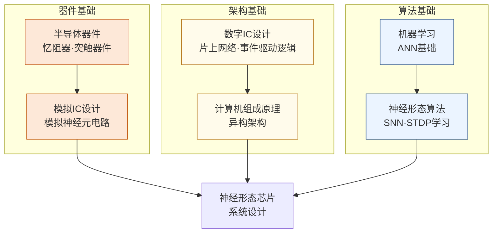

---
hide:
  - navigation
---
模仿大脑神经元的脉冲放电机制，设计比传统深度学习硬件更节能的类脑芯片。

## 这个方向在研究什么

标准的深度学习计算里，神经网络是一组矩阵：输入乘以权重矩阵，经过非线性激活，再乘以下一层的权重矩阵，如此往复。这套框架在 GPU 上运行良好，但有一个根本性的低效：每一层都要把大量参数从内存读出来参与乘法，不管当前输入是否真正涉及这些参数；所有运算密集、同步地发生——整个矩阵同时计算，同时等待结果写回。这和大脑的工作方式有本质区别。生物神经元绝大多数时候是静默的，只有在接收到足够强度的输入时才发出一个短暂的电脉冲（spike），然后归于静默。这种"事件驱动"的计算模式使得神经元的能量消耗和它实际处理的信息量成正比，而不是和电路规模成正比。这是人脑总功耗约 20 瓦却能完成复杂认知任务的核心原因之一，而训练 GPT-4 的 GPU 集群单次运行功耗超过 30 兆瓦，差距超过五个数量级。

<svg viewBox="0 0 860 220" xmlns="http://www.w3.org/2000/svg" style="width:100%;max-width:860px;display:block;margin:1.5rem auto;font-family:system-ui,sans-serif;">
  <defs>
    <marker id="snn-arrow" markerWidth="8" markerHeight="8" refX="6" refY="3" orient="auto">
      <path d="M0,0 L0,6 L8,3 z" fill="#64748B"/>
    </marker>
  </defs>
  <!-- Panel 1: ANN -->
  <rect x="10" y="10" width="255" height="200" rx="8" fill="#F8FAFC" stroke="#CBD5E1" stroke-width="1.5"/>
  <text x="137" y="32" text-anchor="middle" font-size="12" font-weight="600" fill="#334155">① 传统神经网络（ANN）</text>
  <!-- Input vector -->
  <rect x="28" y="45" width="30" height="120" rx="4" fill="#DBEAFE" stroke="#3B82F6" stroke-width="1"/>
  <text x="43" y="85" text-anchor="middle" font-size="9" fill="#1D4ED8">0.8</text>
  <text x="43" y="100" text-anchor="middle" font-size="9" fill="#1D4ED8">0.3</text>
  <text x="43" y="115" text-anchor="middle" font-size="9" fill="#1D4ED8">0.9</text>
  <text x="43" y="130" text-anchor="middle" font-size="9" fill="#1D4ED8">0.2</text>
  <text x="43" y="145" text-anchor="middle" font-size="9" fill="#1D4ED8">0.7</text>
  <text x="43" y="175" text-anchor="middle" font-size="9" fill="#64748B">输入</text>
  <!-- × symbol -->
  <text x="75" y="112" text-anchor="middle" font-size="16" font-weight="bold" fill="#475569">×</text>
  <!-- Weight matrix -->
  <rect x="88" y="45" width="80" height="120" rx="4" fill="#DBEAFE" stroke="#3B82F6" stroke-width="1"/>
  <text x="128" y="70" text-anchor="middle" font-size="8" fill="#1D4ED8">W₁₁ W₁₂ W₁₃</text>
  <text x="128" y="85" text-anchor="middle" font-size="8" fill="#1D4ED8">W₂₁ W₂₂ W₂₃</text>
  <text x="128" y="100" text-anchor="middle" font-size="8" fill="#1D4ED8">W₃₁ W₃₂ W₃₃</text>
  <text x="128" y="115" text-anchor="middle" font-size="8" fill="#1D4ED8">W₄₁ W₄₂ W₄₃</text>
  <text x="128" y="130" text-anchor="middle" font-size="8" fill="#1D4ED8">W₅₁ W₅₂ W₅₃</text>
  <text x="128" y="175" text-anchor="middle" font-size="9" fill="#64748B">权重矩阵</text>
  <!-- = symbol -->
  <text x="183" y="112" text-anchor="middle" font-size="16" font-weight="bold" fill="#475569">=</text>
  <!-- Output -->
  <rect x="196" y="65" width="30" height="80" rx="4" fill="#DBEAFE" stroke="#3B82F6" stroke-width="1"/>
  <text x="211" y="95" text-anchor="middle" font-size="9" fill="#1D4ED8">0.6</text>
  <text x="211" y="110" text-anchor="middle" font-size="9" fill="#1D4ED8">0.4</text>
  <text x="211" y="125" text-anchor="middle" font-size="9" fill="#1D4ED8">0.8</text>
  <text x="211" y="175" text-anchor="middle" font-size="9" fill="#64748B">输出</text>
  <text x="137" y="195" text-anchor="middle" font-size="9" fill="#64748B">每层全量计算 | 功耗高 | GPU擅长</text>
  <!-- Arrow -->
  <line x1="265" y1="110" x2="295" y2="110" stroke="#64748B" stroke-width="1.5" marker-end="url(#snn-arrow)"/>
  <!-- Panel 2: SNN -->
  <rect x="297" y="10" width="260" height="200" rx="8" fill="#F8FAFC" stroke="#CBD5E1" stroke-width="1.5"/>
  <text x="427" y="32" text-anchor="middle" font-size="12" font-weight="600" fill="#334155">② 脉冲神经网络（SNN）</text>
  <!-- Neurons (circles) - most silent, few firing -->
  <!-- Row 1 -->
  <circle cx="340" cy="70" r="10" fill="#E2E8F0" stroke="#94A3B8" stroke-width="1"/>
  <circle cx="370" cy="70" r="10" fill="#E2E8F0" stroke="#94A3B8" stroke-width="1"/>
  <circle cx="400" cy="70" r="10" fill="#FEF3C7" stroke="#D97706" stroke-width="2"/>
  <line x1="400" y1="58" x2="400" y2="44" stroke="#D97706" stroke-width="2"/>
  <polyline points="394,44 400,36 406,44" fill="none" stroke="#D97706" stroke-width="1.5"/>
  <circle cx="430" cy="70" r="10" fill="#E2E8F0" stroke="#94A3B8" stroke-width="1"/>
  <circle cx="460" cy="70" r="10" fill="#E2E8F0" stroke="#94A3B8" stroke-width="1"/>
  <!-- Row 2 -->
  <circle cx="340" cy="110" r="10" fill="#E2E8F0" stroke="#94A3B8" stroke-width="1"/>
  <circle cx="370" cy="110" r="10" fill="#FEF3C7" stroke="#D97706" stroke-width="2"/>
  <line x1="370" y1="98" x2="370" y2="84" stroke="#D97706" stroke-width="2"/>
  <polyline points="364,84 370,76 376,84" fill="none" stroke="#D97706" stroke-width="1.5"/>
  <circle cx="400" cy="110" r="10" fill="#E2E8F0" stroke="#94A3B8" stroke-width="1"/>
  <circle cx="430" cy="110" r="10" fill="#E2E8F0" stroke="#94A3B8" stroke-width="1"/>
  <circle cx="460" cy="110" r="10" fill="#E2E8F0" stroke="#94A3B8" stroke-width="1"/>
  <!-- Row 3 -->
  <circle cx="340" cy="150" r="10" fill="#E2E8F0" stroke="#94A3B8" stroke-width="1"/>
  <circle cx="370" cy="150" r="10" fill="#E2E8F0" stroke="#94A3B8" stroke-width="1"/>
  <circle cx="400" cy="150" r="10" fill="#E2E8F0" stroke="#94A3B8" stroke-width="1"/>
  <circle cx="430" cy="150" r="10" fill="#FEF3C7" stroke="#D97706" stroke-width="2"/>
  <line x1="430" y1="138" x2="430" y2="124" stroke="#D97706" stroke-width="2"/>
  <polyline points="424,124 430,116 436,124" fill="none" stroke="#D97706" stroke-width="1.5"/>
  <circle cx="460" cy="150" r="10" fill="#E2E8F0" stroke="#94A3B8" stroke-width="1"/>
  <!-- Legend -->
  <circle cx="490" cy="80" r="7" fill="#E2E8F0" stroke="#94A3B8" stroke-width="1"/>
  <text x="502" y="84" font-size="9" fill="#64748B">静默</text>
  <circle cx="490" cy="100" r="7" fill="#FEF3C7" stroke="#D97706" stroke-width="1.5"/>
  <text x="502" y="104" font-size="9" fill="#D97706">激活</text>
  <text x="427" y="180" text-anchor="middle" font-size="9" fill="#64748B">事件驱动 | 只有脉冲才耗能 | 稀疏高效</text>
  <text x="427" y="195" text-anchor="middle" font-size="9" fill="#64748B">信息以脉冲时序和频率编码</text>
  <!-- Arrow -->
  <line x1="557" y1="110" x2="587" y2="110" stroke="#64748B" stroke-width="1.5" marker-end="url(#snn-arrow)"/>
  <!-- Panel 3: Bio Neuron -->
  <rect x="590" y="10" width="260" height="200" rx="8" fill="#F8FAFC" stroke="#CBD5E1" stroke-width="1.5"/>
  <text x="720" y="32" text-anchor="middle" font-size="12" font-weight="600" fill="#334155">③ 生物神经元（参照）</text>
  <!-- Dendrite -->
  <line x1="620" y1="110" x2="660" y2="110" stroke="#16A34A" stroke-width="2"/>
  <line x1="625" y1="95" x2="660" y2="110" stroke="#16A34A" stroke-width="1.5"/>
  <line x1="625" y1="125" x2="660" y2="110" stroke="#16A34A" stroke-width="1.5"/>
  <text x="630" y="145" text-anchor="middle" font-size="9" fill="#15803D">树突</text>
  <!-- Soma -->
  <circle cx="690" cy="110" r="20" fill="#DCFCE7" stroke="#16A34A" stroke-width="2"/>
  <text x="690" y="114" text-anchor="middle" font-size="9" fill="#15803D">胞体</text>
  <!-- Axon -->
  <line x1="710" y1="110" x2="790" y2="110" stroke="#16A34A" stroke-width="2"/>
  <!-- Sparse spikes on axon -->
  <line x1="730" y1="110" x2="730" y2="90" stroke="#D97706" stroke-width="2"/>
  <line x1="755" y1="110" x2="755" y2="90" stroke="#D97706" stroke-width="2"/>
  <text x="720" y="145" text-anchor="middle" font-size="9" fill="#64748B">轴突（稀疏放电）</text>
  <text x="720" y="175" text-anchor="middle" font-size="9" fill="#64748B">大脑约 20 W</text>
  <text x="720" y="192" text-anchor="middle" font-size="9" fill="#64748B">完成复杂认知任务</text>
</svg>

脉冲神经网络（SNN）是在算法层面对大脑这套计算范式的模仿。SNN 中每个神经元维护一个膜电位状态，输入脉冲到来时膜电位积分上升，超过阈值时发出一个脉冲，随后膜电位复位。信息以脉冲的时序和频率编码，而不是连续的浮点数激活值。对应地，神经形态芯片的硬件设计是事件驱动的：没有全局时钟强迫所有单元同步工作，而是哪里有脉冲，哪里被激活，能耗随输入稀疏程度自然降低。IBM 的 TrueNorth（2014）实现了 100 万个硅神经元和 2.56 亿个硅突触，功耗只有 70 毫瓦，却能实时完成图像分类。清华大学的天机（Tianjic）芯片更进一步，在同一块芯片上同时支持脉冲网络和传统 CNN 两套计算范式，2019 年驾驶无人自行车的实验登上了 *Nature* 封面，展示了混合架构在实际任务中的可行性。

这个方向目前最核心的瓶颈是训练。标准深度学习依赖反向传播，而反向传播需要计算每个激活值的梯度；SNN 的脉冲是不可微的离散跳变，没有梯度可以传递。研究者用"替代梯度"（surrogate gradient）绕过这一问题——前向传播时用真实的脉冲函数，反向传播时用一个平滑近似函数代替计算梯度。这个技巧有效，但引入了算法层面的近似误差，使得同等规模的 SNN 在 ImageNet 分类精度上仍落后于标准 ANN 几个百分点。另一条路是把训练好的 ANN 权重转换成 SNN 的脉冲频率编码（ANN-to-SNN 转换），精度损失更小，但需要多个时间步才能积分出稳定结果，引入了推理延迟。如何在精度、速度、能耗之间找到实际可用的平衡点，是当前最活跃的研究问题。

忆阻器（memristor）是与神经形态计算高度交织的器件方向。神经网络的突触权重需要存储，忆阻器的电阻状态可以连续调节并持久保留，天然适合模拟突触的"强度"——写入一次，断电不丢失，读取时直接参与乘法（流过器件的电流等于电导与电压的乘积，而电流在列线上自然求和，恰好完成向量内积）。这把存储和计算合一的想法和存算一体（CIM）研究高度重合。难点在于器件变异性（同批制造的器件电阻状态有偏差）和漂移（电阻值会随时间缓慢漂移），使得精确编程权重极为困难。研究者在材料层面（优化 HfO₂、GST 等材料的均匀性）和算法层面（设计对噪声鲁棒的训练方法）同时攻关，这种硬件-算法协同设计的特点，是整个神经形态方向对跨背景研究者最有吸引力的地方。

## 适合什么样的人

这个方向有三个入口，适合不同背景的人从不同角度切入，最终在系统层汇合：

**器件/材料方向**：如果你对忆阻器、ReRAM、铁电器件有兴趣，可以从器件物理出发，研究如何优化突触器件的均匀性和保持特性。器件背景可以直接对接清华吴华强、唐建石，以及复旦的忆阻器课题组。

**电路方向**：模拟 IC 基础扎实的学生可以设计神经元电路（积分-触发电路）和脉冲路由网络（NoC）。这是数字+模拟混合设计的典型场景，电路背景在这里非常直接。

**算法方向**：机器学习基础好的学生可以专注替代梯度训练、ANN-to-SNN 转换、以及神经形态学习规则。这个入口对硬件背景要求低，但需要理解 SNN 的时序动力学。

需要提前了解的一点：SNN 在主流分类任务上的精度目前仍落后于标准 ANN 几个百分点，这不是工程问题而是算法层面仍未解决的挑战。如果你的目标是"最高精度"，传统 GPU 加速方向更成熟。这个方向更适合对"能效比"和"神经科学启发"本身感兴趣的人。

这个方向同时投 ISSCC/IEDM（器件/电路）和 NeurIPS/ICLR（算法），是少数可以同时积累硬件和 AI 社区声誉的交叉方向。

## 核心研究问题

- **脉冲神经网络（SNN）训练**：SNN 的不可微性使反向传播失效，如何有效训练大规模 SNN？
- **忆阻器（Memristor）器件**：用于模拟突触权重的 ReRAM/PCM 器件存在变异性和漂移问题，如何在算法层面补偿？
- **事件驱动硬件**：神经形态芯片是事件驱动的，如何设计高效的片上网络（NoC）和路由机制？
- **与传统 AI 的混合**：天机的实践表明，脉冲网络和传统 CNN 可以在同一芯片上协同工作，这种混合架构如何优化？

## 代表性机构

| | 国际 | 国内 |
|--|------|------|
| **企业/研究院** | Intel（Loihi）、IBM（TrueNorth）、BrainChip | 华为、中科院 |
| **顶会** | NeurIPS、ICLR（SNN算法）、ISSCC、IEDM（器件） | — |

## 知识路径

**本站相关课程：**

- [器件与工艺](../课程资源/器件与工艺/index.md)
- [电路](../课程资源/电路/index.md)
- [人工智能](../课程资源/人工智能/index.md)

## 入门三步走

**典型研究长什么样**

顶会（ISSCC、NeurIPS）的类脑芯片论文通常围绕一个核心数字：能效比（TOPS/W 或 pJ/spike）。论文会展示新芯片或新算法如何在保持精度的前提下降低能耗，通常包含与 GPU/TPU 的对比表格，以及在 MNIST、DVS 事件相机数据集上的精度测试。器件类论文（IEDM）则聚焦于单个忆阻器的 I-V 特性、耐久性和保持特性曲线。一篇 ISSCC 芯片论文背后通常是一次完整的流片和测量，周期约 1-2 年。

**第一步：了解生物背景**  
阅读 Mahowald & Douglas, *A silicon neuron* (Nature, 1991)，两页，这是神经形态计算的奠基论文之一，说明了用模拟电路模拟神经元的基本思路。

**第二步：了解现代系统**  
阅读 Davies et al., *Loihi: A neuromorphic manycore processor with on-chip learning* (IEEE Micro, 2018)，了解工业级神经形态芯片的完整设计思路。

**第三步：动手实验**  
Intel 提供 Loihi 的云端访问权限（Intel Neuromorphic Research Community），可以申请在真实硬件上运行 SNN 实验。

## 相关课题组

### 境内

-   **[施路平](https://faculty.dpi.tsinghua.edu.cn/shiluping/zh_CN/index.htm)** 清华

    天机（Tianjic）神经形态芯片 · SNN/ANN 融合架构

-   **[吴华强](https://www.ime.tsinghua.edu.cn/info/1015/1787.htm)** 清华

    忆阻器件与存内计算芯片 · 器件到系统全栈设计

-   **[张悠慧](https://craft.cs.tsinghua.edu.cn/)** 清华

    神经形态计算编译器 · 运行时框架与系统架构

-   **[裴京](https://craft.cs.tsinghua.edu.cn/author/jing-pei/)** 清华

    天机芯片架构设计 · ANN/SNN 混合计算范式

-   **[唐建石](https://www.ime.tsinghua.edu.cn/info/1035/1595.htm)** 清华

    忆阻器突触/神经元 · 储备池计算

-   **[陈虹](https://www.sic.tsinghua.edu.cn/info/1014/1827.htm)** 清华 

    在线学习异步神经形态处理器 · 超低功耗神经形态芯片

-   **[黄如](https://ic.pku.edu.cn/szdw/ysfc/hr/index.htm)** 北大 

    神经形态器件 · 铁电存储器 · 先进突触器件与类脑系统

-   **[杨玉超](http://yuchaolab.cn/)** 北大

    忆阻器 AI 硬件 · SNN · 突触/神经元器件

-   **[蔡一茂](https://ic.pku.edu.cn/en/Faculty/Facultys/DepartmentofMicroNanoelectronics/CaiYimao/index.htm)** 北大

    RRAM 忆阻器件 · 神经形态计算

-   **[张续猛](https://icmne.fudan.edu.cn/2d/5e/c48925a732510/page.htm)** 复旦

    忆阻器神经元电路 · 脉冲类脑芯片

-   **[周鹏](https://sme.fudan.edu.cn/60/68/c31158a352360/page.htm)** 复旦

    二维半导体感存算一体 · 仿视网膜集成 · 视觉假体

-   **[刘琦](https://icmne.fudan.edu.cn/2d/2a/c48925a732458/page.htm)** 复旦

    ReRAM/FeRAM 类脑计算芯片 · SNN 无监督学习

<button class="prof-show-all">显示全部 ↓</button>

### 境外

-   **[Ngai Wong（黃毅）](https://www.eee.hku.hk/~nwong/)** 港大

    忆阻器/ReRAM 神经形态芯片 · 紧凑神经网络与张量代数优化

-   **[Kwabena Boahen](https://web.stanford.edu/group/brainsinsilicon/)** Stanford

    大脑计算原理逆向工程 · Neurogrid 类脑芯片

-   **[Shimeng Yu（余诗孟）](https://shimeng.ece.gatech.edu/)** Georgia Tech

    新型存储器件与 CIM 架构 · NeuroSim 仿真工具

-   **[Kaushik Roy](https://engineering.purdue.edu/NRL)** Purdue

    神经形态计算与节能深度学习 · 器件/电路/算法协同设计

-   **[Wei Lu（卢伟）](https://web.eecs.umich.edu/~wluee/)** U Michigan

    RRAM/忆阻器 · 存算一体（CIM） · 神经形态电路 · Crossbar/MemryX 创始人

-   **[Yiran Chen（陈怡然）](https://ece.duke.edu/faculty/yiran-chen)** Duke

    神经形态计算 · 新兴存储与处理-存内计算 · 边缘 AI 加速器

-   **[Damien Querlioz](https://sites.google.com/site/damienquerlioz/)** Paris-Saclay / CNRS

    生物启发纳米电子学 · 忆阻器突触 · 物理启发贝叶斯计算

-   **[Marian Verhelst](https://www.esat.kuleuven.be/micas/index.php/marian-verhelst)** KU Leuven / imec 

    嵌入式 ML 加速器 · 数模混合神经网络 SoC（DIANA） · 边缘低功耗处理

<button class="prof-show-all">显示全部 ↓</button>
