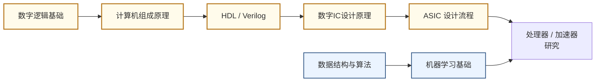

---
---
# 计算芯片与处理器架构

## 一句话定义

设计让计算机"想得更快、更省电"的核心硬件——从通用 CPU 到专为 AI 打造的神经网络加速器。

## 这个方向在研究什么

处理器的工作原理在教科书里描述起来很简单：取指、译码、执行、写回，周而复始。但真正的挑战不在于"能不能做计算"，而在于"在物理约束下怎样让这台机器更快、更省电"。过去三十年，答案一直是"缩小晶体管、提高频率"——制程从微米到纳米，时钟从 MHz 到 GHz，性能翻倍几乎不需要架构上的创新。这条路大约在 2005 年走到了一个转折点：时钟频率停在了 4GHz 附近，因为再往上功耗密度就超过散热极限。于是研究重心转移了——同样数量的晶体管，怎样用架构设计让它们协作得更高效，成了核心问题。

这个领域里一个最根本的挑战叫"内存墙"（Memory Wall）。处理器的运算速度以每秒数百 TFLOPS 甚至 PFLOPS 计，但主内存的带宽往往只有几百 GB/s，二者相差几十倍。结果是：芯片大量时间不是在计算，而是在等数据从内存传来。训练一个大语言模型时，GPU 的实际有效利用率有时低于 30%，其余时间全在等参数搬运。为了应对这个问题，研究者设计各种数据流架构，让数据在芯片内部的寄存器和小型 SRAM 里尽量"就近复用"，减少对片外内存的访问次数。不同的数据流设计——行固定、权重固定、输出固定——对不同类型的神经网络层有各自的优劣，这是加速器设计里的核心权衡。

AI 的崛起带来了另一个分支：领域专用架构（DSA）。通用 CPU 设计的目标是能执行任意程序，因此它的电路里充满了分支预测器、乱序执行引擎等为通用计算准备的复杂机制。但这些机制在做矩阵乘法（神经网络推理的核心操作）时几乎完全用不上，大量晶体管只是在空转。Google 的 TPU 第一代（2016）就是把上述冗余全部去掉、专门做矩阵乘法的产物——它的核心是一个脉动阵列（systolic array），数据像波浪一样在乘法器间流动，完全不需要为每次运算单独发指令。结果是在同等功耗下，TPU 的神经网络推理吞吐量是当时服务器级 GPU 的 15-30 倍。这个思路引发了整个行业的专用芯片浪潮：苹果 Neural Engine、华为昇腾、特斯拉 FSD 芯片，背后逻辑都一样——把算法固定下来，让硬件跟算法完美匹配。

研究者日常工作的核心是"设计-验证-分析"的循环。用 Verilog 或 Chisel 写硬件描述代码，在仿真器里验证逻辑正确，用 EDA 工具做综合和时序分析，在 FPGA 上跑原型评估性能，最终通过分析内存访问模式、执行效率、功耗分解来定位瓶颈并迭代。学术组的论文通常不需要真的流片，而是通过 RTL 仿真 + 工艺库估算，给出面积、频率、功耗等指标的量化对比。这个方向要求同时懂算法（知道 Transformer attention 的计算瓶颈在哪）和电路（知道如何在硬件上高效实现），是 EE 和 CS 交叉最密集的子领域之一。

## 核心研究问题

- **内存墙（Memory Wall）**：计算速度远超内存带宽，数据搬运成为瓶颈，如何设计存储层次和数据流？
- **能效墙（Power Wall）**：芯片功耗密度接近散热极限，如何在有限功耗内最大化算力？
- **专用 vs 通用**：CPU 灵活但低效，DSA（领域专用架构）高效但不灵活，如何找到最优平衡？
- **可编程性**：AI 模型快速迭代，如何让硬件架构跟上算法变化？

## 代表性机构与企业

| | 国际 | 国内 |
|--|------|------|
| **企业** | NVIDIA、Apple、Google（TPU）、Qualcomm | 华为海思、寒武纪、地平线、摩尔线程 |
| **高校** | MIT、UCB、CMU、Stanford、UIUC | 清华、北大、复旦、中科院 |
| **顶会** | ISCA、MICRO、HPCA、Hot Chips、ISSCC | — |

## 知识路径

**本站相关课程（按学习顺序）：**

1. [数字逻辑基础（复旦）](../课程资源/电路/数字/数字逻辑基础/数字逻辑基础_FDU/MICR130003.md)
2. [计算机组成原理（复旦）](../课程资源/系统架构/速通/MICR130038.md) · [UCB CS61C](../课程资源/系统架构/体系结构/CS61C.md)
3. [Verilog HDL · HDLBits](../课程资源/电路/硬件描述语言(HDL)/Verilog/HDLBits.md) · [UCB EECS151](../课程资源/电路/硬件描述语言(HDL)/Verilog/EECS151.md)
4. [数字集成电路设计原理（复旦）](../课程资源/电路/数字/数字集成电路/数字集成电路设计原理_FDU/MICR130029.md)
5. [ASIC 设计（复旦）](../课程资源/电路/ASIC/INFO130094.md)

## 入门三步走

**第一步：建立直觉**  
观看 Hennessy & Patterson 2017 年图灵奖演讲（YouTube 搜索"Turing Lecture 2017 Hennessy Patterson"），20 分钟，了解计算机架构 50 年演进脉络。

**第二步：动手实现**  
跟随 UCB EECS151 的 FPGA Lab，在真实硬件上实现一个五级流水线 RISC-V 处理器。这是目前开放资料中最完整的处理器设计实验。

**第三步：读经典论文**  
- Jouppi et al., *In-Datacenter Performance Analysis of a Tensor Processing Unit* (Google TPU, ISCA 2017)  
- Chen et al., *Eyeriss: An Energy-Efficient Reconfigurable Accelerator for Deep CNN* (ISSCC 2016)

## 相关课题组

### 境内

-   **[马恺声](http://group.iiis.tsinghua.edu.cn/~maks/)** 清华

    Post-Moore 芯片架构 · AI 算法协同设计

-   **[高鸣宇](https://people.iiis.tsinghua.edu.cn/~gaomy/)** 清华

    计算机体系结构 · 高效内存系统 · 数据密集型负载加速

-   **[汪玉](https://web.ee.tsinghua.edu.cn/wangyu/zh_CN/index.htm)** 清华

    DNN/LLM 加速器 · FPGA 异构计算 · IEEE Fellow

-   **[尹首一](https://www.sic.tsinghua.edu.cn/info/1040/1567.htm) & [魏少军](https://www.sic.tsinghua.edu.cn/en/info/1083/1444.htm)** 清华

    神经网络加速器（Thinker）· 软件定义芯片 · 可重构计算架构 · VLSI 设计方法学

-   **[翟季冬](https://pacman.cs.tsinghua.edu.cn/~zjd/)** 清华

    并行计算 · 编译器优化 · HPC 与 AI 编程模型

-   **[刘雷波](https://www.sic.tsinghua.edu.cn/info/1014/1807.htm)** 清华

    软件定义芯片架构 · 可重构计算 · 编译器协同优化

-   **[孙广宇](https://ic.pku.edu.cn/szdw/zzjs/sjzdhyjsxtx1/sgy/index.htm)** 北大

    领域定制体系架构 · 存算融合 · 深度学习加速器

-   **[叶乐](https://ic.pku.edu.cn/szdw/zzjs/jcdlsjx1/yl/index.htm)** 北大

    存算一体 AI 芯片 · 3D 集成 · ISSCC 2021 最佳芯片

-   **[罗国杰](http://ceca.pku.edu.cn/en/people_/faculty_/guojie_luo/)** 北大

    可重构架构与 EDA · 近数据计算 · 深度学习加速器

-   **[程旭](https://cs.pku.edu.cn/info/1062/1607.htm)** 北大

    计算机系统结构 · 国产 CPU（北大-众志）

-   **[曾晓洋](https://sme.fudan.edu.cn/60/76/c31158a352374/page.htm)** 复旦

    高能效 SoC · 嵌入式 AI 芯片 · 智能集成系统

-   **[韩军](https://sme.fudan.edu.cn/5f/da/c31145a352218/page.htm)** 复旦

    RISC-V 处理器 · AI 边缘 SoC · 二维半导体处理器

-   **[范益波](https://sme.fudan.edu.cn/5f/d2/c31143a352210/page.htm)** 复旦

    多媒体 SoC · VPU/ISP/NPU 架构

-   **[陈迟晓](https://fics.fudan.edu.cn/4c/e6/c39908a412902/page.htm)** 复旦

    AI 芯片算法-电路-架构协同 · 感存算一体 · Chiplet

-   **[陈云霁](https://novel.ict.ac.cn/ychen_cn/)** 中科院

    深度学习处理器（DianNao）· 寒武纪创始人

-   **[包云岗](https://acs.ict.ac.cn/baoyg/)** 中科院

    开源 RISC-V 处理器（香山）· 数据中心架构

<button class="prof-show-all">显示全部 ↓</button>

### 境外

-   **[谢源](https://ece.hkust.edu.hk/yuanxie)** 港科大

    计算机体系结构 · 3D IC · AI 加速器 · IEEE Fellow

-   **[涂锋斌](https://ece.hkust.edu.hk/fengbintu)** 港科大

    高能效深度学习加速器 · 存算一体芯片

-   **[Song Han（韩松）](https://hanlab.mit.edu/songhan)** MIT

    高效深度学习 · LLM 量化（AWQ）· 硬件感知 NAS

-   **[Vivienne Sze](https://eems.mit.edu/)** MIT

    深度学习硬件加速 · Eyeriss 加速器 · 视频压缩

-   **[Yakun Sophia Shao](https://people.eecs.berkeley.edu/~ysshao/)** UC Berkeley

    领域专用加速器 · 敏捷 VLSI · Chipyard/Gemmini

-   **[Zhiru Zhang](https://zhang.ece.cornell.edu/)** Cornell

    高层次综合（HLS）· FPGA 加速 · 算法硬件协同

-   **[Onur Mutlu](https://people.inf.ethz.ch/omutlu/)** ETH Zürich

    存储系统（RowHammer）· 近存计算 · DRAM 可靠性

-   **[Yiran Chen](https://ece.duke.edu/people/yiran-chen/)** Duke

    NVM/STT-MRAM · AI 硬件协同 · DNN 压缩与加速

-   **[Joel Emer](https://people.csail.mit.edu/emer/)** MIT

    稀疏张量加速器（Eyeriss/Sparseloop）· 深度学习硬件架构 · 微架构分析

-   **[Priyanka Raina](https://priyanka-raina.github.io/)** Stanford

    领域专用加速器 · 近数据处理（NDP）· 敏捷 VLSI 设计

-   **[Vijay Janapa Reddi](https://scholar.harvard.edu/vijay-janapa-reddi)** Harvard

    TinyML / 边缘 AI · MLPerf 基准测试 · 移动设备推理系统

-   **[Gu-Yeon Wei](https://seas.harvard.edu/person/gu-yeon-wei)** Harvard

    AI 加速器 · 数模混合 IC · 高能效计算系统

-   **[Tushar Krishna](https://www.tushar-krishna.com/)** Georgia Tech

    片上网络（NoC）· DNN 加速器互联 · 多芯片系统架构

-   **[Hyesoon Kim](https://hyesoon-kim.com/)** Georgia Tech

    GPU / CPU 架构 · 硬件-软件协同 · 图计算加速

-   **[Nathan Beckmann](https://www.cs.cmu.edu/~beckmann/)** CMU

    缓存层次结构 · 内存系统架构 · 计算机体系结构

-   **[Tony Nowatzki](https://web.cs.ucla.edu/~nowatzki/)** UCLA

    领域专用加速器 · 数据流架构 · 近存计算（PIM）

<button class="prof-show-all">显示全部 ↓</button>

