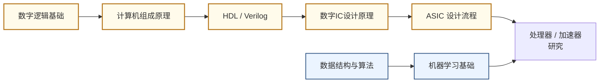

# 计算芯片与处理器架构

## 一句话定义

设计让计算机"想得更快、更省电"的核心硬件——从通用 CPU 到专为 AI 打造的神经网络加速器。

## 这个方向在研究什么

处理器的工作原理在教科书里描述起来很简单：取指、译码、执行、写回，周而复始。但真正的挑战不在于"能不能做计算"，而在于"在物理约束下怎样让这台机器更快、更省电"。过去三十年，答案一直是"缩小晶体管、提高频率"——制程从微米到纳米，时钟从 MHz 到 GHz，性能翻倍几乎不需要架构上的创新。这条路大约在 2005 年走到了一个转折点：时钟频率停在了 4GHz 附近，因为再往上功耗密度就超过散热极限。于是研究重心转移了——同样数量的晶体管，怎样用架构设计让它们协作得更高效，成了核心问题。

这个领域里一个最根本的挑战叫"内存墙"（Memory Wall）。处理器的运算速度以每秒数百 TFLOPS 甚至 PFLOPS 计，但主内存的带宽往往只有几百 GB/s，二者相差几十倍。结果是：芯片大量时间不是在计算，而是在等数据从内存传来。训练一个大语言模型时，GPU 的实际有效利用率有时低于 30%，其余时间全在等参数搬运。为了应对这个问题，研究者设计各种数据流架构，让数据在芯片内部的寄存器和小型 SRAM 里尽量"就近复用"，减少对片外内存的访问次数。不同的数据流设计——行固定、权重固定、输出固定——对不同类型的神经网络层有各自的优劣，这是加速器设计里的核心权衡。

AI 的崛起带来了另一个分支：领域专用架构（DSA）。通用 CPU 设计的目标是能执行任意程序，因此它的电路里充满了分支预测器、乱序执行引擎等为通用计算准备的复杂机制。但这些机制在做矩阵乘法（神经网络推理的核心操作）时几乎完全用不上，大量晶体管只是在空转。Google 的 TPU 第一代（2016）就是把上述冗余全部去掉、专门做矩阵乘法的产物——它的核心是一个脉动阵列（systolic array），数据像波浪一样在乘法器间流动，完全不需要为每次运算单独发指令。结果是在同等功耗下，TPU 的神经网络推理吞吐量是当时服务器级 GPU 的 15-30 倍。这个思路引发了整个行业的专用芯片浪潮：苹果 Neural Engine、华为昇腾、特斯拉 FSD 芯片，背后逻辑都一样——把算法固定下来，让硬件跟算法完美匹配。

研究者日常工作的核心是"设计-验证-分析"的循环。用 Verilog 或 Chisel 写硬件描述代码，在仿真器里验证逻辑正确，用 EDA 工具做综合和时序分析，在 FPGA 上跑原型评估性能，最终通过分析内存访问模式、执行效率、功耗分解来定位瓶颈并迭代。学术组的论文通常不需要真的流片，而是通过 RTL 仿真 + 工艺库估算，给出面积、频率、功耗等指标的量化对比。这个方向要求同时懂算法（知道 Transformer attention 的计算瓶颈在哪）和电路（知道如何在硬件上高效实现），是 EE 和 CS 交叉最密集的子领域之一。

## 核心研究问题

- **内存墙（Memory Wall）**：计算速度远超内存带宽，数据搬运成为瓶颈，如何设计存储层次和数据流？
- **能效墙（Power Wall）**：芯片功耗密度接近散热极限，如何在有限功耗内最大化算力？
- **专用 vs 通用**：CPU 灵活但低效，DSA（领域专用架构）高效但不灵活，如何找到最优平衡？
- **可编程性**：AI 模型快速迭代，如何让硬件架构跟上算法变化？

## 代表性机构与企业

| | 国际 | 国内 |
|--|------|------|
| **企业** | NVIDIA、Apple、Google（TPU）、Qualcomm | 华为海思、寒武纪、地平线、摩尔线程 |
| **高校** | MIT、UCB、CMU、Stanford、UIUC | 清华、北大、复旦、中科院 |
| **顶会** | ISCA、MICRO、HPCA、Hot Chips、ISSCC | — |

## 知识路径

**本站相关课程（按学习顺序）：**

1. [数字逻辑基础（复旦）](../课程资源/电路/数字/数字逻辑基础/数字逻辑基础_FDU/MICR130003.md)
2. [计算机组成原理（复旦）](../课程资源/系统架构/速通/MICR130038.md) · [UCB CS61C](../课程资源/系统架构/体系结构/CS61C.md)
3. [Verilog HDL · HDLBits](../课程资源/电路/硬件描述语言(HDL)/Verilog/HDLBits.md) · [UCB EECS151](../课程资源/电路/硬件描述语言(HDL)/Verilog/EECS151.md)
4. [数字集成电路设计原理（复旦）](../课程资源/电路/数字/数字集成电路/数字集成电路设计原理_FDU/MICR130029.md)
5. [ASIC 设计（复旦）](../课程资源/电路/ASIC/INFO130094.md)

## 入门三步走

**第一步：建立直觉**  
观看 Hennessy & Patterson 2017 年图灵奖演讲（YouTube 搜索"Turing Lecture 2017 Hennessy Patterson"），20 分钟，了解计算机架构 50 年演进脉络。

**第二步：动手实现**  
跟随 UCB EECS151 的 FPGA Lab，在真实硬件上实现一个五级流水线 RISC-V 处理器。这是目前开放资料中最完整的处理器设计实验。

**第三步：读经典论文**  
- Jouppi et al., *In-Datacenter Performance Analysis of a Tensor Processing Unit* (Google TPU, ISCA 2017)  
- Chen et al., *Eyeriss: An Energy-Efficient Reconfigurable Accelerator for Deep CNN* (ISSCC 2016)
