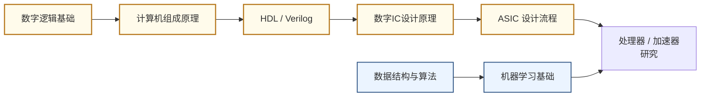

# 计算芯片与处理器架构

## 一句话定义

设计让计算机"想得更快、更省电"的核心硬件——从通用 CPU 到专为 AI 打造的神经网络加速器。

## 你身边的产品

你每天用的手机，它拍照时看起来只是按了一下快门，但背后 Apple A18 Pro 芯片里专门设计的 Neural Engine 在同一瞬间完成了景深估计、噪声抑制、色调映射等十几个模型的推理。这块芯片集成了约 190 亿颗晶体管，面积不到指甲盖大，却是数十年处理器架构研究的结晶。苹果 M 系列芯片把 CPU、GPU 和内存放在同一块硅片上（统一内存架构），解决了数据在不同芯片间搬运太慢的问题——这不是工程技巧，而是架构研究上的一次系统性重新设计。

ChatGPT 背后的硬件规模让人震惊：OpenAI 训练 GPT-4 动用了约 25,000 块 NVIDIA A100 GPU，单次训练耗资估计超过一亿美元，运行期间的总功耗相当于一座小型城市的用电量。每块 H100 GPU 包含 800 亿颗晶体管，是目前人类制造的最复杂单体芯片。这个数量级的算力需求，让"如何设计更高效的芯片架构"从学术问题变成了影响整个 AI 产业节奏的核心命题。

## 为什么重要

摩尔定律放缓后，单靠制程进步已经无法满足算力需求。ChatGPT 背后的训练集群消耗了数千块 GPU；手机里的 SoC 要同时跑影像处理、语音识别、基带通信。算力的竞争本质上是**芯片架构的竞争**。

这个方向的工业产出直接定义了 AI 时代的计算基础设施（即通常所说的 AI Infra），是半导体行业最密集的研究领域之一。

## 当前最前沿（2024-2025）

2024 年 NVIDIA 发布 Blackwell 架构（B200/GB200），单芯片 2080 亿晶体管，FP8 精度算力达到 9 PFLOPS，专为大模型推理优化——这个数字比三年前的 A100 高出约 30 倍，体现了架构创新而非单纯制程进步。一台 DGX B200 机柜的售价超过 300 万美元，全球供不应求。与此同时，Google 的 TPU v5p 部署于自家数据中心，专为 Transformer 架构深度定制，支撑了 Gemini 系列模型的训练；苹果 M4 Ultra 首次在消费级产品里实现了超过 32 核 GPU 的统一内存系统。

国内方面，华为昇腾 910C 在出口管制背景下成为国内 AI 训练集群的核心替代算力；寒武纪、地平线等公司的推理芯片也逐步进入自动驾驶量产场景。学术界的研究则更关注能效比而非绝对算力：稀疏计算、近存计算、数据流架构是最活跃的几个子方向，目标是在边缘设备上以毫瓦级功耗跑通复杂模型推理。

## 核心研究问题

- **内存墙（Memory Wall）**：计算速度远超内存带宽，数据搬运成为瓶颈，如何设计存储层次和数据流？
- **能效墙（Power Wall）**：芯片功耗密度接近散热极限，如何在有限功耗内最大化算力？
- **专用 vs 通用**：CPU 灵活但低效，DSA（领域专用架构）高效但不灵活，如何找到最优平衡？
- **可编程性**：AI 模型快速迭代，如何让硬件架构跟上算法变化？

## 代表性机构与企业

| | 国际 | 国内 |
|--|------|------|
| **企业** | NVIDIA、Apple、Google（TPU）、Qualcomm | 华为海思、寒武纪、地平线、摩尔线程 |
| **高校** | MIT、UCB、CMU、Stanford、UIUC | 清华、北大、复旦、中科院 |
| **顶会** | ISCA、MICRO、HPCA、Hot Chips、ISSCC | — |

## 知识路径

**本站相关课程（按学习顺序）：**

1. [数字逻辑基础（复旦）](../课程资源/电路/数字/数字逻辑基础/数字逻辑基础_FDU/MICR130003.md)
2. [计算机组成原理（复旦）](../课程资源/系统架构/速通/MICR130038.md) · [UCB CS61C](../课程资源/系统架构/体系结构/CS61C.md)
3. [Verilog HDL · HDLBits](../课程资源/电路/硬件描述语言(HDL)/Verilog/HDLBits.md) · [UCB EECS151](../课程资源/电路/硬件描述语言(HDL)/Verilog/EECS151.md)
4. [数字集成电路设计原理（复旦）](../课程资源/电路/数字/数字集成电路/数字集成电路设计原理_FDU/MICR130029.md)
5. [ASIC 设计（复旦）](../课程资源/电路/ASIC/INFO130094.md)

## 入门三步走

**第一步：建立直觉**  
观看 Hennessy & Patterson 2017 年图灵奖演讲（YouTube 搜索"Turing Lecture 2017 Hennessy Patterson"），20 分钟，了解计算机架构 50 年演进脉络。

**第二步：动手实现**  
跟随 UCB EECS151 的 FPGA Lab，在真实硬件上实现一个五级流水线 RISC-V 处理器。这是目前开放资料中最完整的处理器设计实验。

**第三步：读经典论文**  
- Jouppi et al., *In-Datacenter Performance Analysis of a Tensor Processing Unit* (Google TPU, ISCA 2017)  
- Chen et al., *Eyeriss: An Energy-Efficient Reconfigurable Accelerator for Deep CNN* (ISSCC 2016)
