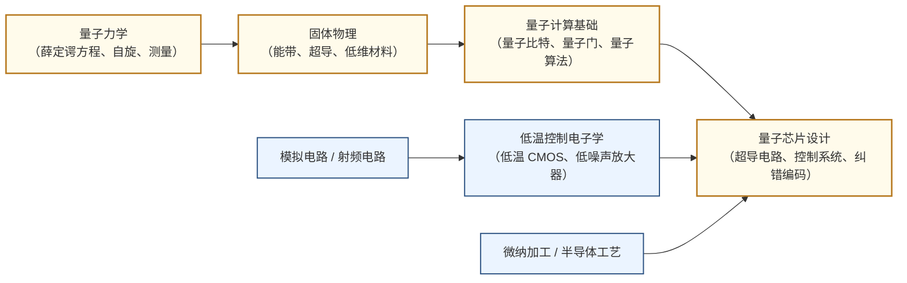

---
hide:
  - navigation
---
用量子叠加与纠缠在物理硬件上实现超越经典计算机极限的信息处理。

## 这个方向在研究什么

2024 年，谷歌的量子芯片 Willow 用不到 5 分钟完成了一个随机采样任务，同样的任务放在当今最快的超算上要跑 10²⁵ 年。差距来自根本性的不同：经典计算机每次只能处在一个状态，把所有可能的答案逐一试过去；量子计算机在某类特定的问题上，能让所有可能同时参与计算。新药的分子模拟、大整数分解、组合优化——这些问题的搜索空间随规模指数爆炸，经典计算机不是慢，是原理上就做不到。

<svg viewBox="0 0 860 220" xmlns="http://www.w3.org/2000/svg" style="width:100%;max-width:860px;display:block;margin:1.5rem auto;font-family:system-ui,sans-serif;">
  <defs>
    <marker id="qc-arrow" markerWidth="8" markerHeight="8" refX="6" refY="3" orient="auto">
      <path d="M0,0 L0,6 L8,3 z" fill="#64748B"/>
    </marker>
  </defs>
  <!-- Panel 1: 经典比特 -->
  <rect x="10" y="10" width="240" height="200" rx="8" fill="#F8FAFC" stroke="#CBD5E1" stroke-width="1.5"/>
  <text x="130" y="34" text-anchor="middle" font-size="13" font-weight="600" fill="#334155">① 经典比特</text>
  <!-- Switch OFF (0) -->
  <rect x="50" y="55" width="70" height="55" rx="6" fill="#DBEAFE" stroke="#3B82F6" stroke-width="1.5"/>
  <text x="85" y="80" text-anchor="middle" font-size="22" font-weight="bold" fill="#1D4ED8">0</text>
  <text x="85" y="100" text-anchor="middle" font-size="10" fill="#3B82F6">OFF</text>
  <!-- Switch ON (1) -->
  <rect x="140" y="55" width="70" height="55" rx="6" fill="#DBEAFE" stroke="#3B82F6" stroke-width="1.5"/>
  <text x="175" y="80" text-anchor="middle" font-size="22" font-weight="bold" fill="#1D4ED8">1</text>
  <text x="175" y="100" text-anchor="middle" font-size="10" fill="#3B82F6">ON</text>
  <!-- OR label -->
  <text x="130" y="90" text-anchor="middle" font-size="11" fill="#64748B">或</text>
  <text x="130" y="145" text-anchor="middle" font-size="10" fill="#64748B">确定性：每次只能是</text>
  <text x="130" y="162" text-anchor="middle" font-size="10" fill="#64748B">0 或 1 之一</text>
  <text x="130" y="195" text-anchor="middle" font-size="10" fill="#64748B">n位 = 2ⁿ 种状态之一</text>
  <!-- Arrow -->
  <line x1="250" y1="110" x2="290" y2="110" stroke="#64748B" stroke-width="1.5" marker-end="url(#qc-arrow)"/>
  <!-- Panel 2: 量子比特 -->
  <rect x="292" y="10" width="270" height="200" rx="8" fill="#F8FAFC" stroke="#CBD5E1" stroke-width="1.5"/>
  <text x="427" y="34" text-anchor="middle" font-size="13" font-weight="600" fill="#334155">② 量子比特</text>
  <!-- Bloch sphere (simple: circle + arrow) -->
  <circle cx="427" cy="110" r="55" fill="#EDE9FE" stroke="#7C3AED" stroke-width="1.5"/>
  <!-- Equator ellipse (hint of 3D) -->
  <ellipse cx="427" cy="110" rx="55" ry="14" fill="none" stroke="#7C3AED" stroke-width="1" stroke-dasharray="4,3"/>
  <!-- Vertical axis -->
  <line x1="427" y1="55" x2="427" y2="165" stroke="#7C3AED" stroke-width="1" stroke-dasharray="3,3"/>
  <!-- |0⟩ and |1⟩ poles -->
  <text x="427" y="50" text-anchor="middle" font-size="10" font-weight="600" fill="#6D28D9">|0⟩</text>
  <text x="427" y="178" text-anchor="middle" font-size="10" font-weight="600" fill="#6D28D9">|1⟩</text>
  <!-- State arrow (superposition) -->
  <line x1="427" y1="110" x2="468" y2="78" stroke="#7C3AED" stroke-width="2.5" marker-end="url(#qc-arrow)"/>
  <circle cx="427" cy="110" r="3" fill="#7C3AED"/>
  <text x="478" y="74" font-size="10" fill="#6D28D9">|ψ⟩</text>
  <text x="427" y="195" text-anchor="middle" font-size="10" fill="#64748B">叠加态 | n量子比特 = 2ⁿ个状态同时</text>
  <!-- Arrow -->
  <line x1="562" y1="110" x2="598" y2="110" stroke="#64748B" stroke-width="1.5" marker-end="url(#qc-arrow)"/>
  <!-- Panel 3: 应用场景 -->
  <rect x="600" y="10" width="250" height="200" rx="8" fill="#F8FAFC" stroke="#CBD5E1" stroke-width="1.5"/>
  <text x="725" y="34" text-anchor="middle" font-size="13" font-weight="600" fill="#334155">③ 量子擅长的问题</text>
  <rect x="625" y="50" width="200" height="38" rx="5" fill="#DCFCE7" stroke="#16A34A" stroke-width="1.2"/>
  <text x="725" y="68" text-anchor="middle" font-size="11" font-weight="600" fill="#15803D">分子模拟</text>
  <text x="725" y="83" text-anchor="middle" font-size="9" fill="#166534">药物设计·材料发现</text>
  <rect x="625" y="98" width="200" height="38" rx="5" fill="#FEF3C7" stroke="#D97706" stroke-width="1.2"/>
  <text x="725" y="116" text-anchor="middle" font-size="11" font-weight="600" fill="#B45309">大整数分解</text>
  <text x="725" y="131" text-anchor="middle" font-size="9" fill="#92400E">Shor 算法·RSA 威胁</text>
  <rect x="625" y="146" width="200" height="38" rx="5" fill="#EDE9FE" stroke="#7C3AED" stroke-width="1.2"/>
  <text x="725" y="164" text-anchor="middle" font-size="11" font-weight="600" fill="#6D28D9">组合优化</text>
  <text x="725" y="179" text-anchor="middle" font-size="9" fill="#5B21B6">QAOA·物流·金融</text>
  <text x="725" y="200" text-anchor="middle" font-size="9" fill="#64748B">经典计算机难以高效处理</text>
</svg>

量子比特在被测量之前同时处于 0 和 1 两种状态——不是还没决定是哪个，而是物理上两者同时存在。n 个量子比特纠缠在一起，能同时代表 2ⁿ 种状态。但光有这个并没有用：测量时会随机给出一个答案，等于什么都没算。让量子算法真正有意义的是干涉。通过一系列精心设计的操作，让错误答案的概率互相抵消，让正确答案的概率越叠越大。这和射频电路里的相消与相长干涉是同一个物理机制，只不过干涉的对象是每个答案出现的概率，而不是电压。测量时，正确答案的概率已经被放大到接近 1，几乎每次都能得到正确结果。

<svg viewBox="0 0 860 240" xmlns="http://www.w3.org/2000/svg" style="width:100%;max-width:860px;display:block;margin:1.5rem auto;font-family:system-ui,sans-serif;">
  <defs>
    <marker id="a2" markerWidth="8" markerHeight="6" refX="7" refY="3" orient="auto">
      <path d="M0,0 L0,6 L8,3 z" fill="#94A3B8"/>
    </marker>
  </defs>
  <!-- 3 panel backgrounds -->
  <rect x="5"   y="5" width="250" height="230" rx="8" fill="#F8FAFC" stroke="#CBD5E1" stroke-width="1.5"/>
  <rect x="305" y="5" width="250" height="230" rx="8" fill="#F8FAFC" stroke="#CBD5E1" stroke-width="1.5"/>
  <rect x="605" y="5" width="250" height="230" rx="8" fill="#F8FAFC" stroke="#CBD5E1" stroke-width="1.5"/>
  <!-- titles -->
  <text x="130" y="25" text-anchor="middle" font-size="12" font-weight="600" fill="#334155">① 初始叠加态</text>
  <text x="430" y="25" text-anchor="middle" font-size="12" font-weight="600" fill="#334155">② 量子门演化</text>
  <text x="730" y="25" text-anchor="middle" font-size="12" font-weight="600" fill="#334155">③ 测量结果</text>
  <!-- zero lines -->
  <line x1="25"  y1="162" x2="250" y2="162" stroke="#E2E8F0" stroke-width="1"/>
  <line x1="325" y1="162" x2="550" y2="162" stroke="#E2E8F0" stroke-width="1"/>
  <line x1="625" y1="162" x2="850" y2="162" stroke="#E2E8F0" stroke-width="1"/>
  <!-- "概率幅 ↑" simple labels (no rotation) -->
  <text x="28"  y="48" font-size="8" fill="#94A3B8">↑ 概率幅</text>
  <text x="328" y="48" font-size="8" fill="#94A3B8">↑ 概率幅</text>
  <text x="628" y="48" font-size="8" fill="#94A3B8">↑ 概率幅</text>
  <!-- ── Panel 1: 6 equal purple bars (height 70) ── -->
  <!-- bar_w=28, gap=8, start_x=30: positions 30,66,102,138,174,210 -->
  <rect x="30"  y="92" width="28" height="70" rx="2" fill="#EDE9FE" stroke="#7C3AED" stroke-width="1.2"/>
  <rect x="66"  y="92" width="28" height="70" rx="2" fill="#EDE9FE" stroke="#7C3AED" stroke-width="1.2"/>
  <rect x="102" y="92" width="28" height="70" rx="2" fill="#EDE9FE" stroke="#7C3AED" stroke-width="1.2"/>
  <rect x="138" y="92" width="28" height="70" rx="2" fill="#EDE9FE" stroke="#7C3AED" stroke-width="1.2"/>
  <rect x="174" y="92" width="28" height="70" rx="2" fill="#EDE9FE" stroke="#7C3AED" stroke-width="1.2"/>
  <rect x="210" y="92" width="28" height="70" rx="2" fill="#EDE9FE" stroke="#7C3AED" stroke-width="1.2"/>
  <text x="130" y="182" text-anchor="middle" font-size="9.5" fill="#64748B">所有答案概率幅相等</text>
  <text x="130" y="196" text-anchor="middle" font-size="8.5" fill="#94A3B8">尚未进行计算</text>
  <!-- ── Panel 2: variable bars (x_base=305, same bar positions +300) ── -->
  <!-- 330,366,402,438,474,510 -->
  <!-- Down bars (red): 330 height 40, 402 height 48, 474 height 32 -->
  <!-- Up bars (green small): 366 height 18, 510 height 12 -->
  <!-- Correct bar (purple): 438 height 84 -->
  <rect x="330" y="162" width="28" height="40" rx="2" fill="#FEE2E2" stroke="#DC2626" stroke-width="1.2"/>
  <rect x="366" y="144" width="28" height="18" rx="2" fill="#DCFCE7" stroke="#16A34A" stroke-width="1.2"/>
  <rect x="402" y="162" width="28" height="48" rx="2" fill="#FEE2E2" stroke="#DC2626" stroke-width="1.2"/>
  <rect x="438" y="78"  width="28" height="84" rx="2" fill="#EDE9FE" stroke="#7C3AED" stroke-width="2"/>
  <rect x="474" y="162" width="28" height="32" rx="2" fill="#FEE2E2" stroke="#DC2626" stroke-width="1.2"/>
  <rect x="510" y="150" width="28" height="12" rx="2" fill="#DCFCE7" stroke="#16A34A" stroke-width="1.2"/>
  <!-- annotation above correct bar -->
  <text x="452" y="73" text-anchor="middle" font-size="8.5" fill="#7C3AED">正确答案 ↑</text>
  <text x="430" y="182" text-anchor="middle" font-size="9.5" fill="#64748B">错误答案相消（↓）· 正确答案叠加（↑）</text>
  <text x="430" y="196" text-anchor="middle" font-size="8.5" fill="#94A3B8">干涉作用于概率幅</text>
  <!-- ── Panel 3: 5 tiny + 1 dominant (x_base=605) ── -->
  <!-- positions 630,666,702,738,774,810 -->
  <rect x="630" y="158" width="28" height="4" rx="1" fill="#DBEAFE" stroke="#93C5FD" stroke-width="1"/>
  <rect x="666" y="158" width="28" height="4" rx="1" fill="#DBEAFE" stroke="#93C5FD" stroke-width="1"/>
  <rect x="702" y="158" width="28" height="4" rx="1" fill="#DBEAFE" stroke="#93C5FD" stroke-width="1"/>
  <rect x="738" y="68"  width="28" height="94" rx="2" fill="#EDE9FE" stroke="#7C3AED" stroke-width="2"/>
  <text x="752" y="63" text-anchor="middle" font-size="15" fill="#7C3AED">✓</text>
  <rect x="774" y="158" width="28" height="4" rx="1" fill="#DBEAFE" stroke="#93C5FD" stroke-width="1"/>
  <rect x="810" y="158" width="28" height="4" rx="1" fill="#DBEAFE" stroke="#93C5FD" stroke-width="1"/>
  <text x="730" y="182" text-anchor="middle" font-size="9.5" fill="#64748B">几乎总能测到正确答案</text>
  <text x="730" y="196" text-anchor="middle" font-size="8.5" fill="#94A3B8">一次测量即得结果</text>
  <!-- inter-panel arrows -->
  <line x1="262" y1="120" x2="298" y2="120" stroke="#94A3B8" stroke-width="2" marker-end="url(#a2)"/>
  <line x1="562" y1="120" x2="598" y2="120" stroke="#94A3B8" stroke-width="2" marker-end="url(#a2)"/>
</svg>

把这些原理变成真实器件，目前主流路线是超导量子比特。量子比特的 0 和 1 不是电压的高低，而是一个超导电路的能量状态：电路待在最低能量状态，这是 0；电路吸收了一个微波光子、跳到了更高的能量状态，这是 1。操控量子比特，就是用微波脉冲往电路里"放"或"取"一个光子。

<svg viewBox="0 0 860 310" xmlns="http://www.w3.org/2000/svg" style="width:100%;max-width:860px;display:block;margin:1.5rem auto;font-family:system-ui,sans-serif;">
  <defs>
    <marker id="arr-mw" markerWidth="8" markerHeight="6" refX="7" refY="3" orient="auto">
      <path d="M0,0 L0,6 L8,3 z" fill="#D97706"/>
    </marker>
  </defs>
  <!-- Backgrounds -->
  <rect x="5" y="5" width="410" height="300" rx="8" fill="#EFF6FF" stroke="#BFDBFE" stroke-width="1.5"/>
  <rect x="445" y="5" width="410" height="300" rx="8" fill="#F5F3FF" stroke="#DDD6FE" stroke-width="1.5"/>
  <!-- Titles -->
  <text x="210" y="30" text-anchor="middle" font-size="13" font-weight="700" fill="#1D4ED8">① 经典比特（CMOS 反相器）</text>
  <text x="650" y="30" text-anchor="middle" font-size="13" font-weight="700" fill="#6D28D9">② 量子比特（超导谐振器）</text>
  <text x="210" y="46" text-anchor="middle" font-size="10" fill="#3B82F6">bit = 节点电压（0V 或 VDD）</text>
  <text x="650" y="46" text-anchor="middle" font-size="10" fill="#7C3AED">bit = 电路能量状态（无光子 或 有光子）</text>
  <!-- ── LEFT: CMOS Inverter ── -->
  <!-- VDD -->
  <text x="210" y="68" text-anchor="middle" font-size="11" font-weight="700" fill="#EF4444">VDD</text>
  <line x1="210" y1="71" x2="210" y2="83" stroke="#EF4444" stroke-width="2.5"/>
  <!-- PMOS: channel bar -->
  <line x1="210" y1="83" x2="210" y2="123" stroke="#0F172A" stroke-width="2.5"/>
  <!-- PMOS: gate oxide bar -->
  <line x1="202" y1="87" x2="202" y2="119" stroke="#0F172A" stroke-width="2.5"/>
  <!-- PMOS: gate wire -->
  <line x1="168" y1="103" x2="202" y2="103" stroke="#0F172A" stroke-width="2"/>
  <!-- PMOS: arrow at source (top) pointing away = p-type -->
  <polygon points="210,84 205,94 215,94" fill="#0F172A"/>
  <text x="227" y="100" font-size="9.5" fill="#475569">PMOS</text>
  <text x="227" y="113" font-size="8" fill="#94A3B8">p型 · 源极接 VDD</text>
  <!-- PMOS drain wire to Vout -->
  <line x1="210" y1="123" x2="210" y2="155" stroke="#0F172A" stroke-width="2"/>
  <!-- Vout node -->
  <circle cx="210" cy="155" r="5" fill="#1D4ED8"/>
  <line x1="215" y1="155" x2="305" y2="155" stroke="#1D4ED8" stroke-width="1.5"/>
  <text x="310" y="160" font-size="12" font-weight="700" fill="#1D4ED8">Vout</text>
  <!-- NMOS: channel bar -->
  <line x1="210" y1="155" x2="210" y2="198" stroke="#0F172A" stroke-width="2.5"/>
  <!-- NMOS: gate oxide bar -->
  <line x1="202" y1="159" x2="202" y2="194" stroke="#0F172A" stroke-width="2.5"/>
  <!-- NMOS: gate wire -->
  <line x1="168" y1="175" x2="202" y2="175" stroke="#0F172A" stroke-width="2"/>
  <!-- NMOS: arrow at source (bottom) pointing into channel = n-type -->
  <polygon points="210,197 205,187 215,187" fill="#0F172A"/>
  <text x="227" y="172" font-size="9.5" fill="#475569">NMOS</text>
  <text x="227" y="184" font-size="8" fill="#94A3B8">n型 · 源极接 GND</text>
  <!-- NMOS source to GND -->
  <line x1="210" y1="198" x2="210" y2="218" stroke="#0F172A" stroke-width="2"/>
  <!-- GND symbol -->
  <line x1="195" y1="218" x2="225" y2="218" stroke="#0F172A" stroke-width="2.5"/>
  <line x1="200" y1="225" x2="220" y2="225" stroke="#0F172A" stroke-width="2"/>
  <line x1="205" y1="232" x2="215" y2="232" stroke="#0F172A" stroke-width="1.5"/>
  <!-- Shared Vin gate wire -->
  <line x1="168" y1="103" x2="168" y2="175" stroke="#0F172A" stroke-width="2"/>
  <circle cx="168" cy="139" r="3" fill="#0F172A"/>
  <line x1="125" y1="139" x2="168" y2="139" stroke="#0F172A" stroke-width="2"/>
  <text x="120" y="143" text-anchor="end" font-size="11" font-weight="700" fill="#0F172A">Vin</text>
  <!-- State boxes -->
  <rect x="15" y="248" width="390" height="50" rx="5" fill="white" stroke="#BFDBFE" stroke-width="1.2"/>
  <rect x="23" y="255" width="178" height="36" rx="3" fill="#DCFCE7" stroke="#16A34A" stroke-width="1"/>
  <text x="112" y="270" text-anchor="middle" font-size="9" font-weight="600" fill="#15803D">Vin=高 → NMOS 导通 → 接地</text>
  <text x="112" y="284" text-anchor="middle" font-size="9" fill="#15803D">Vout ≈ 0V → bit = 0</text>
  <rect x="213" y="255" width="184" height="36" rx="3" fill="#DBEAFE" stroke="#3B82F6" stroke-width="1"/>
  <text x="305" y="270" text-anchor="middle" font-size="9" font-weight="600" fill="#1D4ED8">Vin=低 → PMOS 导通 → 接 VDD</text>
  <text x="305" y="284" text-anchor="middle" font-size="9" fill="#1D4ED8">Vout ≈ VDD → bit = 1</text>
  <!-- ── RIGHT: Superconducting qubit (C ∥ JJ) ── -->
  <!-- Loop wires -->
  <line x1="520" y1="80" x2="730" y2="80" stroke="#7C3AED" stroke-width="2"/>
  <line x1="520" y1="205" x2="730" y2="205" stroke="#7C3AED" stroke-width="2"/>
  <!-- Left branch: Capacitor -->
  <line x1="520" y1="80" x2="520" y2="128" stroke="#7C3AED" stroke-width="2"/>
  <line x1="500" y1="128" x2="540" y2="128" stroke="#7C3AED" stroke-width="3.5"/>
  <line x1="500" y1="142" x2="540" y2="142" stroke="#7C3AED" stroke-width="3.5"/>
  <line x1="520" y1="142" x2="520" y2="205" stroke="#7C3AED" stroke-width="2"/>
  <text x="482" y="139" text-anchor="middle" font-size="16" font-weight="700" fill="#7C3AED">C</text>
  <text x="482" y="152" text-anchor="middle" font-size="8" fill="#7C3AED">并联电容</text>
  <!-- Right branch: JJ -->
  <line x1="730" y1="80" x2="730" y2="124" stroke="#7C3AED" stroke-width="2"/>
  <rect x="712" y="124" width="36" height="36" rx="4" fill="#EDE9FE" stroke="#7C3AED" stroke-width="2.5"/>
  <line x1="718" y1="130" x2="742" y2="154" stroke="#6D28D9" stroke-width="2.5"/>
  <line x1="742" y1="130" x2="718" y2="154" stroke="#6D28D9" stroke-width="2.5"/>
  <line x1="730" y1="160" x2="730" y2="205" stroke="#7C3AED" stroke-width="2"/>
  <text x="757" y="136" font-size="9.5" font-weight="600" fill="#6D28D9">JJ</text>
  <text x="757" y="149" font-size="8.5" fill="#6D28D9">约瑟夫森结</text>
  <text x="757" y="161" font-size="8.5" fill="#6D28D9">（非线性电感）</text>
  <!-- Microwave arrow -->
  <line x1="625" y1="64" x2="625" y2="75" stroke="#D97706" stroke-width="2" stroke-dasharray="4,3" marker-end="url(#arr-mw)"/>
  <text x="625" y="60" text-anchor="middle" font-size="10" font-weight="600" fill="#D97706">微波脉冲</text>
  <!-- Loop label -->
  <text x="625" y="220" text-anchor="middle" font-size="9" fill="#7C3AED">C 与 JJ 并联，构成非线性谐振回路</text>
  <!-- State boxes -->
  <rect x="452" y="238" width="395" height="60" rx="5" fill="white" stroke="#DDD6FE" stroke-width="1.2"/>
  <rect x="460" y="245" width="183" height="46" rx="3" fill="#DCFCE7" stroke="#16A34A" stroke-width="1"/>
  <text x="551" y="260" text-anchor="middle" font-size="9" font-weight="600" fill="#15803D">|0⟩ = 基态 · bit = 0</text>
  <text x="551" y="274" text-anchor="middle" font-size="9" fill="#15803D">电路未吸收微波光子</text>
  <text x="551" y="286" text-anchor="middle" font-size="8.5" fill="#15803D">（最低能量状态）</text>
  <rect x="655" y="245" width="183" height="46" rx="3" fill="#EDE9FE" stroke="#7C3AED" stroke-width="1"/>
  <text x="746" y="260" text-anchor="middle" font-size="9" font-weight="600" fill="#6D28D9">|1⟩ = 激发态 · bit = 1</text>
  <text x="746" y="274" text-anchor="middle" font-size="9" fill="#6D28D9">吸收了一个微波光子</text>
  <text x="746" y="286" text-anchor="middle" font-size="8.5" fill="#6D28D9">（能量升高一档）</text>
  <!-- VS -->
  <text x="430" y="158" text-anchor="middle" font-size="16" font-weight="900" fill="#94A3B8">vs</text>
</svg>

问题在于，一个普通 LC 谐振器有无数个能量档位，而且间隔均匀——就像等间距的楼梯台阶。往里打一个微波脉冲，能量会同时推动多个台阶，没法只在最低两个台阶之间精确操控。解决办法是把电感换成**约瑟夫森结**，两片超导体中间夹一层纳米厚绝缘层构成的非线性电感，它让台阶间距变得不均匀：最低两个台阶之间的间距比其他台阶都大，可以用一个特定频率的微波脉冲只在这两个台阶之间操控，不碰其余的。这两个台阶就是量子比特的 0 和 1。

<svg viewBox="0 0 860 285" xmlns="http://www.w3.org/2000/svg" style="width:100%;max-width:860px;display:block;margin:1.5rem auto;font-family:system-ui,sans-serif;">
  <defs>
    <marker id="a3" markerWidth="8" markerHeight="6" refX="7" refY="3" orient="auto">
      <path d="M0,0 L0,6 L8,3 z" fill="#94A3B8"/>
    </marker>
  </defs>
  <!-- 3 panels -->
  <rect x="5"   y="5" width="250" height="275" rx="8" fill="#F8FAFC" stroke="#CBD5E1" stroke-width="1.5"/>
  <rect x="307" y="5" width="250" height="275" rx="8" fill="#F8FAFC" stroke="#CBD5E1" stroke-width="1.5"/>
  <rect x="609" y="5" width="250" height="275" rx="8" fill="#F8FAFC" stroke="#CBD5E1" stroke-width="1.5"/>
  <!-- titles -->
  <text x="130" y="26" text-anchor="middle" font-size="12" font-weight="600" fill="#334155">① 普通 LC 谐振器</text>
  <text x="432" y="26" text-anchor="middle" font-size="12" font-weight="600" fill="#334155">② 接入约瑟夫森结</text>
  <text x="734" y="26" text-anchor="middle" font-size="12" font-weight="600" fill="#334155">③ 量子比特</text>
  <!-- inter-panel arrows -->
  <line x1="261" y1="148" x2="301" y2="148" stroke="#94A3B8" stroke-width="2" marker-end="url(#a3)"/>
  <text x="281" y="143" text-anchor="middle" font-size="7.5" fill="#94A3B8">换入 JJ</text>
  <line x1="563" y1="148" x2="603" y2="148" stroke="#94A3B8" stroke-width="2" marker-end="url(#a3)"/>
  <text x="583" y="143" text-anchor="middle" font-size="7.5" fill="#94A3B8">微波寻址</text>

  <!-- ── Panel 1: circuit description box + uniform energy levels ── -->
  <rect x="28" y="38" width="199" height="44" rx="6" fill="#DBEAFE" stroke="#3B82F6" stroke-width="1.5"/>
  <text x="128" y="57" text-anchor="middle" font-size="10" font-weight="600" fill="#1D4ED8">线性电感 L  +  电容 C</text>
  <text x="128" y="74" text-anchor="middle" font-size="9" fill="#1D4ED8">构成 LC 谐振回路</text>
  <!-- 4 energy levels, uniform gap=36px: y=245,209,173,137 -->
  <line x1="35" y1="245" x2="215" y2="245" stroke="#334155" stroke-width="2"/>
  <line x1="35" y1="209" x2="215" y2="209" stroke="#334155" stroke-width="2"/>
  <line x1="35" y1="173" x2="215" y2="173" stroke="#334155" stroke-width="2"/>
  <line x1="35" y1="137" x2="215" y2="137" stroke="#334155" stroke-width="2"/>
  <!-- bracket annotation for gap 0→1 (y=209 to y=245) -->
  <line x1="222" y1="210" x2="222" y2="244" stroke="#3B82F6" stroke-width="1.3"/>
  <line x1="219" y1="210" x2="225" y2="210" stroke="#3B82F6" stroke-width="1.3"/>
  <line x1="219" y1="244" x2="225" y2="244" stroke="#3B82F6" stroke-width="1.3"/>
  <text x="230" y="231" font-size="10" fill="#3B82F6">Δ</text>
  <!-- bracket annotation for gap 1→2 (y=173 to y=209) -->
  <line x1="222" y1="174" x2="222" y2="208" stroke="#3B82F6" stroke-width="1.3"/>
  <line x1="219" y1="174" x2="225" y2="174" stroke="#3B82F6" stroke-width="1.3"/>
  <line x1="219" y1="208" x2="225" y2="208" stroke="#3B82F6" stroke-width="1.3"/>
  <text x="230" y="195" font-size="10" fill="#3B82F6">Δ</text>
  <text x="128" y="267" text-anchor="middle" font-size="9" fill="#64748B">能级均匀 → 微波无法定向寻址</text>

  <!-- ── Panel 2: JJ description + non-uniform energy levels ── -->
  <rect x="330" y="38" width="199" height="44" rx="6" fill="#EDE9FE" stroke="#7C3AED" stroke-width="1.5"/>
  <text x="430" y="57" text-anchor="middle" font-size="10" font-weight="600" fill="#7C3AED">约瑟夫森结（非线性电感）</text>
  <text x="430" y="74" text-anchor="middle" font-size="9" fill="#7C3AED">打破均匀间距</text>
  <!-- 4 levels: y=245, 225 (gap=20), 189 (gap=36), 153 (gap=36) -->
  <line x1="337" y1="245" x2="517" y2="245" stroke="#334155" stroke-width="2"/>
  <line x1="337" y1="225" x2="517" y2="225" stroke="#7C3AED" stroke-width="2.5"/>
  <line x1="337" y1="189" x2="517" y2="189" stroke="#334155" stroke-width="1.8"/>
  <line x1="337" y1="153" x2="517" y2="153" stroke="#334155" stroke-width="1.8"/>
  <!-- bracket: gap 0→1 (y=225–245, gap=20, SMALLER) -->
  <line x1="524" y1="226" x2="524" y2="244" stroke="#7C3AED" stroke-width="1.5"/>
  <line x1="521" y1="226" x2="527" y2="226" stroke="#7C3AED" stroke-width="1.5"/>
  <line x1="521" y1="244" x2="527" y2="244" stroke="#7C3AED" stroke-width="1.5"/>
  <text x="532" y="239" font-size="9" font-weight="600" fill="#7C3AED">Δ₀₁</text>
  <!-- bracket: gap 1→2 (y=189–225, gap=36, LARGER) -->
  <line x1="524" y1="190" x2="524" y2="224" stroke="#94A3B8" stroke-width="1.3"/>
  <line x1="521" y1="190" x2="527" y2="190" stroke="#94A3B8" stroke-width="1.3"/>
  <line x1="521" y1="224" x2="527" y2="224" stroke="#94A3B8" stroke-width="1.3"/>
  <text x="532" y="211" font-size="9" fill="#94A3B8">Δ₁₂</text>
  <!-- ≠ symbol -->
  <text x="548" y="230" font-size="13" font-weight="700" fill="#7C3AED">≠</text>
  <text x="432" y="267" text-anchor="middle" font-size="9" fill="#64748B">Δ₀₁ ≠ Δ₁₂ → 可单独寻址最低两能级</text>

  <!-- ── Panel 3: qubit ── -->
  <rect x="632" y="38" width="199" height="44" rx="6" fill="#EDE9FE" stroke="#7C3AED" stroke-width="1.5"/>
  <text x="732" y="57" text-anchor="middle" font-size="10" font-weight="600" fill="#7C3AED">人工"原子"</text>
  <text x="732" y="74" text-anchor="middle" font-size="9" fill="#7C3AED">基态 = |0⟩  激发态 = |1⟩</text>
  <!-- upper levels: dashed gray -->
  <line x1="639" y1="189" x2="819" y2="189" stroke="#CBD5E1" stroke-width="1.5" stroke-dasharray="6,4"/>
  <line x1="639" y1="153" x2="819" y2="153" stroke="#CBD5E1" stroke-width="1.5" stroke-dasharray="6,4"/>
  <text x="734" y="186" text-anchor="middle" font-size="8.5" fill="#CBD5E1">不参与计算</text>
  <!-- qubit levels: thick purple (same y as panel 2) -->
  <line x1="639" y1="245" x2="819" y2="245" stroke="#7C3AED" stroke-width="3"/>
  <line x1="639" y1="225" x2="819" y2="225" stroke="#7C3AED" stroke-width="3"/>
  <text x="631" y="249" text-anchor="end" font-size="11" font-weight="700" fill="#7C3AED">|0⟩</text>
  <text x="631" y="229" text-anchor="end" font-size="11" font-weight="700" fill="#7C3AED">|1⟩</text>
  <!-- microwave arrow at center x=734 -->
  <line x1="734" y1="243" x2="734" y2="227" stroke="#D97706" stroke-width="2.2" marker-end="url(#a3)"/>
  <text x="748" y="239" font-size="10" font-weight="600" fill="#D97706">ω₀₁</text>
  <text x="734" y="267" text-anchor="middle" font-size="9" fill="#64748B">特定频率微波单独操控 |0⟩ 和 |1⟩</text>
</svg>

操控量子比特需要极低温，原因和热噪声一样直接。量子比特两个状态之间的能量差折算成等效温度只有 0.1 到 1 K，室温的 kT 热噪声比这个信号大几千倍，量子状态会被热涨落持续打乱，根本维持不住。把系统冷到 20 mK，热噪声才降到信号以下，量子状态才能稳定。即使在这个温度下，量子状态能维持的时间也只有几百微秒，就像谐振器的 Q 值一样会逐渐衰减；这段时间内能完成的操作次数，直接决定了算法能跑多复杂。

<svg viewBox="0 0 860 235" xmlns="http://www.w3.org/2000/svg" style="width:100%;max-width:860px;display:block;margin:1.5rem auto;font-family:system-ui,sans-serif;">
  <!-- 2 panels -->
  <rect x="5"   y="5" width="370" height="225" rx="8" fill="#F8FAFC" stroke="#CBD5E1" stroke-width="1.5"/>
  <rect x="490" y="5" width="365" height="225" rx="8" fill="#F8FAFC" stroke="#CBD5E1" stroke-width="1.5"/>
  <!-- titles -->
  <text x="190" y="26" text-anchor="middle" font-size="12" font-weight="600" fill="#334155">稀释制冷机温度层级</text>
  <text x="672" y="26" text-anchor="middle" font-size="12" font-weight="600" fill="#334155">kT 热噪声 vs 量子比特信号</text>

  <!-- ── Left: temperature ladder ── -->
  <!-- vertical rail x=75, y=38 to y=215 -->
  <line x1="75" y1="38" x2="75" y2="215" stroke="#CBD5E1" stroke-width="2"/>
  <!-- 5 nodes: y = 42, 80, 118, 156, 210 -->
  <!-- 300 K -->
  <circle cx="75" cy="45"  r="7" fill="#EF4444"/>
  <line x1="75" y1="45"  x2="105" y2="45"  stroke="#EF4444" stroke-width="1.5"/>
  <text x="112" y="43"  font-size="10" font-weight="700" fill="#EF4444">300 K</text>
  <text x="112" y="56"  font-size="8.5" fill="#64748B">室温</text>
  <rect x="240" y="37"  width="122" height="17" rx="3" fill="#FEE2E2"/>
  <text x="301" y="49"  text-anchor="middle" font-size="8.5" fill="#EF4444">kT = 25 meV</text>
  <!-- 77 K -->
  <circle cx="75" cy="83"  r="6" fill="#F97316"/>
  <line x1="75" y1="83"  x2="105" y2="83"  stroke="#F97316" stroke-width="1.5"/>
  <text x="112" y="81"  font-size="10" font-weight="600" fill="#F97316">77 K</text>
  <text x="112" y="93"  font-size="8.5" fill="#64748B">液氮预冷</text>
  <rect x="240" y="75"  width="122" height="17" rx="3" fill="#FED7AA"/>
  <text x="301" y="87"  text-anchor="middle" font-size="8.5" fill="#EA580C">kT = 6.6 meV</text>
  <!-- 4 K -->
  <circle cx="75" cy="121" r="6" fill="#EAB308"/>
  <line x1="75" y1="121" x2="105" y2="121" stroke="#EAB308" stroke-width="1.5"/>
  <text x="112" y="119" font-size="10" font-weight="600" fill="#CA8A04">4 K</text>
  <text x="112" y="131" font-size="8.5" fill="#64748B">液氦 / 4 K CMOS 层</text>
  <rect x="240" y="113" width="122" height="17" rx="3" fill="#FEF9C3"/>
  <text x="301" y="125" text-anchor="middle" font-size="8.5" fill="#CA8A04">kT = 0.34 meV</text>
  <!-- 100 mK -->
  <circle cx="75" cy="159" r="6" fill="#22C55E"/>
  <line x1="75" y1="159" x2="105" y2="159" stroke="#22C55E" stroke-width="1.5"/>
  <text x="112" y="157" font-size="10" font-weight="600" fill="#16A34A">100 mK</text>
  <text x="112" y="169" font-size="8.5" fill="#64748B">预冷级</text>
  <rect x="240" y="151" width="122" height="17" rx="3" fill="#DCFCE7"/>
  <text x="301" y="163" text-anchor="middle" font-size="8.5" fill="#16A34A">kT = 8.6 μeV</text>
  <!-- 20 mK -->
  <circle cx="75" cy="207" r="8" fill="#3B82F6" stroke="#1D4ED8" stroke-width="2"/>
  <line x1="75" y1="207" x2="105" y2="207" stroke="#3B82F6" stroke-width="2"/>
  <text x="112" y="205" font-size="11" font-weight="700" fill="#1D4ED8">20 mK</text>
  <text x="112" y="218" font-size="8.5" fill="#64748B">量子芯片工作温度</text>
  <rect x="240" y="199" width="122" height="17" rx="3" fill="#DBEAFE" stroke="#3B82F6" stroke-width="1.2"/>
  <text x="301" y="211" text-anchor="middle" font-size="8.5" font-weight="600" fill="#1D4ED8">kT = 1.7 μeV</text>

  <!-- ── Right: 3 comparison cards ── -->
  <!-- card dims: x=505, w=337, h=50, gap=10 -->
  <!-- Card 1: 300K -->
  <rect x="505" y="35" width="337" height="50" rx="7" fill="#FEE2E2" stroke="#EF4444" stroke-width="1.5"/>
  <text x="530" y="56" font-size="15" font-weight="700" fill="#EF4444">300 K</text>
  <text x="530" y="74" font-size="8.5" fill="#64748B">室温热噪声</text>
  <text x="838" y="52" text-anchor="end" font-size="12" font-weight="600" fill="#EF4444">kT = 25 meV</text>
  <text x="838" y="72" text-anchor="end" font-size="9" fill="#DC2626">≫ 量子比特信号（约 1500 倍）</text>
  <!-- Card 2: 4K -->
  <rect x="505" y="95" width="337" height="50" rx="7" fill="#FEF9C3" stroke="#CA8A04" stroke-width="1.5"/>
  <text x="530" y="116" font-size="15" font-weight="700" fill="#CA8A04">4 K</text>
  <text x="530" y="134" font-size="8.5" fill="#64748B">液氦冷却</text>
  <text x="838" y="112" text-anchor="end" font-size="12" font-weight="600" fill="#CA8A04">kT = 0.34 meV</text>
  <text x="838" y="132" text-anchor="end" font-size="9" fill="#CA8A04">仍超过信号约 17 倍</text>
  <!-- Card 3: 20mK (highlighted) -->
  <rect x="505" y="155" width="337" height="50" rx="7" fill="#DBEAFE" stroke="#1D4ED8" stroke-width="2"/>
  <text x="530" y="176" font-size="15" font-weight="700" fill="#1D4ED8">20 mK</text>
  <text x="530" y="194" font-size="8.5" fill="#64748B">稀释制冷</text>
  <text x="838" y="172" text-anchor="end" font-size="12" font-weight="600" fill="#1D4ED8">kT = 1.7 μeV</text>
  <text x="838" y="190" text-anchor="end" font-size="10" font-weight="600" fill="#16A34A">≈ 量子比特信号  ✓</text>
  <!-- reference note -->
  <text x="672" y="220" text-anchor="middle" font-size="8.5" fill="#7C3AED">参考：量子比特能级间距 ≈ 0.1 K 等效 ≈ 8.6 μeV</text>
</svg>

目前最好的超导量子比特，每做一次操作出错的概率也在千分之一左右。跑一个有价值的量子算法要做数百万次操作，错误一路累积，结果彻底失效。解决办法只有一个：**量子纠错**，用一批物理量子比特冗余地保护一个逻辑量子比特，定期检测并修正错误。代价是规模急剧膨胀：保护一个逻辑量子比特需要数十到数百个物理比特，造出实用的容错量子计算机意味着百万级的物理量子比特，对芯片制造密度和互连密度的要求已经和经典先进制程处于同一量级。

规模一膨胀，控制线就成了最紧迫的瓶颈。每个量子比特需要好几条微波线来控制和读取，全部要从 20 mK 的冷端引到室温控制系统，每条线都往里传热，几百条线就足以把稀释制冷机压垮。解决思路是把一部分控制电路做在 4 K 温区的 CMOS 芯片上，大幅减少冷端和室温之间的连线数量。难点在于标准 CMOS 在 4 K 下迁移率和阈值电压都会漂移，现有的器件模型和设计方法全部失效，需要从头标定——这是微电子背景学生最直接的切入口。

<svg viewBox="0 0 860 290" xmlns="http://www.w3.org/2000/svg" style="width:100%;max-width:860px;display:block;margin:1.5rem auto;font-family:system-ui,sans-serif;">
  <defs>
    <marker id="a5" markerWidth="8" markerHeight="6" refX="7" refY="3" orient="auto">
      <path d="M0,0 L0,6 L8,3 z" fill="#64748B"/>
    </marker>
    <marker id="a5g" markerWidth="8" markerHeight="6" refX="7" refY="3" orient="auto">
      <path d="M0,0 L0,6 L8,3 z" fill="#16A34A"/>
    </marker>
  </defs>
  <!-- 2 panels -->
  <rect x="5"   y="5" width="385" height="280" rx="8" fill="#F8FAFC" stroke="#CBD5E1" stroke-width="1.5"/>
  <rect x="470" y="5" width="385" height="280" rx="8" fill="#F8FAFC" stroke="#CBD5E1" stroke-width="1.5"/>
  <!-- titles -->
  <text x="197" y="26" text-anchor="middle" font-size="12" font-weight="600" fill="#334155">量子纠错：物理比特 → 逻辑比特</text>
  <text x="662" y="26" text-anchor="middle" font-size="12" font-weight="600" fill="#334155">控制架构：从 20 mK 到室温</text>

  <!-- ── Left: 5×4 grid (20 physical qubits, center=logical) ── -->
  <!-- col centers: 55,110,165,220,275 ; row centers: 65,115,165,215 ; r=24 -->
  <!-- row 0 -->
  <circle cx="55"  cy="65"  r="24" fill="#DBEAFE" stroke="#3B82F6" stroke-width="1.5"/>
  <text x="55"  y="70"  text-anchor="middle" font-size="10" fill="#3B82F6">P</text>
  <circle cx="110" cy="65"  r="24" fill="#DBEAFE" stroke="#3B82F6" stroke-width="1.5"/>
  <text x="110" y="70"  text-anchor="middle" font-size="10" fill="#3B82F6">P</text>
  <circle cx="165" cy="65"  r="24" fill="#DBEAFE" stroke="#3B82F6" stroke-width="1.5"/>
  <text x="165" y="70"  text-anchor="middle" font-size="10" fill="#3B82F6">P</text>
  <circle cx="220" cy="65"  r="24" fill="#DBEAFE" stroke="#3B82F6" stroke-width="1.5"/>
  <text x="220" y="70"  text-anchor="middle" font-size="10" fill="#3B82F6">P</text>
  <circle cx="275" cy="65"  r="24" fill="#DBEAFE" stroke="#3B82F6" stroke-width="1.5"/>
  <text x="275" y="70"  text-anchor="middle" font-size="10" fill="#3B82F6">P</text>
  <!-- row 1 -->
  <circle cx="55"  cy="120" r="24" fill="#DBEAFE" stroke="#3B82F6" stroke-width="1.5"/>
  <text x="55"  y="125" text-anchor="middle" font-size="10" fill="#3B82F6">P</text>
  <circle cx="110" cy="120" r="24" fill="#DBEAFE" stroke="#3B82F6" stroke-width="1.5"/>
  <text x="110" y="125" text-anchor="middle" font-size="10" fill="#3B82F6">P</text>
  <circle cx="165" cy="120" r="24" fill="#DBEAFE" stroke="#3B82F6" stroke-width="1.5"/>
  <text x="165" y="125" text-anchor="middle" font-size="10" fill="#3B82F6">P</text>
  <circle cx="220" cy="120" r="24" fill="#DBEAFE" stroke="#3B82F6" stroke-width="1.5"/>
  <text x="220" y="125" text-anchor="middle" font-size="10" fill="#3B82F6">P</text>
  <circle cx="275" cy="120" r="24" fill="#DBEAFE" stroke="#3B82F6" stroke-width="1.5"/>
  <text x="275" y="125" text-anchor="middle" font-size="10" fill="#3B82F6">P</text>
  <!-- row 2: center (165,175) = logical qubit -->
  <circle cx="55"  cy="175" r="24" fill="#DBEAFE" stroke="#3B82F6" stroke-width="1.5"/>
  <text x="55"  y="180" text-anchor="middle" font-size="10" fill="#3B82F6">P</text>
  <circle cx="110" cy="175" r="24" fill="#DBEAFE" stroke="#3B82F6" stroke-width="1.5"/>
  <text x="110" y="180" text-anchor="middle" font-size="10" fill="#3B82F6">P</text>
  <circle cx="165" cy="175" r="27" fill="#EDE9FE" stroke="#7C3AED" stroke-width="2.5"/>
  <text x="165" y="172" text-anchor="middle" font-size="10" font-weight="700" fill="#7C3AED">L</text>
  <text x="165" y="185" text-anchor="middle" font-size="8" fill="#7C3AED">逻辑</text>
  <circle cx="220" cy="175" r="24" fill="#DBEAFE" stroke="#3B82F6" stroke-width="1.5"/>
  <text x="220" y="180" text-anchor="middle" font-size="10" fill="#3B82F6">P</text>
  <circle cx="275" cy="175" r="24" fill="#DBEAFE" stroke="#3B82F6" stroke-width="1.5"/>
  <text x="275" y="180" text-anchor="middle" font-size="10" fill="#3B82F6">P</text>
  <!-- row 3 -->
  <circle cx="55"  cy="230" r="24" fill="#DBEAFE" stroke="#3B82F6" stroke-width="1.5"/>
  <text x="55"  y="235" text-anchor="middle" font-size="10" fill="#3B82F6">P</text>
  <circle cx="110" cy="230" r="24" fill="#DBEAFE" stroke="#3B82F6" stroke-width="1.5"/>
  <text x="110" y="235" text-anchor="middle" font-size="10" fill="#3B82F6">P</text>
  <circle cx="165" cy="230" r="24" fill="#DBEAFE" stroke="#3B82F6" stroke-width="1.5"/>
  <text x="165" y="235" text-anchor="middle" font-size="10" fill="#3B82F6">P</text>
  <circle cx="220" cy="230" r="24" fill="#DBEAFE" stroke="#3B82F6" stroke-width="1.5"/>
  <text x="220" y="235" text-anchor="middle" font-size="10" fill="#3B82F6">P</text>
  <circle cx="275" cy="230" r="24" fill="#DBEAFE" stroke="#3B82F6" stroke-width="1.5"/>
  <text x="275" y="235" text-anchor="middle" font-size="10" fill="#3B82F6">P</text>
  <!-- legend (bottom-right of left panel, within bounds x<390) -->
  <circle cx="310" cy="110" r="9" fill="#DBEAFE" stroke="#3B82F6" stroke-width="1.2"/>
  <text x="310" y="114" text-anchor="middle" font-size="7.5" fill="#3B82F6">P</text>
  <text x="323" y="114" font-size="8.5" fill="#64748B">物理比特</text>
  <circle cx="310" cy="132" r="9" fill="#EDE9FE" stroke="#7C3AED" stroke-width="1.5"/>
  <text x="310" y="136" text-anchor="middle" font-size="7.5" font-weight="700" fill="#7C3AED">L</text>
  <text x="323" y="136" font-size="8.5" fill="#64748B">逻辑比特</text>
  <text x="197" y="258" text-anchor="middle" font-size="8.5" fill="#64748B">示意：20 物理比特保护 1 个逻辑比特</text>
  <text x="197" y="270" text-anchor="middle" font-size="8" fill="#94A3B8">实用容错量子计算机需数百万物理比特</text>

  <!-- ── Right: 3-layer architecture ── -->
  <!-- layers: x=485, w=340, h=58, gap=16 -->
  <!-- 300K: y=37 -->
  <rect x="485" y="37"  width="340" height="58" rx="7" fill="#FEE2E2" stroke="#EF4444" stroke-width="1.8"/>
  <text x="655" y="62"  text-anchor="middle" font-size="11" font-weight="700" fill="#EF4444">室温  300 K</text>
  <text x="655" y="82"  text-anchor="middle" font-size="9"  fill="#334155">经典控制系统  ·  AWG  ·  ADC  ·  FPGA</text>
  <!-- 4K: y=123 -->
  <rect x="485" y="123" width="340" height="58" rx="7" fill="#FEF9C3" stroke="#CA8A04" stroke-width="1.8"/>
  <text x="655" y="148" text-anchor="middle" font-size="11" font-weight="700" fill="#CA8A04">4 K  低温区</text>
  <text x="655" y="168" text-anchor="middle" font-size="9"  fill="#334155">低温 CMOS 控制芯片  ←  微电子切入口</text>
  <!-- 20mK: y=209 -->
  <rect x="485" y="209" width="340" height="58" rx="7" fill="#DBEAFE" stroke="#1D4ED8" stroke-width="1.8"/>
  <text x="655" y="234" text-anchor="middle" font-size="11" font-weight="700" fill="#1D4ED8">20 mK</text>
  <text x="655" y="254" text-anchor="middle" font-size="9"  fill="#334155">量子芯片  ·  超导量子比特阵列</text>
  <!-- control lines in gaps -->
  <!-- gap1: y=95–111 (16px). Lines from 20mK top (185) to 4K bottom (169). Actually gap is y=169–185. -->
  <!-- Draw lines from y=170 to y=184 (in the 16px gap between 4K bottom 169 and 20mK top 185) -->
  <!-- gap between 4K (bottom=181) and 20mK (top=209): 28px -->
  <line x1="530" y1="183" x2="530" y2="207" stroke="#94A3B8" stroke-width="1" stroke-dasharray="3,2"/>
  <line x1="555" y1="183" x2="555" y2="207" stroke="#94A3B8" stroke-width="1" stroke-dasharray="3,2"/>
  <line x1="580" y1="183" x2="580" y2="207" stroke="#94A3B8" stroke-width="1" stroke-dasharray="3,2"/>
  <line x1="605" y1="183" x2="605" y2="207" stroke="#94A3B8" stroke-width="1" stroke-dasharray="3,2"/>
  <line x1="630" y1="183" x2="630" y2="207" stroke="#94A3B8" stroke-width="1" stroke-dasharray="3,2"/>
  <line x1="655" y1="183" x2="655" y2="207" stroke="#94A3B8" stroke-width="1" stroke-dasharray="3,2"/>
  <line x1="680" y1="183" x2="680" y2="207" stroke="#94A3B8" stroke-width="1" stroke-dasharray="3,2"/>
  <line x1="705" y1="183" x2="705" y2="207" stroke="#94A3B8" stroke-width="1" stroke-dasharray="3,2"/>
  <line x1="730" y1="183" x2="730" y2="207" stroke="#94A3B8" stroke-width="1" stroke-dasharray="3,2"/>
  <text x="655" y="198" text-anchor="middle" font-size="8" fill="#94A3B8">↑ 控制线 &gt;100 条 ↑</text>
  <!-- gap between 300K (bottom=95) and 4K (top=123): 28px -->
  <line x1="595" y1="97"  x2="595" y2="121" stroke="#16A34A" stroke-width="1.5" stroke-dasharray="4,2"/>
  <line x1="655" y1="97"  x2="655" y2="121" stroke="#16A34A" stroke-width="1.5" stroke-dasharray="4,2"/>
  <line x1="715" y1="97"  x2="715" y2="121" stroke="#16A34A" stroke-width="1.5" stroke-dasharray="4,2"/>
  <text x="655" y="113" text-anchor="middle" font-size="8" fill="#16A34A">↑ 4K集成后互连大幅减少 ↑</text>
</svg>

容错量子计算机到来之前，研究者在现有噪声条件下寻找有价值的应用，思路是把量子芯片当协处理器，只承担最难的那部分计算，外层用经典计算机控制和优化。这类应用的编译和调度，本质上是量子版的 EDA：把算法映射到特定量子芯片的连接拓扑上，压缩操作次数、减少错误积累，和经典逻辑综合要解决的问题高度相似。超导不是唯一的技术路线：离子阱把离子悬浮在电磁场里当量子比特，出错率更低但操作速度慢几个数量级；硅量子点和 CMOS 工艺天然兼容，扩展路径最接近经典芯片，但对硅材料纯度极为敏感；光量子不需要制冷，适合量子通信，但让两个光子可靠地相互作用至今是未解难题。量子计算机不会取代经典处理器，而是作为协处理器承担特定类别的计算。最乐观的估计是 2035 年后才会出现第一批有实用价值的容错量子计算机，到那一天还有一大段工程路要走。

## 适合什么样的人

这个方向对于微电子背景学生的最佳切入点，是**工程侧而非物理侧**：低温 CMOS 控制芯片、微波读取电路、约瑟夫森结微纳加工，这些都是 EE 学生可以直接发力的领域，不需要从头学量子力学的全部数学框架。

**不适合想回避物理的人**：量子力学不是可选的背景知识，而是理解任何量子比特为什么有效的前提。至少需要掌握薛定谔方程、量子叠加、测量导致坍缩这几个核心概念，以及超导和约瑟夫森结的基本物理图像。

**适合对极限工程挑战感兴趣的人**：把 CMOS 电路设计到 4K 温度下工作、把控制线从 20mK 引到室温不破坏量子态、把微波信号的信噪比推到量子极限——这些是经典 IC 设计里遇不到的约束，对喜欢极限条件工程问题的人很有吸引力。

**需要有长线思维**：量子计算目前仍处于 NISQ 时代（含噪声中等规模量子），距离通用容错量子计算机还有 10 年以上的路程。读博期间不太可能看到"量子计算机取代经典计算机"，但量子芯片制造和低温控制芯片是当前真实存在的工程问题，可以在实验室里做出有意义的成果。

复旦微电子学院有闫娜老师专注超低温集成电路和量子计算控制芯片，是院内最直接的量子-IC 交叉入口。

## 核心研究问题

- **量子比特质量**：如何提高相干时间和门保真度，使物理错误率降到量子纠错阈值（约 0.1%）以下？
- **可扩展性**：从数百物理比特到百万物理比特（容错所需），互连密度、控制线数量、冷却功率如何解决？
- **低温控制电子学**：如何设计在 4 K 或更低温度下工作的 CMOS 控制芯片，减少室温与冷端的互连？
- **量子纠错**：表面码等编码方案的解码速度是否赶得上物理层错误率，实时纠错如何实现？
- **量子-经典混合算法**：NISQ 时代的变分量子本征求解器（VQE）和量子近似优化（QAOA）能否在近期硬件上产生实用价值？
- **量子芯片微纳制造**：约瑟夫森结的一致性、材料纯度和制造良率如何与量产工艺对接？

## 代表性机构

|  | 国际 | 国内 |
|--|------|------|
| **企业** | IBM Quantum、Google Quantum AI、IonQ（离子阱）、Quantinuum、Intel Quantum | 本源量子（Origin Quantum）、国盾量子、华为量子、百度量子、腾讯量子实验室 |
| **顶会/期刊** | Nature / Science（量子优越性突破）、PRL、PRX Quantum、QIP、IEEE QCE | — |

## 知识路径

**本站相关课程：**

- [量子力学·固体物理](../学习地图/物理/index.md)
- [模拟集成电路·射频电路](../学习地图/电路/index.md)
- [微纳加工·半导体工艺](../学习地图/器件与工艺/index.md)

## 入门三步走

**典型研究长什么样**

量子计算方向的顶级成果通常以 Nature/Science 或 Physical Review Letters 发表，分为两类：实验突破型（展示新的量子比特数量、更长相干时间、首次实时纠错）和工程交叉型（低温 CMOS 控制芯片、微波读取电路优化）。后者发表在 ISSCC、JSSC 等 IC 顶会，更贴近微电子背景学生的发表路径。一篇低温控制芯片的 ISSCC 论文，核心贡献通常是：在 4K 下实现某项功能的 CMOS 电路，测量其在极低温下的性能，并展示与量子比特的集成测试结果。

**第一步：建立量子直觉**  
IBM 的 [*Learning Quantum Computing*](https://learning.quantum.ibm.com/)（原 Qiskit Textbook）是目前最好的免费入门资源，配有 Python/Qiskit 代码可直接在云端量子计算机上运行。物理基础较好的同学可以同时阅读 Nielsen & Chuang 的 *Quantum Computation and Quantum Information*（剑桥大学出版社，通称"圣经"）前三章。

**第二步：了解量子芯片的物理实现**  
观看 MIT 课程 [*Quantum Engineering*（8.421）](https://equs.mit.edu/) 的公开课件，或阅读 Will Oliver 团队的综述 *Superconducting Qubits and Quantum Computing: Current State and Prospects*（Annual Review of Condensed Matter Physics, 2023）。这一步重点理解约瑟夫森结为什么能当量子比特，以及为什么必须在 20 mK 工作。

**第三步：跟进产业前沿与交叉研究**  
- Arute et al., *Quantum supremacy using a programmable superconducting processor* (Google / Nature, 2019) — 了解"量子优越性"实验的完整设计逻辑  
- 中科大 "祖冲之三号" 相关论文（朱晓波等，*Physical Review Letters* / arXiv, 2025）— 了解国内超导量子芯片最新进展  
- 关注 [IEEE Quantum Week（QCE）](https://qce.quantum.ieee.org/) 和 arXiv quant-ph 板块，掌握量子纠错、低温控制电子学最新进展

## 相关课题组

### 境内

-   **[冯磊](https://phys.fudan.edu.cn/c2/83/c7605a508547/page.htm)** 复旦

    中性原子量子计算与模拟 · 精密测量

-   **[李晓鹏](https://phys.fudan.edu.cn/b0/55/c7605a110677/page.htm)** 复旦

    可编程量子模拟 · 量子多体理论 · 量子算法

-   **[朱黄俊](https://inqc.fudan.edu.cn/72/da/c18065a422618/page.htm)** 复旦

    量子测量 · 量子纠缠 · 非局域关联

-   **[石磊](https://phys.fudan.edu.cn/f7/87/c7605a63367/page.htm)** 复旦

    光子晶体 · 光场调控 · 中性原子量子计算

-   **[闫娜](https://sme.fudan.edu.cn/60/61/c31157a352353/page.htm)** 复旦 

    超低温集成电路 · 量子计算控制芯片 · 射频IC

-   **[段路明](https://iiis.tsinghua.edu.cn/rydw/qzjs/duanluming.htm)** 清华

    离子阱与超导量子计算 · 量子网络 · 院士

-   **[孙麓岩](https://iiis.tsinghua.edu.cn/rydw/qzjs/sunluyan.htm)** 清华

    超导量子信息处理 · 量子纠错 · 量子反馈

-   **[吴宇恺](https://iiis.tsinghua.edu.cn/kxyj/ktzjs/lzjswlsxylzxxll.htm)** 清华

    超导量子比特 · 量子计算物理实现

-   **[濮云飞](https://iiis.tsinghua.edu.cn/rydw/qzjs/puyunfei.htm)** 清华

    离子阱量子网络 · 中性原子阵列量子计算

-   **[侯攀宇](https://iiis.tsinghua.edu.cn/rydw/qzjs/houpanyu.htm)** 清华

    离子量子计算 · 金刚石 NV 色心量子信息

-   **[邓东灵](https://iiis.tsinghua.edu.cn/rydw/qzjs/dengdongling.htm)** 清华

    量子人工智能 · 拓扑相物质 · 量子信息

-   **江颖** 北大

    原子尺度扫描探针 · 单分子量子操控

-   **杜瑞瑞** 北大

    量子输运 · 低维量子材料 · AAAS Fellow

-   **[龙桂鲁](https://www.baqis.ac.cn/people/detail/?cid=981)** 北大/清华

    量子通信（全量子通信理论）· 量子精密测量

-   **[潘建伟](https://quantum.ustc.edu.cn/web/en/node/32)** 中科大

    多光子纠缠 · 超导量子计算（祖冲之系列）· 院士

-   **[朱晓波](https://quantum.ustc.edu.cn/web/en/node/51)** 中科大

    可扩展超导量子处理器 · 祖冲之三号（105 量子比特）

-   **[彭承志](https://quantum.ustc.edu.cn/web/en/node/141)** 中科大

    量子通信信道 · 卫星量子通信（墨子号）

-   **[范桁](https://edu.iphy.ac.cn/moreintro.php?id=584)** 中科院

    超导量子计算理论与实验 · 量子模拟

-   **郑东宁** 中科院

    超导量子器件微纳加工 · 超导量子比特制备

-   **[王浩华](https://person.zju.edu.cn/0010051)** 浙大

    超导量子计算与模拟 · 天目1号量子芯片

<button class="prof-show-all">显示全部 ↓</button>

### 境外

-   **[王鑫](https://qclab.wang/)** 港科大（广州）

    量子信息理论 · 量子算法 · 量子机器学习

-   **[Jay Gambetta](https://research.ibm.com/people/jay-gambetta)** IBM

    IBM Quantum 战略 · Qiskit · 超导量子路线图

-   **[Hartmut Neven](https://research.google/people/hartmutneven/)** Google

    超导量子优越性 · Sycamore / Willow 芯片

-   **[Mikhail Lukin](https://lukin.physics.harvard.edu/)** Harvard

    中性原子阵列（Rydberg）· 量子网络

-   **[William Oliver](https://physics.mit.edu/faculty/william-oliver/)** MIT

    超导量子比特 · 低温 CMOS 控制电子学

-   **[Leonardo DiCarlo](https://qutech.nl/person/leo-dicarlo/)** TU Delft

    超导量子电路 · 量子纠错芯片

-   **[Stephanie Wehner](https://qutech.nl/person/stephanie-wehner/)** TU Delft 

    量子互联网 · 量子密码学

-   **[John Preskill](https://preskill.caltech.edu/)** Caltech

    量子纠错 · 容错量子计算理论 · NISQ 概念提出者 · 量子信息与黑洞

-   **[Robert Schoelkopf](https://rsl.yale.edu/)** Yale

    cQED 电路量子电动力学 · 超导量子比特 · 量子纠错芯片

-   **[Andrew Houck](https://houcklab.princeton.edu/)** Princeton

    Transmon 量子比特 · 超导量子模拟 · 下一代高相干量子比特

<button class="prof-show-all">显示全部 ↓</button>
