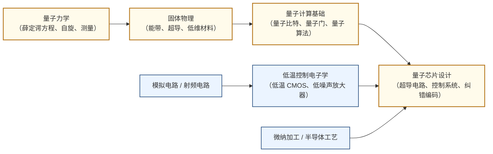

---
hide:
  - navigation
---
用量子叠加与纠缠在物理硬件上实现超越经典计算机极限的信息处理。

## 这个方向在研究什么

2024 年，谷歌的量子芯片 Willow 在不到 5 分钟内完成了一个采样任务，同等任务在当今最快的超算上需要 10²⁵ 年。这个数字大到失去直觉，但重点不是"快多少"——量子计算机和经典计算机处理的根本不是同一类问题。经典比特每次只能持有一个状态；量子比特的叠加态可以同时持有 2ⁿ 个状态，量子干涉能用一次演化筛选整个状态空间。这种优势不是普遍的，只对某类特定结构的问题存在，而这类问题里恰好包括了一些最重要的科学难题：精确模拟分子的电子结构，破解基于大整数分解的密码，求解特定组合优化问题。新型药物的靶向设计、高效催化剂的发现、下一代电池正极材料，这些归根结底都是精确量子化学问题，经典计算的近似方法在这里遇到了物理意义上的天花板。把这个计算能力变成真实硬件，是这个方向三十年工程工作的核心任务。

<svg viewBox="0 0 860 220" xmlns="http://www.w3.org/2000/svg" style="width:100%;max-width:860px;display:block;margin:1.5rem auto;font-family:system-ui,sans-serif;">
  <defs>
    <marker id="qc-arrow" markerWidth="8" markerHeight="8" refX="6" refY="3" orient="auto">
      <path d="M0,0 L0,6 L8,3 z" fill="#64748B"/>
    </marker>
  </defs>
  <!-- Panel 1: 经典比特 -->
  <rect x="10" y="10" width="240" height="200" rx="8" fill="#F8FAFC" stroke="#CBD5E1" stroke-width="1.5"/>
  <text x="130" y="34" text-anchor="middle" font-size="13" font-weight="600" fill="#334155">① 经典比特</text>
  <!-- Switch OFF (0) -->
  <rect x="50" y="55" width="70" height="55" rx="6" fill="#DBEAFE" stroke="#3B82F6" stroke-width="1.5"/>
  <text x="85" y="80" text-anchor="middle" font-size="22" font-weight="bold" fill="#1D4ED8">0</text>
  <text x="85" y="100" text-anchor="middle" font-size="10" fill="#3B82F6">OFF</text>
  <!-- Switch ON (1) -->
  <rect x="140" y="55" width="70" height="55" rx="6" fill="#DBEAFE" stroke="#3B82F6" stroke-width="1.5"/>
  <text x="175" y="80" text-anchor="middle" font-size="22" font-weight="bold" fill="#1D4ED8">1</text>
  <text x="175" y="100" text-anchor="middle" font-size="10" fill="#3B82F6">ON</text>
  <!-- OR label -->
  <text x="130" y="90" text-anchor="middle" font-size="11" fill="#64748B">或</text>
  <text x="130" y="145" text-anchor="middle" font-size="10" fill="#64748B">确定性：每次只能是</text>
  <text x="130" y="162" text-anchor="middle" font-size="10" fill="#64748B">0 或 1 之一</text>
  <text x="130" y="195" text-anchor="middle" font-size="10" fill="#64748B">n位 = 2ⁿ 种状态之一</text>
  <!-- Arrow -->
  <line x1="250" y1="110" x2="290" y2="110" stroke="#64748B" stroke-width="1.5" marker-end="url(#qc-arrow)"/>
  <!-- Panel 2: 量子比特 -->
  <rect x="292" y="10" width="270" height="200" rx="8" fill="#F8FAFC" stroke="#CBD5E1" stroke-width="1.5"/>
  <text x="427" y="34" text-anchor="middle" font-size="13" font-weight="600" fill="#334155">② 量子比特</text>
  <!-- Bloch sphere (simple: circle + arrow) -->
  <circle cx="427" cy="110" r="55" fill="#EDE9FE" stroke="#7C3AED" stroke-width="1.5"/>
  <!-- Equator ellipse (hint of 3D) -->
  <ellipse cx="427" cy="110" rx="55" ry="14" fill="none" stroke="#7C3AED" stroke-width="1" stroke-dasharray="4,3"/>
  <!-- Vertical axis -->
  <line x1="427" y1="55" x2="427" y2="165" stroke="#7C3AED" stroke-width="1" stroke-dasharray="3,3"/>
  <!-- |0⟩ and |1⟩ poles -->
  <text x="427" y="50" text-anchor="middle" font-size="10" font-weight="600" fill="#6D28D9">|0⟩</text>
  <text x="427" y="178" text-anchor="middle" font-size="10" font-weight="600" fill="#6D28D9">|1⟩</text>
  <!-- State arrow (superposition) -->
  <line x1="427" y1="110" x2="468" y2="78" stroke="#7C3AED" stroke-width="2.5" marker-end="url(#qc-arrow)"/>
  <circle cx="427" cy="110" r="3" fill="#7C3AED"/>
  <text x="478" y="74" font-size="10" fill="#6D28D9">|ψ⟩</text>
  <text x="427" y="195" text-anchor="middle" font-size="10" fill="#64748B">叠加态 | n量子比特 = 2ⁿ个状态同时</text>
  <!-- Arrow -->
  <line x1="562" y1="110" x2="598" y2="110" stroke="#64748B" stroke-width="1.5" marker-end="url(#qc-arrow)"/>
  <!-- Panel 3: 应用场景 -->
  <rect x="600" y="10" width="250" height="200" rx="8" fill="#F8FAFC" stroke="#CBD5E1" stroke-width="1.5"/>
  <text x="725" y="34" text-anchor="middle" font-size="13" font-weight="600" fill="#334155">③ 量子擅长的问题</text>
  <rect x="625" y="50" width="200" height="38" rx="5" fill="#DCFCE7" stroke="#16A34A" stroke-width="1.2"/>
  <text x="725" y="68" text-anchor="middle" font-size="11" font-weight="600" fill="#15803D">分子模拟</text>
  <text x="725" y="83" text-anchor="middle" font-size="9" fill="#166534">药物设计·材料发现</text>
  <rect x="625" y="98" width="200" height="38" rx="5" fill="#FEF3C7" stroke="#D97706" stroke-width="1.2"/>
  <text x="725" y="116" text-anchor="middle" font-size="11" font-weight="600" fill="#B45309">大整数分解</text>
  <text x="725" y="131" text-anchor="middle" font-size="9" fill="#92400E">Shor 算法·RSA 威胁</text>
  <rect x="625" y="146" width="200" height="38" rx="5" fill="#EDE9FE" stroke="#7C3AED" stroke-width="1.2"/>
  <text x="725" y="164" text-anchor="middle" font-size="11" font-weight="600" fill="#6D28D9">组合优化</text>
  <text x="725" y="179" text-anchor="middle" font-size="9" fill="#5B21B6">QAOA·物流·金融</text>
  <text x="725" y="200" text-anchor="middle" font-size="9" fill="#64748B">经典计算机难以高效处理</text>
</svg>

超导量子比特的核心是**约瑟夫森结**——两块超导体中间夹一层纳米厚绝缘层，库珀对可以量子隧穿通过，形成非线性电感。把它接成一个 LC 谐振回路，这个回路有一系列量子化能级；但普通 LC 谐振器的能级间距均匀，任何频率的微波脉冲都会同时激励多个能级，根本没有"地址"。约瑟夫森结的非线性打破了这个均匀性，使最低两个能级的间距与其余能级不同，可以用特定频率的微波脉冲单独操控这两个能级而不扰动其他。这就是量子比特的物理基础：不是用电压表示 0 和 1，而是用一个人工"原子"的基态和激发态编码量子信息。

为什么非要冷到 20 mK？超导量子比特的能级间距对应的等效温度在 0.1 至 1 K 之间，环境温度超过这个量级，热涨落就会持续翻转量子态，叠加态根本无法维持。20 mK 比宇宙背景辐射低两个数量级，是稀释制冷机当前能达到的实用极限。即使在这个极端条件下，超导量子比特的相干时间也只有数百微秒——量子态在材料缺陷和控制线电磁干扰的侵蚀下不到一毫秒就会坍缩，而运行有价值的量子算法需要数千次以上的门操作。这个相干时间与所需操作数之间的缺口，是超导路线几乎所有实验组都在追的核心问题。

超导路线工业投入最大，但并非唯一的选择，各条路线押注不同的物理权衡。离子阱把带电离子悬浮在电磁势阱中，用离子内部能级当量子比特，相干时间长达分钟量级，门保真度目前最高，代价是操作速度比超导慢三到四个数量级，规模扩展困难。硅基量子点用单个电子自旋编码量子比特，与现代 CMOS 工艺天然兼容，Intel 的 Tunnel Falls 芯片走的就是这条路，但自旋相干对硅材料同位素纯度极为敏感，量子点间串扰控制也是未解的工程问题。光量子路线用光子的偏振编码量子信息，不需要制冷，天然适合量子通信，但确定性的光子-光子相互作用极难实现，通用量子计算仍是挑战。四条路线都有活跃的学术组和工业投入，哪条路能率先实现容错量子计算，目前没有定论。

量子芯片和经典芯片不是替代关系，而是深度耦合的。一块 100 量子比特的超导芯片，需要同等数量的微波控制线和读取线，全部从 20 mK 冷端引到室温控制系统——每条线都引入热量，数百条线就足以让稀释制冷机失效。学术界和工业界的方向是把部分控制逻辑直接集成在 4 K 温区的 CMOS 芯片上，大幅减少室温与冷端的互连数量。难点在于，标准 CMOS 在 4 K 下迁移率和阈值电压都会漂移，需要重新建立面向极低温工作的器件模型和电路设计方法，这是微电子与量子交叉最紧密的工程问题之一。另一个压力来自规模：量子纠错码要求用数十到数百个物理量子比特编码一个逻辑量子比特，实用规模的容错量子计算机需要数百万物理比特，对芯片制造密度和互连密度的挑战与经典先进制程处于同一量级。

## 适合什么样的人

这个方向对于微电子背景学生的最佳切入点，是**工程侧而非物理侧**：低温 CMOS 控制芯片、微波读取电路、约瑟夫森结微纳加工，这些都是 EE 学生可以直接发力的领域，不需要从头学量子力学的全部数学框架。

**不适合想回避物理的人**：量子力学不是可选的背景知识，而是理解任何量子比特为什么有效的前提。至少需要掌握薛定谔方程、量子叠加、测量导致坍缩这几个核心概念，以及超导和约瑟夫森结的基本物理图像。

**适合对极限工程挑战感兴趣的人**：把 CMOS 电路设计到 4K 温度下工作、把控制线从 20mK 引到室温不破坏量子态、把微波信号的信噪比推到量子极限——这些是经典 IC 设计里遇不到的约束，对喜欢极限条件工程问题的人很有吸引力。

**需要有长线思维**：量子计算目前仍处于 NISQ 时代（含噪声中等规模量子），距离通用容错量子计算机还有 10 年以上的路程。读博期间不太可能看到"量子计算机取代经典计算机"，但量子芯片制造和低温控制芯片是当前真实存在的工程问题，可以在实验室里做出有意义的成果。

复旦微电子学院有闫娜老师专注超低温集成电路和量子计算控制芯片，是院内最直接的量子-IC 交叉入口。

## 核心研究问题

- **量子比特质量**：如何提高相干时间和门保真度，使物理错误率降到量子纠错阈值（约 0.1%）以下？
- **可扩展性**：从数百物理比特到百万物理比特（容错所需），互连密度、控制线数量、冷却功率如何解决？
- **低温控制电子学**：如何设计在 4 K 或更低温度下工作的 CMOS 控制芯片，减少室温与冷端的互连？
- **量子纠错**：表面码等编码方案的解码速度是否赶得上物理层错误率，实时纠错如何实现？
- **量子-经典混合算法**：NISQ 时代的变分量子本征求解器（VQE）和量子近似优化（QAOA）能否在近期硬件上产生实用价值？
- **量子芯片微纳制造**：约瑟夫森结的一致性、材料纯度和制造良率如何与量产工艺对接？

## 代表性机构

|  | 国际 | 国内 |
|--|------|------|
| **企业** | IBM Quantum、Google Quantum AI、IonQ（离子阱）、Quantinuum、Intel Quantum | 本源量子（Origin Quantum）、国盾量子、华为量子、百度量子、腾讯量子实验室 |
| **顶会/期刊** | Nature / Science（量子优越性突破）、PRL、PRX Quantum、QIP、IEEE QCE | — |

## 知识路径

**本站相关课程：**

- [量子力学·固体物理](../学习地图/物理/index.md)
- [模拟集成电路·射频电路](../学习地图/电路/index.md)
- [微纳加工·半导体工艺](../学习地图/器件与工艺/index.md)

## 入门三步走

**典型研究长什么样**

量子计算方向的顶级成果通常以 Nature/Science 或 Physical Review Letters 发表，分为两类：实验突破型（展示新的量子比特数量、更长相干时间、首次实时纠错）和工程交叉型（低温 CMOS 控制芯片、微波读取电路优化）。后者发表在 ISSCC、JSSC 等 IC 顶会，更贴近微电子背景学生的发表路径。一篇低温控制芯片的 ISSCC 论文，核心贡献通常是：在 4K 下实现某项功能的 CMOS 电路，测量其在极低温下的性能，并展示与量子比特的集成测试结果。

**第一步：建立量子直觉**  
IBM 的 [*Learning Quantum Computing*](https://learning.quantum.ibm.com/)（原 Qiskit Textbook）是目前最好的免费入门资源，配有 Python/Qiskit 代码可直接在云端量子计算机上运行。物理基础较好的同学可以同时阅读 Nielsen & Chuang 的 *Quantum Computation and Quantum Information*（剑桥大学出版社，通称"圣经"）前三章。

**第二步：了解量子芯片的物理实现**  
观看 MIT 课程 [*Quantum Engineering*（8.421）](https://equs.mit.edu/) 的公开课件，或阅读 Will Oliver 团队的综述 *Superconducting Qubits and Quantum Computing: Current State and Prospects*（Annual Review of Condensed Matter Physics, 2023）。这一步重点理解约瑟夫森结为什么能当量子比特，以及为什么必须在 20 mK 工作。

**第三步：跟进产业前沿与交叉研究**  
- Arute et al., *Quantum supremacy using a programmable superconducting processor* (Google / Nature, 2019) — 了解"量子优越性"实验的完整设计逻辑  
- 中科大 "祖冲之三号" 相关论文（朱晓波等，*Physical Review Letters* / arXiv, 2025）— 了解国内超导量子芯片最新进展  
- 关注 [IEEE Quantum Week（QCE）](https://qce.quantum.ieee.org/) 和 arXiv quant-ph 板块，掌握量子纠错、低温控制电子学最新进展

## 相关课题组

### 境内

-   **[冯磊](https://phys.fudan.edu.cn/c2/83/c7605a508547/page.htm)** 复旦

    中性原子量子计算与模拟 · 精密测量

-   **[李晓鹏](https://phys.fudan.edu.cn/b0/55/c7605a110677/page.htm)** 复旦

    可编程量子模拟 · 量子多体理论 · 量子算法

-   **[朱黄俊](https://inqc.fudan.edu.cn/72/da/c18065a422618/page.htm)** 复旦

    量子测量 · 量子纠缠 · 非局域关联

-   **[石磊](https://phys.fudan.edu.cn/f7/87/c7605a63367/page.htm)** 复旦

    光子晶体 · 光场调控 · 中性原子量子计算

-   **[闫娜](https://sme.fudan.edu.cn/60/61/c31157a352353/page.htm)** 复旦 

    超低温集成电路 · 量子计算控制芯片 · 射频IC

-   **[段路明](https://iiis.tsinghua.edu.cn/rydw/qzjs/duanluming.htm)** 清华

    离子阱与超导量子计算 · 量子网络 · 院士

-   **[孙麓岩](https://iiis.tsinghua.edu.cn/rydw/qzjs/sunluyan.htm)** 清华

    超导量子信息处理 · 量子纠错 · 量子反馈

-   **[吴宇恺](https://iiis.tsinghua.edu.cn/kxyj/ktzjs/lzjswlsxylzxxll.htm)** 清华

    超导量子比特 · 量子计算物理实现

-   **[濮云飞](https://iiis.tsinghua.edu.cn/rydw/qzjs/puyunfei.htm)** 清华

    离子阱量子网络 · 中性原子阵列量子计算

-   **[侯攀宇](https://iiis.tsinghua.edu.cn/rydw/qzjs/houpanyu.htm)** 清华

    离子量子计算 · 金刚石 NV 色心量子信息

-   **[邓东灵](https://iiis.tsinghua.edu.cn/rydw/qzjs/dengdongling.htm)** 清华

    量子人工智能 · 拓扑相物质 · 量子信息

-   **江颖** 北大

    原子尺度扫描探针 · 单分子量子操控

-   **杜瑞瑞** 北大

    量子输运 · 低维量子材料 · AAAS Fellow

-   **[龙桂鲁](https://www.baqis.ac.cn/people/detail/?cid=981)** 北大/清华

    量子通信（全量子通信理论）· 量子精密测量

-   **[潘建伟](https://quantum.ustc.edu.cn/web/en/node/32)** 中科大

    多光子纠缠 · 超导量子计算（祖冲之系列）· 院士

-   **[朱晓波](https://quantum.ustc.edu.cn/web/en/node/51)** 中科大

    可扩展超导量子处理器 · 祖冲之三号（105 量子比特）

-   **[彭承志](https://quantum.ustc.edu.cn/web/en/node/141)** 中科大

    量子通信信道 · 卫星量子通信（墨子号）

-   **[范桁](https://edu.iphy.ac.cn/moreintro.php?id=584)** 中科院

    超导量子计算理论与实验 · 量子模拟

-   **郑东宁** 中科院

    超导量子器件微纳加工 · 超导量子比特制备

-   **[王浩华](https://person.zju.edu.cn/0010051)** 浙大

    超导量子计算与模拟 · 天目1号量子芯片

<button class="prof-show-all">显示全部 ↓</button>

### 境外

-   **[王鑫](https://qclab.wang/)** 港科大（广州）

    量子信息理论 · 量子算法 · 量子机器学习

-   **[Jay Gambetta](https://research.ibm.com/people/jay-gambetta)** IBM

    IBM Quantum 战略 · Qiskit · 超导量子路线图

-   **[Hartmut Neven](https://research.google/people/hartmutneven/)** Google

    超导量子优越性 · Sycamore / Willow 芯片

-   **[Mikhail Lukin](https://lukin.physics.harvard.edu/)** Harvard

    中性原子阵列（Rydberg）· 量子网络

-   **[William Oliver](https://physics.mit.edu/faculty/william-oliver/)** MIT

    超导量子比特 · 低温 CMOS 控制电子学

-   **[Leonardo DiCarlo](https://qutech.nl/person/leo-dicarlo/)** TU Delft

    超导量子电路 · 量子纠错芯片

-   **[Stephanie Wehner](https://qutech.nl/person/stephanie-wehner/)** TU Delft 

    量子互联网 · 量子密码学

-   **[John Preskill](https://preskill.caltech.edu/)** Caltech

    量子纠错 · 容错量子计算理论 · NISQ 概念提出者 · 量子信息与黑洞

-   **[Robert Schoelkopf](https://rsl.yale.edu/)** Yale

    cQED 电路量子电动力学 · 超导量子比特 · 量子纠错芯片

-   **[Andrew Houck](https://houcklab.princeton.edu/)** Princeton

    Transmon 量子比特 · 超导量子模拟 · 下一代高相干量子比特

<button class="prof-show-all">显示全部 ↓</button>
