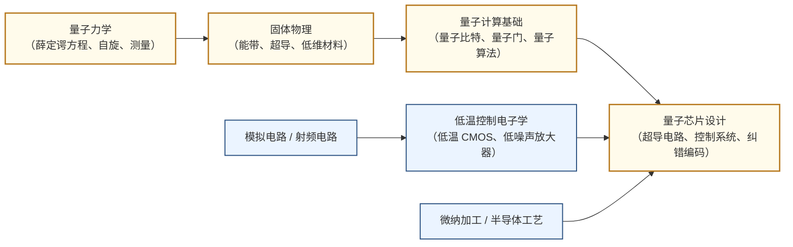

---
hide:
  - navigation
---
# 量子计算与量子芯片

## 一句话定义

用量子叠加与纠缠在物理硬件上实现超越经典计算机极限的信息处理。

## 这个方向在研究什么

量子计算的核心动机来自一个物理事实：某些问题在经典计算机上天然难解——分子模拟、大整数分解、组合优化——不是因为算法不够好，而是因为所需的状态空间随系统规模指数增长，任何经典比特都无法高效表示。量子比特（qubit）与经典比特的根本区别在于叠加与纠缠：一个 n 量子比特的系统可以同时处于 2ⁿ 个状态的叠加之中，两个量子比特可以纠缠到一起使得对其中一个的测量立即确定另一个的状态，无论相距多远。Shor 的因式分解算法和 Grover 的搜索算法早在 1990 年代就证明了这种能力原则上可转化为计算优势，但把它变成真实芯片却花了将近三十年。量子计算不是"更快的经典计算机"，而是一种需要全新物理、全新工程体系的计算范式，这正是微电子学院的学生最有机会切入的地方。

技术路线的多样性是这个方向最鲜明的特征。**超导量子比特**是目前产业界投入最大的路线：把铝或铌制成的约瑟夫森结冷却到接近绝对零度（约 20 mK），利用非线性 LC 谐振制造人工"原子"，用微波脉冲读写量子态。超导路线的优势是制造工艺与现有半导体产线高度兼容、操作速度快（纳秒量级的门操作）；缺点是必须在极低温下工作，与室温电子控制系统的接口是巨大的工程挑战，且相干时间（qubit 保持量子态的时间）仍然有限，目前最好水平约数百微秒。**离子阱**用激光把带电离子悬浮在电磁势阱中，用离子自身充当量子比特：相干时间极长（可达分钟量级），保真度是所有路线中最高的；缺点是操作速度慢（毫秒量级），系统规模扩展困难。**光量子**用光子的偏振或路径编码量子信息，天然不需要制冷，适合量子通信和特定算法；但确定性光子-光子相互作用极难实现，通用计算仍是难题。**硅基半导体量子点**利用单个电子自旋编码量子比特，与现代 CMOS 工艺高度兼容，理论上可以直接在硅晶圆上制造数百万量子比特，Intel 的 Tunnel Falls 芯片就走这条路；挑战在于自旋相干时间对材料纯度极为敏感，且量子点间距离近，串扰控制困难。

量子芯片和经典芯片并不是简单的替代关系，而是深度耦合的。一块 100 量子比特的超导芯片，需要同等数量的微波脉冲控制线和读取线，全部从 20 mK 冷端引出到室温控制系统——这就是"低温电子学"的挑战。每条控制线都引入热量，数百条线就足以让稀释制冷机失效，所以学术界和工业界都在研究"量子-经典协处理器"：把部分控制逻辑（如模数转换、数字滤波、反馈控制）直接集成在 4 K 或更低温度的 CMOS 芯片上，大幅减少室温与冷端之间的互连数量。这需要专门针对极低温特性优化的 CMOS 设计（标准 CMOS 在 4 K 下迁移率、阈值电压都会漂移），是微电子与量子交叉最紧密的工程问题之一。此外，量子纠错码（如表面码）要求用数十甚至数百个物理量子比特编码一个逻辑量子比特，使得容错量子计算机的物理比特需求骤升到数百万量级，这对芯片制造、互连密度、控制系统的集成提出了与经典先进制程同等量级的工程挑战。

国内外产业格局方面，IBM Quantum 的超导路线已公开了明确的工程路线图：2024 年发布 Heron（133 量子比特），2025 年推出 Nighthawk（120 量子比特、更高连通性），目标是 2029 年实现搭载约 200 个逻辑量子比特的容错系统。Google Quantum AI 2019 年用 53 量子比特的 Sycamore 宣称"量子优越性"，2023 年发布 72 量子比特的 Willow 并实现实时纠错。国内方面，中科大潘建伟/朱晓波团队的"祖冲之三号"（105 量子比特超导芯片，2025 年）在量子随机采样任务上比最快超算快 15 个数量级；本源量子（Origin Quantum，合肥，郭国平创立）是国内首家量子计算商用公司，已交付工程化量子计算机，并自主研发了量子芯片生产线；国盾量子聚焦量子通信与密钥分发，已在沪杭等城市落地商用量子网络。

与微电子/IC 的交叉点是微电子学院学生最容易切入量子方向的入口。除了前述低温控制 CMOS，还包括：量子芯片的微纳加工（约瑟夫森结需要电子束光刻和 ALD 超薄层工艺，与先进制程实验室高度重叠）；量子比特读取的射频电路（量子态测量本质上是极低信噪比的微波信号检测，需要低噪声放大器 LNA 和高速 ADC）；量子芯片的封装与热管理（引线键合、超低热导率基板、稀释制冷机内部的同轴线缆与滤波器设计）；以及量子计算机的编译与控制软件栈（把量子算法映射到具体硬件的脉冲序列，与 EDA 的综合-映射流程异曲同工）。

## 核心研究问题

- **量子比特质量**：如何提高相干时间和门保真度，使物理错误率降到量子纠错阈值（约 0.1%）以下？
- **可扩展性**：从数百物理比特到百万物理比特（容错所需），互连密度、控制线数量、冷却功率如何解决？
- **低温控制电子学**：如何设计在 4 K 或更低温度下工作的 CMOS 控制芯片，减少室温与冷端的互连？
- **量子纠错**：表面码等编码方案的解码速度是否赶得上物理层错误率，实时纠错如何实现？
- **量子-经典混合算法**：NISQ 时代的变分量子本征求解器（VQE）和量子近似优化（QAOA）能否在近期硬件上产生实用价值？
- **量子芯片微纳制造**：约瑟夫森结的一致性、材料纯度和制造良率如何与量产工艺对接？

## 代表性机构与企业

|  | 国际 | 国内 |
|--|------|------|
| **企业** | IBM Quantum、Google Quantum AI、IonQ（离子阱）、Quantinuum、Intel Quantum | 本源量子（Origin Quantum）、国盾量子、华为量子、百度量子、腾讯量子实验室 |
| **高校/研究机构** | MIT、TU Delft（QuTech）、Harvard、UCSB、ETH Zürich | 中科大、清华（IIIS 量子中心）、北大（ICQM、BAQIS）、浙大、中科院物理所 |
| **顶会/期刊** | Nature / Science（量子优越性突破）、PRL、PRX Quantum、QIP、IEEE QCE | — |

## 知识路径

**本站相关课程：**

- [固体物理（复旦）](../课程资源/)
- [模拟集成电路设计（复旦）](../课程资源/)
- [半导体器件原理（复旦）](../课程资源/)

## 入门三步走

**第一步：建立量子直觉**  
IBM 的 [*Learning Quantum Computing*](https://learning.quantum.ibm.com/)（原 Qiskit Textbook）是目前最好的免费入门资源，配有 Python/Qiskit 代码可直接在云端量子计算机上运行。物理基础较好的同学可以同时阅读 Nielsen & Chuang 的 *Quantum Computation and Quantum Information*（剑桥大学出版社，通称"圣经"）前三章。

**第二步：了解量子芯片的物理实现**  
观看 MIT 课程 [*Quantum Engineering*（8.421）](https://equs.mit.edu/) 的公开课件，或阅读 Will Oliver 团队的综述 *Superconducting Qubits and Quantum Computing: Current State and Prospects*（Annual Review of Condensed Matter Physics, 2023）。这一步重点理解约瑟夫森结为什么能当量子比特，以及为什么必须在 20 mK 工作。

**第三步：跟进产业前沿与交叉研究**  
- Arute et al., *Quantum supremacy using a programmable superconducting processor* (Google / Nature, 2019) — 了解"量子优越性"实验的完整设计逻辑  
- 中科大 "祖冲之三号" 相关论文（朱晓波等，*Physical Review Letters* / arXiv, 2025）— 了解国内超导量子芯片最新进展  
- 关注 [IEEE Quantum Week（QCE）](https://qce.quantum.ieee.org/) 和 arXiv quant-ph 板块，掌握量子纠错、低温控制电子学最新进展

## 相关课题组

-   **[冯磊](https://phys.fudan.edu.cn/c2/83/c7605a508547/page.htm)** 复旦

    中性原子量子计算与模拟 · 精密测量

-   **[李晓鹏](https://phys.fudan.edu.cn/b0/55/c7605a110677/page.htm)** 复旦

    可编程量子模拟 · 量子多体理论 · 量子算法

-   **[朱黄俊](https://inqc.fudan.edu.cn/72/da/c18065a422618/page.htm)** 复旦

    量子测量 · 量子纠缠 · 非局域关联

-   **[石磊](https://phys.fudan.edu.cn/f7/87/c7605a63367/page.htm)** 复旦

    光子晶体 · 光场调控 · 中性原子量子计算

-   **[闫娜](https://sme.fudan.edu.cn/60/61/c31157a352353/page.htm)** 复旦

    超低温集成电路 · 量子计算控制芯片 · 射频IC

-   **[段路明](https://iiis.tsinghua.edu.cn/en/duanluming/)** 清华

    离子阱与超导量子计算 · 量子网络 · 院士

-   **[孙麓岩](https://iiis.tsinghua.edu.cn/en/sunluyan/)** 清华

    超导量子信息处理 · 量子纠错 · 量子反馈

-   **[吴宇恺](https://iiis.tsinghua.edu.cn/wuyukai/)** 清华

    超导量子比特 · 量子计算物理实现

-   **[濮云飞](https://iiis.tsinghua.edu.cn/puyunfei/)** 清华

    离子阱量子网络 · 中性原子阵列量子计算

-   **[侯攀宇](https://iiis.tsinghua.edu.cn/houpanyu/)** 清华

    离子量子计算 · 金刚石 NV 色心量子信息

-   **[邓东灵](https://iiis.tsinghua.edu.cn/dengdongling/)** 清华

    量子人工智能 · 拓扑相物质 · 量子信息

-   **江颖** 北大

    原子尺度扫描探针 · 单分子量子操控

-   **杜瑞瑞** 北大

    量子输运 · 低维量子材料 · AAAS Fellow

-   **[龙桂鲁](https://www.baqis.ac.cn/people/detail/?cid=981)** 北大/清华

    量子通信（全量子通信理论）· 量子精密测量

-   **[潘建伟](https://quantum.ustc.edu.cn/web/en/node/32)** 中科大

    多光子纠缠 · 超导量子计算（祖冲之系列）· 院士

-   **[朱晓波](https://quantum.ustc.edu.cn/web/en/node/51)** 中科大

    可扩展超导量子处理器 · 祖冲之三号（105 量子比特）

-   **[彭承志](https://quantum.ustc.edu.cn/web/en/node/141)** 中科大

    量子通信信道 · 卫星量子通信（墨子号）

-   **[范桁](https://edu.iphy.ac.cn/moreintro.php?id=584)** 中科院

    超导量子计算理论与实验 · 量子模拟

-   **郑东宁** 中科院

    超导量子器件微纳加工 · 超导量子比特制备

-   **[王浩华](https://person.zju.edu.cn/0010051)** 浙大

    超导量子计算与模拟 · 天目1号量子芯片

-   **[王鑫](https://qclab.wang/)** 港科大（广州）

    量子信息理论 · 量子算法 · 量子机器学习

-   **[Jay Gambetta](https://research.ibm.com/people/jay-gambetta)** IBM

    IBM Quantum 战略 · Qiskit · 超导量子路线图

-   **[Hartmut Neven](https://research.google/people/hartmutneven/)** Google

    超导量子优越性 · Sycamore / Willow 芯片

-   **[Mikhail Lukin](https://lukin.physics.harvard.edu/)** Harvard

    中性原子阵列（Rydberg）· 量子网络

-   **[William Oliver](https://physics.mit.edu/faculty/william-oliver/)** MIT

    超导量子比特 · 低温 CMOS 控制电子学

-   **[Leonardo DiCarlo](https://qutech.nl/person/leo-dicarlo/)** TU Delft

    超导量子电路 · 量子纠错芯片

-   **[Stephanie Wehner](https://qutech.nl/person/stephanie-wehner/)** TU Delft

    量子互联网 · 量子密码学

<button class="prof-show-all">显示全部 ↓</button>
