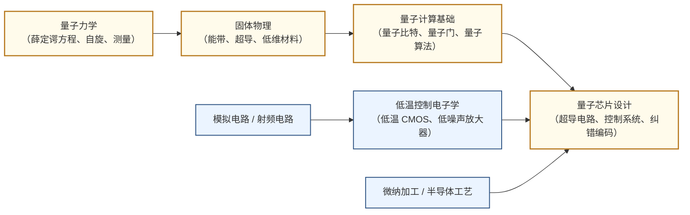

---
hide:
  - navigation
---
用量子叠加与纠缠在物理硬件上实现超越经典计算机极限的信息处理。

## 这个方向在研究什么

2024 年，谷歌的量子芯片 Willow 在不到 5 分钟内完成了一个随机采样任务，同等任务在当今最快的超算上需要 10²⁵ 年。这个数字大到失去直觉，但更重要的是理解为什么：量子计算机和经典计算机处理的根本不是同一类问题。经典计算机每次只能处于一个状态，遍历所有可能是逐一检查。量子计算机在某类特定结构的问题上，能让所有可能性在物理上同时参与计算。新型药物的靶向设计、催化剂与新材料的发现、破解 RSA 加密——这些问题的搜索空间随规模指数增长，经典计算在这里遇到了物理上的天花板。把这个计算能力变成真实硬件，是这个方向三十年工程工作的核心任务。

<svg viewBox="0 0 860 220" xmlns="http://www.w3.org/2000/svg" style="width:100%;max-width:860px;display:block;margin:1.5rem auto;font-family:system-ui,sans-serif;">
  <defs>
    <marker id="qc-arrow" markerWidth="8" markerHeight="8" refX="6" refY="3" orient="auto">
      <path d="M0,0 L0,6 L8,3 z" fill="#64748B"/>
    </marker>
  </defs>
  <!-- Panel 1: 经典比特 -->
  <rect x="10" y="10" width="240" height="200" rx="8" fill="#F8FAFC" stroke="#CBD5E1" stroke-width="1.5"/>
  <text x="130" y="34" text-anchor="middle" font-size="13" font-weight="600" fill="#334155">① 经典比特</text>
  <!-- Switch OFF (0) -->
  <rect x="50" y="55" width="70" height="55" rx="6" fill="#DBEAFE" stroke="#3B82F6" stroke-width="1.5"/>
  <text x="85" y="80" text-anchor="middle" font-size="22" font-weight="bold" fill="#1D4ED8">0</text>
  <text x="85" y="100" text-anchor="middle" font-size="10" fill="#3B82F6">OFF</text>
  <!-- Switch ON (1) -->
  <rect x="140" y="55" width="70" height="55" rx="6" fill="#DBEAFE" stroke="#3B82F6" stroke-width="1.5"/>
  <text x="175" y="80" text-anchor="middle" font-size="22" font-weight="bold" fill="#1D4ED8">1</text>
  <text x="175" y="100" text-anchor="middle" font-size="10" fill="#3B82F6">ON</text>
  <!-- OR label -->
  <text x="130" y="90" text-anchor="middle" font-size="11" fill="#64748B">或</text>
  <text x="130" y="145" text-anchor="middle" font-size="10" fill="#64748B">确定性：每次只能是</text>
  <text x="130" y="162" text-anchor="middle" font-size="10" fill="#64748B">0 或 1 之一</text>
  <text x="130" y="195" text-anchor="middle" font-size="10" fill="#64748B">n位 = 2ⁿ 种状态之一</text>
  <!-- Arrow -->
  <line x1="250" y1="110" x2="290" y2="110" stroke="#64748B" stroke-width="1.5" marker-end="url(#qc-arrow)"/>
  <!-- Panel 2: 量子比特 -->
  <rect x="292" y="10" width="270" height="200" rx="8" fill="#F8FAFC" stroke="#CBD5E1" stroke-width="1.5"/>
  <text x="427" y="34" text-anchor="middle" font-size="13" font-weight="600" fill="#334155">② 量子比特</text>
  <!-- Bloch sphere (simple: circle + arrow) -->
  <circle cx="427" cy="110" r="55" fill="#EDE9FE" stroke="#7C3AED" stroke-width="1.5"/>
  <!-- Equator ellipse (hint of 3D) -->
  <ellipse cx="427" cy="110" rx="55" ry="14" fill="none" stroke="#7C3AED" stroke-width="1" stroke-dasharray="4,3"/>
  <!-- Vertical axis -->
  <line x1="427" y1="55" x2="427" y2="165" stroke="#7C3AED" stroke-width="1" stroke-dasharray="3,3"/>
  <!-- |0⟩ and |1⟩ poles -->
  <text x="427" y="50" text-anchor="middle" font-size="10" font-weight="600" fill="#6D28D9">|0⟩</text>
  <text x="427" y="178" text-anchor="middle" font-size="10" font-weight="600" fill="#6D28D9">|1⟩</text>
  <!-- State arrow (superposition) -->
  <line x1="427" y1="110" x2="468" y2="78" stroke="#7C3AED" stroke-width="2.5" marker-end="url(#qc-arrow)"/>
  <circle cx="427" cy="110" r="3" fill="#7C3AED"/>
  <text x="478" y="74" font-size="10" fill="#6D28D9">|ψ⟩</text>
  <text x="427" y="195" text-anchor="middle" font-size="10" fill="#64748B">叠加态 | n量子比特 = 2ⁿ个状态同时</text>
  <!-- Arrow -->
  <line x1="562" y1="110" x2="598" y2="110" stroke="#64748B" stroke-width="1.5" marker-end="url(#qc-arrow)"/>
  <!-- Panel 3: 应用场景 -->
  <rect x="600" y="10" width="250" height="200" rx="8" fill="#F8FAFC" stroke="#CBD5E1" stroke-width="1.5"/>
  <text x="725" y="34" text-anchor="middle" font-size="13" font-weight="600" fill="#334155">③ 量子擅长的问题</text>
  <rect x="625" y="50" width="200" height="38" rx="5" fill="#DCFCE7" stroke="#16A34A" stroke-width="1.2"/>
  <text x="725" y="68" text-anchor="middle" font-size="11" font-weight="600" fill="#15803D">分子模拟</text>
  <text x="725" y="83" text-anchor="middle" font-size="9" fill="#166534">药物设计·材料发现</text>
  <rect x="625" y="98" width="200" height="38" rx="5" fill="#FEF3C7" stroke="#D97706" stroke-width="1.2"/>
  <text x="725" y="116" text-anchor="middle" font-size="11" font-weight="600" fill="#B45309">大整数分解</text>
  <text x="725" y="131" text-anchor="middle" font-size="9" fill="#92400E">Shor 算法·RSA 威胁</text>
  <rect x="625" y="146" width="200" height="38" rx="5" fill="#EDE9FE" stroke="#7C3AED" stroke-width="1.2"/>
  <text x="725" y="164" text-anchor="middle" font-size="11" font-weight="600" fill="#6D28D9">组合优化</text>
  <text x="725" y="179" text-anchor="middle" font-size="9" fill="#5B21B6">QAOA·物流·金融</text>
  <text x="725" y="200" text-anchor="middle" font-size="9" fill="#64748B">经典计算机难以高效处理</text>
</svg>

一个量子比特在被测量之前，同时处于 0 和 1 的叠加态——不是"不知道是哪个"，而是物理上真的两者兼具，用一个复数概率幅描述这种混合的程度。这不是哲学猜测，是过去几十年实验一再验证的事实，违反了所有经典直觉。多个量子比特纠缠在一起时更奇怪：它们的联合状态不能被拆解成各自的独立状态，n 个完全纠缠的量子比特可以同时持有 2ⁿ 个状态，这是量子计算指数优势的物理来源。但叠加和纠缠只是原材料，真正的计算发生在干涉上。量子门精心设计演化过程，让错误答案的概率幅相互抵消，让正确答案的概率幅不断叠加增强——就像 RF 电路里两列信号的相长和相消干涉，只不过作用在概率幅上。测量时，你几乎总能得到正确结果。这是所有量子算法的底层逻辑：不是穷举所有可能，而是操控干涉。

<svg viewBox="0 0 860 252" xmlns="http://www.w3.org/2000/svg" style="width:100%;max-width:860px;display:block;margin:1.5rem auto;font-family:system-ui,sans-serif;">
  <defs>
    <marker id="qi-arr" markerWidth="8" markerHeight="8" refX="6" refY="3" orient="auto">
      <path d="M0,0 L0,6 L8,3 z" fill="#94A3B8"/>
    </marker>
  </defs>
  <!-- panels -->
  <rect x="5" y="5" width="250" height="242" rx="8" fill="#F8FAFC" stroke="#CBD5E1" stroke-width="1.5"/>
  <rect x="305" y="5" width="250" height="242" rx="8" fill="#F8FAFC" stroke="#CBD5E1" stroke-width="1.5"/>
  <rect x="605" y="5" width="250" height="242" rx="8" fill="#F8FAFC" stroke="#CBD5E1" stroke-width="1.5"/>
  <!-- titles -->
  <text x="130" y="26" text-anchor="middle" font-size="12" font-weight="600" fill="#334155">① 初始叠加态</text>
  <text x="430" y="26" text-anchor="middle" font-size="12" font-weight="600" fill="#334155">② 量子门演化</text>
  <text x="730" y="26" text-anchor="middle" font-size="12" font-weight="600" fill="#334155">③ 测量结果</text>
  <!-- arrows -->
  <line x1="261" y1="126" x2="299" y2="126" stroke="#94A3B8" stroke-width="2" marker-end="url(#qi-arr)"/>
  <line x1="561" y1="126" x2="599" y2="126" stroke="#94A3B8" stroke-width="2" marker-end="url(#qi-arr)"/>
  <!-- zero lines -->
  <line x1="20" y1="168" x2="250" y2="168" stroke="#E2E8F0" stroke-width="1"/>
  <line x1="320" y1="168" x2="550" y2="168" stroke="#E2E8F0" stroke-width="1"/>
  <line x1="620" y1="168" x2="850" y2="168" stroke="#E2E8F0" stroke-width="1"/>
  <!-- y-axis label -->
  <text x="14" y="131" text-anchor="middle" font-size="8.5" fill="#94A3B8" transform="rotate(-90 14 131)">概率幅</text>
  <!-- Panel 1: 6 equal bars at height 62 -->
  <rect x="27" y="106" width="28" height="62" rx="2" fill="#EDE9FE" stroke="#7C3AED" stroke-width="1.2"/>
  <rect x="63" y="106" width="28" height="62" rx="2" fill="#EDE9FE" stroke="#7C3AED" stroke-width="1.2"/>
  <rect x="99" y="106" width="28" height="62" rx="2" fill="#EDE9FE" stroke="#7C3AED" stroke-width="1.2"/>
  <rect x="135" y="106" width="28" height="62" rx="2" fill="#EDE9FE" stroke="#7C3AED" stroke-width="1.2"/>
  <rect x="171" y="106" width="28" height="62" rx="2" fill="#EDE9FE" stroke="#7C3AED" stroke-width="1.2"/>
  <rect x="207" y="106" width="28" height="62" rx="2" fill="#EDE9FE" stroke="#7C3AED" stroke-width="1.2"/>
  <text x="130" y="190" text-anchor="middle" font-size="9.5" fill="#64748B">所有答案概率幅相等</text>
  <text x="130" y="206" text-anchor="middle" font-size="9" fill="#94A3B8">尚未进行计算</text>
  <!-- Panel 2: variable bars (x_base=305, bars at 327,363,399,435,471,507) -->
  <rect x="327" y="168" width="28" height="36" rx="2" fill="#FEE2E2" stroke="#DC2626" stroke-width="1.2"/>
  <rect x="363" y="152" width="28" height="16" rx="2" fill="#DCFCE7" stroke="#16A34A" stroke-width="1.2"/>
  <rect x="399" y="168" width="28" height="44" rx="2" fill="#FEE2E2" stroke="#DC2626" stroke-width="1.2"/>
  <rect x="435" y="90" width="28" height="78" rx="2" fill="#EDE9FE" stroke="#7C3AED" stroke-width="2"/>
  <rect x="471" y="168" width="28" height="30" rx="2" fill="#FEE2E2" stroke="#DC2626" stroke-width="1.2"/>
  <rect x="507" y="156" width="28" height="12" rx="2" fill="#DCFCE7" stroke="#16A34A" stroke-width="1.2"/>
  <text x="449" y="85" text-anchor="middle" font-size="8.5" fill="#7C3AED">正确答案</text>
  <line x1="449" y1="87" x2="449" y2="90" stroke="#7C3AED" stroke-width="1"/>
  <text x="430" y="190" text-anchor="middle" font-size="9.5" fill="#64748B">错误答案相消（↓）· 正确答案叠加（↑）</text>
  <text x="430" y="206" text-anchor="middle" font-size="9" fill="#94A3B8">作用在概率幅上</text>
  <!-- Panel 3: one dominant bar (x_base=605, bars at 627,663,699,735,771,807) -->
  <rect x="627" y="164" width="28" height="4" rx="1" fill="#DBEAFE" stroke="#93C5FD" stroke-width="1"/>
  <rect x="663" y="164" width="28" height="4" rx="1" fill="#DBEAFE" stroke="#93C5FD" stroke-width="1"/>
  <rect x="699" y="164" width="28" height="4" rx="1" fill="#DBEAFE" stroke="#93C5FD" stroke-width="1"/>
  <rect x="735" y="74" width="28" height="94" rx="2" fill="#EDE9FE" stroke="#7C3AED" stroke-width="2"/>
  <text x="749" y="70" text-anchor="middle" font-size="14" fill="#7C3AED">✓</text>
  <rect x="771" y="164" width="28" height="4" rx="1" fill="#DBEAFE" stroke="#93C5FD" stroke-width="1"/>
  <rect x="807" y="164" width="28" height="4" rx="1" fill="#DBEAFE" stroke="#93C5FD" stroke-width="1"/>
  <text x="730" y="190" text-anchor="middle" font-size="9.5" fill="#64748B">几乎总能测到正确答案</text>
  <text x="730" y="206" text-anchor="middle" font-size="9" fill="#94A3B8">一次测量即得结果</text>
</svg>

把这三个原理变成真实器件，主流路线是超导量子比特。对学过模拟电路的学生，理解它的最快入口是 LC 谐振回路：普通 LC 谐振器有一系列均匀间距的能级，任何微波脉冲都会同时激励多个能级，无法对单独两个能级定向操控。把电感换成约瑟夫森结——两块超导体中间夹一层纳米厚绝缘层构成的非线性电感——非线性打破了均匀性，让最低两个能级的间距与其他能级不同，可以用特定频率的微波脉冲单独寻址这两个能级。这就是量子比特的物理基础：用这个人工"原子"的基态和激发态编码量子信息，不是电压的高低。

<svg viewBox="0 0 860 295" xmlns="http://www.w3.org/2000/svg" style="width:100%;max-width:860px;display:block;margin:1.5rem auto;font-family:system-ui,sans-serif;">
  <defs>
    <marker id="lj-arr" markerWidth="8" markerHeight="8" refX="6" refY="3" orient="auto">
      <path d="M0,0 L0,6 L8,3 z" fill="#94A3B8"/>
    </marker>
    <marker id="lj-dbl" markerWidth="8" markerHeight="8" refX="2" refY="3" orient="auto">
      <path d="M8,0 L8,6 L0,3 z" fill="#94A3B8"/>
    </marker>
  </defs>
  <!-- panels -->
  <rect x="5" y="5" width="250" height="285" rx="8" fill="#F8FAFC" stroke="#CBD5E1" stroke-width="1.5"/>
  <rect x="307" y="5" width="250" height="285" rx="8" fill="#F8FAFC" stroke="#CBD5E1" stroke-width="1.5"/>
  <rect x="609" y="5" width="250" height="285" rx="8" fill="#F8FAFC" stroke="#CBD5E1" stroke-width="1.5"/>
  <!-- titles -->
  <text x="130" y="26" text-anchor="middle" font-size="12" font-weight="600" fill="#334155">① 普通 LC 谐振器</text>
  <text x="432" y="26" text-anchor="middle" font-size="12" font-weight="600" fill="#334155">② 接入约瑟夫森结</text>
  <text x="734" y="26" text-anchor="middle" font-size="12" font-weight="600" fill="#334155">③ 量子比特</text>
  <!-- arrows -->
  <line x1="261" y1="148" x2="301" y2="148" stroke="#94A3B8" stroke-width="2" marker-end="url(#lj-arr)"/>
  <text x="281" y="143" text-anchor="middle" font-size="8" fill="#94A3B8">换入JJ</text>
  <line x1="563" y1="148" x2="603" y2="148" stroke="#94A3B8" stroke-width="2" marker-end="url(#lj-arr)"/>
  <text x="583" y="143" text-anchor="middle" font-size="8" fill="#94A3B8">微波寻址</text>

  <!-- === Panel 1 circuit: simple LC loop === -->
  <!-- loop wires -->
  <line x1="60" y1="50" x2="200" y2="50" stroke="#3B82F6" stroke-width="1.8"/>
  <line x1="60" y1="105" x2="200" y2="105" stroke="#3B82F6" stroke-width="1.8"/>
  <line x1="60" y1="50" x2="60" y2="62" stroke="#3B82F6" stroke-width="1.8"/>
  <line x1="60" y1="93" x2="60" y2="105" stroke="#3B82F6" stroke-width="1.8"/>
  <line x1="200" y1="50" x2="200" y2="63" stroke="#3B82F6" stroke-width="1.8"/>
  <line x1="200" y1="88" x2="200" y2="105" stroke="#3B82F6" stroke-width="1.8"/>
  <!-- inductor: coil arcs -->
  <path d="M60,62 a7,7 0 0,0 14,0 a7,7 0 0,0 14,0 a7,7 0 0,0 14,0 M60,62 L60,93 M102,62 L102,93" stroke="none" fill="none"/>
  <path d="M60,93 a7,7 0 0,1 -7,-7 a7,7 0 0,1 14,0 a7,7 0 0,1 -7,7" stroke="none" fill="none"/>
  <!-- simpler inductor: rounded rect with label -->
  <rect x="46" y="62" width="28" height="31" rx="5" fill="#DBEAFE" stroke="#3B82F6" stroke-width="1.8"/>
  <text x="60" y="81" text-anchor="middle" font-size="11" fill="#1D4ED8" font-weight="600">L</text>
  <text x="60" y="120" text-anchor="middle" font-size="8.5" fill="#64748B">线性电感</text>
  <!-- capacitor: two plates -->
  <line x1="193" y1="63" x2="207" y2="63" stroke="#3B82F6" stroke-width="2.5"/>
  <line x1="193" y1="72" x2="207" y2="72" stroke="#3B82F6" stroke-width="2.5"/>
  <line x1="200" y1="50" x2="200" y2="63" stroke="#3B82F6" stroke-width="1.8"/>
  <line x1="200" y1="72" x2="200" y2="105" stroke="#3B82F6" stroke-width="1.8"/>
  <!-- fix cap wires (already drawn above) -->
  <line x1="193" y1="80" x2="207" y2="80" stroke="#3B82F6" stroke-width="2.5"/>
  <line x1="193" y1="89" x2="207" y2="89" stroke="#3B82F6" stroke-width="2.5"/>
  <line x1="200" y1="63" x2="200" y2="80" stroke="#3B82F6" stroke-width="1.8"/>
  <line x1="200" y1="89" x2="200" y2="105" stroke="#3B82F6" stroke-width="1.8"/>
  <text x="215" y="81" font-size="10" fill="#1D4ED8" font-weight="600">C</text>
  <!-- Panel 1 energy levels: uniform, 5 levels at y=130,160,190,220,250 -->
  <line x1="40" y1="255" x2="220" y2="255" stroke="#334155" stroke-width="2"/>
  <line x1="40" y1="225" x2="220" y2="225" stroke="#334155" stroke-width="2"/>
  <line x1="40" y1="195" x2="220" y2="195" stroke="#334155" stroke-width="2"/>
  <line x1="40" y1="165" x2="220" y2="165" stroke="#334155" stroke-width="2"/>
  <line x1="40" y1="135" x2="220" y2="135" stroke="#334155" stroke-width="2"/>
  <!-- gap annotations: double arrows at x=230 -->
  <line x1="228" y1="226" x2="228" y2="254" stroke="#3B82F6" stroke-width="1.2" marker-start="url(#lj-dbl)" marker-end="url(#lj-arr)"/>
  <line x1="228" y1="196" x2="228" y2="224" stroke="#3B82F6" stroke-width="1.2" marker-start="url(#lj-dbl)" marker-end="url(#lj-arr)"/>
  <text x="238" y="244" font-size="10" fill="#3B82F6">Δ</text>
  <text x="238" y="214" font-size="10" fill="#3B82F6">Δ</text>
  <text x="130" y="278" text-anchor="middle" font-size="9" fill="#64748B">能级间距均匀 → 无法定向寻址</text>

  <!-- === Panel 2 circuit: JJ instead of L === -->
  <line x1="362" y1="50" x2="502" y2="50" stroke="#7C3AED" stroke-width="1.8"/>
  <line x1="362" y1="105" x2="502" y2="105" stroke="#7C3AED" stroke-width="1.8"/>
  <line x1="362" y1="50" x2="362" y2="62" stroke="#7C3AED" stroke-width="1.8"/>
  <line x1="362" y1="93" x2="362" y2="105" stroke="#7C3AED" stroke-width="1.8"/>
  <line x1="502" y1="50" x2="502" y2="63" stroke="#7C3AED" stroke-width="1.8"/>
  <line x1="502" y1="88" x2="502" y2="105" stroke="#7C3AED" stroke-width="1.8"/>
  <!-- JJ box with X -->
  <rect x="348" y="62" width="28" height="31" rx="3" fill="#EDE9FE" stroke="#7C3AED" stroke-width="2"/>
  <line x1="350" y1="64" x2="374" y2="91" stroke="#7C3AED" stroke-width="1.5"/>
  <line x1="374" y1="64" x2="350" y2="91" stroke="#7C3AED" stroke-width="1.5"/>
  <text x="362" y="120" text-anchor="middle" font-size="8.5" fill="#7C3AED" font-weight="600">JJ（非线性）</text>
  <!-- capacitor same as panel 1, offset 302 -->
  <line x1="495" y1="63" x2="509" y2="63" stroke="#7C3AED" stroke-width="2.5"/>
  <line x1="495" y1="72" x2="509" y2="72" stroke="#7C3AED" stroke-width="2.5"/>
  <line x1="502" y1="72" x2="502" y2="80" stroke="#7C3AED" stroke-width="1.8"/>
  <line x1="495" y1="80" x2="509" y2="80" stroke="#7C3AED" stroke-width="2.5"/>
  <line x1="495" y1="89" x2="509" y2="89" stroke="#7C3AED" stroke-width="2.5"/>
  <line x1="502" y1="89" x2="502" y2="105" stroke="#7C3AED" stroke-width="1.8"/>
  <text x="517" y="81" font-size="10" fill="#7C3AED" font-weight="600">C</text>
  <!-- Panel 2 energy levels: non-uniform. Bottom gap=20 (vs 30 for rest) -->
  <line x1="342" y1="255" x2="522" y2="255" stroke="#334155" stroke-width="2"/>
  <line x1="342" y1="235" x2="522" y2="235" stroke="#7C3AED" stroke-width="2.5"/>
  <line x1="342" y1="195" x2="522" y2="195" stroke="#334155" stroke-width="1.5"/>
  <line x1="342" y1="165" x2="522" y2="165" stroke="#334155" stroke-width="1.5"/>
  <line x1="342" y1="135" x2="522" y2="135" stroke="#334155" stroke-width="1.5"/>
  <!-- gap annotations -->
  <line x1="530" y1="236" x2="530" y2="254" stroke="#7C3AED" stroke-width="1.5" marker-start="url(#lj-dbl)" marker-end="url(#lj-arr)"/>
  <text x="538" y="249" font-size="9" fill="#7C3AED" font-weight="600">Δ₀₁</text>
  <line x1="530" y1="196" x2="530" y2="234" stroke="#94A3B8" stroke-width="1.2" marker-start="url(#lj-dbl)" marker-end="url(#lj-arr)"/>
  <text x="538" y="218" font-size="9" fill="#94A3B8">Δ₁₂</text>
  <text x="555" y="232" font-size="11" fill="#7C3AED" font-weight="600">≠</text>
  <text x="432" y="278" text-anchor="middle" font-size="9" fill="#64748B">非线性打破均匀间距 → Δ₀₁ ≠ Δ₁₂</text>

  <!-- === Panel 3: qubit levels === -->
  <!-- upper grayed levels -->
  <line x1="644" y1="195" x2="824" y2="195" stroke="#CBD5E1" stroke-width="1.5"/>
  <line x1="644" y1="165" x2="824" y2="165" stroke="#CBD5E1" stroke-width="1.5"/>
  <line x1="644" y1="135" x2="824" y2="135" stroke="#CBD5E1" stroke-width="1.5"/>
  <!-- |0⟩ and |1⟩ levels: thick purple -->
  <line x1="644" y1="255" x2="824" y2="255" stroke="#7C3AED" stroke-width="3"/>
  <line x1="644" y1="235" x2="824" y2="235" stroke="#7C3AED" stroke-width="3"/>
  <text x="634" y="259" text-anchor="end" font-size="11" fill="#7C3AED" font-weight="600">|0⟩</text>
  <text x="634" y="239" text-anchor="end" font-size="11" fill="#7C3AED" font-weight="600">|1⟩</text>
  <text x="830" y="159" font-size="9" fill="#CBD5E1">（不参与）</text>
  <!-- microwave arrow between |0⟩ and |1⟩ -->
  <line x1="734" y1="253" x2="734" y2="237" stroke="#D97706" stroke-width="2" marker-end="url(#lj-arr)"/>
  <text x="748" y="247" font-size="9.5" fill="#D97706" font-weight="600">ω₀₁</text>
  <text x="734" y="278" text-anchor="middle" font-size="9" fill="#64748B">特定微波频率单独寻址两能级</text>
  <!-- circuit area: just label -->
  <rect x="654" y="44" width="160" height="55" rx="6" fill="#EDE9FE" stroke="#7C3AED" stroke-width="1.5"/>
  <text x="734" y="68" text-anchor="middle" font-size="11" fill="#7C3AED" font-weight="600">人工"原子"</text>
  <text x="734" y="86" text-anchor="middle" font-size="9" fill="#7C3AED">基态 = |0⟩ · 激发态 = |1⟩</text>
</svg>

操控这个人工原子需要极冷的环境，道理和模拟电路里的热噪声一样直接。超导量子比特的能级间距折算成等效温度约在 0.1 至 1 K 之间，室温下 kT 热噪声比这个信号大几千倍，量子态会被持续翻转，叠加态根本无法维持。把系统冷到 20 mK，热噪声才降到能级间距以下，量子状态才能在不被扰动的情况下演化。即使在这个极端温度下，量子态的寿命也只有数百微秒——相当于谐振器 Q 值在噪声中迅速衰减，有效时间里能完成的门操作数量，决定了算法能走多深。

<svg viewBox="0 0 860 240" xmlns="http://www.w3.org/2000/svg" style="width:100%;max-width:860px;display:block;margin:1.5rem auto;font-family:system-ui,sans-serif;">
  <!-- panels -->
  <rect x="5" y="5" width="380" height="230" rx="8" fill="#F8FAFC" stroke="#CBD5E1" stroke-width="1.5"/>
  <rect x="475" y="5" width="380" height="230" rx="8" fill="#F8FAFC" stroke="#CBD5E1" stroke-width="1.5"/>
  <!-- titles -->
  <text x="195" y="27" text-anchor="middle" font-size="12" font-weight="600" fill="#334155">稀释制冷机温度层级</text>
  <text x="665" y="27" text-anchor="middle" font-size="12" font-weight="600" fill="#334155">kT 热噪声 vs 量子比特信号</text>

  <!-- === Left: temperature ladder === -->
  <!-- vertical rail -->
  <line x1="80" y1="42" x2="80" y2="218" stroke="#CBD5E1" stroke-width="2"/>
  <!-- temperature rows: y positions 50, 88, 126, 164, 202 -->
  <!-- 300K -->
  <circle cx="80" cy="52" r="6" fill="#EF4444"/>
  <line x1="80" y1="52" x2="110" y2="52" stroke="#EF4444" stroke-width="1.5"/>
  <text x="118" y="49" font-size="10" font-weight="600" fill="#EF4444">300 K</text>
  <text x="118" y="62" font-size="9" fill="#64748B">室温</text>
  <rect x="260" y="44" width="112" height="18" rx="3" fill="#FEE2E2"/>
  <text x="316" y="57" text-anchor="middle" font-size="8.5" fill="#EF4444">kT = 25 meV</text>
  <!-- 77K -->
  <circle cx="80" cy="90" r="6" fill="#F97316"/>
  <line x1="80" y1="90" x2="110" y2="90" stroke="#F97316" stroke-width="1.5"/>
  <text x="118" y="87" font-size="10" font-weight="600" fill="#F97316">77 K</text>
  <text x="118" y="100" font-size="9" fill="#64748B">液氮预冷</text>
  <rect x="260" y="82" width="112" height="18" rx="3" fill="#FED7AA"/>
  <text x="316" y="95" text-anchor="middle" font-size="8.5" fill="#F97316">kT = 6.6 meV</text>
  <!-- 4K -->
  <circle cx="80" cy="128" r="6" fill="#EAB308"/>
  <line x1="80" y1="128" x2="110" y2="128" stroke="#EAB308" stroke-width="1.5"/>
  <text x="118" y="125" font-size="10" font-weight="600" fill="#EAB308">4 K</text>
  <text x="118" y="138" font-size="9" fill="#64748B">液氦 / 4K CMOS</text>
  <rect x="260" y="120" width="112" height="18" rx="3" fill="#FEF9C3"/>
  <text x="316" y="133" text-anchor="middle" font-size="8.5" fill="#EAB308">kT = 0.34 meV</text>
  <!-- 100mK -->
  <circle cx="80" cy="166" r="6" fill="#22C55E"/>
  <line x1="80" y1="166" x2="110" y2="166" stroke="#22C55E" stroke-width="1.5"/>
  <text x="118" y="163" font-size="10" font-weight="600" fill="#22C55E">100 mK</text>
  <text x="118" y="176" font-size="9" fill="#64748B">预冷级</text>
  <rect x="260" y="158" width="112" height="18" rx="3" fill="#DCFCE7"/>
  <text x="316" y="171" text-anchor="middle" font-size="8.5" fill="#16A34A">kT = 8.6 μeV</text>
  <!-- 20mK -->
  <circle cx="80" cy="208" r="7" fill="#3B82F6" stroke="#1D4ED8" stroke-width="1.5"/>
  <line x1="80" y1="208" x2="110" y2="208" stroke="#3B82F6" stroke-width="2"/>
  <text x="118" y="205" font-size="11" font-weight="700" fill="#1D4ED8">20 mK</text>
  <text x="118" y="218" font-size="9" fill="#64748B">量子芯片工作温度</text>
  <rect x="260" y="200" width="112" height="18" rx="3" fill="#DBEAFE" stroke="#3B82F6" stroke-width="1.2"/>
  <text x="316" y="213" text-anchor="middle" font-size="8.5" fill="#1D4ED8" font-weight="600">kT = 1.7 μeV</text>

  <!-- === Right: noise comparison bars === -->
  <!-- log-scale horizontal bars. Max bar = 300K = 310px. Others proportional on log scale. -->
  <!-- log10(300)=2.48  log10(4)=0.60  log10(0.02)=-1.70  level≈0.1K→log10(0.1)=-1 -->
  <!-- range: -1.85 to 2.48 → span=4.33. bar_max=310px -->
  <!-- 300K: 310px  4K: (0.60+1.85)/4.33*310=171px  20mK: (−1.70+1.85)/4.33*310=11px  signal: (−1+1.85)/4.33*310=61px -->
  <!-- bar y positions: 50, 90, 130, 175 -->
  <!-- bar height=26px, left edge at x=490 -->
  <!-- 300K bar -->
  <text x="618" y="48" text-anchor="middle" font-size="9" fill="#EF4444">室温 300K  kT</text>
  <rect x="490" y="52" width="310" height="24" rx="3" fill="#FEE2E2" stroke="#EF4444" stroke-width="1.2"/>
  <text x="806" y="68" font-size="8.5" fill="#EF4444">  25 meV</text>
  <!-- 4K bar -->
  <text x="576" y="90" text-anchor="middle" font-size="9" fill="#EAB308">4K  kT</text>
  <rect x="490" y="94" width="171" height="24" rx="3" fill="#FEF9C3" stroke="#EAB308" stroke-width="1.2"/>
  <text x="665" y="110" font-size="8.5" fill="#EAB308">  0.34 meV</text>
  <!-- 20mK bar -->
  <text x="496" y="132" text-anchor="middle" font-size="9" fill="#3B82F6">20mK</text>
  <rect x="490" y="136" width="11" height="24" rx="2" fill="#DBEAFE" stroke="#3B82F6" stroke-width="1.5"/>
  <text x="505" y="152" font-size="8.5" fill="#3B82F6">  1.7 μeV</text>
  <!-- quantum level spacing: dotted line -->
  <line x1="551" y1="170" x2="551" y2="208" stroke="#7C3AED" stroke-width="1.5" stroke-dasharray="4,3"/>
  <text x="553" y="184" font-size="8.5" fill="#7C3AED">量子比特能级间距</text>
  <text x="553" y="197" font-size="8.5" fill="#7C3AED">（~0.1 K 等效）</text>
  <!-- x-axis -->
  <line x1="490" y1="165" x2="800" y2="165" stroke="#E2E8F0" stroke-width="1"/>
  <text x="490" y="215" font-size="8.5" fill="#94A3B8">← 对数刻度 →</text>
  <!-- annotation: gap between room temp and signal -->
  <line x1="552" y1="53" x2="552" y2="75" stroke="#94A3B8" stroke-width="1" stroke-dasharray="3,2"/>
  <text x="665" y="222" text-anchor="middle" font-size="9" fill="#64748B">室温热噪声比量子比特信号大约 1500 倍</text>
</svg>

最好的超导量子比特，单次门操作的错误率也在千分之一左右。运行有价值的量子算法需要数千乃至数百万次操作，错误会累积到结果完全失效。量子纠错是唯一出路：用多个物理量子比特冗余编码一个逻辑量子比特，周期性检测并修正错误。代价是规模骤增——一个容错的逻辑量子比特需要数十到数百个物理比特，实用规模的容错量子计算机意味着数百万物理量子比特，对芯片制造密度和互连密度的挑战与经典先进制程处于同一量级。

规模一膨胀，控制线就成为最紧迫的瓶颈。每个量子比特需要多条微波控制和读取线，全部从 20 mK 冷端引到室温控制系统，每条线携带热量，几百条线就足以让稀释制冷机过载。解决方向是把部分控制逻辑集成到 4 K 温区的 CMOS 芯片上，大幅减少室温与冷端的互连数量。麻烦在于标准 CMOS 在 4 K 下迁移率和阈值电压都会漂移，需要从头建立低温器件模型和电路设计方法——这是微电子背景学生最直接的切入口，也是目前最缺人的工程问题之一。

<svg viewBox="0 0 860 280" xmlns="http://www.w3.org/2000/svg" style="width:100%;max-width:860px;display:block;margin:1.5rem auto;font-family:system-ui,sans-serif;">
  <defs>
    <marker id="ar5" markerWidth="8" markerHeight="8" refX="6" refY="3" orient="auto">
      <path d="M0,0 L0,6 L8,3 z" fill="#64748B"/>
    </marker>
    <marker id="ar5g" markerWidth="8" markerHeight="8" refX="6" refY="3" orient="auto">
      <path d="M0,0 L0,6 L8,3 z" fill="#16A34A"/>
    </marker>
  </defs>
  <!-- panels -->
  <rect x="5" y="5" width="390" height="270" rx="8" fill="#F8FAFC" stroke="#CBD5E1" stroke-width="1.5"/>
  <rect x="465" y="5" width="390" height="270" rx="8" fill="#F8FAFC" stroke="#CBD5E1" stroke-width="1.5"/>
  <!-- titles -->
  <text x="200" y="27" text-anchor="middle" font-size="12" font-weight="600" fill="#334155">量子纠错：物理比特 → 逻辑比特</text>
  <text x="660" y="27" text-anchor="middle" font-size="12" font-weight="600" fill="#334155">控制架构：从 20 mK 到室温</text>

  <!-- === Left: QEC grid === -->
  <!-- 5x5 grid of physical qubits, logical qubit at center (2,2) -->
  <!-- grid starts at x=35, y=45, spacing=58px -->
  <!-- positions: x = 35+col*58, y = 45+row*58, col/row 0..4 -->
  <!-- circles radius 22 -->
  <!-- row 0 -->
  <circle cx="65" cy="75" r="22" fill="#DBEAFE" stroke="#3B82F6" stroke-width="1.5"/>
  <text x="65" y="80" text-anchor="middle" font-size="10" fill="#3B82F6">P</text>
  <circle cx="123" cy="75" r="22" fill="#DBEAFE" stroke="#3B82F6" stroke-width="1.5"/>
  <text x="123" y="80" text-anchor="middle" font-size="10" fill="#3B82F6">P</text>
  <circle cx="181" cy="75" r="22" fill="#DBEAFE" stroke="#3B82F6" stroke-width="1.5"/>
  <text x="181" y="80" text-anchor="middle" font-size="10" fill="#3B82F6">P</text>
  <circle cx="239" cy="75" r="22" fill="#DBEAFE" stroke="#3B82F6" stroke-width="1.5"/>
  <text x="239" y="80" text-anchor="middle" font-size="10" fill="#3B82F6">P</text>
  <circle cx="297" cy="75" r="22" fill="#DBEAFE" stroke="#3B82F6" stroke-width="1.5"/>
  <text x="297" y="80" text-anchor="middle" font-size="10" fill="#3B82F6">P</text>
  <!-- row 1 -->
  <circle cx="65" cy="133" r="22" fill="#DBEAFE" stroke="#3B82F6" stroke-width="1.5"/>
  <text x="65" y="138" text-anchor="middle" font-size="10" fill="#3B82F6">P</text>
  <circle cx="123" cy="133" r="22" fill="#DBEAFE" stroke="#3B82F6" stroke-width="1.5"/>
  <text x="123" y="138" text-anchor="middle" font-size="10" fill="#3B82F6">P</text>
  <circle cx="181" cy="133" r="22" fill="#DBEAFE" stroke="#3B82F6" stroke-width="1.5"/>
  <text x="181" y="138" text-anchor="middle" font-size="10" fill="#3B82F6">P</text>
  <circle cx="239" cy="133" r="22" fill="#DBEAFE" stroke="#3B82F6" stroke-width="1.5"/>
  <text x="239" y="138" text-anchor="middle" font-size="10" fill="#3B82F6">P</text>
  <circle cx="297" cy="133" r="22" fill="#DBEAFE" stroke="#3B82F6" stroke-width="1.5"/>
  <text x="297" y="138" text-anchor="middle" font-size="10" fill="#3B82F6">P</text>
  <!-- row 2: center is logical qubit -->
  <circle cx="65" cy="191" r="22" fill="#DBEAFE" stroke="#3B82F6" stroke-width="1.5"/>
  <text x="65" y="196" text-anchor="middle" font-size="10" fill="#3B82F6">P</text>
  <circle cx="123" cy="191" r="22" fill="#DBEAFE" stroke="#3B82F6" stroke-width="1.5"/>
  <text x="123" y="196" text-anchor="middle" font-size="10" fill="#3B82F6">P</text>
  <!-- LOGICAL QUBIT at center -->
  <circle cx="181" cy="191" r="26" fill="#EDE9FE" stroke="#7C3AED" stroke-width="2.5"/>
  <text x="181" y="188" text-anchor="middle" font-size="10" fill="#7C3AED" font-weight="700">L</text>
  <text x="181" y="200" text-anchor="middle" font-size="8" fill="#7C3AED">逻辑</text>
  <circle cx="239" cy="191" r="22" fill="#DBEAFE" stroke="#3B82F6" stroke-width="1.5"/>
  <text x="239" y="196" text-anchor="middle" font-size="10" fill="#3B82F6">P</text>
  <circle cx="297" cy="191" r="22" fill="#DBEAFE" stroke="#3B82F6" stroke-width="1.5"/>
  <text x="297" y="196" text-anchor="middle" font-size="10" fill="#3B82F6">P</text>
  <!-- row 3 -->
  <circle cx="65" cy="249" r="22" fill="#DBEAFE" stroke="#3B82F6" stroke-width="1.5"/>
  <text x="65" y="254" text-anchor="middle" font-size="10" fill="#3B82F6">P</text>
  <circle cx="123" cy="249" r="22" fill="#DBEAFE" stroke="#3B82F6" stroke-width="1.5"/>
  <text x="123" y="254" text-anchor="middle" font-size="10" fill="#3B82F6">P</text>
  <circle cx="181" cy="249" r="22" fill="#DBEAFE" stroke="#3B82F6" stroke-width="1.5"/>
  <text x="181" y="254" text-anchor="middle" font-size="10" fill="#3B82F6">P</text>
  <circle cx="239" cy="249" r="22" fill="#DBEAFE" stroke="#3B82F6" stroke-width="1.5"/>
  <text x="239" y="254" text-anchor="middle" font-size="10" fill="#3B82F6">P</text>
  <circle cx="297" cy="249" r="22" fill="#DBEAFE" stroke="#3B82F6" stroke-width="1.5"/>
  <text x="297" y="254" text-anchor="middle" font-size="10" fill="#3B82F6">P</text>
  <!-- label -->
  <text x="345" y="110" font-size="9.5" fill="#3B82F6">P</text>
  <text x="355" y="110" font-size="9" fill="#64748B">= 物理比特</text>
  <text x="345" y="128" font-size="10" fill="#7C3AED" font-weight="600">L</text>
  <text x="355" y="128" font-size="9" fill="#64748B">= 逻辑比特</text>
  <text x="200" y="271" text-anchor="middle" font-size="8.5" fill="#64748B">示意：~25 物理比特保护 1 个逻辑比特（实际需数十到数百）</text>

  <!-- === Right: 3-layer architecture === -->
  <!-- Layer 1: 300K room temp -->
  <rect x="480" y="38" width="360" height="60" rx="6" fill="#FEE2E2" stroke="#EF4444" stroke-width="1.8"/>
  <text x="660" y="62" text-anchor="middle" font-size="11" font-weight="700" fill="#EF4444">室温  300 K</text>
  <text x="660" y="80" text-anchor="middle" font-size="9" fill="#334155">经典控制系统  ·  AWG  ·  ADC  ·  FPGA</text>
  <!-- Layer 2: 4K -->
  <rect x="480" y="118" width="360" height="60" rx="6" fill="#FEF9C3" stroke="#D97706" stroke-width="1.8"/>
  <text x="660" y="142" text-anchor="middle" font-size="11" font-weight="700" fill="#D97706">4 K 低温区</text>
  <text x="660" y="160" text-anchor="middle" font-size="9" fill="#334155">低温 CMOS 控制芯片  ←  微电子切入口</text>
  <!-- Layer 3: 20mK -->
  <rect x="480" y="198" width="360" height="60" rx="6" fill="#DBEAFE" stroke="#3B82F6" stroke-width="1.8"/>
  <text x="660" y="222" text-anchor="middle" font-size="11" font-weight="700" fill="#1D4ED8">20 mK</text>
  <text x="660" y="240" text-anchor="middle" font-size="9" fill="#334155">量子芯片  ·  超导量子比特阵列</text>
  <!-- control lines: 20mK -> 4K (many) -->
  <line x1="540" y1="198" x2="540" y2="178" stroke="#94A3B8" stroke-width="1" stroke-dasharray="3,2"/>
  <line x1="570" y1="198" x2="570" y2="178" stroke="#94A3B8" stroke-width="1" stroke-dasharray="3,2"/>
  <line x1="600" y1="198" x2="600" y2="178" stroke="#94A3B8" stroke-width="1" stroke-dasharray="3,2"/>
  <line x1="630" y1="198" x2="630" y2="178" stroke="#94A3B8" stroke-width="1" stroke-dasharray="3,2"/>
  <line x1="660" y1="198" x2="660" y2="178" stroke="#94A3B8" stroke-width="1" stroke-dasharray="3,2"/>
  <line x1="690" y1="198" x2="690" y2="178" stroke="#94A3B8" stroke-width="1" stroke-dasharray="3,2"/>
  <line x1="720" y1="198" x2="720" y2="178" stroke="#94A3B8" stroke-width="1" stroke-dasharray="3,2"/>
  <line x1="750" y1="198" x2="750" y2="178" stroke="#94A3B8" stroke-width="1" stroke-dasharray="3,2"/>
  <line x1="780" y1="198" x2="780" y2="178" stroke="#94A3B8" stroke-width="1" stroke-dasharray="3,2"/>
  <text x="660" y="192" text-anchor="middle" font-size="8" fill="#94A3B8">↑ 控制线 &gt;100 条 ↑</text>
  <!-- 4K -> 300K (few after integration) -->
  <line x1="610" y1="118" x2="610" y2="98" stroke="#16A34A" stroke-width="1.5" stroke-dasharray="4,2"/>
  <line x1="660" y1="118" x2="660" y2="98" stroke="#16A34A" stroke-width="1.5" stroke-dasharray="4,2"/>
  <line x1="710" y1="118" x2="710" y2="98" stroke="#16A34A" stroke-width="1.5" stroke-dasharray="4,2"/>
  <text x="660" y="112" text-anchor="middle" font-size="8" fill="#16A34A">↑ 集成后大幅减少 ↑</text>
  <!-- reduction brace -->
  <line x1="848" y1="100" x2="848" y2="176" stroke="#16A34A" stroke-width="1.5" marker-end="url(#ar5g)"/>
  <line x1="848" y1="100" x2="843" y2="100" stroke="#16A34A" stroke-width="1.5"/>
  <line x1="848" y1="176" x2="843" y2="176" stroke="#16A34A" stroke-width="1.5"/>
  <text x="851" y="142" font-size="8" fill="#16A34A">互连</text>
  <text x="851" y="153" font-size="8" fill="#16A34A">减少</text>
</svg>

等待容错量子计算机到来的这段时间里，NISQ 时代（含噪声中等规模量子）的研究是在现有噪声条件下找到有价值的应用。变分量子本征求解器（VQE）把量子电路当成参数化计算单元，由经典优化器在外层迭代，让量子硬件只承担最难的内层计算；量子近似优化算法（QAOA）用类似逻辑攻组合优化问题。这两类算法的编译和调度，在本质上是量子版的 EDA：如何把算法映射到特定量子硬件的拓扑约束上，如何最小化门的深度和错误积累，背景和经典逻辑综合高度重叠，只是约束条件换成了量子比特的连通图和保真度图谱。

超导路线工业投入最大，但不是唯一的押注。离子阱相干时间长达分钟量级，门保真度最高，代价是操作速度比超导慢几个数量级。硅基量子点与 CMOS 工艺天然兼容，扩展路径和经典芯片最近，但自旋相干对材料纯度极为敏感。光量子不需要制冷，天然适合量子通信，但确定性的光子-光子相互作用仍是未解问题。量子芯片最终不会替代经典处理器，而是作为协处理器加速特定类别的计算，其余工作仍由经典计算机完成。最乐观的预测是 2035 年代后出现第一批有实用价值的容错量子计算机，通向那里的工程路径——低温控制芯片、量子纠错实现、量子编译器——正在当下展开。

## 适合什么样的人

这个方向对于微电子背景学生的最佳切入点，是**工程侧而非物理侧**：低温 CMOS 控制芯片、微波读取电路、约瑟夫森结微纳加工，这些都是 EE 学生可以直接发力的领域，不需要从头学量子力学的全部数学框架。

**不适合想回避物理的人**：量子力学不是可选的背景知识，而是理解任何量子比特为什么有效的前提。至少需要掌握薛定谔方程、量子叠加、测量导致坍缩这几个核心概念，以及超导和约瑟夫森结的基本物理图像。

**适合对极限工程挑战感兴趣的人**：把 CMOS 电路设计到 4K 温度下工作、把控制线从 20mK 引到室温不破坏量子态、把微波信号的信噪比推到量子极限——这些是经典 IC 设计里遇不到的约束，对喜欢极限条件工程问题的人很有吸引力。

**需要有长线思维**：量子计算目前仍处于 NISQ 时代（含噪声中等规模量子），距离通用容错量子计算机还有 10 年以上的路程。读博期间不太可能看到"量子计算机取代经典计算机"，但量子芯片制造和低温控制芯片是当前真实存在的工程问题，可以在实验室里做出有意义的成果。

复旦微电子学院有闫娜老师专注超低温集成电路和量子计算控制芯片，是院内最直接的量子-IC 交叉入口。

## 核心研究问题

- **量子比特质量**：如何提高相干时间和门保真度，使物理错误率降到量子纠错阈值（约 0.1%）以下？
- **可扩展性**：从数百物理比特到百万物理比特（容错所需），互连密度、控制线数量、冷却功率如何解决？
- **低温控制电子学**：如何设计在 4 K 或更低温度下工作的 CMOS 控制芯片，减少室温与冷端的互连？
- **量子纠错**：表面码等编码方案的解码速度是否赶得上物理层错误率，实时纠错如何实现？
- **量子-经典混合算法**：NISQ 时代的变分量子本征求解器（VQE）和量子近似优化（QAOA）能否在近期硬件上产生实用价值？
- **量子芯片微纳制造**：约瑟夫森结的一致性、材料纯度和制造良率如何与量产工艺对接？

## 代表性机构

|  | 国际 | 国内 |
|--|------|------|
| **企业** | IBM Quantum、Google Quantum AI、IonQ（离子阱）、Quantinuum、Intel Quantum | 本源量子（Origin Quantum）、国盾量子、华为量子、百度量子、腾讯量子实验室 |
| **顶会/期刊** | Nature / Science（量子优越性突破）、PRL、PRX Quantum、QIP、IEEE QCE | — |

## 知识路径

**本站相关课程：**

- [量子力学·固体物理](../学习地图/物理/index.md)
- [模拟集成电路·射频电路](../学习地图/电路/index.md)
- [微纳加工·半导体工艺](../学习地图/器件与工艺/index.md)

## 入门三步走

**典型研究长什么样**

量子计算方向的顶级成果通常以 Nature/Science 或 Physical Review Letters 发表，分为两类：实验突破型（展示新的量子比特数量、更长相干时间、首次实时纠错）和工程交叉型（低温 CMOS 控制芯片、微波读取电路优化）。后者发表在 ISSCC、JSSC 等 IC 顶会，更贴近微电子背景学生的发表路径。一篇低温控制芯片的 ISSCC 论文，核心贡献通常是：在 4K 下实现某项功能的 CMOS 电路，测量其在极低温下的性能，并展示与量子比特的集成测试结果。

**第一步：建立量子直觉**  
IBM 的 [*Learning Quantum Computing*](https://learning.quantum.ibm.com/)（原 Qiskit Textbook）是目前最好的免费入门资源，配有 Python/Qiskit 代码可直接在云端量子计算机上运行。物理基础较好的同学可以同时阅读 Nielsen & Chuang 的 *Quantum Computation and Quantum Information*（剑桥大学出版社，通称"圣经"）前三章。

**第二步：了解量子芯片的物理实现**  
观看 MIT 课程 [*Quantum Engineering*（8.421）](https://equs.mit.edu/) 的公开课件，或阅读 Will Oliver 团队的综述 *Superconducting Qubits and Quantum Computing: Current State and Prospects*（Annual Review of Condensed Matter Physics, 2023）。这一步重点理解约瑟夫森结为什么能当量子比特，以及为什么必须在 20 mK 工作。

**第三步：跟进产业前沿与交叉研究**  
- Arute et al., *Quantum supremacy using a programmable superconducting processor* (Google / Nature, 2019) — 了解"量子优越性"实验的完整设计逻辑  
- 中科大 "祖冲之三号" 相关论文（朱晓波等，*Physical Review Letters* / arXiv, 2025）— 了解国内超导量子芯片最新进展  
- 关注 [IEEE Quantum Week（QCE）](https://qce.quantum.ieee.org/) 和 arXiv quant-ph 板块，掌握量子纠错、低温控制电子学最新进展

## 相关课题组

### 境内

-   **[冯磊](https://phys.fudan.edu.cn/c2/83/c7605a508547/page.htm)** 复旦

    中性原子量子计算与模拟 · 精密测量

-   **[李晓鹏](https://phys.fudan.edu.cn/b0/55/c7605a110677/page.htm)** 复旦

    可编程量子模拟 · 量子多体理论 · 量子算法

-   **[朱黄俊](https://inqc.fudan.edu.cn/72/da/c18065a422618/page.htm)** 复旦

    量子测量 · 量子纠缠 · 非局域关联

-   **[石磊](https://phys.fudan.edu.cn/f7/87/c7605a63367/page.htm)** 复旦

    光子晶体 · 光场调控 · 中性原子量子计算

-   **[闫娜](https://sme.fudan.edu.cn/60/61/c31157a352353/page.htm)** 复旦 

    超低温集成电路 · 量子计算控制芯片 · 射频IC

-   **[段路明](https://iiis.tsinghua.edu.cn/rydw/qzjs/duanluming.htm)** 清华

    离子阱与超导量子计算 · 量子网络 · 院士

-   **[孙麓岩](https://iiis.tsinghua.edu.cn/rydw/qzjs/sunluyan.htm)** 清华

    超导量子信息处理 · 量子纠错 · 量子反馈

-   **[吴宇恺](https://iiis.tsinghua.edu.cn/kxyj/ktzjs/lzjswlsxylzxxll.htm)** 清华

    超导量子比特 · 量子计算物理实现

-   **[濮云飞](https://iiis.tsinghua.edu.cn/rydw/qzjs/puyunfei.htm)** 清华

    离子阱量子网络 · 中性原子阵列量子计算

-   **[侯攀宇](https://iiis.tsinghua.edu.cn/rydw/qzjs/houpanyu.htm)** 清华

    离子量子计算 · 金刚石 NV 色心量子信息

-   **[邓东灵](https://iiis.tsinghua.edu.cn/rydw/qzjs/dengdongling.htm)** 清华

    量子人工智能 · 拓扑相物质 · 量子信息

-   **江颖** 北大

    原子尺度扫描探针 · 单分子量子操控

-   **杜瑞瑞** 北大

    量子输运 · 低维量子材料 · AAAS Fellow

-   **[龙桂鲁](https://www.baqis.ac.cn/people/detail/?cid=981)** 北大/清华

    量子通信（全量子通信理论）· 量子精密测量

-   **[潘建伟](https://quantum.ustc.edu.cn/web/en/node/32)** 中科大

    多光子纠缠 · 超导量子计算（祖冲之系列）· 院士

-   **[朱晓波](https://quantum.ustc.edu.cn/web/en/node/51)** 中科大

    可扩展超导量子处理器 · 祖冲之三号（105 量子比特）

-   **[彭承志](https://quantum.ustc.edu.cn/web/en/node/141)** 中科大

    量子通信信道 · 卫星量子通信（墨子号）

-   **[范桁](https://edu.iphy.ac.cn/moreintro.php?id=584)** 中科院

    超导量子计算理论与实验 · 量子模拟

-   **郑东宁** 中科院

    超导量子器件微纳加工 · 超导量子比特制备

-   **[王浩华](https://person.zju.edu.cn/0010051)** 浙大

    超导量子计算与模拟 · 天目1号量子芯片

<button class="prof-show-all">显示全部 ↓</button>

### 境外

-   **[王鑫](https://qclab.wang/)** 港科大（广州）

    量子信息理论 · 量子算法 · 量子机器学习

-   **[Jay Gambetta](https://research.ibm.com/people/jay-gambetta)** IBM

    IBM Quantum 战略 · Qiskit · 超导量子路线图

-   **[Hartmut Neven](https://research.google/people/hartmutneven/)** Google

    超导量子优越性 · Sycamore / Willow 芯片

-   **[Mikhail Lukin](https://lukin.physics.harvard.edu/)** Harvard

    中性原子阵列（Rydberg）· 量子网络

-   **[William Oliver](https://physics.mit.edu/faculty/william-oliver/)** MIT

    超导量子比特 · 低温 CMOS 控制电子学

-   **[Leonardo DiCarlo](https://qutech.nl/person/leo-dicarlo/)** TU Delft

    超导量子电路 · 量子纠错芯片

-   **[Stephanie Wehner](https://qutech.nl/person/stephanie-wehner/)** TU Delft 

    量子互联网 · 量子密码学

-   **[John Preskill](https://preskill.caltech.edu/)** Caltech

    量子纠错 · 容错量子计算理论 · NISQ 概念提出者 · 量子信息与黑洞

-   **[Robert Schoelkopf](https://rsl.yale.edu/)** Yale

    cQED 电路量子电动力学 · 超导量子比特 · 量子纠错芯片

-   **[Andrew Houck](https://houcklab.princeton.edu/)** Princeton

    Transmon 量子比特 · 超导量子模拟 · 下一代高相干量子比特

<button class="prof-show-all">显示全部 ↓</button>
