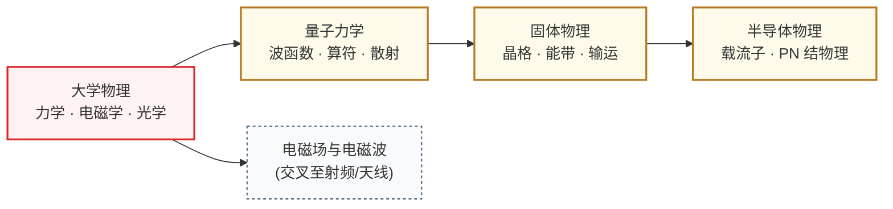

# 物理在 ECE 的地位

物理对 ECE 有什么作用呢？

首先，扎实的物理基础是理解一系列半导体器件（如三极管、MOS 管）的基石。由于时间有限，很多人在学完大学物理后直接学半导体物理（没错就是我），导致半物像听天书一样，直接导致我对工艺器件这一方向很抵触。**非常建议有志于器件或工艺方向的同学在学半物前先打好量子力学或固体物理基础**。

再者，当前十分火热的具身智能（Robotics）也对物理要求非常高，机器人的运动需要力学分析，传感器也需要声、光、热等领域知识的支撑。有志于此的同学一定要打好物理基础。

另外，一个非常前沿的方向——量子计算（Quantum Computing），也需要扎实的量子力学基础。

总之，物理和数学一样，也属于"技多不压身"的知识，多多益善。

## 知识谱系

主链 **大物 → 量子 → 固体 → 半物** 是器件/工艺方向的硬核前置。**电磁场理论**(国内通常单独开课)是射频/天线/光电子方向的另一条主线。

---

**[大学物理](大学物理/)** — 力学、电磁学、光学、热力学；高中物理的"加强版",所有理工科学生的共同基础。

**[量子力学](量子力学/)** — 薛定谔方程、本征值问题、散射理论；理解半导体能带和量子计算的入口。

**[固体物理](固体物理/)** — 晶格振动、电子能带、声子；衔接量子力学与半导体物理的桥梁。

**[半导体物理](半导体物理/)** — 载流子统计、PN 结、欧姆接触；所有半导体器件设计的物理基础。

**[其他](其他/)** — 物理实验、特殊主题。

## 对科研方向的作用

| 物理子分支 | 主要服务的科研方向 |
|---|---|
| 大学物理 + 电磁学 | [射频与毫米波 IC](../../科研方向/射频与毫米波IC.md)、[光电子与硅光集成](../../科研方向/光电子与硅光集成.md) |
| 量子力学 | [量子计算与量子芯片](../../科研方向/量子计算与量子芯片.md)、[半导体器件与先进工艺](../../科研方向/半导体器件与先进工艺.md) |
| 固体物理 | [半导体器件与先进工艺](../../科研方向/半导体器件与先进工艺.md)、[功率半导体与宽禁带器件](../../科研方向/功率半导体与宽禁带器件.md) |
| 半导体物理 | 所有[器件与工艺](../器件与工艺/index.md)子方向的本体前置 |
| 力学(运动学/动力学) | [具身智能](../../科研方向/具身智能.md)(机器人运动控制)、[MEMS 与微纳传感器](../../科研方向/MEMS与微纳传感器.md) |
| 光学(几何光学/波动光学) | [光电子与硅光集成](../../科研方向/光电子与硅光集成.md) |
| 热力学 | [先进封装与异构集成](../../科研方向/先进封装与异构集成.md)(热-电协同设计)、[功率半导体与宽禁带器件](../../科研方向/功率半导体与宽禁带器件.md) |

## 选修建议

按方向反推:
- **做器件/工艺**: 量子力学 → 固体物理 → 半导体物理(三步走,不可跳)
- **做模拟/射频 IC**: 大物中的电磁学要扎实,半导体物理略懂即可
- **做数字 IC / 体系结构**: 大物即可,半导体物理只为读懂工艺参数
- **做量子计算**: 量子力学要学到能用 Dirac notation 计算
- **做具身智能**: 力学 + 控制理论(交叉至[算法编程](../算法编程/index.md))
