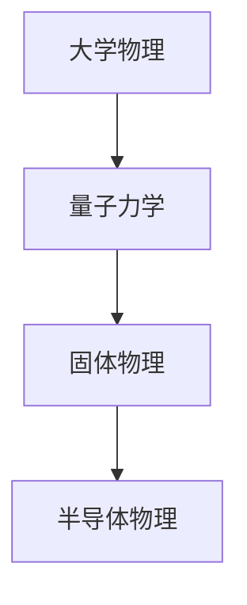

物理对ECE有什么作用呢？
首先，扎实的物理基础是理解一系列半导体器件（如三极管、MOS管）的基石。由于时间有限，很多人在学完大学物理后直接学半导体物理（没错就是我），导致半物像听天书一样，直接导致我对工艺器件这一方向很抵触。非常建议有志于器件或工艺方向的同学在学半物前先打好量子力学或固体物理基础。
再者，当前十分火热的具身智能（Robotics）也对物理要求非常高，机器人的运动需要力学分析，传感器也需要声、光、热等领域知识的支撑。有志于此的同学一定要打好物理基础。
另外，一个非常前沿的方向————量子计算(Quantum Computing)，也需要扎实的量子力学基础。
总之，物理和数学一样，也属于“技多不压身”的知识，多多益善。