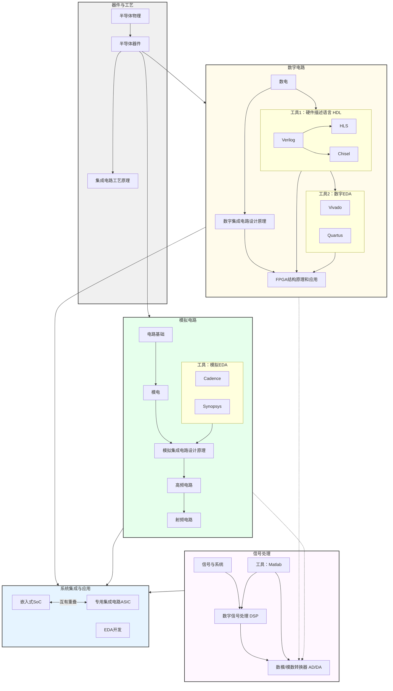
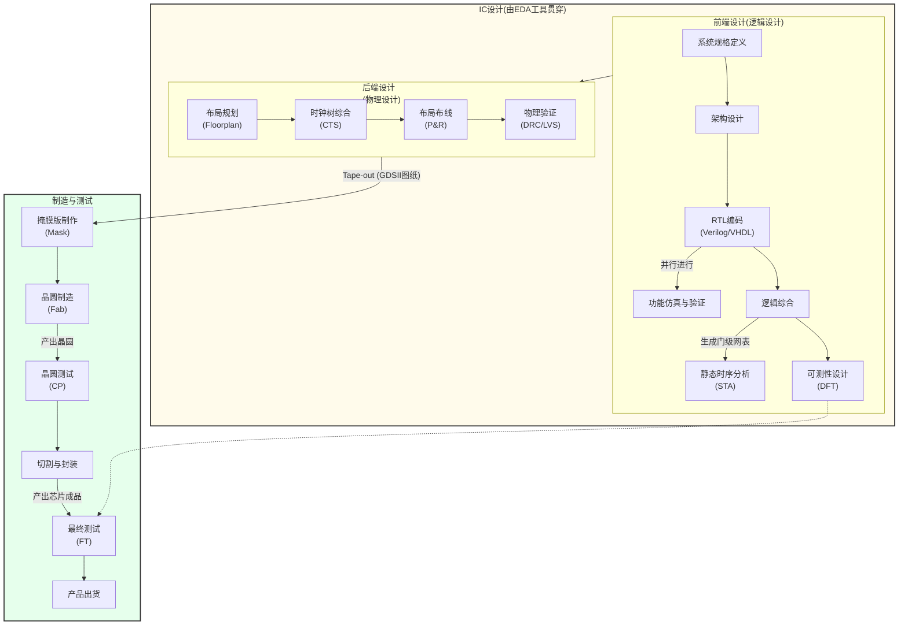

# 知识谱系

## 本科

（以复旦大学微电子专业的培养方案为参考）

可以看出，这份以复旦微电本科为参考的知识谱系有两个特点：

- 主要以设计为主，设计方向是复旦微电的强项，略有侧重不足为奇。
- 每个方向都走马观花地过了一遍，重在打基础，为日后的发展充实工具箱。

## 全局

### 设计

### 器件与工艺

### EDA

## 芯片生产流程

# 介绍

## 器件与工艺 (Devices & Process)

- **半导体物理 (Semiconductor Physics)**
  这是所有现代电子学的理论基石。它研究半导体材料（如硅）内部电子和空穴的运动规律，以及P-N结的形成和特性，为理解晶体管的工作原理提供物理基础。
- **半导体器件 (Semiconductor Devices)**
  在半导体物理之上，研究由半导体材料制成的基本电子元件。主要包括二极管、双极结型晶体管（BJT）和金属-氧化物-半导体场效应晶体管（MOSFET）。这些是构成所有集成电路（芯片）的最基本积木。
- **集成电路工艺原理 (IC Process Principles)**
  研究如何将亿万个半导体器件（主要是MOSFET）制造到一小片硅晶圆上的技术和流程。主要包括光刻、蚀刻、薄膜沉积、离子注入等一系列复杂的微纳加工技术。

------

## 数字电路 (Digital Circuits)

- **数电 (Digital Electronics)**
  研究处理离散二进制信号（0和1）的电路。内容包括逻辑门（与、或、非）、组合逻辑电路（如加法器）和时序逻辑电路（如触发器、寄存器）。这是所有数字系统，包括CPU和FPGA的基础。
- **数字集成电路设计原理 (Digital Integrated Circuit Design Principles)**
  
  研究如何将数字逻辑电路（数电）在芯片（CMOS工艺）层面进行物理实现。重点关注如何从晶体管级别构建逻辑门，并分析其速度（延时）、功耗和面积。这是连接逻辑设计与物理实现的桥梁，是数字芯片后端设计的基础。
- **硬件描述语言 HDL (Hardware Description Language)**
  
  - **Verilog**: 最主流的硬件描述语言之一，语法类似C语言。工程师用它来像写代码一样“描述”数字电路的结构和功能，这份“代码”就是电路的设计蓝图。
  - **HLS (High-Level Synthesis - 高层次综合)**: 一种更高级的设计方法，允许工程师使用C/C++/SystemC等高级语言来描述算法，然后由工具自动将其转换为Verilog等HDL代码。主要用于快速实现复杂的算法硬件加速器。
  - **Chisel**: 一种基于Scala语言的新兴硬件构建语言，相比Verilog能提供更强大的抽象和参数化设计能力，能够更高效地生成复杂的硬件设计。
- **数字EDA (Digital EDA)**
  - **Vivado**: 由Xilinx（现AMD）公司开发的EDA套件，专门用于其自家FPGA芯片的设计、综合、布局布线和编程。
  - **Quartus**: 由Altera（现Intel）公司开发的EDA套件，功能与Vivado类似，专门用于其自家FPGA芯片的设计流程。
- **FPGA (Field-Programmable Gate Array - 现场可编程门阵列)**
  一种半定制芯片。它内部充满了可由用户重复配置的逻辑单元和连线。用户可以通过烧录HDL代码生成的配置文件，在FPGA上实现任意想要的数字电路功能，因此被称为“硬件领域的万能芯片”，常用于产品原型验证和中小批量生产。

------

## 模拟电路 (Analog Circuits)

- **电路基础 (Circuit Fundamentals)**
  学习电子电路的入门课程，主要研究由电阻、电容、电感等无源器件组成的电路网络，掌握欧姆定律、基尔霍夫定律等基本分析方法。
- **模电 (Analog Electronics)**
  研究处理连续变化的模拟信号的电路。主要内容包括使用晶体管等有源器件搭建放大器、滤波器、振荡器等基本电路单元。
- **模拟集成电路设计原理 (Analog Integrated Circuits)**
  将模拟电路（模电）的理论应用在芯片设计上。它研究如何在硅片上设计和实现高性能的模拟电路模块，如运算放大器、比较器等。
- **高频电路 (High-Frequency Circuits)**
  当电路工作频率升高时，元器件和导线会表现出与低频下完全不同的特性（如寄生效应）。本课程研究这些高频效应以及相应的分析工具，如传输线理论、S参数、史密斯圆图等。
- **射频电路 (Radio-Frequency Circuits)**
  高频电路在无线通信领域的专门应用。它专注于设计用于发射和接收无线电磁波的电路，如低噪声放大器（LNA）、功率放大器（PA）、混频器、振荡器等，是所有无线设备（手机、Wi-Fi）的核心。
- **模拟EDA (Analog EDA)**
  - **Cadence**: 全球领先的EDA公司，其Virtuoso平台和Spectre仿真器是模拟集成电路设计领域事实上的工业标准。
  - **Synopsys**: 另一家EDA巨头，其HSPICE仿真器被誉为模拟电路仿真的“黄金标准”，用于最高精度的sign-off验证。

------

## 信号处理 (Signal Processing)

- **信号与系统 (Signals and Systems)**
  研究信号的数学表示和系统对其响应的课程，是通信和信号处理领域的数学基础。核心工具包括傅里叶变换、拉普拉斯变换和Z变换。
- **数字信号处理 DSP (Digital Signal Processing)**
  研究如何用计算机或专用硬件对数字化后的信号进行运算和处理，以实现滤波、变换、增强、识别等目的。例如手机通话中的降噪、音频的均衡器（EQ）等都属于DSP范畴。
- **数模/模数转换器 AD/DA (ADC/DAC)**
  连接真实模拟世界与数字处理世界的桥梁。ADC（Analog-to-Digital Converter）负责将来自传感器等模拟信号转换为数字信号；DAC（Digital-to-Analog Converter）则负责将处理完的数字信号转换回模拟信号以驱动扬声器等设备。

------

## 系统集成与应用 (System Integration & Applications)

- **嵌入式SoC (Embedded System on a Chip)**
  “片上系统”，指将一个完整的计算机系统（包含CPU处理器、内存、各种接口、甚至DSP和AI加速单元）集成到单一芯片上。它通常被“嵌入”到特定设备中执行专门任务，例如智能手机的主处理器、路由器的控制芯片等。
- **ASIC (Application-Specific Integrated Circuit - 专用集成电路)**
  为某种特定应用而“量身定制”的芯片。一旦设计制造完成，其功能便永久固化。与通用芯片相比，ASIC在性能、功耗和成本上为特定应用做了极致优化。我们日常使用的大部分高性能SoC，如手机处理器，都是以ASIC的形式存在的。
- **EDA开发 (EDA Development)**
  
  指开发用于设计芯片的软件工具（EDA）本身。这是一个高度交叉的领域，需要深厚的计算机科学（算法、数据结构、软件工程）和电子工程（数字/模拟电路）知识。EDA开发者创造的工具，被芯片设计工程师用于开发实际的芯片产品。
