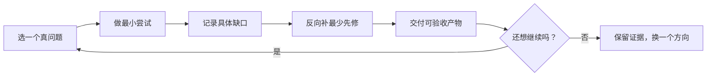

# 自由探索学习路线

这份指南不规定“某个学期必须学什么”。不同学校的课程、实验条件和个人兴趣差异很大；真正可迁移的是先修关系、项目证据和自我诊断能力。

!!! tip "一句话用法"
    先选一个你想理解或做出的东西，直接开始小型尝试；遇到具体障碍时，再沿能力页的“先修能力”反向补课。

## 三种同样有效的入口

### 兴趣优先

先浏览[六条专业路线](专业路线/index.md)，挑一个最想探索的问题。不需要等到“公共基础全部学完”；先看专业能力的概述和项目，再选取当下必须的先修。

### 项目优先

从一个 2–6 周的小项目出发，例如放大器仿真、FPGA 数字模块、MOS 特性分析或小型架构模拟。先建立最小可运行版本，将不会的概念记为缺口，然后回到[56 个能力点](能力点/index.md)精准补齐。

### 基础优先

如果你更喜欢系统学习，可从数学、物理/器件、电路/信号、软件/系统、工程/科研五个公共组中各挑一个当前最需要的能力。每完成 2–3 个点就做一次方向尝试，避免长期只看基础课而没有设计反馈。

## 五个建议窗口

“窗口”只表示常见的进入条件，不对应年级、学期或截止时间。你可以并行、跳转、重复或反向进行。

| 建议窗口 | 何时可以进入 | 可选行动 | 适合留下的证据 |
|---|---|---|---|
| 入门与试做 | 对芯片、电路、代码或硬件有一个具体好奇点 | Linux/Git、C/Python、电路直观、专业地图 | 一个能运行的小实验和失败记录 |
| 基础工具箱 | 项目暴露出计算、物理、数据结构或信号表达障碍 | 按需选数学、物理、编程和基础电路能力 | 一份可复现计算/实验笔记 |
| IC 公共核心 | 已能用基本方程、代码或仪器描述问题 | 器件、工艺、模电、数电、信号、IC 设计和体系结构 | 一份设计、仿真或测试报告 |
| 方向探索与深化 | 某条路线的问题已经值得连续投入 | 从路线四个专业点中挑选，也可跨路线组合 | 一个有指标、对照和可复现文件的专项项目 |
| 综合创作与迁移 | 想把知识转化为研究、竞赛、实习或毕业作品 | 复现、技术写作、测量、团队工程、伦理/IP 和作品集 | 可被第三方运行、评审或复用的交付 |

## 建议的探索循环

1. 选一个能说清楚的真问题，不以“看完一门课”作为目标。
2. 先做最小尝试，用错误、曲线、测试或性能指标找缺口。
3. 只补当前阻塞项目的先修；先修是导航线索，不是入场资格。
4. 按能力页的验收标准留下产物，再决定继续、跨方向或暂停。

## 时间与校内课程

- `参考投入` 是从零学到能交付验收产物的粗略估计，不是学期任务或建议截止时间。
- 可以每周 2 小时慢速探索，也可在假期集中完成一个项目；指南不对单周或单学期设上限。
- 校内课程可以替代相应的视频学习，但是否掌握仍由产物和验收标准判定。
- 不需要完成全部 32 个公共点才能进入专业方向；优先补所选项目和路线明确引用的先修。
